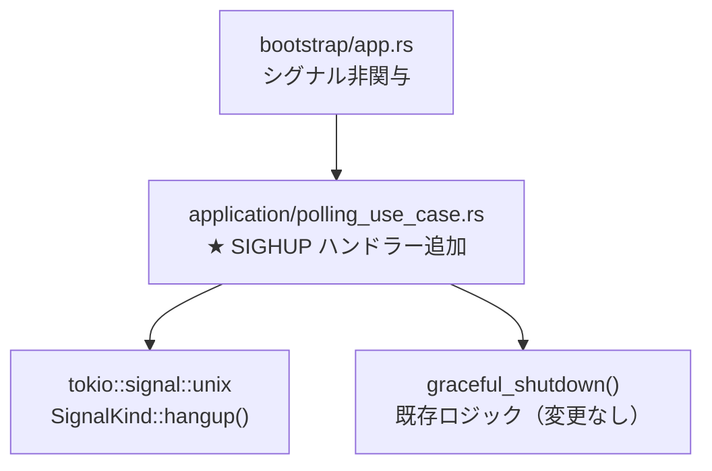

# Design Document: SIGHUP ハンドリング (issue-263)

## Overview

cupola daemon において、現在ハンドリングされていない SIGHUP シグナルを明示的に受け取り、グレースフルシャットダウンを実行する。また、config reload が実装されていないことと、config 変更時には再起動が必要であることをドキュメントに明記する。

**対象ユーザー**: cupola daemon の運用者（個人・小チーム）。主に `kill -HUP <pid>` や `logrotate` 等の外部ツールが SIGHUP を送信するケースへの対応。

**影響範囲**: `PollingUseCase::run()` へのシグナルハンドラー追加（1 箇所）と `docs/commands/start.md` のドキュメント更新（1 ファイル）のみ。

### Goals

- SIGHUP 受信時のデフォルト動作（即時プロセス終了）をオーバーライドし、グレースフルシャットダウンを行う
- SIGHUP の挙動と config 再起動要件をドキュメントに明記する

### Non-Goals

- SIGHUP による config reload の実装（将来 Issue で対応）
- SIGQUIT / SIGUSR1 / SIGUSR2 等その他シグナルのハンドリング

## Architecture

### Existing Architecture Analysis

`PollingUseCase::run()` は `tokio::select!` ループで SIGTERM / SIGINT を受け取り、グレースフルシャットダウン（`graceful_shutdown()`）を呼び出す。SIGHUP は同じパターンで追加できる。

```
tokio::select! {
    _ = tick.tick()      => { run_cycle().await }
    _ = sigterm.recv()   => { break }   // SIGTERM
    _ = ctrl_c()         => { break }   // SIGINT (Ctrl-C)
    // ← SIGHUP もここに追加する
}
```

### Architecture Pattern & Boundary Map

本変更は Application 層の `PollingUseCase` のみを修正し、他の層への影響はない。



**変更対象**:
- `src/application/polling_use_case.rs` — `run()` 内の `tokio::select!` に SIGHUP アーム追加
- `docs/commands/start.md` — シグナルハンドリングセクション追加

**変更なし**:
- `src/bootstrap/app.rs` — シグナルハンドリングの責務なし
- `src/domain/` — 純粋ロジック、影響なし
- `src/adapter/` — 変更なし

### Technology Stack

| Layer | Choice / Version | Role in Feature |
|-------|-----------------|-----------------|
| Runtime | tokio (既存) | `signal::unix::signal(SignalKind::hangup())` で SIGHUP を非同期購読 |

追加依存なし。`SignalKind` は既存の `use tokio::signal::unix::SignalKind;` でカバーされている。

## Requirements Traceability

| Requirement | Summary | Components | Interfaces |
|-------------|---------|------------|------------|
| 1.1 | SIGHUP 受信時にログ記録とシャットダウン開始 | PollingUseCase | tokio::signal::unix |
| 1.2 | SIGTERM と同一のグレースフルシャットダウン手順 | PollingUseCase | graceful_shutdown() |
| 1.3 | デフォルト動作のオーバーライド | PollingUseCase | tokio::signal::unix |
| 1.4 | Config reload は行わない旨のログ | PollingUseCase | tracing |
| 2.1 | SIGHUP → グレースフルシャットダウンの記述 | docs/commands/start.md | — |
| 2.2 | Config 変更時の再起動要件 | docs/commands/start.md | — |
| 2.3 | Config reload 未実装の旨 | docs/commands/start.md | — |

## Components and Interfaces

| Component | Layer | Intent | Requirements | Key Dependencies |
|-----------|-------|--------|--------------|-----------------|
| PollingUseCase | application | SIGHUP シグナルを購読してグレースフルシャットダウンへ誘導 | 1.1, 1.2, 1.3, 1.4 | tokio::signal (P0) |
| docs/commands/start.md | documentation | SIGHUP 挙動と config reload 非対応を明文化 | 2.1, 2.2, 2.3 | — |

### Application Layer

#### PollingUseCase

| Field | Detail |
|-------|--------|
| Intent | SIGHUP シグナルを tokio select! に追加し、受信時にグレースフルシャットダウンを開始する |
| Requirements | 1.1, 1.2, 1.3, 1.4 |

**Responsibilities & Constraints**

- `run()` の `tokio::select!` ブロックに `sighup.recv()` アームを追加する
- SIGHUP 受信時のログは `"received SIGHUP, shutting down (config reload is not supported, please restart to apply config changes)..."` とする
- シャットダウン処理は既存の `graceful_shutdown()` をそのまま呼び出す（ロジック変更なし）
- `tokio::signal::unix::signal(SignalKind::hangup())` は `run()` 内で `sigterm` と同様に初期化する

**Dependencies**

- Inbound: bootstrap/app.rs — `run()` 呼び出し (P0)
- External: tokio::signal::unix — SignalKind::hangup() (P0)

**Contracts**: Service [x]

##### Service Interface

変更後の `run()` メソッドの振る舞い仕様:

- 受信シグナル: SIGTERM, SIGINT (Ctrl-C), SIGHUP
- いずれかのシグナル受信時: `tracing::info!` でログ記録 → `break` → `graceful_shutdown()` 呼び出し
- 戻り値: `Ok(())`（変更なし）

**Implementation Notes**

- Integration: `let mut sighup = signal::unix::signal(SignalKind::hangup())?;` を `sigterm` と同じスコープに追加し、`select!` に `_ = sighup.recv() => { tracing::info!(...); break; }` を追加する
- Validation: `tokio::signal::unix::signal()` が `Result` を返すため `?` で伝播する（既存の sigterm 初期化と同じパターン）
- Risks: tokio の signal は Unix 限定 (`#[cfg(unix)]` 相当)。Windows ビルドには影響しない（既存の SIGTERM ハンドラーと同様の制約）

## Testing Strategy

### Unit Tests

- SIGHUP 受信時にシャットダウンが開始されること（`graceful_shutdown` 呼び出しの検証）
- SIGTERM / SIGINT と同様の終了ログが記録されること

### Integration Tests

- プロセスに `kill -HUP <pid>` を送信した場合、実行中セッションが終了を待機してから daemon が終了すること（既存の SIGTERM テストに準じたパターン）

> 既存シグナルハンドリングとの一貫性を重視。新規テストは `polling_use_case.rs` の `#[cfg(test)]` 内に追加する。
