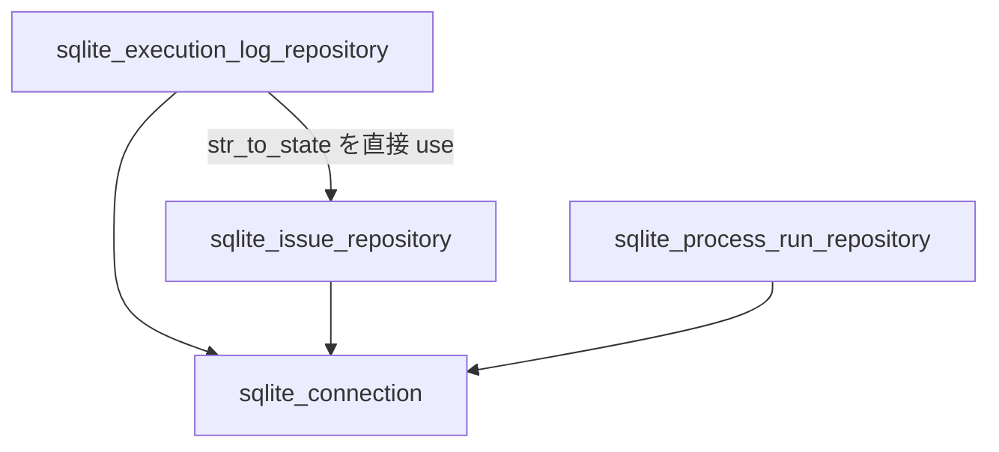
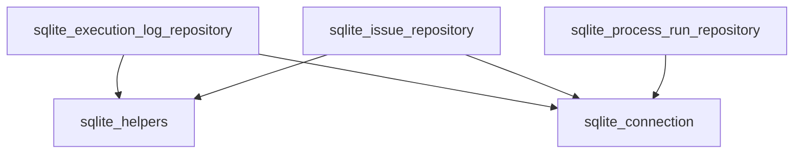

# 設計書: SQLite アダプター共通ヘルパーの抽出

## 概要

`sqlite_issue_repository.rs` と `sqlite_execution_log_repository.rs` に重複する SQLite ヘルパー関数を、新設モジュール `sqlite_helpers.rs` へ集約するリファクタリングである。対象関数は `parse_sqlite_datetime`（完全重複）と `str_to_state`（兄弟モジュール経由の不適切な横断依存）の 2 つ。機能的な変更は一切なく、コード重複と不適切な結合を解消することが目的である。

**対象ユーザー:** アダプター層を保守・拡張する開発者。  
**影響:** `adapter/outbound` 内の 3 ファイル（`mod.rs` 含む）を変更し、新規 1 ファイルを追加する。

### ゴール

- `parse_sqlite_datetime` の重複定義を排除する
- `sqlite_execution_log_repository` → `sqlite_issue_repository` の兄弟間依存を解消する
- 全既存テストをパスさせる（回帰なし）

### 非ゴール

- `parse_rfc3339_datetime`（`sqlite_issue_repository.rs` 内のみ利用）の移動
- `sqlite_process_run_repository.rs` の `parse_datetime`（異なる実装）の統合
- 機能追加・API 変更

## アーキテクチャ

### 既存アーキテクチャの分析

現状の `adapter/outbound` における依存関係:



問題点:
- `sqlite_execution_log_repository` が `sqlite_issue_repository` から `str_to_state` をインポート（兄弟依存）
- `parse_sqlite_datetime` が 2 ファイルに重複

### 変更後のアーキテクチャ



- 兄弟依存が解消され、各リポジトリは `sqlite_helpers` のみに依存する
- `sqlite_process_run_repository` は今回の変更対象外（独自の `parse_datetime` を保持）

### アーキテクチャの整合性

- **選択パターン:** 単一責任モジュール（`sqlite_helpers` = SQLite 型変換専用）
- **既存パターンの維持:** `mod.rs` はすべてモジュール再エクスポートのみで構成する原則を維持
- **Clean Architecture:** `adapter/outbound` 内の変更のみ。外層（bootstrap）への影響なし

## 要件トレーサビリティ

| 要件 | サマリー | コンポーネント | インターフェイス | フロー |
|------|---------|---------------|----------------|-------|
| 1.1 | `sqlite_helpers.rs` 新規作成 | SqliteHelpers | `str_to_state`, `parse_sqlite_datetime` | — |
| 1.2 | `str_to_state` を helpers に定義 | SqliteHelpers | `str_to_state` | — |
| 1.3 | `parse_sqlite_datetime` を helpers に定義 | SqliteHelpers | `parse_sqlite_datetime` | — |
| 1.4 | `mod.rs` に `mod sqlite_helpers` 追加 | OutboundMod | — | — |
| 1.5 | clippy / fmt チェック通過 | SqliteHelpers | — | — |
| 2.1 | `sqlite_issue_repository` が helpers を参照 | SqliteIssueRepository | `super::sqlite_helpers` | — |
| 2.2 | `sqlite_execution_log_repository` が helpers を参照 | SqliteExecutionLogRepository | `super::sqlite_helpers` | — |
| 2.3 | 兄弟依存の排除 | SqliteExecutionLogRepository | — | — |
| 2.4 | 旧 `pub` 定義の外部参照を確認 | SqliteIssueRepository | — | — |
| 3.1 | 全既存テスト通過 | すべて | — | — |
| 3.2 | 同一ランタイム動作 | SqliteHelpers | — | — |
| 3.3 | テストモジュールからのアクセス維持 | SqliteHelpers | — | — |
| 3.4 | `devbox run test` 成功 | すべて | — | — |

## コンポーネントとインターフェイス

### コンポーネントサマリー

| コンポーネント | レイヤー | 役割 | 要件カバレッジ | 主要依存 | コントラクト |
|--------------|---------|------|-------------|---------|------------|
| SqliteHelpers | adapter/outbound | SQLite 型変換ヘルパー関数群 | 1.1–1.5, 3.1–3.4 | `rusqlite`, `chrono`, `domain::State` | Service |
| SqliteIssueRepository | adapter/outbound | Issue エンティティの永続化 | 2.1, 2.4 | SqliteHelpers, SqliteConnection | — |
| SqliteExecutionLogRepository | adapter/outbound | ExecutionLog エンティティの永続化 | 2.2, 2.3 | SqliteHelpers, SqliteConnection | — |
| OutboundMod (`mod.rs`) | adapter/outbound | モジュール宣言・再エクスポート | 1.4 | — | — |

### adapter/outbound

#### SqliteHelpers (`sqlite_helpers.rs`)

| フィールド | 詳細 |
|---------|------|
| 役割 | SQLite のカラム値と Rust ドメイン型・日時型の相互変換ヘルパー |
| 要件 | 1.1, 1.2, 1.3, 1.5 |

**責務と制約**
- `str_to_state`: 文字列カラム値を `State` 列挙型に変換する。パース失敗時は `rusqlite::Error::InvalidColumnType` を返す
- `parse_sqlite_datetime`: SQLite の `datetime('now')` 出力形式（`%Y-%m-%d %H:%M:%S`）の文字列を `DateTime<Utc>` に変換する。パース失敗時は `rusqlite::Error::InvalidColumnType` を返す
- 可視性は `pub(super)`（`adapter/outbound` 内のみからアクセス可能）
- 状態を持たない純粋関数のみ

**依存関係**
- External: `rusqlite` — 戻り値型 `rusqlite::Result` および `rusqlite::Error::InvalidColumnType` (P0)
- External: `chrono` — `DateTime<Utc>`, `NaiveDateTime` (P0)
- Inbound: `crate::domain::state::State` — `str_to_state` の戻り値型 (P0)

**コントラクト:** Service [x]

##### サービスインターフェイス

```rust
// src/adapter/outbound/sqlite_helpers.rs

pub(super) fn str_to_state(
    col_idx: usize,
    s: &str,
) -> rusqlite::Result<State>;

pub(super) fn parse_sqlite_datetime(
    col_idx: usize,
    s: &str,
) -> rusqlite::Result<DateTime<Utc>>;
```

- 事前条件: `s` は空でない有効な文字列
- 事後条件:
  - `str_to_state`: `s.parse::<State>()` が成功した場合に `Ok(State)` を返す
  - `parse_sqlite_datetime`: `%Y-%m-%d %H:%M:%S` 形式でパース成功した場合に `Ok(DateTime<Utc>)` を返す
- 不変条件: 関数はいかなる状態も変更しない（純粋関数）

**実装ノート**
- `str_to_state` の実装は現行の `sqlite_issue_repository.rs` の `pub fn str_to_state` と同一
- `parse_sqlite_datetime` の実装は現行の両ファイルの `fn parse_sqlite_datetime` と同一
- モジュール宣言: `mod.rs` に `mod sqlite_helpers;` を追加（`pub mod` にしない）

## データモデル

本変更でデータモデルの変更はない。既存のドメイン型 `State` および `DateTime<Utc>` をヘルパー関数の入出力として引き続き使用する。

## エラーハンドリング

### エラー戦略

ヘルパー関数は `rusqlite::Result<T>` を返す。エラーは `rusqlite::Error::InvalidColumnType` に統一されており、上位の `row_to_*` 関数がそのまま `?` で伝播させる。動作変更なし。

## テスト戦略

### ユニットテスト

- `str_to_state`: すべての `State` バリアントに対してラウンドトリップ検証（`state_roundtrip_includes_initialize_running` テストが既存、移動後も通過することを確認）
- `parse_sqlite_datetime`: 有効な SQLite datetime 文字列のパース成功と無効文字列のエラー返却を確認

### インテグレーションテスト

- `SqliteIssueRepository` の全既存テスト（`save_and_find_by_id`、`find_active_excludes_terminal` 等）がリファクタリング後も通過することを確認
- `SqliteExecutionLogRepository` の全既存テスト（`record_start_and_find`、`record_finish_updates_log` 等）がリファクタリング後も通過することを確認

### CI 確認

- `devbox run test` — 全テスト通過
- `devbox run clippy` — 警告ゼロ
- `devbox run fmt-check` — フォーマット差分なし
