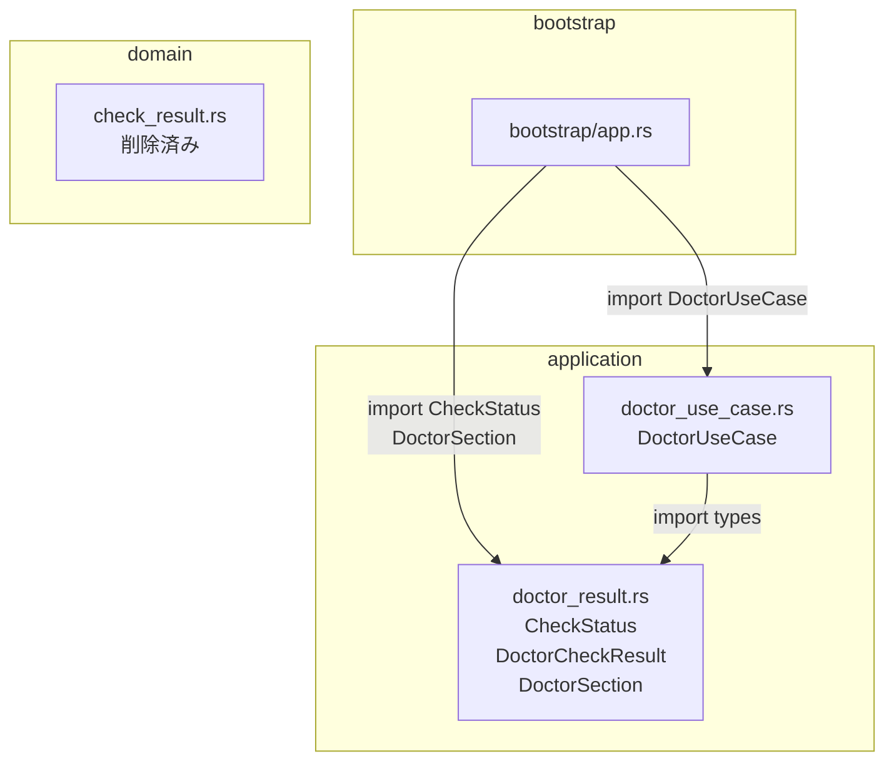

# Design Document

## Overview

本リファクタリングは、`CheckResult` / `CheckStatus` の二重定義問題を完全に解消する。主要課題（`domain/check_result.rs` の存在）は commit 88066b1 にて解決済みであり、本設計は残存課題である **アプリケーション層内の型定義の専用モジュール分離** を扱う。

`src/application/doctor_use_case.rs`（992行）に混在している型定義（`CheckStatus`、`DoctorCheckResult`、`DoctorSection`）を `src/application/doctor_result.rs` として独立させ、単一責務の原則を満たす。

### Goals

- `doctor_use_case.rs` から型定義を分離し、ファイルの責務を明確化する
- `domain/check_result.rs` が削除済みであることを確認し、二重定義が完全に解消されたことを確定する
- すべての既存テストをパスさせ、リグレッションなしで完了する

### Non-Goals

- `application/doctor/` サブディレクトリへの分割（現規模では過剰設計）
- 個別チェック関数（`check_config`, `check_git` 等）の分割・移動
- `CheckStatus` のバリアント変更や型の追加・削除
- テストの修正・追加

## Requirements Traceability

| Requirement | Summary | Components | Flows |
|-------------|---------|------------|-------|
| 1.1 | domain層にCheckStatus定義なし | 現状確認（削除済み） | — |
| 1.2 | `domain/check_result.rs` 不存在 | 現状確認（削除済み） | — |
| 1.3 | CheckStatus は application 層に1つのみ | `doctor_result.rs`（新規） | — |
| 2.1 | 型を `doctor_result.rs` に定義 | `doctor_result.rs`（新規） | — |
| 2.2 | `doctor_use_case.rs` に型定義なし | `doctor_use_case.rs`（修正） | — |
| 2.3 | `application/mod.rs` に `pub mod doctor_result` | `application/mod.rs`（修正） | — |
| 2.4 | `bootstrap/app.rs` のインポート更新 | `bootstrap/app.rs`（修正） | — |
| 2.5 | 既存テスト全通過 | 全モジュール | — |
| 2.6 | clippy 警告なし | 全モジュール | — |

## Architecture

### Existing Architecture Analysis

現在の `doctor_use_case.rs` の構造:

```
src/application/doctor_use_case.rs (992行)
├── DoctorSection enum       ← 移動対象
├── CheckStatus enum         ← 移動対象
├── DoctorCheckResult struct ← 移動対象
├── DoctorUseCase struct + impl
├── check_config()
├── check_git()
├── check_github_token()
├── check_claude()
├── check_db()
├── check_assets()
├── check_steering()
├── check_labels()
└── #[cfg(test)] mod tests
```

`bootstrap/app.rs` の参照:
- L37: `use crate::application::doctor_use_case::{CheckStatus, DoctorUseCase};`
- L169: `use crate::application::doctor_use_case::DoctorSection;`

### Architecture Pattern & Boundary Map



**Architecture Integration**:
- 選択パターン: 単一ファイル内モジュール分離（ファイル分割）
- 変更するアーキテクチャ層: application 層内のみ
- 既存パターンの維持: Clean Architecture 4層構造に変更なし
- 新規コンポーネント: `doctor_result.rs`（型定義専用ファイル）

### Technology Stack

| Layer | Choice | Role | Notes |
|-------|--------|------|-------|
| application | Rust / 既存 | 型定義の専用ファイル化 | 新規ファイル1つのみ |

## Components and Interfaces

| Component | Layer | Intent | Req Coverage | Contracts |
|-----------|-------|--------|--------------|-----------|
| `doctor_result.rs` | application | CheckStatus 等の型定義専用ファイル | 1.3, 2.1, 2.2 | State |
| `doctor_use_case.rs` | application | Doctor ユースケースロジック（型定義を除く） | 2.2, 2.5 | Service |
| `application/mod.rs` | application | `doctor_result` モジュールの公開 | 2.3 | — |
| `bootstrap/app.rs` | bootstrap | インポートパスの更新 | 2.4 | — |

### application

#### doctor_result.rs（新規）

| Field | Detail |
|-------|--------|
| Intent | Doctor ユースケースの結果型を定義する専用ファイル |
| Requirements | 1.3, 2.1 |

**Responsibilities & Constraints**
- `DoctorSection`、`CheckStatus`、`DoctorCheckResult` の3型を定義する
- ロジックを含まない（純粋な型定義のみ）
- domain 層への依存なし

**Contracts**: State [x]

##### State Management

- 状態モデル: 変更なし（型定義のみ移動）
- 定義する型:
  - `DoctorSection`: `StartReadiness` / `OperationalReadiness`
  - `CheckStatus`: `Ok(String)` / `Warn(String)` / `Fail(String)`
  - `DoctorCheckResult`: `{ section, name, status, remediation }`

**Implementation Notes**
- `doctor_use_case.rs` から型定義ブロック（L8–L29）を物理移動する
- `doctor_use_case.rs` の先頭に `use crate::application::doctor_result::{CheckStatus, DoctorCheckResult, DoctorSection};` を追加する
- テスト内の `use super::*;` は `doctor_use_case.rs` に残るため、`doctor_result` の型も `super::*` 経由で引き続き参照できる（`doctor_use_case.rs` が `use` 文でスコープに取り込んでいるため）

#### doctor_use_case.rs（修正）

| Field | Detail |
|-------|--------|
| Intent | Doctor ユースケースロジックのみを担当するファイル（型定義を除く） |
| Requirements | 2.2, 2.5, 2.6 |

**Responsibilities & Constraints**
- `DoctorUseCase` struct および `run()` メソッドの実装
- 個別チェック関数（`check_config` 等）の実装
- 型定義（`CheckStatus` 等）を保持しない → `doctor_result.rs` からインポート

**Implementation Notes**
- 削除: L8–L29 の型定義ブロック（`DoctorSection`, `CheckStatus`, `DoctorCheckResult`）
- 追加: `use crate::application::doctor_result::{CheckStatus, DoctorCheckResult, DoctorSection};`
- テスト部: `use super::*;` で型にアクセス可能。変更不要

## Error Handling

本リファクタリングは型の移動のみであり、エラーハンドリングロジックの変更はない。`CheckStatus` の Ok/Warn/Fail バリアントおよびその意味は不変。

## Testing Strategy

### Unit Tests
- 変更前後で `devbox run test` を実行し、全テスト（現状 356件+）がパスすることを確認
- テストコードの修正は行わない

### Static Analysis
- `devbox run clippy` で警告ゼロを確認
- `devbox run fmt-check` でフォーマット準拠を確認
