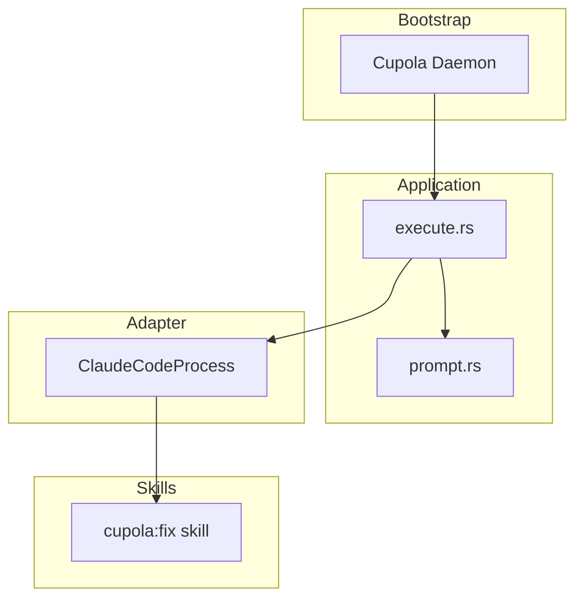
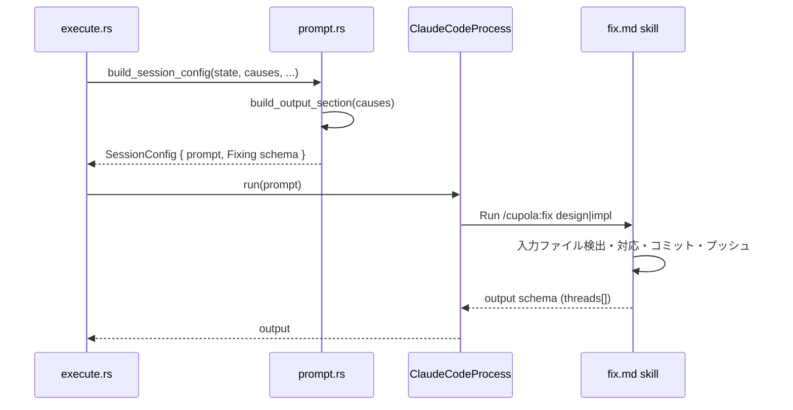

# Design Document

## Overview

本機能は、fixing フェーズのプロンプト生成ロジックを `prompt.rs` のインライン記述から `/cupola:fix` スキルへ委譲することで、Design/Impl フェーズとの一貫性を確立する。あわせて #297 で要求されていたコミットメッセージの動的生成をスキル側で実装する。

**Purpose**: `prompt.rs` の fixing プロンプトを簡略化し、`/cupola:fix` スキルを唯一の正本とすることで二重管理を解消する。

**Users**: Cupola デーモンが内部的に使用する。エンドユーザーは GitHub Issue/PR を通じて間接的に恩恵を受ける。

**Impact**: `build_design_fixing_prompt`・`build_implementation_fixing_prompt` のシグネチャが簡素化され、`execute.rs` の呼び出し側もあわせて更新される。`fix.md` スキルに `design`/`impl` 分岐が追加される。

### Goals

- fixing フェーズのプロンプトを `/cupola:fix {phase}` の呼び出しに委譲する
- インラインの手順記述（コミットメッセージ指示・品質チェック・git 手順）を削除する
- fix.md スキルで `docs:` / `fix:` プレフィックスを分岐し、コミットメッセージを動的生成する
- 削除されたインライン手順に依存するテストを新しい形式に対応させる

### Non-Goals

- output-schema セクションのスキル側への移管（`causes` 依存が残るため、今回は prompt.rs に維持）
- `causes` パラメータの除去
- Design/Impl Running フェーズのプロンプト変更
- スキルのその他の機能改善（#298 の範囲）

## Architecture

### Existing Architecture Analysis

現状、Cupola のプロンプト生成は以下の非対称な構造になっている：

| フェーズ | プロンプト生成 | スキル委譲 |
|---------|--------------|-----------|
| DesignRunning | `build_design_prompt` | `/cupola:spec-design` に委譲 ✅ |
| ImplementationRunning | `build_implementation_prompt` | `/cupola:spec-impl` に委譲 ✅ |
| DesignFixing | `build_design_fixing_prompt` | インライン記述 ❌ |
| ImplementationFixing | `build_implementation_fixing_prompt` | インライン記述 ❌ |

### Architecture Pattern & Boundary Map



変更後は `prompt.rs` がスキル呼び出し指示のみを生成し、fixing の実行手順はすべて `fix.md` スキルが担う。

**Architecture Integration**:
- Selected pattern: 既存のスキル委譲パターン（Running フェーズと同じ）
- Domain/feature boundaries: `prompt.rs` はプロンプト文字列の生成のみ担当、実行手順はスキル側
- Existing patterns preserved: `causes` → output-schema セクションの動的生成
- New components rationale: なし（既存コンポーネントの変更のみ）
- Steering compliance: Clean Architecture 維持（application 層の変更のみ）

### Technology Stack

| Layer | Choice / Version | Role in Feature | Notes |
|-------|------------------|-----------------|-------|
| Application | Rust / prompt.rs | fixing プロンプト生成の簡略化 | シグネチャ変更あり |
| Skills | Markdown / fix.md | fixing の実行手順を正本として管理 | design/impl 分岐を追加 |

## Requirements Traceability

| Requirement | Summary | Components | Flows |
|-------------|---------|------------|-------|
| 1.1, 1.2 | スキル委譲指示を生成 | `build_design_fixing_prompt`, `build_implementation_fixing_prompt` | DesignFixing / ImplementationFixing |
| 1.3 | インライン手順を除去 | `build_design_fixing_prompt`, `build_implementation_fixing_prompt` | — |
| 1.4 | コンテキスト情報を維持 | `build_design_fixing_prompt`, `build_implementation_fixing_prompt` | — |
| 1.5 | output-schema セクションを維持 | `build_output_section` | — |
| 1.6, 1.7 | conflict section・パラメータを除去 | `build_session_config`, `build_conflict_section` | — |
| 2.1, 2.2 | docs:/fix: プレフィックス分岐 | `fix.md` | — |
| 2.3 | 動的コミットメッセージ生成 | `fix.md` | — |
| 3.1–3.4 | テスト整合性 | `prompt.rs` テストモジュール | — |

## Components and Interfaces

### コンポーネントサマリー

| Component | Layer | Intent | Req Coverage | Key Changes |
|-----------|-------|--------|--------------|-------------|
| `build_design_fixing_prompt` | application | DesignFixing プロンプト生成 | 1.1, 1.3, 1.4, 1.5 | シグネチャ簡素化、スキル委譲 |
| `build_implementation_fixing_prompt` | application | ImplementationFixing プロンプト生成 | 1.2, 1.3, 1.4, 1.5 | シグネチャ簡素化、スキル委譲 |
| `build_session_config` | application | 公開 API（フェーズ別セッション設定生成） | 1.7 | パラメータ除去 |
| `build_conflict_section` | application | コンフリクトセクション生成（削除対象） | 1.6 | 関数ごと削除 |
| `build_instructions_text` | application | 原因別指示生成（削除対象） | 1.3 | 関数ごと削除 |
| `fix.md` スキル | skills | fixing 実行手順の正本 | 2.1, 2.2, 2.3 | design/impl 分岐・動的コミットメッセージ |
| `execute.rs` 呼び出し箇所 | application | `build_session_config` 呼び出し | 1.7 | `has_merge_conflict` 引数除去 |

### Application Layer

#### `build_design_fixing_prompt` / `build_implementation_fixing_prompt`

| Field | Detail |
|-------|--------|
| Intent | DesignFixing / ImplementationFixing フェーズのプロンプトを生成する |
| Requirements | 1.1, 1.2, 1.3, 1.4, 1.5 |

**変更前シグネチャ**:
```
fn build_design_fixing_prompt(
    issue_number: u64,
    pr_number: u64,
    language: &str,
    causes: &[FixingProblemKind],
    has_merge_conflict: bool,
    default_branch: &str,
) -> String
```

**変更後シグネチャ**:
```
fn build_design_fixing_prompt(
    issue_number: u64,
    pr_number: u64,
    language: &str,
    causes: &[FixingProblemKind],
) -> String
```

**生成するプロンプトの構造**:

```
You are an automated review agent. Address the issues on PR #{pr_number} (Issue #{issue_number}).

Run /cupola:fix design   ← design は impl に置き換わる場合もある

## Output to output-schema

{output_section}   ← causes に基づき build_output_section が生成

## Constraints

- Do not use the GitHub API (including the gh command)
- Do not reply to comments or resolve threads (the system will do it)
- Write all replies in {language}
```

**Dependencies**:
- Inbound: `build_session_config` — 唯一の呼び出し元 (P0)
- Outbound: `build_output_section` — output-schema セクション生成 (P1)

**Contracts**: Service [x]

**Implementation Notes**:
- `build_conflict_section` への呼び出しを除去する
- `build_instructions_text` への呼び出しを除去する
- `## Actions Required` / `## Steps` セクションを除去する
- `GENERIC_QUALITY_CHECK_INSTRUCTION` への参照を除去する

#### `build_session_config`

| Field | Detail |
|-------|--------|
| Intent | フェーズ別のセッション設定（プロンプト + 出力スキーマ種別）を生成する公開 API |
| Requirements | 1.7 |

**変更前シグネチャ**:
```
pub fn build_session_config(
    state: State,
    issue_number: u64,
    config: &Config,
    pr_number: Option<u64>,
    feature_name: &str,
    fixing_causes: &[FixingProblemKind],
    has_merge_conflict: bool,
) -> anyhow::Result<SessionConfig>
```

**変更後シグネチャ**:
```
pub fn build_session_config(
    state: State,
    issue_number: u64,
    config: &Config,
    pr_number: Option<u64>,
    feature_name: &str,
    fixing_causes: &[FixingProblemKind],
) -> anyhow::Result<SessionConfig>
```

**Implementation Notes**:
- `has_merge_conflict` を `build_design_fixing_prompt` / `build_implementation_fixing_prompt` への転送から除去する
- `execute.rs` の呼び出し側も合わせて更新する

#### 削除対象関数

| 関数 | 理由 |
|------|------|
| `build_conflict_section` | `has_merge_conflict` パラメータ除去に伴い不要 |
| `build_instructions_text` | インライン手順をスキルに移管するため不要 |

### Skills Layer

#### `fix.md` スキル

| Field | Detail |
|-------|--------|
| Intent | fixing フェーズの実行手順を定義する正本スキル |
| Requirements | 2.1, 2.2, 2.3 |

**変更内容（Step 6: Commit and Push）**:

変更前:
```bash
git commit -m "fix: address requested changes"
```

変更後（`$1` に応じてプレフィックスを決定し、本文を動的生成）:
```
$1 が design の場合: docs: <変更内容に基づいた動的メッセージ>
$1 が impl の場合:   fix:  <変更内容に基づいた動的メッセージ>
```

具体的には、スキルの指示として：
- コミットメッセージは `$1` に応じたプレフィックス（`docs:` または `fix:`）で始める
- メッセージ本文は `git diff --name-only` で確認した変更ファイルと対応したレビューコメント等に基づき動的に生成する

**Implementation Notes**:
- `$1 == design` の判定で条件分岐を記述する
- 固定文字列 `"address requested changes"` への依存を除去する

## System Flows

### Fixing フェーズのプロンプト生成フロー（変更後）



## Testing Strategy

### Unit Tests（更新・追加対象）

変更前テストのうち削除対象（スキルが担う内容を検証しているため）:
- `fixing_prompt_has_merge_conflict_true_inserts_section_at_top`
- `fixing_prompt_has_merge_conflict_false_is_unchanged`
- `design_fixing_prompt_contains_docs_prefix`（コミットメッセージは prompt に含まれなくなる）
- `implementation_fixing_prompt_contains_fix_prefix`（同上）
- `design_fixing_prompt_does_not_contain_code_wording`
- `implementation_fixing_prompt_contains_code_wording`
- `fixing_prompt_review_comments_only` の `review_threads.json` アサーション（スキルが対応）
- `fixing_prompt_ci_failure_only` の `ci_errors.txt` アサーション（スキルが対応）

新規追加テスト（要件 3.1〜3.4 に対応）:
- `design_fixing_prompt_delegates_to_fix_skill`: `Run /cupola:fix design` を含む
- `implementation_fixing_prompt_delegates_to_fix_skill`: `Run /cupola:fix impl` を含む
- `design_fixing_prompt_has_no_inline_steps`: インライン手順が含まれない
- `implementation_fixing_prompt_has_no_inline_steps`: 同上
- output-schema セクション（`thread_id`・`{"threads": []}` 等）の検証テストは維持

### Integration Tests

`execute.rs` の `build_session_config` 呼び出しのコンパイル通過（型チェック）が自動的に検証される。
