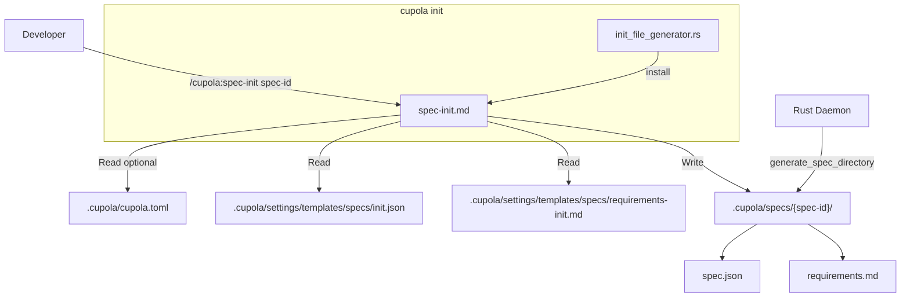
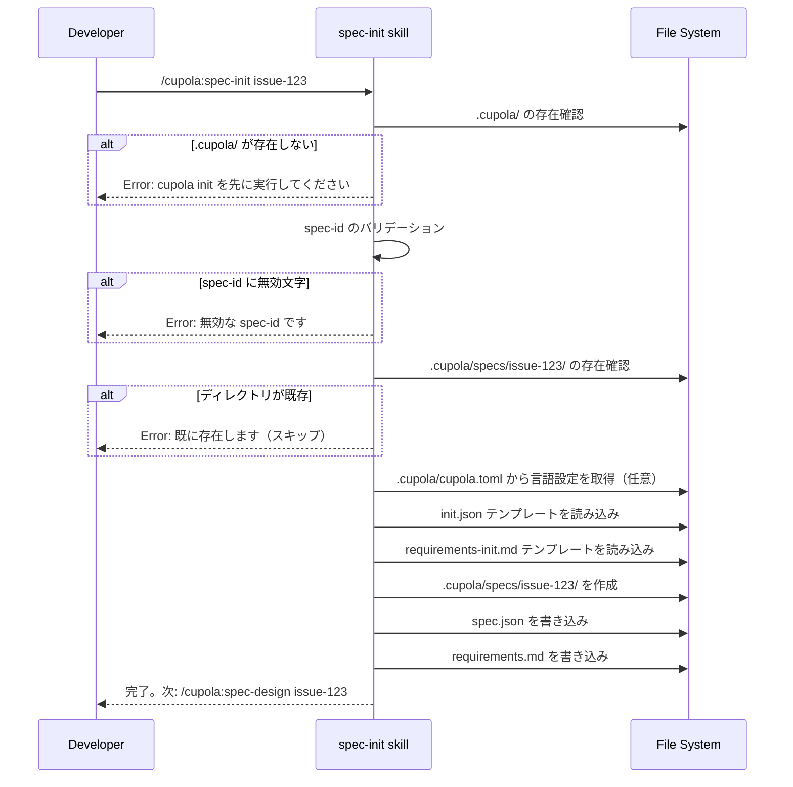

# Design: /cupola:spec-init スキルの追加

## Overview

`/cupola:spec-init {spec-id}` スキルは、手動ワークフロー向けに spec ディレクトリの初期化機能を提供する。Cupola デーモンが自動実行する `generate_spec_directory()` と同等の操作を、Claude Code スキルとして実行可能にする。

**Purpose**: spec-driven workflow の手動実行における入口を提供し、`spec-init → spec-design → spec-impl` の完全な手動ワークフローを実現する。  
**Users**: Cupola デーモンを使わずに手動で spec-driven workflow を実行する開発者が利用する。  
**Impact**: `.claude/commands/cupola/spec-init.md` を新規追加し、`init_file_generator.rs` に1エントリを追加する。既存の動作・API への変更はない。

### Goals

- `cupola init` 実行後にすぐ `/cupola:spec-init` が利用できる
- Rust デーモンと同一形式の `spec.json` および `requirements.md` を生成する
- 既存ディレクトリの安全な検出（上書き防止）
- 手動ワークフローの次ステップを明示的に案内する

### Non-Goals

- Rust デーモン側の `generate_spec_directory()` を変更しない
- ワークツリー作成や GitHub API 操作は行わない
- spec-design / spec-impl の責務を担わない
- `cupola` CLI に新サブコマンドを追加しない

## Architecture

### Existing Architecture Analysis

既存のスキル群（`.claude/commands/cupola/`）は YAML フロントマター + Markdown 指示書の形式で実装されており、Claude Code が解釈・実行する。ファイル操作は Read/Write/Bash ツールを通じて行われる。

`generate_spec_directory()`（Rust）と `/cupola:spec-init`（スキル）は独立した実装経路である。双方が同一のテンプレートファイル（`init.json`, `requirements-init.md`）を参照することで出力形式を一致させる。

すべてのスキルファイルは `CLAUDE_CODE_ASSETS`（`init_file_generator.rs`）に静的に登録されており、`cupola init` 実行時にプロジェクトへインストールされる。

### Architecture Pattern & Boundary Map



スキルとデーモンは共通テンプレートを参照するが独立したコードパスで動作する。

### Technology Stack

| Layer | Choice | Role | Notes |
|-------|--------|------|-------|
| スキル定義 | Markdown + YAML frontmatter | スキルの指示書 | `.claude/commands/cupola/` パターンに準拠 |
| テンプレート | `init.json` | spec.json 雛形 | 既存テンプレートを流用 |
| テンプレート | `requirements-init.md` | requirements.md 雛形 | 既存テンプレートを流用 |
| Rust 組み込み | `include_str!()` + `CLAUDE_CODE_ASSETS` | インストール配布 | `init_file_generator.rs` へ1エントリ追加 |

## System Flows



## Requirements Traceability

| Requirement | Summary | Components | Flows |
|-------------|---------|------------|-------|
| 1.1 | spec-id を受け取り spec ディレクトリを作成する | spec-init skill | ファイル生成フロー |
| 1.2 | spec-id 未指定時にエラーを表示する | spec-init skill | 引数バリデーション |
| 1.3 | オプション言語引数を受け付ける | spec-init skill | 引数解析 |
| 1.4 | 言語のデフォルト解決（toml → "ja"） | spec-init skill | 設定読み込み |
| 1.5 | 完了後に次ステップを案内する | spec-init skill | 完了通知 |
| 2.1 | spec ディレクトリを作成する | spec-init skill | ファイル生成フロー |
| 2.2 | spec.json を生成する | spec-init skill | ファイル生成フロー |
| 2.3 | requirements.md を生成する | spec-init skill | ファイル生成フロー |
| 2.4 | init.json テンプレートを使用する | spec-init skill | テンプレート処理 |
| 2.5 | requirements-init.md テンプレートを使用する | spec-init skill | テンプレート処理 |
| 3.1 | spec.json の feature_name を設定する | spec-init skill | ファイル生成フロー |
| 3.2 | spec.json のタイムスタンプを設定する | spec-init skill | ファイル生成フロー |
| 3.3 | spec.json の language を設定する | spec-init skill | ファイル生成フロー |
| 3.4 | spec.json の phase を "initialized" に設定する | spec-init skill | ファイル生成フロー |
| 3.5 | spec.json の approvals を全 false に設定する | spec-init skill | ファイル生成フロー |
| 3.6 | spec.json の ready_for_implementation を false に設定する | spec-init skill | ファイル生成フロー |
| 3.7 | requirements.md にプロジェクト説明の記入欄を含める | spec-init skill | ファイル生成フロー |
| 4.1 | 既存ディレクトリを上書きしない | spec-init skill | 冪等性チェック |
| 4.2 | .cupola/ 未初期化を検出する | spec-init skill | 前提条件チェック |
| 4.3 | spec-id のバリデーションを行う | spec-init skill | 引数バリデーション |
| 5.1 | cupola init でスキルをインストールする | init_file_generator.rs | インストールフロー |
| 5.2 | cupola init --upgrade でスキルを更新する | init_file_generator.rs | アップグレードフロー |
| 5.3 | バイナリにスキルを埋め込む | init_file_generator.rs | ビルド |

## Components and Interfaces

| Component | Layer | Intent | Req Coverage | Key Dependencies |
|-----------|-------|--------|--------------|------------------|
| spec-init.md | スキル | spec ディレクトリの初期化 | 1.1–4.3 | init.json, requirements-init.md, cupola.toml |
| CLAUDE_CODE_ASSETS 追加エントリ | adapter/outbound | スキルのインストール配布 | 5.1–5.3 | spec-init.md |

### スキル層

#### spec-init.md

| Field | Detail |
|-------|--------|
| Intent | `spec-id` を受け取り spec ディレクトリ（`spec.json` + `requirements.md`）を初期化するスキル |
| Requirements | 1.1, 1.2, 1.3, 1.4, 1.5, 2.1, 2.2, 2.3, 2.4, 2.5, 3.1, 3.2, 3.3, 3.4, 3.5, 3.6, 3.7, 4.1, 4.2, 4.3 |

**Responsibilities & Constraints**

- 唯一の責務: spec ディレクトリ構造の初期化
- 既存ファイルを上書きしない（冪等性保証）
- Rust デーモンと同一の出力形式を生成する
- テンプレート未存在時はフォールバック値で生成する（Rust と同動作）

**Dependencies**

- Inbound: Claude Code ツール（Read, Write, Bash）— スキル実行環境 (P0)
- Outbound: `.cupola/settings/templates/specs/init.json` — spec.json テンプレート (P0)
- Outbound: `.cupola/settings/templates/specs/requirements-init.md` — requirements.md テンプレート (P0)
- Outbound: `.cupola/cupola.toml` — 言語設定（省略可能）(P1)

**Contracts**: Service [x]

##### Service Interface

```
Input:
  $1: spec-id（必須）— 例: "issue-123"
  $2: language（オプション）— 例: "ja", "en"（未指定時: cupola.toml 参照 → デフォルト "ja"）

Output (Success):
  - 作成されたファイルのパスリスト
  - 次ステップの案内: "/cupola:spec-design {spec-id}"

Output (Error):
  - spec-id 未指定: 使用方法を表示して停止
  - 既存ディレクトリ: "spec directory already exists: .cupola/specs/{spec-id}/"
  - .cupola/ 未存在: ".cupola/ not found. Run: cupola init"
  - 無効な spec-id: "invalid spec-id: {spec-id}. Use alphanumeric, hyphens, underscores only"
```

**Implementation Notes**

- Integration: 既存スキル（spec-design.md 等）と同一の YAML frontmatter 形式を使用する
- Validation: spec-id のバリデーションは `[[ "$1" =~ ^[a-zA-Z0-9_-]+$ ]]` 相当のチェックを行う
- Risks: テンプレートファイルが存在しない場合は Rust 実装と同様にインライン値でフォールバックする

### adapter/outbound 層

#### init_file_generator.rs — CLAUDE_CODE_ASSETS への追加

| Field | Detail |
|-------|--------|
| Intent | spec-init.md スキルを `cupola init` でプロジェクトにインストールする |
| Requirements | 5.1, 5.2, 5.3 |

**Responsibilities & Constraints**

- `CLAUDE_CODE_ASSETS` 配列に spec-init.md のエントリを追加する
- `include_str!()` でコンパイル時に spec-init.md の内容をバイナリに埋め込む
- 既存の `install_claude_code_assets()` ロジックは変更しない

**Contracts**: Batch [x]

##### Batch / Job Contract

- Trigger: `cupola init` または `cupola init --upgrade`
- Input: spec-init.md のファイルパスと内容（コンパイル時埋め込み）
- Output: `.claude/commands/cupola/spec-init.md` をプロジェクトに書き込む
- Idempotency: `upgrade=false` の場合、既存ファイルはスキップされる

**Implementation Notes**

- Integration: `CLAUDE_CODE_ASSETS` への1エントリ追加のみ。既存テストは新スキルの存在も自動的に検証する。
- Risks: なし（パターンが確立されており変更量が最小）

## Data Models

### Domain Model

生成される `spec.json` の構造（Rust の `generate_spec_directory()` と同一形式）:

```json
{
  "feature_name": "<spec-id>",
  "created_at": "<ISO8601 UTC>",
  "updated_at": "<ISO8601 UTC>",
  "language": "<言語コード>",
  "phase": "initialized",
  "approvals": {
    "requirements": { "generated": false, "approved": false },
    "design":       { "generated": false, "approved": false },
    "tasks":        { "generated": false, "approved": false }
  },
  "ready_for_implementation": false
}
```

生成される `requirements.md` の構造（`requirements-init.md` テンプレートに基づく）:

```markdown
# Requirements Document

## Project Description (Input)
（ユーザーが記入する）

## Requirements
<!-- Will be generated by /cupola:spec-design -->
```

## Error Handling

### Error Strategy

スキルは前提条件を早期チェックし（fail-fast）、明確なエラーメッセージと remediation ヒントを提供する。

### Error Categories and Responses

**ユーザーエラー**:
- spec-id 未指定 → 使用方法（`/cupola:spec-init <spec-id> [language]`）を表示して停止
- spec-id に無効文字 → 有効な文字種の例を表示して停止
- spec directory 既存 → 既存パスを報告してスキップ（データ保護）

**システムエラー**:
- `.cupola/` ディレクトリ未存在 → `cupola init` 実行を促す
- テンプレートファイル未存在 → フォールバック値で生成継続（Rust と同動作）

### Monitoring

スキル実行時に作成したファイルのフルパスを出力することで操作の可視性を確保する。

## Testing Strategy

### Unit Tests

- `spec.json` 生成内容検証: `feature_name`, `language`, `phase`, `approvals`, `ready_for_implementation` の各フィールド
- `requirements.md` 生成内容検証: テンプレート構造の保持確認
- 言語解決ロジック: 引数 > cupola.toml > デフォルト `ja` の優先順位
- バリデーション: 有効・無効な spec-id のケース

### Integration Tests

- `spec-init → spec-design` のワークフロー連携（spec.json の `phase: "initialized"` が spec-design で正しく認識されること）
- 既存ディレクトリへの安全なスキップ動作（既存ファイルが変更されないこと）
- テンプレート未存在時のフォールバック動作（フォールバック JSON が有効な spec.json であること）
- `cupola init` 後に spec-init.md が `.claude/commands/cupola/` に存在すること（既存テスト `install_claude_code_assets_creates_files` に相当）
