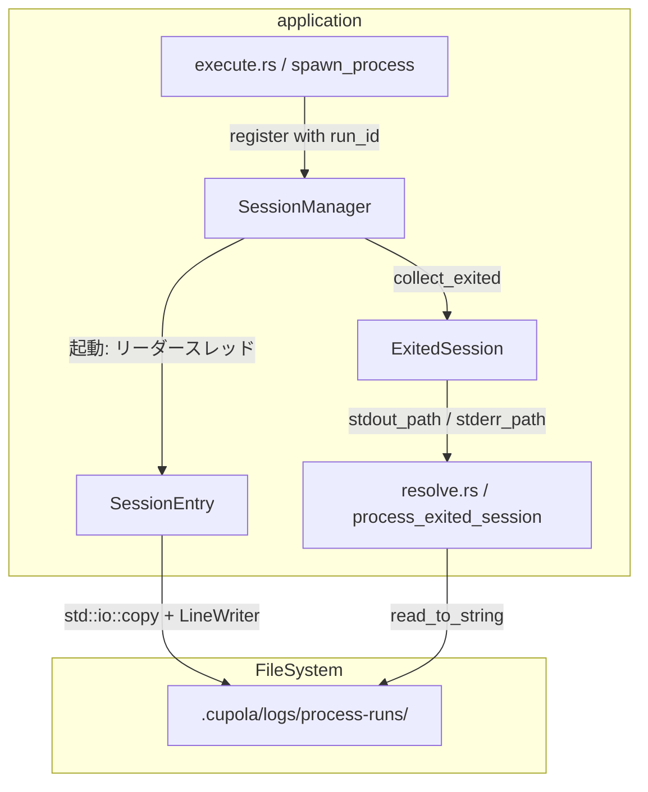
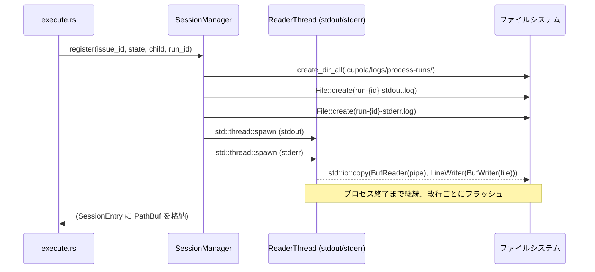
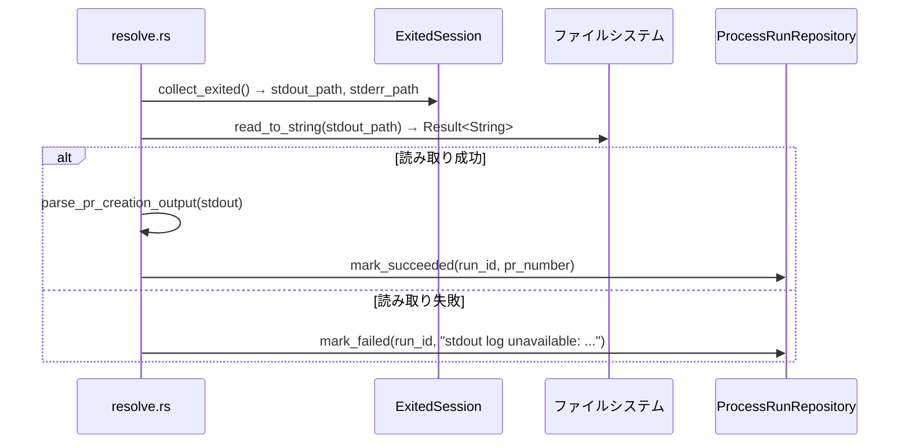

# 設計ドキュメント

## 概要

本機能は、子プロセス（Claude Code）の stdout/stderr をプロセス実行中にファイルへストリーム書き込みすることで、OOM リスクの排除とデバッグ性向上を実現する。

現在は `JoinHandle<String>` でメモリに蓄積した後、プロセス完了時に一括ダンプする方式を採っている。これを **register 時点でリーダースレッドを起動し `std::io::copy` でファイルへストリームする方式** に置き換える。`ExitedSession` は文字列フィールドをパスフィールドに置換し、resolve フェーズはファイルから読み取るよう変更する。

**影響範囲**: `SessionManager`（application 層）、`ExitedSession`（application 層）、`resolve.rs`（application 層）、および関連ユニットテスト。Clean Architecture の依存関係に変更はない。

### ゴール

- メモリ上の stdout/stderr バッファを線形増加させない
- プロセス実行中にログファイルを `tail -f` で観察できる
- ファイル書き込み失敗時に空 PR body での誤作成を防ぐ
- `dump_session_io` と `JoinHandle<String>` 設計を除去してコードを単純化する

### 非ゴール

- bounded ring buffer による部分的な解決（stderr のみの対応など）
- Windows 環境での動作保証（本プロジェクトは macOS/Linux ターゲット）
- ストリームのリアルタイム解析（受け取りは完了後の一括 read_to_string で十分）

## 要件トレーサビリティ

| 要件 | 概要 | コンポーネント | インターフェース | フロー |
|---|---|---|---|---|
| 1.1 | register 時にリーダースレッドを起動 | SessionManager | register() | ストリーム書き込みフロー |
| 1.2 | 実行中メモリバッファ禁止 | SessionManager | SessionEntry 構造体 | — |
| 1.3 | JoinHandle<String> → PathBuf | SessionManager | SessionEntry 構造体 | — |
| 1.4 | std::io::copy + BufWriter | SessionManager | register() | — |
| 1.5 | run_id を register に渡す | SessionManager / spawn_process | register() シグネチャ | — |
| 2.1 | LineWriter でリアルタイム書き込み | SessionManager | register() | ストリーム書き込みフロー |
| 2.2 | 実行中にファイル外部観察可能 | SessionManager | — | — |
| 2.3 | プロセス開始直後から書き込み | SessionManager | — | — |
| 3.1 | ExitedSession をパスベースに | ExitedSession | ExitedSession 構造体 | — |
| 3.2 | read_to_string で stdout 解析 | ResolvePhase | process_exited_session() | Resolve フロー |
| 3.3 | ファイルから stderr スニペット | ResolvePhase | process_exited_session() | Resolve フロー |
| 3.4 | dump_session_io 削除 | ResolvePhase | — | — |
| 4.1 | ファイル作成失敗 → error! + スレッド終了 | SessionManager | register() | エラーハンドリング |
| 4.2 | ファイル読み取り失敗 → mark_failed | ResolvePhase | process_exited_session() | エラーハンドリング |
| 4.3 | 空文字フォールバック禁止 | ResolvePhase | process_exited_session() | — |
| 4.4 | error! にパスとエラー詳細を含める | SessionManager | — | — |
| 5.1 | run-{id}-stdout/stderr.log 命名規則 | SessionManager | — | — |
| 5.2 | run_id 未確定時は一時ファイル（廃止） | — | — | — |
| 5.3 | update_run_id でリネーム（廃止） | — | — | — |
| 5.4 | ログディレクトリ作成 | SessionManager | register() | — |
| 6.1 | session_manager テスト移行 | SessionManager テスト | — | — |
| 6.2 | resolve テスト make_session 移行 | ResolvePhase テスト | — | — |
| 6.3 | 統合テストで書き込みを検証 | 統合テスト | — | — |
| 6.4 | 既存 resolve テスト全通過 | ResolvePhase テスト | — | — |

> 要件 5.2 / 5.3 については research.md の「run_id の確定タイミング」調査の結果、`register` 呼び出し時に run_id が常に確定しているため、一時ファイルによる回避策は不要と判断した。`register` シグネチャに `run_id: i64` を追加する（決定: `register` シグネチャへの run_id 追加）。

## アーキテクチャ

### 既存アーキテクチャの分析

```
application/
  session_manager.rs   ← SessionEntry(JoinHandle<String>), ExitedSession(stdout: String)
  polling/
    execute.rs         ← spawn_process → register → update_run_id
    resolve.rs         ← dump_session_io, session.stdout, session.stderr
```

**変更対象の境界**:
- `SessionManager` は application 層の純粋な内部コンポーネントであり、外部アダプターへの依存なし
- `ExitedSession` は `resolve.rs` に渡される DTO であり、domain には依存しない
- 変更はすべて application 層内に閉じており、Clean Architecture 依存規則を維持する

### アーキテクチャパターンと境界マップ



**重要な設計選択**:
- `register(issue_id, state, child, run_id)` にシグネチャを変更し、一時ファイルを廃止
- `update_run_id` の呼び出しを `spawn_process` から削除（リネーム処理が不要になるため）
- `LineWriter<BufWriter<File>>` で改行ごとフラッシュを保証

### テクノロジースタック

| レイヤー | 選択 | 役割 | 備考 |
|---|---|---|---|
| ファイル書き込み | `std::io::LineWriter<BufWriter<File>>` | 改行ごとフラッシュ、バッファリング | 標準ライブラリのみ |
| ストリームコピー | `std::io::copy` | リーダーストリーム→ライターへの転送 | 8KB チャンク |
| スレッド | `std::thread::spawn` | リーダースレッド（既存パターン踏襲） | JoinHandle の戻り値型が変わる |

## システムフロー

### ストリーム書き込みフロー



### Resolve フロー（ファイル読み取り）



**フロー決定事項**:
- ファイル読み取りエラーは `?` で伝搬せず、`mark_failed` を明示的に呼び出して `Ok(())` を返す（呼び出し元の `resolve_exited_sessions` は warn ログを出すが継続する）
- stderr 読み取りエラーは空スニペット扱いにするか、同様に mark_failed とするかは、stdout 読み取り失敗と同じ方針（mark_failed）を適用する

## コンポーネントとインターフェース

| コンポーネント | ドメイン/レイヤー | 意図 | 要件カバレッジ | 主要依存 |
|---|---|---|---|---|
| SessionManager | application | セッション登録・完了収集・ストリーム書き込み | 1.1–1.5, 2.1–2.3, 4.1, 4.4, 5.1, 5.4 | std::fs, std::io, std::thread |
| ExitedSession | application | プロセス終了情報 DTO | 3.1 | PathBuf |
| ResolvePhase | application | 完了セッションの後処理、ファイル読み取り | 3.2–3.4, 4.2–4.3 | std::fs |
| spawn_process | application | プロセス起動・register 呼び出し | 1.5 | SessionManager |

### Application Layer

#### SessionManager

| フィールド | 詳細 |
|---|---|
| 意図 | プロセスの登録・完了収集・stdout/stderr ストリーム書き込みを管理する |
| 要件 | 1.1, 1.2, 1.3, 1.4, 1.5, 2.1, 2.2, 2.3, 4.1, 4.4, 5.1, 5.4 |

**責務と制約**
- `register` 呼び出し時にリーダースレッドを起動し、`std::io::copy` でファイルへストリームする
- `SessionEntry` はメモリ上の文字列バッファを保持しない
- ファイル作成失敗はプロセスを停止させず、`tracing::error!` で記録してスレッドを終了させる

**依存関係**
- Inbound: `execute.rs / spawn_process` — `register` を呼び出す（P0）
- Outbound: `std::fs` — ログファイルの作成・ディレクトリ作成（P0）
- Outbound: `std::thread` — リーダースレッドの起動（P0）

**Contracts**: Service [x]

##### Service Interface

```rust
// 変更後のシグネチャ（run_id を追加）
pub fn register(&mut self, issue_id: i64, state: State, child: Child, run_id: i64);

// 変更後の SessionEntry（stdout_handle/stderr_handle を削除）
struct SessionEntry {
    child: Child,
    started_at: Instant,
    registered_state: State,
    stdout_path: PathBuf,
    stderr_path: PathBuf,
    log_id: i64,
    run_id: i64,
    // stdout_reader_handle: JoinHandle<()>  ← 書き込み完了を待つ場合に保持（オプション）
    // stderr_reader_handle: JoinHandle<()>  ← 同上
}
```

- 事前条件: `child.stdout` / `child.stderr` が `Some`（`Stdio::piped()` で起動されていること）
- 事後条件: リーダースレッドが起動し、ログファイルへの書き込みが開始されている
- 不変条件: メモリ上に stdout/stderr 文字列バッファが存在しない

**実装メモ**
- Integration: `spawn_process` は `register(issue_id, state, child, run_id)` を呼ぶよう変更する
- Validation: `child.stdout.take()` が `None` の場合は warn ログのみ（Stdio::piped 未設定）
- Risks: Unix 上では rename がアトミックなためリネーム競合は発生しないが、ファイルディスクリプタが別スレッドで使用中でも問題ない

#### ExitedSession

| フィールド | 詳細 |
|---|---|
| 意図 | プロセス終了情報を resolve フェーズへ渡す DTO。文字列バッファを保持しない |
| 要件 | 3.1 |

**変更後の構造体**

```rust
pub struct ExitedSession {
    pub issue_id: i64,
    pub exit_status: ExitStatus,
    pub stdout_path: PathBuf,   // 旧: stdout: String
    pub stderr_path: PathBuf,   // 旧: stderr: String
    pub log_id: i64,
    pub run_id: i64,
    pub registered_state: State,
}
```

#### ResolvePhase（resolve.rs）

| フィールド | 詳細 |
|---|---|
| 意図 | 完了セッションの後処理。ファイルから stdout/stderr を読み取り、PR 作成や mark_failed を行う |
| 要件 | 3.2, 3.3, 3.4, 4.2, 4.3 |

**責務と制約**
- `dump_session_io` を削除する（ストリーム側で書き込みが完了しているため不要）
- stdout ファイルの読み取り失敗は `mark_failed` で処理し、空文字フォールバックは禁止
- stderr ファイル読み取り失敗時も同様に `mark_failed`

**変更後の主要コード意図**

```rust
// 変更前:
dump_session_io(run_id, &session.stdout, &session.stderr);
let output = parse_pr_creation_output(&session.stdout);

// 変更後:
let stdout = match std::fs::read_to_string(&session.stdout_path) {
    Ok(s) => s,
    Err(e) => {
        // mark_failed して早期リターン
    }
};
let output = parse_pr_creation_output(&stdout);
```

**実装メモ**
- Integration: `ExitedSession` の `stdout_path` / `stderr_path` を使う
- Validation: ファイル不在は `mark_failed` で処理（panic/unwrap 禁止）
- Risks: リーダースレッドがまだ書き込み中の状態でプロセスが終了した場合、ファイルが不完全な可能性がある。`collect_exited` → resolve の流れでは、プロセス終了後にリーダースレッドの EOF まで待つことが望ましい

> **リーダースレッドの完了待機**: `collect_exited` でリーダースレッドの `JoinHandle<()>` を join することで、ファイルが完全に書き込まれた後に `ExitedSession` を返すことができる。`JoinHandle` は `()` を返すため、メモリは確保しない。

## データモデル

### ドメインモデル（変更分）

`SessionEntry`（非公開）の変更:

| フィールド | 変更前 | 変更後 |
|---|---|---|
| `stdout_handle` | `Option<JoinHandle<String>>` | 削除（または `Option<JoinHandle<()>>`） |
| `stderr_handle` | `Option<JoinHandle<String>>` | 削除（または `Option<JoinHandle<()>>`） |
| `stdout_path` | なし | `PathBuf` |
| `stderr_path` | なし | `PathBuf` |

`ExitedSession`（公開）の変更:

| フィールド | 変更前 | 変更後 |
|---|---|---|
| `stdout` | `String` | 削除 |
| `stderr` | `String` | 削除 |
| `stdout_path` | なし | `PathBuf` |
| `stderr_path` | なし | `PathBuf` |

## エラーハンドリング

### エラー戦略

ファイル I/O エラーは 2 箇所で発生しうる。それぞれに対して明確なポリシーを適用する。

### エラーカテゴリと対応

| エラー箇所 | エラー種別 | 対応 | 理由 |
|---|---|---|---|
| リーダースレッド: `File::create` 失敗 | システムエラー | `tracing::error!` → スレッド終了、プロセス継続 | ファイル作成失敗でプロセスを止める理由はない |
| リーダースレッド: `io::copy` 途中失敗 | システムエラー | `tracing::error!` → スレッド終了 | 一部書き込み後の障害は継続不可 |
| resolve: `read_to_string(stdout_path)` 失敗 | システムエラー | `mark_failed(run_id, "stdout log unavailable: ...")` | ログなしで PR を作るリスクを排除 |
| resolve: `read_to_string(stderr_path)` 失敗 | システムエラー | stderr スニペットを空文字として扱い、処理継続 | stderr 読み取り失敗は致命的でない（PR 作成は stdout 依存） |

### モニタリング

- リーダースレッド起動成功: `tracing::debug!` でパスを記録
- ファイル作成失敗: `tracing::error!` にパス + エラーを記録
- resolve でファイル読み取り失敗: `tracing::error!` + `mark_failed`

## テスト戦略

### ユニットテスト

`session_manager.rs` の変更点:
- `collect_exited_returns_finished_process`: `exited[0].stdout` → `std::fs::read_to_string(&exited[0].stdout_path)` で内容検証
- `register_and_is_running`: 変更なし（パスの存在確認を追加してもよい）
- リーダースレッドのエラー経路: `File::create` が失敗するモックを使ったテスト

`resolve.rs` の変更点:
- `make_session` ヘルパー: `TempDir` 上にフィクスチャファイルを作成し `stdout_path`/`stderr_path` を設定
- `find_pr_error_calls_mark_failed_and_returns_ok` 等: フィクスチャファイルを用意した上で既存のアサーションを維持
- stdout ファイル読み取り失敗 → `mark_failed` のテストを追加

### 統合テスト

- プロセス実行中にログファイルが書き込まれていることを検証するテスト
- `tail` 相当（ファイルを途中で読み取り、内容が増えていることを確認）

### パフォーマンス・負荷

- リーダースレッドは `std::io::copy` を使用するため、チャンクサイズ（8KB）のバッファのみ確保する
- 30 分 × stderr 出力速度が最大負荷であり、ファイル I/O のみがボトルネック（メモリは無増加）
