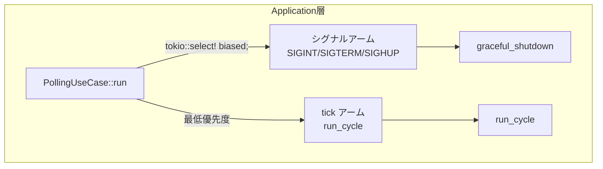

# Design Document — issue-313: polling loop の tokio::select! biased 化

## Overview

本変更は `PollingUseCase::run()` 内の `tokio::select!` に `biased;` キーワードを追加し、シグナルアームを tick アームより先に宣言することで、シグナルと tick が同時 ready になった場合に常にシグナルが優先されるようにする。

**Purpose**: シャットダウン直前の余分なポーリングサイクル実行を防止し、GitHub コメント・PR 作成・issue クローズ等の意図しない副作用を排除する。  
**Users**: デーモンモードでプロセスを管理するオペレーター。  
**Impact**: `tokio::select!` ブロック内のアーム順の変更と `biased;` 追加のみ。既存ロジック（グレースフルシャットダウン・SIGINT 2 回目強制シャットダウン）は無変更。

### Goals

- `biased;` 追加によりシグナルが tick より常に優先される
- 変更スコープを最小限（1 箇所の `tokio::select!` ブロックのみ）に留める
- 既存テストをすべてパスさせる

### Non-Goals

- shutdown フラグによる `run_cycle` 冒頭チェックの追加（`biased;` で十分）
- ポーリング間隔やシグナルハンドラロジックの変更
- 孤児プロセス対策（既存の `graceful_shutdown` で解決済み）

## Architecture

### Existing Architecture Analysis

`PollingUseCase` は Application 層に位置し、`run()` メソッドがメインポーリングループを担う。`tokio::select!` で tick と各 OS シグナルを多重待機している。シグナル受信後は `graceful_shutdown()` を呼び出してプロセス回収と PID ファイル削除を行う。

現在のアーム順：
1. `tick.tick()` — ポーリングサイクル実行
2. `sigint.recv()` — SIGINT（Ctrl-C）
3. `sigterm.recv()` — SIGTERM
4. `sighup.recv()` — SIGHUP

`biased;` なしのため、tick と signal が同時 ready のとき擬似ランダム選択が行われる。

### Architecture Pattern & Boundary Map

変更は Application 層内の単一ファイルに閉じており、ドメイン層・アダプター層・ブートストラップ層への影響はない。



**Architecture Integration**:
- 選択パターン: 既存の `tokio::select!` に `biased;` を追加するだけ（新規コンポーネント不要）
- 既存パターン維持: シグナルハンドラの責務・`graceful_shutdown` の呼び出し構造は無変更
- Steering 準拠: Application 層の独立性を保持

### Technology Stack

| Layer | Choice / Version | Role | Notes |
|-------|-----------------|------|-------|
| Runtime | tokio（既存） | 非同期ランタイム・select!/signal | `biased;` は tokio 1.x で利用可能 |

## System Flows

```mermaid
sequenceDiagram
    participant OS as OS
    participant Loop as polling loop
    participant Cycle as run_cycle
    participant Shutdown as graceful_shutdown

    Note over Loop: tokio::select! biased;
    OS->>Loop: SIGINT/SIGTERM/SIGHUP（シグナル送信）
    Note over Loop: biased; によりシグナルアームが\n最優先で評価される
    Loop->>Shutdown: graceful_shutdown()
    Note over Loop: tick と signal が同時 ready でも\nシグナルが必ず選択される
```

変更前は tick と signal が同時 ready のとき擬似ランダム選択が行われ、tick が選ばれる可能性があった。`biased;` 追加後はシグナルアームが常に先に評価されるため、シグナルが必ず選択される。

## Requirements Traceability

| Requirement | Summary | Components | Flows |
|-------------|---------|------------|-------|
| 1.1 | `biased;` キーワード追加 | PollingUseCase::run | select! biased 化 |
| 1.2 | シグナル優先選択の保証 | PollingUseCase::run | 同時 ready 時のアーム評価順 |
| 1.3 | シグナルアームを tick より前に配置 | PollingUseCase::run | アーム宣言順変更 |
| 1.4 | 既存ハンドラロジックの無変更 | PollingUseCase::run | graceful_shutdown 呼び出し維持 |
| 2.1 | シャットダウンシナリオの結合テスト（任意） | tests/ | シグナル受信テスト |
| 2.2 | 既存テストのパス | 全テストスイート | cargo test |

## Components and Interfaces

| Component | Domain/Layer | Intent | Req Coverage | Key Dependencies |
|-----------|-------------|--------|--------------|-----------------|
| PollingUseCase::run | Application | biased select! でシグナル優先制御 | 1.1, 1.2, 1.3, 1.4 | tokio::select!, tokio::signal |

### Application 層

#### PollingUseCase::run

| Field | Detail |
|-------|--------|
| Intent | `tokio::select!` に `biased;` を追加しシグナルアームを先頭に配置することでシグナル優先を実現する |
| Requirements | 1.1, 1.2, 1.3, 1.4 |

**Responsibilities & Constraints**

- `biased;` を `tokio::select!` の最初の行に追加する
- アーム順を `SIGINT → SIGTERM → SIGHUP → tick` に変更する
- 各シグナルアーム内の `graceful_shutdown` 呼び出しロジックは変更しない
- SIGINT 2 回目の強制シャットダウンロジック（`sigint_count`）は変更しない

**Dependencies**

- External: tokio 1.x (`tokio::select!`, `tokio::signal::unix`) — 既存依存（P0）

**Contracts**: State [ ✓ ]

##### State Management

- State model: `sigint_count: u32` は変更なし。シグナル受信後は `return Ok(())` でループ終了
- 並行戦略: `biased;` によりアーム評価が決定的になる。tick の starving リスクはシグナル受信後即座に return するため実害なし

**Implementation Notes**

- Integration: `src/application/polling_use_case.rs` の `run()` メソッド内 `tokio::select!` ブロックのみ変更
- Validation: `cargo test` で既存テストのリグレッションがないことを確認
- Risks: なし（`biased;` は tokio の安定機能）

#### 変更後コード概要

```
loop {
    tokio::select! {
        biased;                     // ← 追加：アーム評価を宣言順に固定

        _ = sigint.recv() => { ... }   // ← 先頭に移動
        _ = sigterm.recv() => { ... }  // ← 先頭に移動
        _ = sighup.recv() => { ... }   // ← 先頭に移動
        _ = tick.tick() => { ... }     // ← 最後尾（最低優先度）
    }
}
```

## Error Handling

### Error Strategy

本変更は `tokio::select!` のアーム評価順を変更するだけであり、新たなエラーパスは発生しない。既存のエラーハンドリング（`run_cycle` のエラーログ、`graceful_shutdown` の各種タイムアウト処理）は変更なし。

### Monitoring

既存のトレーシングログ（`tracing::info!("received SIGTERM, ...")` 等）は変更なし。

## Testing Strategy

### Unit Tests

- 既存の `#[cfg(test)] mod tests` ブロックが `biased;` 追加後もコンパイル・パスすることを確認

### Integration Tests

- `cargo test` で全テストスイートがパスすることを確認（必須）
- シグナル受信時に余分なサイクルが走らないことを確認する結合テストの追加（任意: race window の再現が困難なため）
