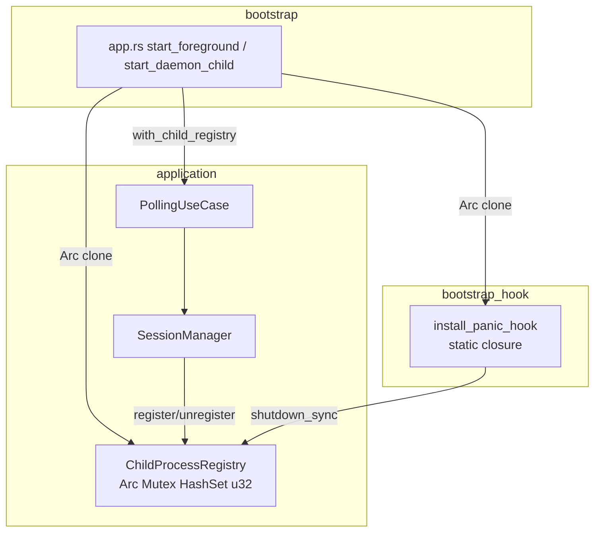
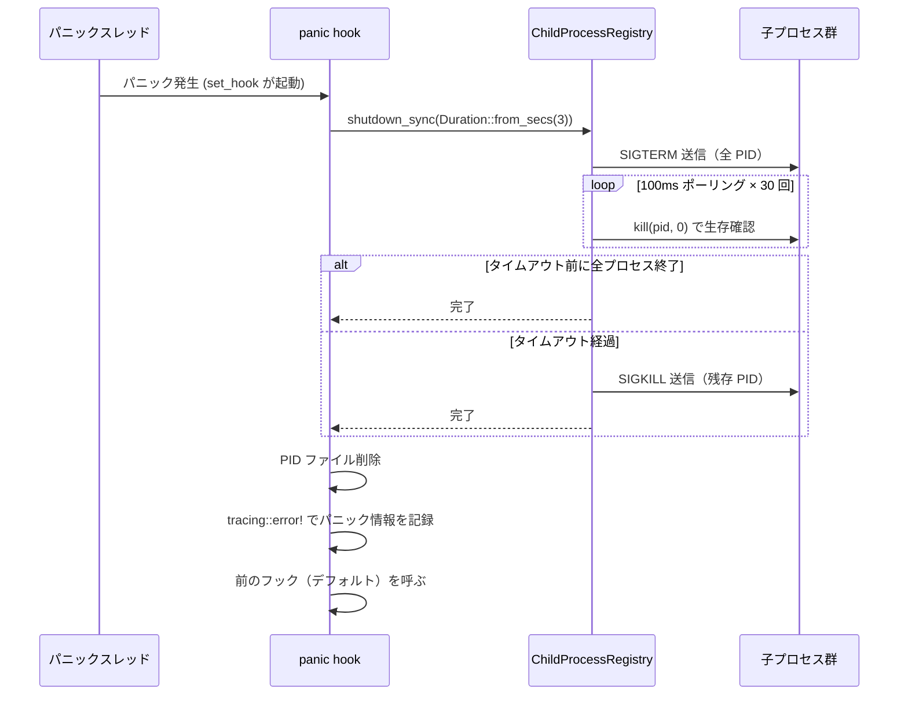

# 設計書: panic 時の graceful exit (panic hook)

## 概要

本機能は、cupola デーモン内で panic が発生した際に Claude Code の子プロセスが孤児化する問題を解決する。`install_panic_hook` を拡張し、PID ファイル削除とログ記録に加えて、登録済みの全子プロセスへの SIGTERM → SIGKILL シーケンスを実行する。

**ユーザー**: cupola デーモンを運用するエンジニア。今後は panic 後に `ps` で孤児プロセスを探す必要がなくなる。

**変更の影響**: `SessionManager`・`PollingUseCase`・`install_panic_hook` の 3 コンポーネントを拡張する。既存の正常終了パス（SIGTERM/SIGINT ハンドラ）・正常シャットダウンロジックは変更しない。

### Goals

- panic 発生後、登録済み子プロセスが必ず終了されること（SIGTERM → 3 秒タイムアウト → SIGKILL）
- PID ファイルが削除されること
- panic のメッセージ・位置がログファイルに残ること
- 既存の正常終了パスに影響を与えないこと

### Non-Goals

- 正常終了パス（SIGTERM/SIGINT）のシャットダウンロジック変更
- tokio async コンテキストでの使用（panic hook は sync-only）
- Windows 対応（nix クレートを使用）
- 子プロセスの stdout/stderr の回収（panic 時は不要）

## 要件トレーサビリティ

| 要件 | 概要 | コンポーネント | インターフェース | フロー |
|------|------|----------------|-----------------|--------|
| 1.1–1.5 | PID 共有レジストリ | ChildProcessRegistry, SessionManager | ChildProcessRegistry::register/unregister | - |
| 2.1–2.5 | 同期シャットダウン API | ChildProcessRegistry | ChildProcessRegistry::shutdown_sync | panic shutdown flow |
| 3.1–3.5 | panic hook 拡張 | install_panic_hook | - | panic shutdown flow |
| 4.1–4.4 | bootstrap 配線 | PollingUseCase, bootstrap/app.rs | PollingUseCase::with_child_registry | - |
| 5.1–5.5 | 統合テスト | tests/ | - | - |

## アーキテクチャ

### 既存アーキテクチャの制約

- `SessionManager` は `std::process::Child` を保持する（`!Send + !Sync`）ため `Arc<Mutex<SessionManager>>` での共有は不可
- panic hook は `'static` クロージャが必要（ライフタイム制約）
- panic hook は sync コンテキスト（tokio runtime 停止後に実行される可能性）

### アーキテクチャパターンと境界



- **ChildProcessRegistry** は application 層（`session_manager.rs` に同居）に置き、bootstrap と panic hook の両方から参照する
- bootstrap は registry を二つの `Arc::clone` で panic hook と PollingUseCase に渡す（唯一の配線拠点）
- SessionManager は registry への副作用更新のみを行い、registry の所有権は持たない

### テクノロジースタック

| レイヤー | 採用技術 | 役割 |
|----------|---------|------|
| Application | `std::sync::{Arc, Mutex, HashSet}` | ChildProcessRegistry の共有状態 |
| Application | `nix` クレート (既存依存) | SIGTERM / SIGKILL 送信、プロセス生存確認 |
| Bootstrap | `std::panic::{set_hook, take_hook}` | panic hook の登録・チェーン |

## システムフロー

### panic シャットダウンフロー



## コンポーネントとインターフェース

### サマリーテーブル

| コンポーネント | レイヤー | 役割 | 要件カバレッジ | 主要依存 |
|--------------|--------|------|--------------|--------|
| ChildProcessRegistry | application | 子プロセス PID の共有レジストリ・同期シャットダウン | 1.1–2.5 | nix, std::sync |
| SessionManager (拡張) | application | 子プロセス登録・終了時のレジストリ更新 | 1.2, 1.3, 1.5 | ChildProcessRegistry |
| install_panic_hook (拡張) | bootstrap | panic 時の全クリーンアップオーケストレーション | 3.1–3.5 | ChildProcessRegistry |
| PollingUseCase (拡張) | application | registry の SessionManager への転送 | 4.3 | ChildProcessRegistry, SessionManager |

---

### Application 層

#### ChildProcessRegistry

| Field | Detail |
|-------|--------|
| Intent | 子プロセス PID を スレッドセーフに管理し、sync シャットダウンを実行する |
| Requirements | 1.1, 1.2, 1.3, 1.4, 1.5, 2.1, 2.2, 2.3, 2.4, 2.5 |

**Responsibilities & Constraints**
- `Arc<Mutex<HashSet<u32>>>` でアクティブ子プロセスの PID を管理する
- `Clone` で安価にコピーでき、bootstrap が panic hook と SessionManager の両方に渡せる
- `shutdown_sync` は sync コンテキスト専用（`std::thread::sleep` で待機）
- Mutex が毒化していた場合は `PoisonError::into_inner` でデータを回収して処理を続行する

**Dependencies**
- External: `nix` クレート — SIGTERM/SIGKILL 送信・kill(pid, 0) によるプロセス生存確認 (P0)
- External: `std::sync::{Arc, Mutex, HashSet}` — 共有状態 (P0)

**Contracts**: Service [x]

##### Service Interface

```rust
/// アクティブな子プロセスの PID 共有レジストリ。
/// SessionManager と panic hook の間でプロセス PID を共有する。
/// Arc<Mutex<_>> でラップされているため、clone() で安価に複数の所有者に配布できる。
#[derive(Clone, Default)]
pub struct ChildProcessRegistry {
    pids: Arc<Mutex<HashSet<u32>>>,
}

impl ChildProcessRegistry {
    pub fn new() -> Self;

    /// 子プロセスが起動したときに PID を登録する。
    /// SessionManager::register から呼ばれる。
    pub fn register(&self, pid: u32);

    /// 子プロセスが終了・強制終了したときに PID を削除する。
    /// SessionManager::collect_exited / kill / kill_all から呼ばれる。
    pub fn unregister(&self, pid: u32);

    /// 全登録プロセスへ SIGTERM → タイムアウト → SIGKILL を同期実行する。
    /// panic hook から呼ばれることを想定しており、async/await を使わない。
    ///
    /// # 動作
    /// 1. SIGTERM を全 PID に送信
    /// 2. `poll_interval` ごとにプロセスの生存を確認し、全終了まで待機
    /// 3. `sigterm_timeout` 経過後も残存するプロセスに SIGKILL を送信
    pub fn shutdown_sync(&self, sigterm_timeout: Duration);
}
```

- Preconditions: なし（空の registry に対して呼んでも安全）
- Postconditions: `shutdown_sync` 完了後、登録されていた全 PID のプロセスは終了しているか、SIGKILL が送信済み
- Invariants: `register` / `unregister` / `shutdown_sync` はすべてロック取得後に操作するため、PID セットの一貫性は保たれる

**Implementation Notes**
- Integration: `src/application/session_manager.rs` に `ChildProcessRegistry` を追加定義する。SessionManager と同一ファイルに置くことで、依存関係を application 層内で完結させる
- Validation: `shutdown_sync` 内では SIGTERM/SIGKILL の送信失敗（プロセスが既に終了している場合など）は無視する
- Risks: poll_interval を細かくしすぎると panic hook が長時間ブロックする。100ms 間隔 × 最大 30 回 (3 秒) を推奨

---

#### SessionManager（拡張）

| Field | Detail |
|-------|--------|
| Intent | 子プロセスの起動・終了時に ChildProcessRegistry を副作用として更新する |
| Requirements | 1.2, 1.3, 1.5 |

**Responsibilities & Constraints**
- `register` 時に `registry.register(child.id())` を呼ぶ
- `collect_exited` で回収した PID を `registry.unregister(pid)` で削除する
- `kill(issue_id)` 実行後に対象 PID を `registry.unregister` する
- `kill_all` 実行後に全 PID を `registry.unregister` する
- registry が未設定（`None`）の場合は従来どおり動作し、registry 更新を行わない

**Dependencies**
- Inbound: PollingUseCase — `with_child_registry` builder でセット (P1)
- Outbound: ChildProcessRegistry — PID 登録・削除 (P0)

**Contracts**: Service [x]

##### Service Interface

```rust
impl SessionManager {
    /// ChildProcessRegistry を設定する builder メソッド。
    /// 設定した場合、register/collect_exited/kill/kill_all が
    /// registry を自動更新する。
    pub fn with_registry(mut self, registry: ChildProcessRegistry) -> Self;
}
```

**Implementation Notes**
- Integration: `SessionManager` に `registry: Option<ChildProcessRegistry>` フィールドを追加
- Validation: `registry` が `None` のときは既存動作と同一
- Risks: `kill_all` は `Child::id()` を呼ぶ前に kill するため、PID を事前に収集してから unregister する

---

#### PollingUseCase（拡張）

| Field | Detail |
|-------|--------|
| Intent | bootstrap から渡された ChildProcessRegistry を SessionManager に転送する |
| Requirements | 4.3 |

**Contracts**: Service [x]

##### Service Interface

```rust
impl PollingUseCase</* ... */> {
    /// ChildProcessRegistry を SessionManager に接続する builder メソッド。
    /// with_process_repo / with_pid_file と同じパターン。
    pub fn with_child_registry(mut self, registry: ChildProcessRegistry) -> Self;
}
```

**Implementation Notes**
- `with_child_registry` は内部の `self.session_mgr = self.session_mgr.with_registry(registry)` を呼ぶだけ

---

### Bootstrap 層

#### install_panic_hook（拡張）

| Field | Detail |
|-------|--------|
| Intent | panic 発生時に子プロセスシャットダウン → PID 削除 → ログ → 前のフック の順でクリーンアップを実行する |
| Requirements | 3.1, 3.2, 3.3, 3.4, 3.5, 4.1, 4.2, 4.4 |

**Contracts**: Service [x]

##### Service Interface

```rust
/// panic hook をインストールする。
/// 拡張シグネチャ: ChildProcessRegistry を受け取り、hook 内でシャットダウンする。
pub fn install_panic_hook(
    pid_path: std::path::PathBuf,
    child_registry: ChildProcessRegistry,
);
```

- Preconditions: `pid_path` の親ディレクトリが存在すること（PID ファイル書き込み後に呼ばれる前提）
- Postconditions: hook 実行後、全子プロセスは終了しているか SIGKILL 送信済み、PID ファイルは削除済み

**Implementation Notes**
- Integration: `start_foreground` と `start_daemon_child` で `install_panic_hook(pid_path, registry.clone())` に変更
- Validation: シャットダウンエラーは全て無視（best-effort）
- Risks: tracing サブスクライバが初期化前に panic した場合、`tracing::error!` は no-op になる。ログが残らなくても PID ファイルと子プロセスの回収は実行される

---

## エラーハンドリング

### エラー戦略

panic hook 内はすべて best-effort（エラーは無視）。原則 `let _ = ...` で無視し、cleanup ステップ自体が panic を引き起こしてはならない。

### エラーカテゴリと対応

| エラー | 発生場所 | 対応 |
|--------|---------|------|
| Mutex 毒化 | `ChildProcessRegistry::shutdown_sync` での lock() | `PoisonError::into_inner` でデータ回収して継続 |
| SIGTERM/SIGKILL 送信失敗 | `shutdown_sync` 内 nix 呼び出し | `let _ = ...` で無視（プロセス既終了など正常ケースも含む） |
| PID ファイル削除失敗 | hook 内 `delete_pid()` | `let _ = ...` で無視（既存実装と同じ） |
| tracing 未初期化 | hook 内 `tracing::error!` | no-op になるため問題なし |

### モニタリング

- panic 発生時、`tracing::error!` で `message`, `file`, `line` フィールドを構造化ログとして記録
- ログが `.cupola/logs/` に書き込まれている場合のみ残る（tracing 初期化後の panic が対象）

## テスト戦略

### ユニットテスト

- `ChildProcessRegistry::register` / `unregister` が HashSet を正しく更新することを確認
- `SessionManager::with_registry` を使ったとき、`register` で子プロセス PID が registry に追加されることを確認
- `SessionManager::collect_exited` で終了したプロセスの PID が registry から削除されることを確認
- `SessionManager::kill_all` 後に registry が空になることを確認
- `shutdown_sync` でモックプロセス（`sleep` コマンド）に SIGTERM が送られ終了することを確認

### 統合テスト

- **Mutex 毒化テスト**: 別スレッドで意図的に Mutex を毒化し panic を起こす。registry に登録したモック子プロセス（`sleep`）が panic hook 実行後に残存していないことを `kill(pid, 0)` で確認する（要件 5.1）
- **spawn_blocking panic テスト**: `spawn_blocking` 内でパニックさせる同等のシナリオで同様の検証を行う（要件 5.2）
- **PID ファイル削除テスト**: panic hook 実行後に PID ファイルが削除されていることを確認（要件 5.3）
- **タイムバウンドテスト**: テスト全体が `SIGTERM_TIMEOUT (3 秒) + マージン (2 秒)` 以内に完了することを確認（要件 5.4）
