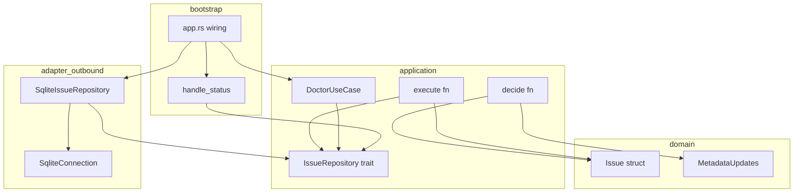
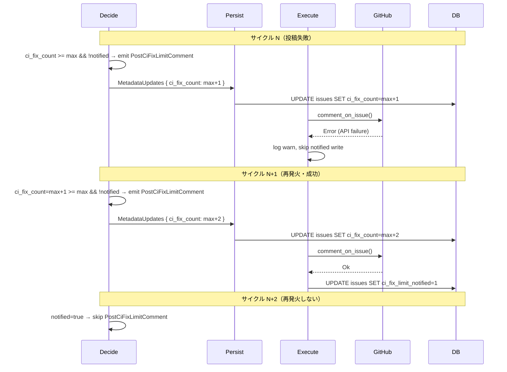
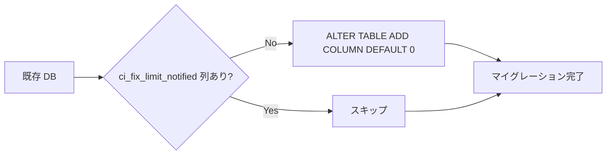

# 技術設計書: PostCiFixLimitComment 通知欠落防止（best-effort 再発火）

## Overview

本機能は、`PostCiFixLimitComment` エフェクトの best-effort 実行失敗時に生じる通知永久欠落リスクを最小スコープで解消する。Issue ドメインに `ci_fix_limit_notified: bool` フラグを追加し、Decide が「上限超過かつ未通知」の場合のみ効果を発火、Execute の成功後のみフラグを永続化することで、次サイクルでの再発火を保証する。

**利用者**: Cupola を運用するエンジニア（CI 自動修正が止まった場合の通知受信者）および Cupola 自身の Decide/Execute ランタイム。

**影響範囲**: ドメイン層（Issue, MetadataUpdates）、アプリケーション層（decide.rs, execute.rs, DoctorUseCase）、アダプタ層（SQLite スキーマ・リポジトリ）、bootstrap 層（status コマンド表示）。

### Goals
- `PostCiFixLimitComment` 投稿失敗時に次のポーリングサイクルで自動再発火する
- 投稿成功後は二重通知が発生しない
- `status` / `doctor` コマンドで未送信通知の有無を運用者が確認できる
- 既存 DB が無停止でマイグレーション可能

### Non-Goals
- 全通知系 Effect への汎用フラグ管理（#322 以降の decide.rs 分割後に再考）
- EffectLog port + 観測の完全抽象化（#338 で対応）
- リトライキューや指数バックオフ機構

## 要件トレーサビリティ

| 要件 | サマリー | コンポーネント | インターフェース | フロー |
|------|---------|---------------|----------------|-------|
| 1.1–1.4 | Issue フラグ追加 | Issue, MetadataUpdates | – | – |
| 2.1–2.5 | DB スキーマ・マイグレーション | SqliteConnection, SqliteIssueRepository | IssueRepository | – |
| 3.1–3.4 | Decide 条件変更 | decide_implementation_review_waiting | – | 再発火フロー |
| 4.1–4.3 | Execute 成功時フラグ書き込み | execute.rs (PostCiFixLimitComment ハンドラ) | IssueRepository | 再発火フロー |
| 5.1–5.2 | status 警告表示 | handle_status (bootstrap/app.rs) | IssueRepository | – |
| 6.1–6.4 | doctor 警告チェック | DoctorUseCase | IssueRepository | – |

## Architecture

### 既存アーキテクチャ分析

Cupola は Clean Architecture（4 層）を採用している。本機能の影響範囲は以下の通り。

- **domain**: `Issue` struct（純粋データ）、`MetadataUpdates`（sparse update set）
- **application**: `decide` 関数（純粋関数）、`execute` 関数（effect 実行）、`DoctorUseCase`（診断ユースケース）
- **adapter/outbound**: `SqliteIssueRepository`（永続化）、`SqliteConnection`（スキーマ管理）
- **bootstrap**: `handle_status`（status コマンド表示）

依存関係は内向きのみ。application が IssueRepository ポートトレイトを定義し、adapter がそれを実装する。

### アーキテクチャ境界マップ



**統合ポイント**: execute.rs の `PostCiFixLimitComment` ハンドラが `IssueRepository` を直接呼ぶ（Option A）。これは既に execute.rs が `issue_repo` 引数を受け取るパターンと整合する。

### テクノロジースタック

| 層 | 技術 | 本機能での役割 |
|----|------|---------------|
| Domain | Rust struct | `ci_fix_limit_notified: bool` フィールド追加 |
| Application | 純粋関数 / async trait | Decide 条件変更、Execute ハンドラ修正、DoctorUseCase 拡張 |
| Adapter/Outbound | rusqlite + spawn_blocking | スキーマ ALTER TABLE、SELECT/INSERT/UPDATE 更新 |
| Bootstrap | clap + tokio | status 表示ループ、DoctorUseCase 呼び出しの async 化 |

## System Flows

### 再発火フロー（投稿失敗 → 次サイクル再発火 → 成功）



**主要な設計判断**:
- Decide は `ci_fix_limit_notified` を MetadataUpdates に含めない（execute 側が担う）
- Execute は match 文で成功/失敗を分岐し、成功時のみ `update_state_and_metadata` を呼ぶ
- 発火条件を `>= max` にすることで、count が max+1 以上になっても未通知なら再発火する

## Components and Interfaces

### コンポーネントサマリー

| コンポーネント | 層 | 目的 | 要件カバレッジ | 主要依存 |
|--------------|---|------|---------------|---------|
| Issue | domain | ci_fix_limit_notified フィールド保持 | 1.1, 1.2 | – |
| MetadataUpdates | domain | ci_fix_limit_notified のスパース更新 | 1.3, 1.4 | Issue |
| SqliteConnection | adapter/outbound | スキーマ定義・マイグレーション | 2.1, 2.2 | rusqlite |
| SqliteIssueRepository | adapter/outbound | SELECT/INSERT/UPDATE の列対応 | 2.3, 2.4, 2.5 | SqliteConnection |
| decide_implementation_review_waiting | application/domain | 発火条件変更 | 3.1–3.4 | Issue, Config |
| execute.rs PostCiFixLimitComment handler | application | 成功時フラグ書き込み | 4.1–4.3 | IssueRepository |
| handle_status | bootstrap | pending 通知の警告表示 | 5.1, 5.2 | IssueRepository, Config |
| DoctorUseCase | application | pending 通知件数チェック | 6.1–6.4 | IssueRepository |

---

### Domain

#### Issue

| フィールド | 詳細 |
|-----------|------|
| Intent | CI 修正上限通知済みフラグを保持する |
| Requirements | 1.1, 1.2 |

**変更内容**

`Issue` 構造体に `pub ci_fix_limit_notified: bool` を追加する。`Issue::new` では `false` に初期化する。

**Contracts**: State [ ✓ ]

---

#### MetadataUpdates

| フィールド | 詳細 |
|-----------|------|
| Intent | ci_fix_limit_notified のスパース更新をサポートする |
| Requirements | 1.3, 1.4 |

**変更内容**

`MetadataUpdates` 構造体に `pub ci_fix_limit_notified: Option<bool>` を追加する。`apply_to` メソッドに `Some(v)` の場合のみ `issue.ci_fix_limit_notified = v` を適用するロジックを追加する。

---

### Application

#### decide_implementation_review_waiting（Decide ロジック）

| フィールド | 詳細 |
|-----------|------|
| Intent | PostCiFixLimitComment を「上限超過かつ未通知」の場合のみ発火させる |
| Requirements | 3.1, 3.2, 3.3, 3.4 |

**変更内容**

CI failure 経路（旧 line 681）と conflict 経路（旧 line 693）の両方で、発火条件を以下のように変更する。

変更前:
```
if prev.ci_fix_count == cfg.max_ci_fix_cycles {
    effects.push(Effect::PostCiFixLimitComment);
    metadata_updates.ci_fix_count = Some(prev.ci_fix_count + 1);
}
```

変更後の論理（コードではなく仕様）:
- 条件: `prev.ci_fix_count >= cfg.max_ci_fix_cycles AND NOT prev.ci_fix_limit_notified`
- 効果: `Effect::PostCiFixLimitComment` を発火、`ci_fix_count = prev + 1` をセット
- `ci_fix_limit_notified` は MetadataUpdates に含めない

**実装上の注意**: `ci_fix_limit_notified` を MetadataUpdates に含めると通常 persist フローで DB 書き込みが行われてしまうため、decide 側では一切セットしない。

---

#### execute.rs — PostCiFixLimitComment ハンドラ

| フィールド | 詳細 |
|-----------|------|
| Intent | 投稿成功時のみ ci_fix_limit_notified を true に永続化する |
| Requirements | 4.1, 4.2, 4.3 |

**Inbound**: Decide が発火した `Effect::PostCiFixLimitComment`
**Outbound**: `GitHubClient.comment_on_issue`, `IssueRepository.update_state_and_metadata`（成功時のみ）

**Contracts**: Service [ ✓ ]

**変更内容（論理仕様）**:

```
match github.comment_on_issue(n, &msg).await {
    Ok(()) =>
        // 成功: ci_fix_limit_notified = true を DB に書き込む
        issue_repo.update_state_and_metadata(
            issue.id,
            MetadataUpdates { ci_fix_limit_notified: Some(true), ..Default::default() }
        ).await?;
    Err(e) =>
        // 失敗: ログを残すのみ、フラグは書かない（best-effort）
        warn!("failed to post ci-fix-limit comment: {e}");
}
```

**実装上の注意**: 現行の `Effect::PostCiFixLimitComment` ハンドラは `github.comment_on_issue(...).await?` で `?` 伝播しているが、これを match 式に変更する。best-effort の性質は維持する（呼び出し元でエラーをキャッチするのではなく、このハンドラ内で match して吸収する）。

---

#### DoctorUseCase

| フィールド | 詳細 |
|-----------|------|
| Intent | pending CI 修正上限通知の件数を OperationalReadiness セクションで報告する |
| Requirements | 6.1, 6.2, 6.3, 6.4 |

**Inbound**: bootstrap からの `run(&config_path).await` 呼び出し
**Outbound**: `IssueRepository.find_all()` または専用クエリ（`max_ci_fix_cycles` と比較）

**Contracts**: Service [ ✓ ]

**変更内容**:

`DoctorUseCase<C: ConfigLoader, R: CommandRunner>` を `DoctorUseCase<C: ConfigLoader, R: CommandRunner, I: IssueRepository>` に拡張する。`run` メソッドを `pub async fn run(&self, config_path: &Path) -> Vec<DoctorCheckResult>` に変更する。

新規チェック関数 `check_pending_ci_fix_limit_notifications(issue_repo, max_cycles)` を追加し、以下の動作とする:

- `issue_repo.find_all()` を await して全 Issue を取得
- `ci_fix_count > max_cycles && !ci_fix_limit_notified` の Issue をカウント
- 件数 > 0 なら `CheckStatus::Warn` を返す（remediation メッセージ付き）
- 件数 = 0 なら `CheckStatus::Ok` を返す

remediation メッセージ: `"GitHub の通信状況を確認の上、cupola start で再度ポーリングを実行してください"`

**bootstrap 側の影響**: `DoctorUseCase::new` に `issue_repo` を追加引数として渡す。`run` の呼び出しに `.await` を追加する。

---

### Adapter/Outbound

#### SqliteConnection (init_schema)

| フィールド | 詳細 |
|-----------|------|
| Intent | ci_fix_limit_notified 列をスキーマ定義・マイグレーションに追加する |
| Requirements | 2.1, 2.2 |

**変更内容**:
1. `CREATE TABLE issues` の定義に `ci_fix_limit_notified INTEGER NOT NULL DEFAULT 0` を追加
2. `run_add_column_migration` の呼び出しに `"ci_fix_limit_notified INTEGER NOT NULL DEFAULT 0"` を追加

---

#### SqliteIssueRepository

| フィールド | 詳細 |
|-----------|------|
| Intent | 全 SQL クエリで ci_fix_limit_notified を正しく読み書きする |
| Requirements | 2.3, 2.4, 2.5 |

**Contracts**: Service [ ✓ ]

**変更内容**:
1. `SELECT` クエリ（`find_by_id`, `find_by_issue_number`, `find_active`, `find_all`, `find_by_state`）の列リストに `ci_fix_limit_notified` を追加
2. `row_to_issue` 関数で `ci_fix_limit_notified` を読み取り `!= 0` で bool 変換
3. `save` の INSERT 文に `ci_fix_limit_notified` を追加（値は `issue.ci_fix_limit_notified as i64`）
4. `update_state_and_metadata` の動的 SQL 生成に `ci_fix_limit_notified: Option<bool>` の処理を追加

---

### Bootstrap

#### handle_status

| フィールド | 詳細 |
|-----------|------|
| Intent | 各 Issue の pending 通知状態を status 出力に表示する |
| Requirements | 5.1, 5.2 |

**変更内容**:

`handle_status` の Issue 表示ループ内で、以下の条件をチェックして `⚠ ci-fix-limit notification pending` を出力に追加する。

条件: `issue.ci_fix_count > config.max_ci_fix_cycles && !issue.ci_fix_limit_notified`

**実装上の注意**: `config.max_ci_fix_cycles` が `handle_status` の引数またはスコープから取得可能であることを確認する。

## Data Models

### Domain Model

`Issue` エンティティに以下の不変条件が加わる。

- `ci_fix_limit_notified = true` は `ci_fix_count >= max_ci_fix_cycles` の状態でのみ書き込まれる（Decide の発火条件 + Execute の成功パスの組み合わせによって保証）
- 一度 `ci_fix_limit_notified = true` になると、`PostCiFixLimitComment` は発火しない

### 物理データモデル

#### issues テーブル（追加列）

| 列名 | 型 | 制約 | デフォルト |
|------|----|------|-----------|
| `ci_fix_limit_notified` | INTEGER | NOT NULL | 0 |

マイグレーション SQL:
```sql
ALTER TABLE issues ADD COLUMN ci_fix_limit_notified INTEGER NOT NULL DEFAULT 0;
```

既存行は `DEFAULT 0`（`false`）が設定される。これは正しい初期値である（通知済みではないため）。

## Error Handling

### エラー戦略

`PostCiFixLimitComment` エフェクトは best-effort を維持する。

| シナリオ | 処理 |
|---------|------|
| GitHub API 投稿成功 | `ci_fix_limit_notified = true` を DB に書き込む |
| GitHub API 投稿失敗 | `tracing::warn!` でログ、`ci_fix_limit_notified` は書き込まない（次サイクルで再発火） |
| `update_state_and_metadata` 失敗（成功後） | `?` で伝播し、エラーは polling ループ上位で処理（既存挙動） |

### モニタリング

- `tracing::warn!` で投稿失敗と再発火試行をログに残す
- `doctor` コマンドで pending 件数を可視化することで、長期間の通知欠落を検出できる

## Testing Strategy

### ユニットテスト

1. **Decide — 投稿失敗時再発火シナリオ**: `ci_fix_count = max+1, notified = false` の Issue を入力とし、`PostCiFixLimitComment` が発火されることを確認
2. **Decide — 通知済みシナリオ**: `notified = true` の場合、`PostCiFixLimitComment` が発火しないことを確認
3. **Decide — 正常シナリオ（count < max）**: `count < max` の場合、`PostCiFixLimitComment` が発火しないことを確認
4. **MetadataUpdates.apply_to**: `ci_fix_limit_notified: Some(true)` が正しく Issue に適用されることを確認
5. **DoctorUseCase**: mock `IssueRepository` を使って pending 件数に応じた Warn/Ok が返ることを確認

### 統合テスト

1. **execute — 成功時フラグ書き込み**: mock `IssueRepository` で `PostCiFixLimitComment` 成功後に `update_state_and_metadata` が `ci_fix_limit_notified: Some(true)` で呼ばれることを確認
2. **execute — 失敗時フラグ非書き込み**: GitHub 投稿が失敗した場合に `update_state_and_metadata` が呼ばれないことを確認
3. **SQLite スキーマ**: インメモリ DB で `init_schema` を呼び出し、`ci_fix_limit_notified` 列が存在し 0 で初期化されることを確認
4. **SQLite マイグレーション**: 列なし状態の DB に `init_schema` を適用し、`ci_fix_limit_notified` 列が追加されることを確認
5. **SQLite 読み書きラウンドトリップ**: `save` → `find_by_id` で `ci_fix_limit_notified` が正しく保持・復元されることを確認

## Migration Strategy



- `run_add_column_migration` が "duplicate column name" エラーを握りつぶす既存パターンを利用
- ロールバックトリガー: マイグレーション失敗時は `init_schema` がエラーを伝播し起動を中断
- バリデーション: 統合テスト（インメモリ + ファイル DB）で確認
