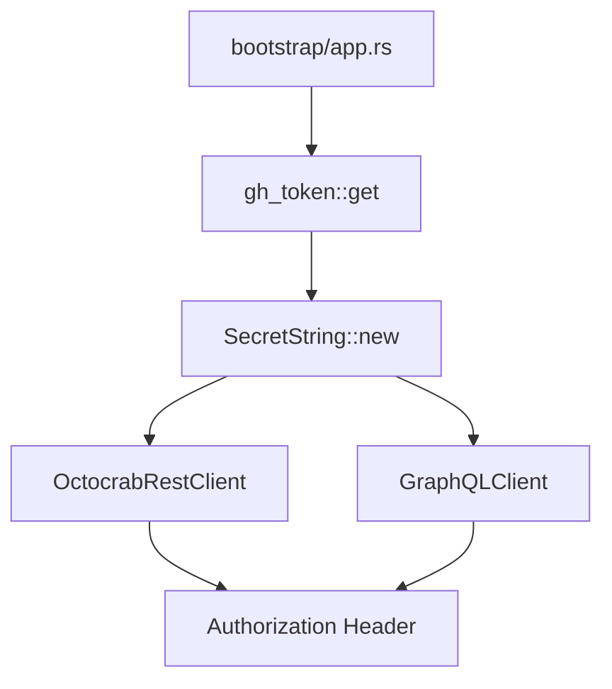

# 設計書

## 概要

GitHub PAT を保持する `OctocrabRestClient.token` と `GraphQLClient.token` フィールドを `String` から `secrecy::SecretString` 型に置換する防御的セキュリティリファクタリング。現時点では漏洩経路は存在しないが、将来的な `Debug` derive 追加や `format!()` への誤った混入によるトークン漏洩を型レベルで封じる。

変更はアダプター層（`OctocrabRestClient`、`GraphQLClient`）とブートストラップ層（`bootstrap/app.rs`）に限定される。ドメイン層・アプリケーション層への変更はなく、クリーンアーキテクチャの依存方向を維持する。

### 目標

- `OctocrabRestClient.token` と `GraphQLClient.token` を `SecretString` 型に置換する
- トークンの取り出しに `.expose_secret()` の明示的呼び出しを必須にする
- `Debug` 出力でトークン値がマスクされることをテストで検証する
- `cargo clippy -- -D warnings` を通過させ、既存テストが無回帰で動作することを確認する

### 非目標

- ドメイン層・アプリケーション層への `SecretString` の浸透
- トークン以外の秘密情報（DB パスワード等）の `SecretString` 化
- 環境変数の最小化（Issue #321 のスコープ）

## 要件トレーサビリティ

| 要件 | 概要 | コンポーネント | インターフェース |
|------|------|----------------|-----------------|
| 1.1, 1.2 | secrecy crate 追加 | Cargo.toml | — |
| 2.1, 2.3, 2.5 | OctocrabRestClient の型置換 | OctocrabRestClient | `new(token: SecretString, ...)` |
| 2.2, 2.4, 2.5 | GraphQLClient の型置換 | GraphQLClient | `new(token: SecretString, ...)` |
| 3.1, 3.2 | bootstrap でのラップ | bootstrap/app.rs | `SecretString::new(...)` |
| 4.1, 4.2 | Debug マスキング検証 | OctocrabRestClient (test) | `SecretString` の `Debug` 実装 |
| 5.1–5.3 | 後方互換性・品質保証 | 全変更ファイル | clippy・テスト |

## アーキテクチャ

### 既存アーキテクチャ分析

プロジェクトは Clean Architecture に従い、外側の層（bootstrap → adapter → application → domain）の一方向依存を厳守している。トークンのライフサイクルは以下の通り:

現状:
1. `bootstrap/app.rs` にて `gh_token::get()` で `String` として取得
2. `OctocrabRestClient::new(token.clone(), ...)` と `GraphQLClient::new(token, ...)` に `String` を渡す
3. 各クライアント内で HTTP `Authorization` ヘッダー構築時にのみ使用

変更後:
1. `bootstrap/app.rs` にて `SecretString::new(gh_token::get()?.into())` でラップ
2. 各クライアントに `SecretString` を渡す（`token.clone()` は `SecretString::Clone` で動作）
3. ヘッダー構築時に `.expose_secret()` で明示的に取り出す

### アーキテクチャ図



変更対象のみを示す。アプリケーション層・ドメイン層は変更なし。

### テクノロジースタック

| 層 | 選択/バージョン | 役割 | 備考 |
|----|----------------|------|------|
| adapter/outbound | secrecy 0.10（新規追加） | `SecretString` によるトークンラップ | `[target.'cfg(unix)'.dependencies]` に追加 |
| adapter/outbound | 既存 reqwest 0.12 | HTTP ヘッダー構築（変更なし） | `.expose_secret()` を追加するのみ |
| bootstrap | 既存 gh-token 0.1 | トークン取得（変更なし） | 戻り値 `String` を `SecretString` でラップ |

## コンポーネントとインターフェース

### コンポーネント概要

| コンポーネント | 層 | 目的 | 要件カバレッジ | 主要依存 | コントラクト |
|--------------|----|----|--------------|---------|------------|
| OctocrabRestClient | adapter/outbound | REST API クライアント（`token` フィールド型変更） | 2.1, 2.3, 2.5, 4.1, 4.2 | secrecy (P0) | Service |
| GraphQLClient | adapter/outbound | GraphQL API クライアント（`token` フィールド型変更） | 2.2, 2.4, 2.5 | secrecy (P0) | Service |
| bootstrap/app.rs | bootstrap | DI 配線（`SecretString` でトークンをラップ） | 3.1, 3.2 | secrecy (P0) | — |
| Cargo.toml | — | 依存関係定義 | 1.1, 1.2 | — | — |

### adapter/outbound

#### OctocrabRestClient

| フィールド | 詳細 |
|----------|------|
| 意図 | GitHub REST API クライアント。`token` フィールドを `String` から `SecretString` に変更し、ヘッダー構築時に `.expose_secret()` を使用する |
| 要件 | 2.1, 2.3, 2.5, 4.1, 4.2 |

**責務と制約**

- `token: SecretString` フィールドを保持する
- `new()` は `token: SecretString` を受け取る
- HTTP `Authorization` ヘッダーを構築する4メソッド（`get_job_logs`、`fetch_label_actor_login`、`fetch_user_permission`、`remove_label`）で `.expose_secret()` を使用する
- `octocrab::builder().personal_token()` は `String` を要求するため、`token.expose_secret().to_string()` を使用する
- テスト用 `new_for_test()` は `SecretString::new("test-token".into())` を使用する

**依存関係**

- 外部: secrecy 0.10 — `SecretString`、`ExposeSecret` トレイト (P0)
- 外部: octocrab 0.44 — REST API クライアント（変更なし、P0）

**コントラクト**: Service [x]

##### サービスインターフェース変更

変更前のシグネチャ:
```
pub fn new(token: String, owner: String, repo: String) -> Result<Self>
```

変更後のシグネチャ:
```
pub fn new(token: SecretString, owner: String, repo: String) -> Result<Self>
```

ヘッダー構築パターン変更（全4箇所）:
```
// 変更前
format!("Bearer {}", self.token)
// 変更後
format!("Bearer {}", self.token.expose_secret())
```

octocrab builder 変更:
```
// 変更前
.personal_token(token.clone())
// 変更後
.personal_token(token.expose_secret().to_string())
```

**実装メモ**
- `new_for_test()` 内の `token: "test-token".to_string()` フィールド初期化を `token: SecretString::new("test-token".into())` に変更する
- Debug マスキングテストは `SecretString::new("actual-token".into())` の `format!("{:?}", ...)` 出力に `"actual-token"` が含まれないことをアサートする形式で追加する

#### GraphQLClient

| フィールド | 詳細 |
|----------|------|
| 意図 | GitHub GraphQL API クライアント。`token` フィールドを `String` から `SecretString` に変更し、`execute_raw()` 内のヘッダー構築に `.expose_secret()` を使用する |
| 要件 | 2.2, 2.4, 2.5 |

**責務と制約**

- `token: SecretString` フィールドを保持する
- `new()` は `token: SecretString` を受け取る
- `execute_raw()` 内の `format!("bearer {}", self.token)` を `format!("bearer {}", self.token.expose_secret())` に変更する

**依存関係**

- 外部: secrecy 0.10 — `SecretString`、`ExposeSecret` トレイト (P0)
- 外部: reqwest 0.12 — HTTP クライアント（変更なし、P0）

**コントラクト**: Service [x]

##### サービスインターフェース変更

変更前のシグネチャ:
```
pub fn new(token: String, owner: String, repo: String) -> Self
```

変更後のシグネチャ:
```
pub fn new(token: SecretString, owner: String, repo: String) -> Self
```

ヘッダー構築パターン変更（1箇所）:
```
// 変更前
format!("bearer {}", self.token)
// 変更後
format!("bearer {}", self.token.expose_secret())
```

**実装メモ**
- `GraphQLClient` には `Debug` derive も `Clone` derive もないため、フィールド型変更のみで足りる

### bootstrap

#### bootstrap/app.rs

| フィールド | 詳細 |
|----------|------|
| 意図 | アダプター構築時のトークン受け渡し。`gh_token::get()` の戻り値 `String` を `SecretString::new()` でラップしてからコンストラクタに渡す |
| 要件 | 3.1, 3.2 |

**責務と制約**

- `run_daemon_child` 関数（line ~525）と `run_foreground` 相当箇所（line ~690）の2箇所を変更する
- `use secrecy::SecretString` を import に追加する
- `let token = gh_token::get()?;` を `let token = SecretString::new(gh_token::get()?.into());` に変更する
- `token.clone()` は `SecretString` の `Clone` 実装により動作する（変更不要）

**コントラクト**: なし（内部 DI 配線）

## テスト戦略

### ユニットテスト

- `github_rest_client.rs` の `#[cfg(test)] mod tests` 内に Debug マスキングテストを追加する
  - `SecretString::new("actual-token".into())` の `format!("{:?}", ...)` 出力に `"actual-token"` が含まれないことをアサートする
  - 要件 4.1、4.2 を充足する

### 既存テストの回帰確認

- `github_rest_client.rs` の `pagination_tests` モジュール（`new_for_test()` を使用）が通過すること
- `devbox run test` で全件パスすること

### コンパイル時品質確認

- `devbox run check` でコンパイルエラーがないことを確認
- `devbox run clippy` で `cargo clippy -- -D warnings` の通過を確認

## セキュリティ考慮事項

`SecretString` の `Zeroize` 実装により、ドロップ時にメモリ上のトークン文字列がゼロクリアされる。これは将来的なメモリ内容の意図しない流出に対する追加の防御層を提供する。`.expose_secret()` の呼び出し箇所が `grep expose_secret` で一覧できるため、将来のセキュリティ監査も容易になる。
