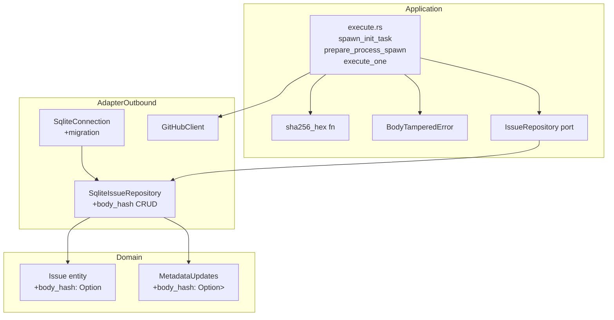
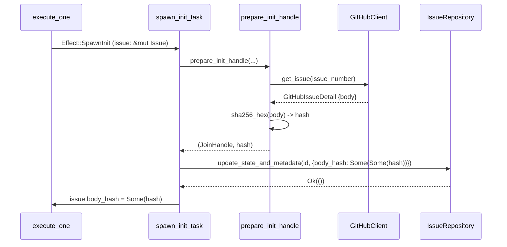
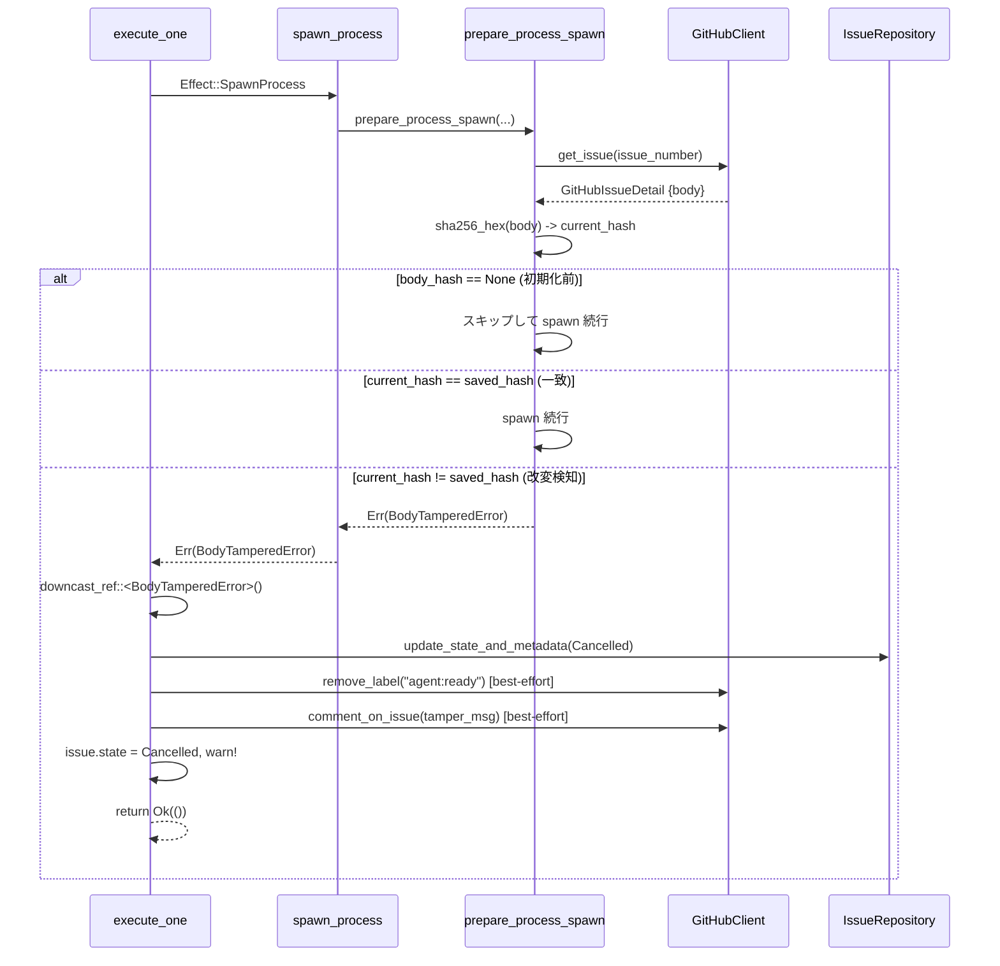
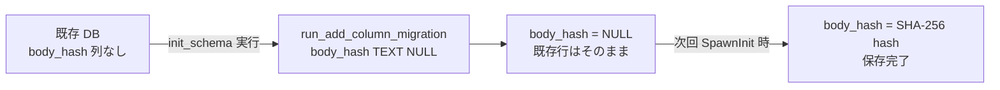

# 設計書

## 概要

本機能は、Cupola の Issue 処理パイプラインに SHA-256 ハッシュベースの本文改変検知を追加する。`agent:ready` が初めて付与されたとき、Issue 本文を取得してそのハッシュを「承認スナップショット」として保存する。以降の Claude Code spawn 前に現在の本文を再取得してハッシュを比較し、不一致（改変検知）の場合は処理をキャンセルしてコメントで通知する。

本対応は「攻撃者が無害な Issue を作成し、trusted ユーザーが `agent:ready` を付与した後に本文を改変する」というプロンプト注入攻撃を防ぐ。ハッシュ比較により、このウィンドウを閉じる。

**インパクト**: `issues` テーブルへの `body_hash TEXT` 列追加、`Issue` エンティティと `MetadataUpdates` 構造体の拡張、execute 相へのハッシュ計算・検証ロジックの追加、および `SECURITY.md` の更新。

### Goals
- `agent:ready` 承認後の Issue 本文編集によるプロンプト注入を防止する
- 再 approve フローを維持する: trusted ユーザーが改変後の内容を確認して再ラベル付与すれば処理再開可能
- フットプリント最小化: 新規テーブルなし、本文全文保存なし（ハッシュのみ）

### Non-Goals
- `agent:ready` 付与前の本文変更の検知
- PR レビューコメントのハッシュ管理（既存の per-author trust check で対応済み）
- Issue 本文の全文 DB 保存（案 B/C）
- TOCTOU 問題の対応（single-threaded polling の構造上発生しない）

---

## アーキテクチャ

### 既存アーキテクチャの分析

システムは Clean Architecture (4 層) を採用しており、実行フローは以下の通り:

1. **Collect 相**: GitHub イベントを収集
2. **Decide 相**: 現在の状態とイベントから `Effect` リストを生成 (pure function)
3. **Persist 相**: 状態変更を SQLite に書き込み
4. **Execute 相**: `Effect` を実行 (GitHub API 呼び出し、プロセス起動等)

ハッシュ計算・保存・検証はすべて **Execute 相** (`execute.rs`) で行う。`prepare_init_handle` と `prepare_process_spawn` はすでに `github.get_issue()` を呼び出しており、ここがハッシュ処理の自然な挿入点となる。

### アーキテクチャパターン & バウンダリマップ



**アーキテクチャ統合**:
- 選択パターン: Execute 相でのインライン拡張 — 既存フローへの最小変更
- ドメイン境界: `Issue` が `body_hash` を所有、`MetadataUpdates` がスパース更新を担う
- 新規ポート・トレイト不要; 既存 `IssueRepository.update_state_and_metadata` を活用
- `sha256_hex` は application 層 (execute.rs) の private/pub(crate) 関数として配置

### テクノロジースタック

| レイヤー | 選択 | 本機能での役割 | 備考 |
|---------|------|--------------|------|
| Data / Storage | SQLite + rusqlite (既存) | `body_hash` 列の保存・取得 | `run_add_column_migration` パターンで追加 |
| Backend | `sha2 = "0.10"` (新規) | SHA-256 hex ダイジェスト計算 | `hex` クレート不要。`format!("{:x}", ...)` で対応 |
| Backend | `thiserror` (既存) | `BodyTamperedError` 型定義 | Cargo.toml に既存 |

---

## システムフロー

### SpawnInit ハッシュ保存フロー



### SpawnProcess ハッシュ検証・改変応答フロー



---

## 要件トレーサビリティ

| 要件 | 概要 | コンポーネント | フロー |
|------|------|--------------|--------|
| 1.1 | issues.body_hash カラム | SqliteConnection migration | - |
| 1.2 | Issue.body_hash フィールド | Issue entity | - |
| 1.3 | MetadataUpdates.body_hash / persist.rs 更新 | MetadataUpdates, persist.rs | - |
| 1.4 | 後方互換マイグレーション | SqliteConnection | - |
| 2.1 | SpawnInit 時のハッシュ保存 | prepare_init_handle, spawn_init_task, IssueRepository | SpawnInit フロー |
| 2.2 | インメモリ Issue 更新 | spawn_init_task, execute_one | SpawnInit フロー |
| 3.1 | SpawnProcess でのハッシュ再計算 | prepare_process_spawn, sha256_hex | SpawnProcess フロー |
| 3.2 | 不一致時の BodyTamperedError | prepare_process_spawn, BodyTamperedError | SpawnProcess フロー |
| 3.3 | body_hash=None 時のスキップ | prepare_process_spawn | SpawnProcess フロー |
| 4.1 | Cancelled 遷移 | execute_one, IssueRepository | SpawnProcess フロー |
| 4.2 | agent:ready ラベル削除 | execute_one, GitHubClient | SpawnProcess フロー |
| 4.3 | 通知コメント投稿 | execute_one, GitHubClient | SpawnProcess フロー |
| 4.4 | warn! トレースイベント | execute_one | SpawnProcess フロー |
| 5.1, 5.2 | 再 approve フロー | spawn_init_task (SpawnInit の再実行) | SpawnInit フロー |
| 6.1-6.6 | SECURITY.md 更新 | SECURITY.md | - |

---

## コンポーネントとインターフェース

### コンポーネント概要

| コンポーネント | レイヤー | 目的 | 要件カバレッジ | 主要依存 |
|--------------|---------|------|--------------|---------|
| `Issue` entity | domain | body_hash フィールド追加 | 1.2 | - |
| `MetadataUpdates` | domain | body_hash スパース更新サポート | 1.3 | - |
| `SqliteConnection` | adapter/outbound | body_hash マイグレーション | 1.1, 1.4 | rusqlite |
| `SqliteIssueRepository` | adapter/outbound | body_hash の SELECT/UPDATE/INSERT | 1.1, 1.3, 1.4 | Issue, MetadataUpdates |
| `sha256_hex` 関数 | application | SHA-256 hex ダイジェスト計算 | 2.1, 3.1 | sha2 |
| `BodyTamperedError` | application | 改変検知エラー型 | 3.2, 4.1-4.4 | thiserror |
| `prepare_init_handle` (変更) | application | ハッシュを計算して返す | 2.1 | GitHubClient |
| `spawn_init_task` (変更) | application | ハッシュを保存・インメモリ更新 | 2.1, 2.2 | IssueRepository |
| `prepare_process_spawn` (変更) | application | ハッシュを比較・改変検知 | 3.1-3.3 | GitHubClient |
| `execute_one` (変更) | application | 改変応答（Cancelled・ラベル削除・コメント） | 4.1-4.4, 5.1, 5.2 | IssueRepository, GitHubClient |
| `persist_decision` (変更) | application | 早期リターン条件に body_hash を追加 | 1.3 | - |
| `SECURITY.md` | docs | 信頼モデルの文書化 | 6.1-6.6 | - |

---

### application 層

#### `sha256_hex` ユーティリティ関数

| フィールド | 詳細 |
|-----------|------|
| Intent | Issue 本文の SHA-256 hex ダイジェストを計算する |
| Requirements | 2.1, 3.1 |

**責務と制約**
- シグネチャ: `fn sha256_hex(text: &str) -> String`
- `sha2::Sha256::digest(text.as_bytes())` → `format!("{:x}", result)` で実装
- 純粋関数 (no I/O, no state)
- `execute.rs` 内に配置（または `application/hash.rs` の独立モジュール）

**依存**
- External: `sha2 = "0.10"` (新規追加)

---

#### `BodyTamperedError` エラー型

| フィールド | 詳細 |
|-----------|------|
| Intent | Issue 本文改変検知を表す専用エラー型 |
| Requirements | 3.2 |

**Contracts**: State [✓]

**サービスインターフェース**
```rust
#[derive(Debug, thiserror::Error)]
#[error("issue #{issue_number} body was modified after agent:ready approval")]
pub(crate) struct BodyTamperedError {
    pub issue_number: u64,
}
```

- 事前条件: `prepare_process_spawn` で `body_hash` が `Some` かつハッシュ不一致
- 事後条件: `execute_one` で `downcast_ref::<BodyTamperedError>()` によりキャッチされる

---

#### `prepare_init_handle` (変更)

| フィールド | 詳細 |
|-----------|------|
| Intent | SpawnInit 時にハッシュを計算して戻り値に追加 |
| Requirements | 2.1 |

**Contracts**: Service [✓]

**変更内容**
```rust
// 変更前
async fn prepare_init_handle(...) -> Result<JoinHandle<anyhow::Result<String>>>

// 変更後
async fn prepare_init_handle(...) -> Result<(JoinHandle<anyhow::Result<String>>, String)>
// 第二要素 String = body_hash (hex)
```
- `detail.body` に対して `sha256_hex` を呼び出し、JoinHandle と共に返す

---

#### `spawn_init_task` (変更)

| フィールド | 詳細 |
|-----------|------|
| Intent | prepare_init_handle から受け取ったハッシュを永続化し in-memory Issue を更新 |
| Requirements | 2.1, 2.2 |

**変更内容**
- `_issue_repo: &I` → `issue_repo: &I`（アンダースコア除去）
- `issue: &Issue` → `issue: &mut Issue`
- `prepare_init_handle` の戻り値 `(handle, hash)` を受け取り:
  1. `issue_repo.update_state_and_metadata(issue.id, MetadataUpdates { body_hash: Some(Some(hash.clone())), .. })` で保存
  2. `issue.body_hash = Some(hash)` でインメモリ更新
- 保存失敗時は `init_mgr.release_claim` してエラーを伝播

**依存**
- Outbound: `IssueRepository.update_state_and_metadata` — body_hash 保存 (P0)

---

#### `prepare_process_spawn` (変更)

| フィールド | 詳細 |
|-----------|------|
| Intent | SpawnProcess 前に body_hash を比較して改変を検知する |
| Requirements | 3.1, 3.2, 3.3 |

**変更内容**

既存の `let detail = github.get_issue(issue.github_issue_number).await?;` の直後に以下を追加:

```rust
// ハッシュ比較（body_hash が設定されている場合のみ）
let current_hash = sha256_hex(&detail.body);
if let Some(saved) = &issue.body_hash {
    if saved != &current_hash {
        tracing::warn!(
            issue_number = issue.github_issue_number,
            "Issue body was modified after agent:ready approval — aborting"
        );
        return Err(BodyTamperedError { issue_number: issue.github_issue_number }.into());
    }
}
```

---

#### `execute_one` — `Effect::SpawnProcess` ブランチ (変更)

| フィールド | 詳細 |
|-----------|------|
| Intent | BodyTamperedError をキャッチし改変応答を実行する |
| Requirements | 4.1, 4.2, 4.3, 4.4 |

**変更内容**

`Effect::SpawnProcess` の処理を以下に変更:

```rust
Effect::SpawnProcess { type_, causes, pending_run_id } => {
    let result = spawn_process(
        github, issue_repo, process_repo, claude_runner,
        worktree, session_mgr, config, issue, *type_, causes, *pending_run_id,
    ).await;

    if let Err(ref e) = result {
        if e.downcast_ref::<BodyTamperedError>().is_some() {
            // 改変検知応答
            handle_body_tampered(github, issue_repo, config, issue).await;
            return Ok(());
        }
    }
    result?;
}
```

`handle_body_tampered` ヘルパー:
1. `issue_repo.update_state_and_metadata(issue.id, { state: Some(State::Cancelled), .. })` — 伝播
2. `github.remove_label(n, "agent:ready")` — best-effort (warn! ログ)
3. `github.comment_on_issue(n, tamper_message)` — best-effort (warn! ログ)
4. `issue.state = State::Cancelled` — インメモリ更新
5. `warn!` トレースイベント発火

**実装注記**
- Integration: `execute_one` はすでに `issue: &mut Issue` を持つため変更なし
- Risks: label 削除・コメント失敗は best-effort（association_guard.rs の先例に倣う）

---

### adapter/outbound 層

#### `SqliteConnection` — マイグレーション追加

| フィールド | 詳細 |
|-----------|------|
| Intent | issues テーブルに body_hash TEXT 列を追加 |
| Requirements | 1.1, 1.4 |

**変更内容**

`init_schema` の migration ブロックに以下を追加:
```rust
Self::run_add_column_migration(&conn, "body_hash TEXT")?;
```

既存の `last_pr_review_submitted_at` マイグレーションの直後に配置。

---

#### `SqliteIssueRepository` — body_hash CRUD

| フィールド | 詳細 |
|-----------|------|
| Intent | body_hash カラムの SELECT / UPDATE を実装 |
| Requirements | 1.1, 1.3, 1.4 |

**変更内容**

1. **全 SELECT クエリ**: 末尾に `body_hash` を追加（列インデックス 12）
   ```sql
   SELECT id, github_issue_number, state, feature_name, weight,
          worktree_path, ci_fix_count, close_finished, consecutive_failures_epoch,
          created_at, updated_at, last_pr_review_submitted_at, body_hash
   FROM issues ...
   ```

2. **`row_to_issue`**: `body_hash: row.get(12)?` を追加

3. **`update_state_and_metadata`**: `body_hash: Option<Option<String>>` の処理を追加
   - `Some(Some(hash))` → `body_hash = ?N` (Text)
   - `Some(None)` → `body_hash = ?N` (Null)
   - `None` → 変更なし

**実装注記**
- 列インデックスが 12 であることを `row_to_issue` のテストで検証すること
- `body_hash` は `CREATE TABLE IF NOT EXISTS` ブロックには含めず、migration 専用

---

## データモデル

### ドメインモデル

```
Issue (entity)
  ├── id: i64
  ├── github_issue_number: u64
  ├── state: State
  ├── feature_name: String
  ├── weight: TaskWeight
  ├── worktree_path: Option<String>
  ├── ci_fix_count: u32
  ├── close_finished: bool
  ├── consecutive_failures_epoch: Option<DateTime<Utc>>
  ├── last_pr_review_submitted_at: Option<DateTime<Utc>>
  ├── body_hash: Option<String>   ← NEW
  ├── created_at: DateTime<Utc>
  └── updated_at: DateTime<Utc>
```

**不変条件**:
- `body_hash` は `SpawnInit` 完了後に `Some(hex_string)` になる
- `Cancelled` 遷移後も `body_hash` を保持（再 approve 時に上書き）
- `body_hash = None` の Issue では SpawnProcess は比較をスキップ（後方互換）

### 論理データモデル (SQLite)

**`issues` テーブル変更**:
```sql
-- マイグレーション（冪等）
ALTER TABLE issues ADD COLUMN body_hash TEXT;
-- NULL 可 (既存行は NULL のまま)
```

**マイグレーション方針**: `run_add_column_migration` パターンを踏襲。`CREATE TABLE IF NOT EXISTS` ブロックには含めず、migration ブロックでのみ追加する。

---

## エラーハンドリング

### エラー戦略

`BodyTamperedError` は `prepare_process_spawn` から `anyhow::Error` としてラップして返し、`execute_one` でダウンキャストする。改変応答の失敗モードを以下の通り分類する:

| エラー | 分類 | 応答 |
|-------|------|------|
| `BodyTamperedError` | ビジネスロジック | Cancelled 遷移 + ラベル削除 + コメント → `Ok(())` |
| `update_state_and_metadata` 失敗 | システム (DB) | `error!` ログ + 伝播 |
| ラベル削除失敗 | システム (GitHub API) | `warn!` ログ + 続行 |
| コメント投稿失敗 | システム (GitHub API) | `warn!` ログ + 続行 |

### モニタリング

- `warn!` トレースイベントに `issue_number` フィールドを含める
- 構造化ログにより Grafana 等での改変検知イベントの集計が可能

---

## テスト戦略

### ユニットテスト

- `sha256_hex`: 同一入力に対して同一出力を返すことを検証
- `sha256_hex`: 空文字列に対して既知の SHA-256 値 (`e3b0c44298fc...`) を返すことを検証
- `BodyTamperedError::to_string()`: issue_number が含まれることを検証
- `MetadataUpdates::apply_to`: `body_hash: Some(Some(hash))` が適用されることを検証

### 統合テスト

- 改変なし: `body_hash` が一致する場合に通常 spawn が成功すること
- 改変あり: `body_hash` が不一致の場合に Cancelled 遷移 + ラベル削除 + コメント投稿が発生すること
- `body_hash = None`: ハッシュ比較をスキップして spawn が成功すること
- SpawnInit 後に `body_hash` が DB に保存されること（ラウンドトリップ）
- `body_hash` の SQLite ラウンドトリップ (`save → find_by_id`)
- マイグレーション冪等性: 既存 DB に `body_hash` カラムが追加されること
- 再 approve: SpawnInit が body_hash を上書きすること

### セキュリティ考慮事項

本機能はセキュリティ機能そのものであるため、攻撃シナリオに基づくテストが重要:
- 攻撃者が `agent:ready` 付与後に Issue 本文を編集したシナリオを統合テストで網羅
- `agent:ready` 再付与後にハッシュが更新されることを検証

---

## マイグレーション戦略



既存 Issue は `body_hash = NULL` のまま残り、次回 SpawnInit（再 approve または新規 Issue）時に初めてハッシュが設定される。NULL の Issue は要件 3.3 によりハッシュ比較をスキップするため、移行期間中の互換性が保たれる。
