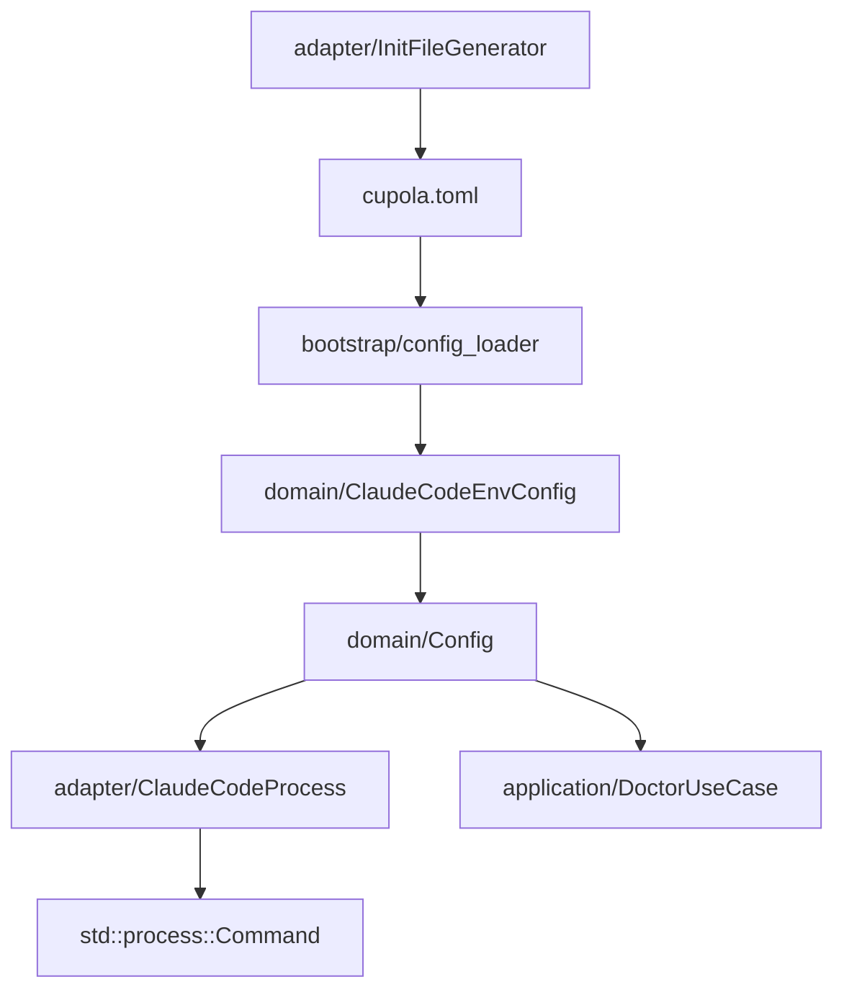
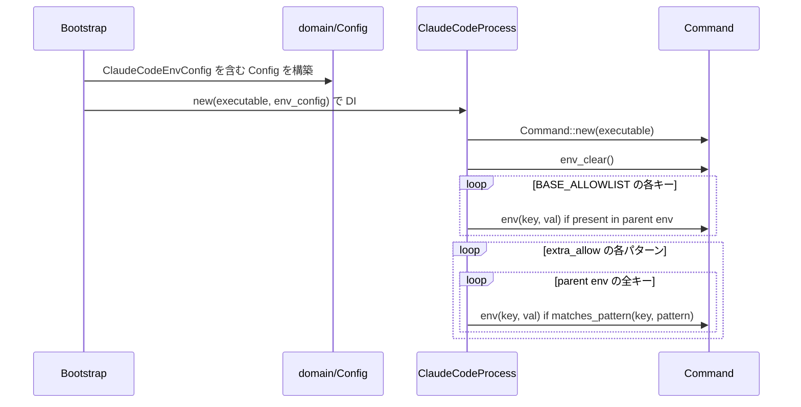
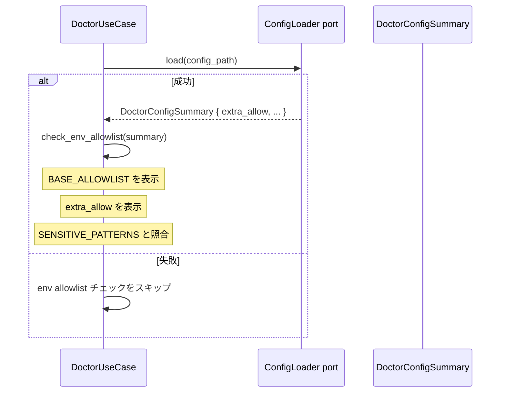

# 技術設計書

## 概要

**目的**: Claude Code 子プロセスが Cupola daemon の全 env を継承する脆弱性を解消し、secrets 漏洩の攻撃面を縮小する。

**ユーザー**: Cupola オペレーターが cupola.toml に `[claude_code.env]` セクションを追加することで、必要な env var だけを宣言的に許可できる。

**影響**: `ClaudeCodeProcess::build_command()` に `env_clear()` + allowlist 適用を追加し、`Config` に `claude_code_env` フィールドを追加することで既存の全セッションに適用される。

### ゴール

- `Command::env_clear()` を必ず呼び出し、デフォルト全継承を廃止する
- BASE_ALLOWLIST（HOME, PATH, USER, LANG, LC_ALL, TERM）を常に渡す
- cupola.toml の `extra_allow` でプロジェクト固有の env を追加できる
- サフィックス `*` ワイルドカードで prefix match をサポートする
- `cupola init` テンプレートに `[claude_code.env]` セクションを含める
- `cupola doctor` で allowlist と危険パターンを表示する

### 非ゴール

- `--dangerously-skip-permissions` の廃止（別 issue）
- `cat ~/.zshenv` 等によるシェル経由の間接漏洩の防止（根本対策は別 issue）
- サフィックス以外の複雑なワイルドカード（`?`、`[abc]` 等）
- env var の値のサニタイズ

---

## アーキテクチャ

### 既存アーキテクチャ分析

Clean Architecture 4 層構成に準拠した拡張：

```
domain/             ← 純粋ビジネスロジック（Config value object）
application/        ← use case + port trait（DoctorUseCase）
adapter/outbound/   ← 外部接続（ClaudeCodeProcess、InitFileGenerator）
bootstrap/          ← DI wiring（config_loader）
```

env whitelist 機能は以下のパスで流れる：
1. `cupola.toml` → bootstrap → `ClaudeCodeEnvConfig`（domain value object）→ `Config.claude_code_env`
2. `Config.claude_code_env` → `ClaudeCodeProcess`（adapter）→ `Command` に env_clear + 許可 var を適用
3. `Config.claude_code_env` → `DoctorUseCase`（application）→ allowlist チェック結果

### アーキテクチャ図



### アーキテクチャ統合

- **選択パターン**: 既存 Clean Architecture への追加（Extension）
- **新コンポーネントの理由**: `ClaudeCodeEnvConfig` を domain value object とすることで domain の純粋性を保ちつつ application/adapter から参照可能にする
- **既存パターンの踏襲**: `[models]` セクションと同様に `[claude_code.env]` を bootstrap で解析し domain Config へ変換する

### テクノロジースタック

| レイヤー | 技術/版 | 本機能での役割 | 備考 |
|---------|---------|-------------|------|
| domain | Rust 標準型 | `ClaudeCodeEnvConfig` value object | 外部 crate 不要 |
| bootstrap | serde / toml | `[claude_code.env]` TOML 解析 | 既存 crate で対応 |
| adapter | std::process::Command | `env_clear()` + `env(k,v)` 呼び出し | 既存 crate で対応 |
| application | 既存 DoctorUseCase 拡張 | env allowlist チェック追加 | 新 crate 不要 |

---

## システムフロー

### Claude Code 起動時の env 適用フロー



### doctor env チェックフロー



---

## 要件トレーサビリティ

| 要件 | 概要 | コンポーネント | インターフェース | フロー |
|------|------|-------------|--------------|------|
| 1.1 | env_clear 呼び出し | ClaudeCodeProcess | build_command | 起動フロー |
| 1.2, 1.3 | BASE_ALLOWLIST 適用 | ClaudeCodeProcess, ClaudeCodeEnvConfig | build_command | 起動フロー |
| 2.1 | TOML セクション解析 | config_loader, ClaudeCodeEnvConfig | into_config | — |
| 2.2, 2.3, 2.4 | extra_allow 適用 | ClaudeCodeProcess, ClaudeCodeEnvConfig | build_command | 起動フロー |
| 3.1, 3.2, 3.3 | ワイルドカードパターン | ClaudeCodeEnvConfig | matches_pattern | — |
| 4.1, 4.2 | init テンプレート更新 | InitFileGenerator | CUPOLA_TOML_TEMPLATE | — |
| 5.1 | doctor allowlist 表示 | DoctorUseCase | check_env_allowlist | doctor フロー |
| 5.2, 5.3 | doctor 危険パターン警告 | DoctorUseCase | check_env_allowlist | doctor フロー |
| 5.4 | config 失敗時スキップ | DoctorUseCase | check_env_allowlist | doctor フロー |

---

## コンポーネントとインターフェース

### コンポーネントサマリー

| コンポーネント | 層 | 役割 | 要件カバレッジ | 主要依存 | コントラクト |
|--------------|---|------|------------|--------|-----------|
| ClaudeCodeEnvConfig | domain | env whitelist の value object | 1.2, 2.1–2.4, 3.1–3.3 | なし | State |
| Config（拡張） | domain | ClaudeCodeEnvConfig フィールド追加 | 2.1 | ClaudeCodeEnvConfig | State |
| ClaudeCodeEnvToml / ClaudeCodeToml | bootstrap | TOML 解析 struct | 2.1, 2.3, 2.4 | serde | — |
| ClaudeCodeProcess（拡張） | adapter/outbound | env_clear + allowlist 適用 | 1.1, 1.2, 1.3, 2.2, 3.1, 3.2 | ClaudeCodeEnvConfig | Service |
| DoctorConfigSummary（拡張） | application/port | extra_allow をフィールドに追加 | 5.1–5.4 | — | State |
| DoctorUseCase（拡張） | application | env allowlist チェック追加 | 5.1–5.4 | DoctorConfigSummary | Service |
| InitFileGenerator（拡張） | adapter/outbound | TOML テンプレート更新 | 4.1, 4.2 | — | — |

---

### domain 層

#### ClaudeCodeEnvConfig

| フィールド | 詳細 |
|---------|------|
| Intent | Claude Code 子プロセスに渡す env var の whitelist を表す value object |
| Requirements | 1.2, 1.3, 2.1, 2.2, 2.3, 2.4, 3.1, 3.2, 3.3 |

**責務と制約**

- `BASE_ALLOWLIST` を `const` として定義し、削除不能なシステム env を hardcode する
- `extra_allow` フィールドに cupola.toml から読み込んだパターンを保持する
- `matches_pattern` 関数によりサフィックス `*` ワイルドカードのみサポートする
- I/O を行わない（env var の読み取りは adapter/bootstrap 層で実行）

**依存関係**

- Inbound: bootstrap/config_loader — `into_config()` で生成 (P0)
- Inbound: adapter/ClaudeCodeProcess — `build_command()` で env 適用 (P0)
- Inbound: application/DoctorUseCase — allowlist チェックで参照 (P1)
- Outbound: なし

**コントラクト**: State [x]

##### 状態定義

```
ClaudeCodeEnvConfig {
    extra_allow: Vec<String>  // パターン文字列リスト（サフィックス * ワイルドカード対応）
}

BASE_ALLOWLIST: &[&str] = ["HOME", "PATH", "USER", "LANG", "LC_ALL", "TERM"]

fn matches_pattern(key: &str, pattern: &str) -> bool
  - pattern が '*' で終わる場合: key.starts_with(prefix) で判定
  - それ以外: key == pattern で厳密一致
```

**実装ノート**

- Integration: `Config` の `claude_code_env: ClaudeCodeEnvConfig` フィールドとして保持。`Config::default_with_repo()` でも `ClaudeCodeEnvConfig::default()` を使う
- Validation: `extra_allow` の各パターンに対する追加バリデーションは行わない（空文字列は単に何にもマッチしない）
- Risks: `BASE_ALLOWLIST` の固定化により、将来 Claude Code が必要とする env var を追加する際はコード変更が必要になる（`extra_allow` で対応することを推奨）

---

### adapter/outbound 層

#### ClaudeCodeProcess（拡張）

| フィールド | 詳細 |
|---------|------|
| Intent | env_clear + allowlist を `build_command()` に追加し、env 継承を最小化する |
| Requirements | 1.1, 1.2, 1.3, 2.2, 3.1, 3.2 |

**責務と制約**

- コンストラクタで `ClaudeCodeEnvConfig` を受け取り `self.env_config` として保持する
- `build_command()` の冒頭で `cmd.env_clear()` を呼ぶ
- BASE_ALLOWLIST の各キーについて親プロセスの env に存在する場合のみ `cmd.env(key, val)` する
- `extra_allow` の各パターンにマッチする全 env var を `cmd.env(key, val)` する
- `ClaudeCodeRunner` trait のシグネチャは変更しない

**依存関係**

- Inbound: application/SessionManager — `ClaudeCodeRunner` trait 経由で spawn (P0)
- Outbound: domain/ClaudeCodeEnvConfig — env 設定参照 (P0)
- External: std::process::Command — env_clear(), env() (P0)

**コントラクト**: Service [x]

##### サービスインターフェース

```rust
impl ClaudeCodeProcess {
    // 変更: env_config を受け取る
    pub fn new(executable: impl Into<String>, env_config: ClaudeCodeEnvConfig) -> Self;

    // 変更: env_clear + allowlist を適用
    pub fn build_command(
        &self,
        prompt: &str,
        working_dir: &Path,
        json_schema: Option<&str>,
        model: &str,
    ) -> Command;
}
```

- 事前条件: `env_config` が有効な `ClaudeCodeEnvConfig` であること
- 事後条件: 返す `Command` は `env_clear()` 済みで、BASE_ALLOWLIST + extra_allow にマッチする env var のみを持つ
- 不変条件: `ClaudeCodeRunner::spawn()` のシグネチャは変更しない

**実装ノート**

- Integration: bootstrap で `Config.claude_code_env` を取り出し、`ClaudeCodeProcess::new(executable, config.claude_code_env.clone())` で生成する
- Risks: `std::env::vars()` をイテレートするため、`extra_allow` のパターン数 × 親プロセスの env var 数の O(n×m) だが、実用的なスケールでは問題なし

---

#### InitFileGenerator（拡張）

| フィールド | 詳細 |
|---------|------|
| Intent | `CUPOLA_TOML_TEMPLATE` 定数に `[claude_code.env]` セクションを追加する |
| Requirements | 4.1, 4.2 |

**責務と制約**

- `CUPOLA_TOML_TEMPLATE` の末尾に `[claude_code.env]` セクションを追記する
- コメントアウト状態の `extra_allow` 候補パターンを含める
- `generate_toml_template()` のロジックは変更しない（定数更新のみ）

**実装ノート**

```toml
# [claude_code.env]
# Claude Code に渡す追加の環境変数 (ベース: HOME, PATH, USER, LANG, LC_ALL, TERM)
# サフィックス '*' によるワイルドカード対応 (例: "CLAUDE_*")
# extra_allow = [
#   # "ANTHROPIC_API_KEY",  # OAuth ログインを使わない場合
#   # "CLAUDE_*",           # Claude Code 内部変数
#   # "OPENAI_API_KEY",     # MCP が OpenAI を使う場合
#   # "DOCKER_HOST",        # ビルドで Docker を使う場合
# ]
```

---

### application 層

#### DoctorConfigSummary（拡張）

| フィールド | 詳細 |
|---------|------|
| Intent | doctor が env allowlist を表示できるよう `claude_code_extra_allow` フィールドを追加する |
| Requirements | 5.1, 5.2, 5.3, 5.4 |

**責務と制約**

- `claude_code_extra_allow: Vec<String>` を追加する
- `TomConfigLoader`（bootstrap）の `load()` 実装で `extra_allow` を詰める
- config ロード失敗時は `DoctorConfigSummary` が返らないため 5.4 は自然に満たされる

#### DoctorUseCase（拡張）

| フィールド | 詳細 |
|---------|------|
| Intent | `check_env_allowlist()` チェックを StartReadiness セクションに追加する |
| Requirements | 5.1, 5.2, 5.3, 5.4 |

**責務と制約**

- `check_env_allowlist(summary: &DoctorConfigSummary)` 関数を追加する
- BASE_ALLOWLIST と `extra_allow` を表示（CheckStatus::Ok の message に含める）
- `SENSITIVE_PATTERNS` と照合し、マッチする extra_allow エントリがあれば Warn を返す
- `DoctorUseCase::run()` の戻り値リストに追加（StartReadiness セクション）

**コントラクト**: Service [x]

##### 危険パターン定義

`check_env_allowlist` では、`extra_allow` の各エントリを 2 段階の照合で判定する：

1. **完全一致・プレフィックス一致**（`matches_pattern` を使用）：
   ```
   SENSITIVE_PATTERNS: &[&str] = [
       "GH_TOKEN",     // 完全一致
       "GITHUB_TOKEN", // 完全一致
       "AWS_*",        // プレフィックス一致
       "AZURE_*",      // プレフィックス一致
       "GOOGLE_*",     // プレフィックス一致
   ]
   ```

2. **サフィックス一致**（`ends_with` を使用、`matches_pattern` は使用しない）：
   ```
   SENSITIVE_SUFFIX_PATTERNS: &[&str] = [
       "_API_KEY", "_SECRET", "_TOKEN", "_PASSWORD",
   ]
   ```
   → `extra_allow` のエントリが上記サフィックスで終わる場合に Warn

**実装ノート**

- Integration: `check_config()` で得た `DoctorConfigSummary` を `check_env_allowlist()` に渡す。config ロード失敗時はスキップする（既存の check_config と分離して実装する）
- Validation: `SENSITIVE_PATTERNS` は `matches_pattern` で照合（完全一致・プレフィックス `*` 対応）。`SENSITIVE_SUFFIX_PATTERNS` は `extra_allow` の各エントリが当該サフィックスで終わるかを `ends_with` で判定する

---

## データモデル

### ドメインモデル（追加）

```
ClaudeCodeEnvConfig
  + extra_allow: Vec<String>   // コンフィグ由来のパターンリスト
  + BASE_ALLOWLIST: const      // ["HOME", "PATH", "USER", "LANG", "LC_ALL", "TERM"]
  + matches_pattern(key, pattern): bool  // サフィックス * ワイルドカード対応

Config（拡張）
  + claude_code_env: ClaudeCodeEnvConfig  // 新規フィールド
```

### 論理データモデル（TOML 構造）

```toml
[claude_code.env]
extra_allow = ["ANTHROPIC_API_KEY", "CLAUDE_*"]
```

- `[claude_code.env]` セクション: オプション
- `extra_allow`: 文字列リスト、デフォルト `[]`
- 値の型: `Vec<String>`、各要素はパターン文字列

---

## エラーハンドリング

### エラー戦略

本機能は既存 `Config` ロードフローに乗る。新規エラー種別は不要：

| シナリオ | 対応 |
|--------|------|
| `[claude_code.env]` セクション未設定 | `extra_allow = []` にフォールバック |
| env var が親プロセスに存在しない | サイレントスキップ（`std::env::var()` が `Err` → スキップ） |
| extra_allow に無効なパターン | 追加バリデーションなし（空文字列 = 何にもマッチしない） |
| doctor 実行時に config ロード失敗 | env allowlist チェックをスキップ（既存 check_config が Fail を返す） |

### モニタリング

- env 適用はプロセス起動時に一度だけ実行されるため、ログへの記録は不要
- doctor チェックの Warn は `tracing` 等でのログ出力は不要（結果は標準出力に表示される）

---

## テスト戦略

### ユニットテスト

- `ClaudeCodeEnvConfig::matches_pattern`: 完全一致・サフィックス wildcard・中間 wildcard（非対応）の各ケース
- `ClaudeCodeProcess::build_command`: `env_clear()` が呼ばれること、BASE_ALLOWLIST + extra_allow の var のみ含まれること（`cmd.get_envs()` で検証）
- `DoctorUseCase::check_env_allowlist`: Ok ケース・Warn ケース・config 失敗時スキップの各ケース

### 統合テスト

- `CupolaToml` の `[claude_code.env]` セクション解析: `extra_allow` が正しく `ClaudeCodeEnvConfig` に変換されること
- env 汚染状態でのコマンド構築: 親プロセスに `SECRET_KEY=xxx` を設定した状態で `build_command()` を呼び、`cmd.get_envs()` に `SECRET_KEY` が含まれないことを確認
- ワイルドカード統合: `extra_allow = ["CLAUDE_*"]` で `CLAUDE_FOO=bar` のみ渡ること

### テスト方針

- `cmd.get_envs()` でコマンドの env 設定を検証する（実プロセスを spawn しない）
- `std::env::set_var()` / `remove_var()` は `unsafe` かつスレッドアンセーフなため、env 汚染テストは `std::env::vars()` をモック可能な設計にするか、単一スレッドテストで実施する
- doctor テストは既存の `MockConfigLoader` パターンを踏襲して `claude_code_extra_allow` を含む `DoctorConfigSummary` を返す mock を使用する

---

## セキュリティ考慮事項

- **多層防御**: 本機能は root cause fix（`--dangerously-skip-permissions` 廃止）の補完であり、env 漏洩出口を機械的に塞ぐ
- **BASE_ALLOWLIST の固定化**: HOME/PATH/USER/LANG/LC_ALL/TERM は機密性が低く Claude Code の動作に必要。ユーザーによる削除を許可しない
- **`extra_allow` の最小化原則**: doctor の Warn により、不必要な secrets を extra_allow に追加しないよう誘導する
- **シェル経由の間接漏洩**: `cat ~/.zshenv` 等によるシェル設定経由の漏洩は本機能では防げない（別 issue のスコープ）
