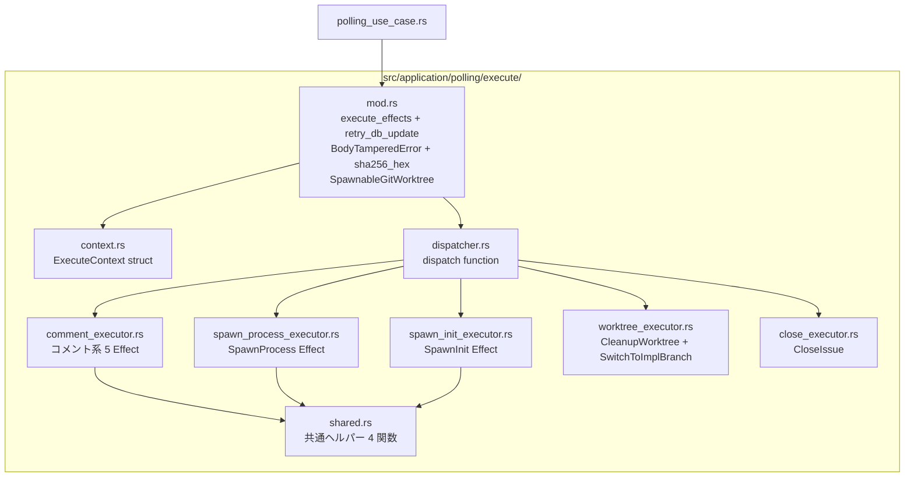
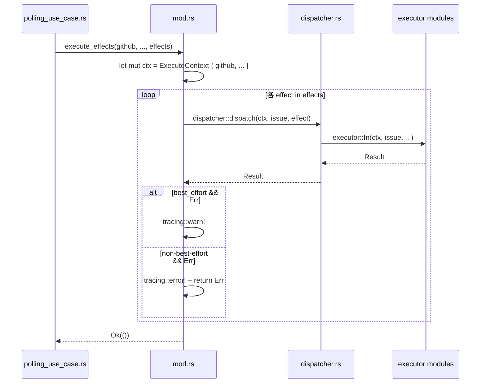

# 設計書: execute.rs 分割と ExecuteContext 導入

## Overview

`src/application/polling/execute.rs`（約2,870行）を Effect 種別ごとの executor モジュール 9 ファイルに分割し、`ExecuteContext` generic struct を導入する機械的リファクタリング。ロジック変更は一切なく、コードの保守性・拡張性向上が目的。

`pub async fn execute_effects(...)` のシグネチャは完全に維持され、呼び出し元（`polling_use_case.rs`、統合テスト）への影響はゼロ。`ExecuteContext` は execute モジュール内部の実装詳細として閉じる。

将来 #338（観測と副作用の完全抽象化）で `EffectLog` port 追加が進んだ際、`ExecuteContext` にフィールドを追加するだけで全 executor が新依存を受け取れる構造にする。

### Goals

- `execute.rs` を `src/application/polling/execute/` ディレクトリの 9 モジュールファイルに分割し、各ファイルを 500 行以下に収める
- `ExecuteContext<'a, G, I, P, C, W, F>` 導入により全 executor から `#[allow(clippy::too_many_arguments)]` を除去する
- `cargo clippy -D warnings`、`cargo fmt --check`、`cargo test` をすべて通過させる

### Non-Goals

- ロジックの変更・最適化
- `ExecuteContext` フィールドの追加・削除（#338 スコープ）
- 新 Effect の追加
- パブリック API シグネチャの変更
- テストユーティリティの共有化（モック重複解消は #338 スコープ）

## Requirements Traceability

| Requirement | Summary | Components | Interfaces |
|-------------|---------|------------|------------|
| 1.1 | ディレクトリ構成移行 | 全 9 モジュール | mod.rs pub 宣言 |
| 1.2 | 各ファイル 500 行以下 | 全 9 モジュール | — |
| 1.3 | retry_db_update 等を mod.rs に配置 | mod.rs | — |
| 1.4 | 共通ヘルパーを shared.rs に配置 | shared.rs | get_pr_number_for_type 等 |
| 1.5 | executor の可視性を pub(super) に制限 | 各 executor | pub(super) 関数 |
| 2.1 | ExecuteContext struct 定義 | context.rs | ExecuteContext\<'a,G,I,P,C,W,F\> |
| 2.2 | execute_effects が Context を構築 | mod.rs | ExecuteContext 構築 + dispatch |
| 2.3 | executor 関数シグネチャ統一 | 各 executor | ctx: &mut ExecuteContext |
| 2.4 | #[allow] 全除去 | 全ファイル | — |
| 3.1 | 全 Effect バリアントの dispatch | dispatcher.rs | dispatch fn |
| 3.2 | dispatcher の公開範囲制限 | dispatcher.rs | pub(super) |
| 3.3 | exhaustive match | dispatcher.rs | Rust コンパイラ保証 |
| 4.1 | execute_effects シグネチャ維持 | mod.rs | execute_effects |
| 4.2 | SpawnableGitWorktree 公開維持 | mod.rs | SpawnableGitWorktree |
| 4.3 | 呼び出し元コンパイル成功 | mod.rs | — |
| 5.1 | clippy 通過 | 全ファイル | — |
| 5.2 | fmt 通過 | 全ファイル | — |
| 5.3 | テスト全通過 | 全ファイル | — |
| 5.4 | ロジック不変 | 全ファイル | — |

## Architecture

### Existing Architecture Analysis

現在の `src/application/polling/execute.rs` は application 層の単一ファイルで、以下を含む：

- **エントリポイント**: `execute_effects`（公開、9 引数）→ `execute_one` を呼び出す
- **内部ディスパッチ**: `execute_one`（非公開、9 引数、210 行超の match）
- **SpawnInit 実装**: `spawn_init_task` + `prepare_init_handle` + `perform_init_sync`
- **SpawnProcess 実装**: `spawn_process` + `prepare_process_spawn` + `handle_body_tampered`
- **共通ヘルパー**: `get_pr_number_for_type`、`state_from_phase`、`phase_for_type`、`find_last_error`
- **ユーティリティ**: `retry_db_update`、`sha256_hex`、`BodyTamperedError`、`SpawnableGitWorktree`

Clean Architecture の application 層として port trait にのみ依存（具体型不使用）。

### Architecture Pattern & Boundary Map



**Architecture Integration**:
- 選択パターン: Rust `mod` システムを使ったモジュール分割 + Context pattern
- 依存方向: mod.rs → dispatcher.rs → executor → shared.rs（内向き依存、逆方向なし）
- 既存パターン維持: application 層の port trait 依存、Clean Architecture の依存方向制約
- 外部公開 API 不変: `pub async fn execute_effects`、`pub trait SpawnableGitWorktree`
- steering compliance: application 層は port のみ依存（具体型は bootstrap で注入）

### Technology Stack

| Layer | Choice / Version | Role | Notes |
|-------|------------------|------|-------|
| 実装言語 | Rust Edition 2024 | モジュール分割 + generic struct 定義 | 変更なし |
| 非同期ランタイム | tokio | spawn/await | 変更なし |
| 静的解析 | cargo clippy -D warnings | `#[allow(clippy::too_many_arguments)]` 全除去確認 | CI 要件 |

## System Flows



## Components and Interfaces

### コンポーネント概要

| Component | Layer | Intent | Req Coverage | Key Dependencies |
|-----------|-------|--------|--------------|-----------------|
| mod.rs | application | エントリポイント + 共有ユーティリティ | 1.1, 1.3, 2.2, 4.1, 4.2, 4.3 | context, dispatcher |
| context.rs | application | ExecuteContext struct 定義 | 1.1, 2.1 | port traits |
| dispatcher.rs | application | Effect → executor へのルーティング | 1.1, 3.1, 3.2, 3.3 | 全 executor |
| comment_executor.rs | application | コメント系 5 Effect 実装 | 1.1, 1.2, 1.5, 2.3, 2.4 | shared |
| spawn_init_executor.rs | application | SpawnInit Effect 実装 | 1.1, 1.2, 1.5, 2.3, 2.4 | — |
| spawn_process_executor.rs | application | SpawnProcess Effect 実装 | 1.1, 1.2, 1.5, 2.3, 2.4 | shared |
| worktree_executor.rs | application | CleanupWorktree / SwitchToImplBranch 実装 | 1.1, 1.2, 1.5, 2.3, 2.4 | — |
| close_executor.rs | application | CloseIssue 実装 | 1.1, 1.2, 1.5, 2.3, 2.4 | — |
| shared.rs | application | 複数 executor で共有するヘルパー関数 | 1.1, 1.4 | port traits |

### Application Layer

#### mod.rs

| Field | Detail |
|-------|--------|
| Intent | execute_effects エントリポイント、retry_db_update、SpawnableGitWorktree、BodyTamperedError、sha256_hex を提供 |
| Requirements | 1.1, 1.3, 2.2, 4.1, 4.2, 4.3, 5.4 |

**Responsibilities & Constraints**
- `execute_effects` の公開シグネチャを完全維持
- `ExecuteContext` を構築し `dispatcher::dispatch` に委譲するだけの薄い層
- `retry_db_update`、`BodyTamperedError`、`sha256_hex`、`SpawnableGitWorktree` を公開または内部提供

**Dependencies**
- Outbound: context.rs — ExecuteContext 構築 (P0)
- Outbound: dispatcher.rs — dispatch 呼び出し (P0)

**Contracts**: Service [x]

##### Service Interface

```rust
// シグネチャは変更なし
pub async fn execute_effects<G, I, P, C, W, F>(
    github: &G,
    issue_repo: &I,
    process_repo: &P,
    claude_runner: &C,
    worktree: &W,
    file_gen: &F,
    session_mgr: &mut SessionManager,
    init_mgr: &mut InitTaskManager,
    config: &Config,
    issue: &mut Issue,
    effects: &[Effect],
) -> Result<()>
where
    G: GitHubClient,
    I: IssueRepository,
    P: ProcessRunRepository,
    C: ClaudeCodeRunner,
    W: SpawnableGitWorktree,
    F: FileGenerator + Clone + 'static,
```

- Preconditions: `effects` は `Decision::new()` によって優先度順ソート済み
- Postconditions: 全 non-best-effort effect 成功時に `Ok(())`。最初の non-best-effort 失敗で `Err` を返す
- Invariants: best-effort failure は `warn!` ログのみ、チェーンを継続する

**Implementation Notes**
- 内部実装: `let mut ctx = ExecuteContext { ... }` を構築後、`for effect in effects` ループで `dispatcher::dispatch(&mut ctx, issue, effect)` を呼び出す
- `execute_one` 関数の内容は `dispatcher::dispatch` に移動し、mod.rs からは削除する
- ロジック変更禁止

---

#### context.rs

| Field | Detail |
|-------|--------|
| Intent | 全 executor が共有するランタイムリソースを束ねる ExecuteContext struct |
| Requirements | 1.1, 2.1, 2.3 |

**Responsibilities & Constraints**
- port trait への参照を保持（具体型は含まない）
- application 層の Clean Architecture 制約を維持
- `session_mgr` と `init_mgr` は `&'a mut` で可変参照

**Dependencies**
- External: `application::port::*` トレイト群 (P0)
- External: `application::{session_manager, init_task_manager}` (P0)
- External: `domain::config::Config` (P0)

**Contracts**: State [x]

##### State Management

```rust
pub struct ExecuteContext<'a, G, I, P, C, W, F>
where
    G: GitHubClient,
    I: IssueRepository,
    P: ProcessRunRepository,
    C: ClaudeCodeRunner,
    W: SpawnableGitWorktree,
    F: FileGenerator + Clone + 'static,
{
    pub github: &'a G,
    pub issue_repo: &'a I,
    pub process_repo: &'a P,
    pub claude_runner: &'a C,
    pub worktree: &'a W,
    pub file_gen: &'a F,
    pub session_mgr: &'a mut SessionManager,
    pub init_mgr: &'a mut InitTaskManager,
    pub config: &'a Config,
}
```

- `W` bound: `use super::SpawnableGitWorktree` で参照
- フィールドの追加・削除は本 issue のスコープ外

---

#### dispatcher.rs

| Field | Detail |
|-------|--------|
| Intent | Effect enum バリアントを対応する executor 関数にルーティングする薄い層 |
| Requirements | 1.1, 3.1, 3.2, 3.3 |

**Responsibilities & Constraints**
- exhaustive match で全 Effect バリアントを処理（コンパイル時保証）
- `pub(super)` で mod.rs からのみ呼び出し可能
- executor 呼び出し以外のロジックを持たない

**Contracts**: Service [x]

##### Service Interface

```rust
pub(super) async fn dispatch<G, I, P, C, W, F>(
    ctx: &mut ExecuteContext<'_, G, I, P, C, W, F>,
    issue: &mut Issue,
    effect: &Effect,
) -> Result<()>
where
    G: GitHubClient,
    I: IssueRepository,
    P: ProcessRunRepository,
    C: ClaudeCodeRunner,
    W: SpawnableGitWorktree,
    F: FileGenerator + Clone + 'static,
```

- match arms の実装例:
  ```rust
  Effect::PostCompletedComment => comment_executor::post_completed(ctx, issue).await,
  Effect::SpawnProcess { type_, causes, pending_run_id } => {
      spawn_process_executor::execute(ctx, issue, *type_, causes, *pending_run_id).await
  }
  ```

---

#### comment_executor.rs

| Field | Detail |
|-------|--------|
| Intent | PostCompletedComment / PostCancelComment / PostRetryExhaustedComment / PostCiFixLimitComment / RejectUntrustedReadyIssue を実装 |
| Requirements | 1.1, 1.2, 1.5, 2.3, 2.4 |

**Contracts**: Service [x]

##### Service Interface

```rust
pub(super) async fn post_completed<G, I, P, C, W, F>(
    ctx: &mut ExecuteContext<'_, G, I, P, C, W, F>,
    issue: &Issue,
) -> Result<()>

pub(super) async fn post_cancel<G, I, P, C, W, F>(
    ctx: &mut ExecuteContext<'_, G, I, P, C, W, F>,
    issue: &Issue,
) -> Result<()>

pub(super) async fn post_retry_exhausted<G, I, P, C, W, F>(
    ctx: &mut ExecuteContext<'_, G, I, P, C, W, F>,
    issue: &Issue,
    consecutive_failures: u32,
    process_type: ProcessRunType,
) -> Result<()>

pub(super) async fn post_ci_fix_limit<G, I, P, C, W, F>(
    ctx: &mut ExecuteContext<'_, G, I, P, C, W, F>,
    issue: &mut Issue,
) -> Result<()>

pub(super) async fn reject_untrusted<G, I, P, C, W, F>(
    ctx: &mut ExecuteContext<'_, G, I, P, C, W, F>,
    issue: &Issue,
) -> Result<()>
```

**Implementation Notes**
- 各関数は `ctx.github`、`ctx.issue_repo`、`ctx.config` のみを使用
- `post_retry_exhausted` は `shared::find_last_error` を呼び出す
- `post_ci_fix_limit` は `ctx.config.max_ci_fix_cycles` を参照し、`MetadataUpdates { ci_fix_limit_notified: Some(true) }` を更新

---

#### spawn_init_executor.rs

| Field | Detail |
|-------|--------|
| Intent | SpawnInit Effect 実装（spawn_init_task + prepare_init_handle + perform_init_sync） |
| Requirements | 1.1, 1.2, 1.5, 2.3, 2.4 |

**Contracts**: Service [x]

##### Service Interface

```rust
// dispatcher から呼ばれるエントリポイント
pub(super) async fn execute<G, I, P, C, W, F>(
    ctx: &mut ExecuteContext<'_, G, I, P, C, W, F>,
    issue: &mut Issue,
) -> Result<()>
```

**Implementation Notes**
- 内部関数 `spawn_init_task`、`prepare_init_handle`、`perform_init_sync` を含む
- `perform_init_sync` の `#[allow(clippy::too_many_arguments)]` を除去（ExecuteContext は使わないが、引数は元のままで許容範囲内）
- 既存テスト（`perform_init_sync_*`、`prepare_init_handle_*`）を `#[cfg(test)]` に移動
- テストで使用するモック型（`MockGitWorktree`、`MockFileGenerator`、`MockGitHubForInit`、`MockProcRepo`）も本ファイルの `#[cfg(test)]` に移動

---

#### spawn_process_executor.rs

| Field | Detail |
|-------|--------|
| Intent | SpawnProcess Effect 実装（spawn_process + prepare_process_spawn + handle_body_tampered） |
| Requirements | 1.1, 1.2, 1.5, 2.3, 2.4 |

**Contracts**: Service [x]

##### Service Interface

```rust
pub(super) async fn execute<G, I, P, C, W, F>(
    ctx: &mut ExecuteContext<'_, G, I, P, C, W, F>,
    issue: &mut Issue,
    type_: ProcessRunType,
    causes: &[FixingProblemKind],
    pending_run_id: Option<i64>,
) -> Result<()>
```

**Implementation Notes**
- 内部関数 `spawn_process`、`prepare_process_spawn`、`handle_body_tampered` を含む
- `BodyTamperedError` は `use super::BodyTamperedError` で参照
- `sha256_hex` は `use super::sha256_hex` で参照
- `spawn_process` と `prepare_process_spawn` の `#[allow(clippy::too_many_arguments)]` を除去（`ExecuteContext` ベースシグネチャにより不要）
- `prepare_process_spawn` はテストから `super::prepare_process_spawn` で参照されるため `pub(super)` にする（実装時にテスト可視性を確認）
- `shared::get_pr_number_for_type`、`shared::state_from_phase`、`shared::phase_for_type` を呼び出す

---

#### worktree_executor.rs

| Field | Detail |
|-------|--------|
| Intent | CleanupWorktree / SwitchToImplBranch Effect 実装 |
| Requirements | 1.1, 1.2, 1.5, 2.3, 2.4 |

**Contracts**: Service [x]

##### Service Interface

```rust
pub(super) async fn cleanup<G, I, P, C, W, F>(
    ctx: &mut ExecuteContext<'_, G, I, P, C, W, F>,
    issue: &mut Issue,
) -> Result<()>

pub(super) async fn switch_to_impl_branch<G, I, P, C, W, F>(
    ctx: &mut ExecuteContext<'_, G, I, P, C, W, F>,
    issue: &Issue,
) -> Result<()>
```

**Implementation Notes**
- `cleanup` は `super::retry_db_update` を呼び出す
- `switch_to_impl_branch` は `ctx.worktree.checkout` と `ctx.worktree.pull` のみを使用

---

#### close_executor.rs

| Field | Detail |
|-------|--------|
| Intent | CloseIssue Effect 実装 |
| Requirements | 1.1, 1.2, 1.5, 2.3, 2.4 |

**Contracts**: Service [x]

##### Service Interface

```rust
pub(super) async fn close<G, I, P, C, W, F>(
    ctx: &mut ExecuteContext<'_, G, I, P, C, W, F>,
    issue: &mut Issue,
) -> Result<()>
```

**Implementation Notes**
- `super::retry_db_update` を呼び出す
- `MetadataUpdates { close_finished: Some(true) }` を更新

---

#### shared.rs

| Field | Detail |
|-------|--------|
| Intent | 複数 executor で共有する純粋ヘルパー関数群 |
| Requirements | 1.1, 1.4 |

**Contracts**: Service [x]

##### Service Interface

```rust
pub(super) async fn get_pr_number_for_type<P: ProcessRunRepository>(
    process_repo: &P,
    issue_id: i64,
    type_: ProcessRunType,
) -> Result<Option<u64>>

pub(super) fn state_from_phase(
    phase: Phase,
    type_: ProcessRunType,
) -> State

pub(super) fn phase_for_type(type_: ProcessRunType) -> Option<Phase>

pub(super) async fn find_last_error<P: ProcessRunRepository>(
    process_repo: &P,
    issue_id: i64,
    process_type: ProcessRunType,
) -> Option<String>
```

**Implementation Notes**
- 全関数は現状の実装をそのまま移動（ロジック変更なし）
- `pub(super)` により execute モジュール内からのみアクセス可能

## Error Handling

### Error Strategy

エラー処理ロジックは現状から変更しない。`execute_effects` の best-effort フラグに基づく分岐処理は mod.rs に維持。

### Error Categories and Responses

| 種別 | 発生箇所 | 処理 |
|------|---------|------|
| best-effort failure | コメント系 Effect、CleanupWorktree、CloseIssue | `warn!` ログのみ、チェーン継続 |
| non-best-effort failure | SpawnInit、SpawnProcess、SwitchToImplBranch | `error!` ログ、即時 `Err` を返して残り effect をスキップ |
| BodyTamperedError | spawn_process_executor | キャッチして `handle_body_tampered` を呼び出し、`Ok(())` を返す |
| DB 更新失敗 | retry_db_update | 最大 4 回（指数バックオフ）リトライ後に `Err` |

### Monitoring

既存の tracing ログ（`warn!`、`error!`、`info!`）をすべて維持する。

## Testing Strategy

### Unit Tests

既存の `#[cfg(test)]` テストを各モジュールに分散移動。テストロジック・アサートは変更しない。

| テスト群 | 移動先 | 主なテスト |
|---------|--------|-----------|
| `sha256_hex_*`、`body_tampered_*` | mod.rs | sha256_hex 決定論性、BodyTamperedError メッセージ |
| `effect_priority_order`、`best_effort_classification`、`fixing_causes_*` | mod.rs | Effect の priority / best-effort 分類 |
| `perform_init_sync_*` | spawn_init_executor.rs | git 操作の順序確認 |
| `prepare_init_handle_*` | spawn_init_executor.rs | コメント投稿・失敗時の run_id mark_failed |
| `prepare_process_spawn_*`（ファイル末尾付近） | spawn_process_executor.rs | プロセス起動・BodyTampered 検知 |

### Integration Tests

`tests/` ディレクトリの統合テストは `execute_effects` のシグネチャが不変であるため変更不要。
