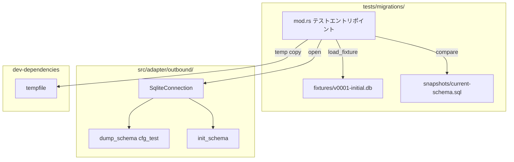
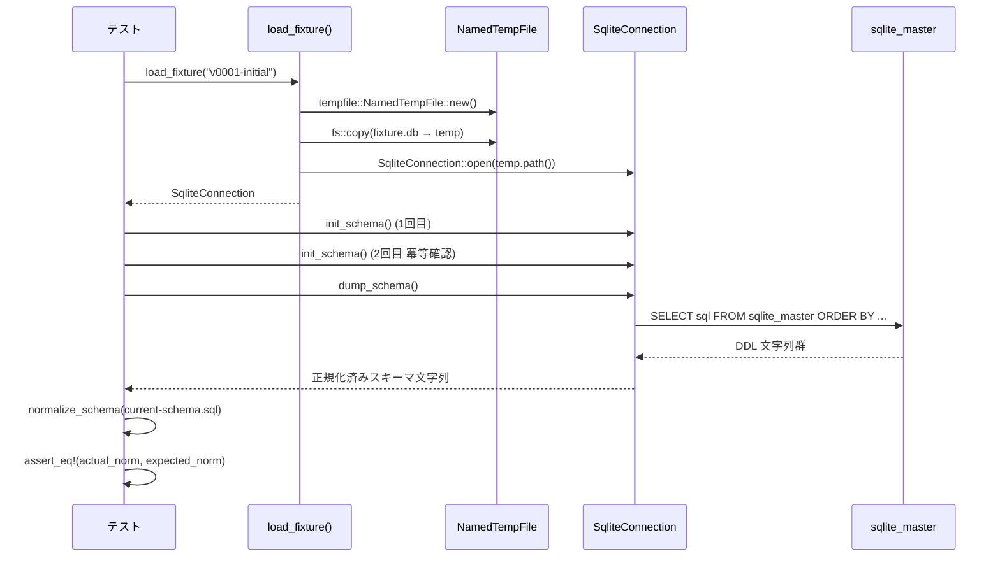
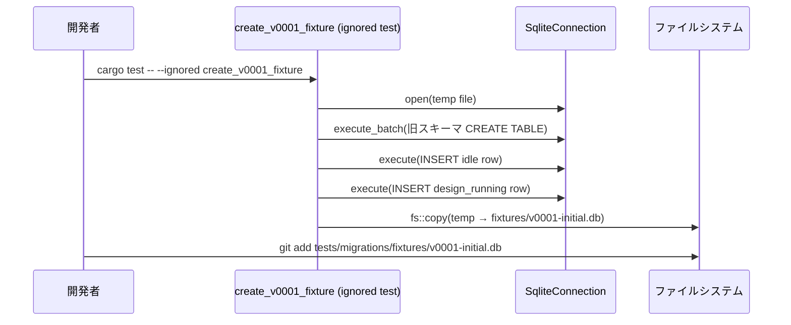

# 設計ドキュメント — DB マイグレーション回帰テスト実装

## 概要

本機能は `docs/tests/migration-test.md` に定義された DB マイグレーション回帰テスト仕様を実装する。`SqliteConnection::init_schema()` の冪等性と過去スキーマからのマイグレーションパスを、フィクスチャベースの統合テストで継続的に検証できるようにする。

対象ユーザーはプロジェクトのコア開発者であり、`init_schema()` を変更するたびにマイグレーションの正確性を確認する作業を、手動確認ではなく自動テストで代替できるようにする。

### Goals

- `SqliteConnection` に `#[cfg(test)]` の `dump_schema()` ヘルパーを追加する
- `tests/migrations/` 配下にフィクスチャ・スナップショット・テストを配置するインフラを構築する
- `v0001-initial.db` フィクスチャ (pre-migration 状態) を作成し、2 本の回帰テストを実装する
- `cargo test` の標準実行パスにマイグレーションテストを含める

### Non-Goals

- GitHub や外部サービスとの連携テスト (E2E テストとは別系統)
- `process_runs` / `execution_log` テーブルのマイグレーションテスト (初回スコープ外、将来追加可)
- `association_guard` テストや fix-count-limit テスト (別 Issue で扱う)
- テスト実行の高速化以外のパフォーマンス最適化

## 要件トレーサビリティ

| 要件 | 概要 | コンポーネント | フロー |
|-----|------|--------------|------|
| 1.1–1.3 | dump_schema() ヘルパー | SqliteConnection (#[cfg(test)]) | — |
| 2.1–2.4 | テストインフラ構築 | MigrationTestInfra | — |
| 3.1–3.2 | スキーマスナップショット管理 | MigrationTestInfra | snapshot 生成フロー |
| 4.1–4.3 | v0001 フィクスチャ | MigrationTestInfra | fixture 生成フロー |
| 5.1–5.4 | マイグレーションテスト 2 本 | MigrationTestInfra | マイグレーション検証フロー |
| 6.1–6.2 | CI 統合 | Cargo.toml | — |
| 7.1 | 運用ルール文書化 | CHANGELOG.md | — |

## アーキテクチャ

### 既存アーキテクチャの分析

- `SqliteConnection` は `src/adapter/outbound/sqlite_connection.rs` に存在し、`Arc<Mutex<Connection>>` を保持する
- 既に `#[cfg(test)] mod tests` ブロックがあり、`open_in_memory()` を使ったテストパターンが確立している
- `#[cfg_attr(test, allow(clippy::expect_used))]` が `src/lib.rs` に設定されており、テストコード内の `.expect()` は許容される
- `tempfile` が `[dev-dependencies]` に登録済みで、追加依存なしに使用できる

### アーキテクチャパターン & バウンダリマップ



**アーキテクチャ統合**:
- 選択パターン: 既存アダプター層への `#[cfg(test)]` メソッド追加 + 統合テスト追加
- `SqliteConnection` のパブリック API には変更を加えない (テストのみで使用)
- Clean Architecture の依存方向は維持: テストは adapter/outbound を直接参照してよい
- 既存 steering 原則を保持: ドメイン層への影響なし

### テクノロジースタック

| レイヤー | 選択 | 本機能での役割 |
|---------|------|------------|
| テスト | Rust `#[test]` + `#[cfg(test)]` | 回帰テスト実装 |
| ストレージ | rusqlite (既存) | フィクスチャ DB の操作 |
| 一時ファイル | tempfile 3.x (既存) | フィクスチャのコピー先 |
| テスト登録 | Cargo.toml `[[test]]` | migrations ターゲット登録 |

## システムフロー

### マイグレーション検証フロー



### フィクスチャ生成フロー (初期セットアップ時のみ)



## コンポーネントとインターフェース

### コンポーネントサマリー

| コンポーネント | レイヤー | 概要 | 要件カバレッジ | 主要依存 |
|-------------|---------|------|-------------|--------|
| SqliteConnection (cfg_test 追加) | adapter/outbound | dump_schema() / normalize_schema() の追加 | 1.1, 1.2, 1.3 | rusqlite |
| MigrationTestInfra | tests/migrations | mod.rs 全体 (load_fixture, テスト 2 本, 生成ヘルパー) | 2.1–2.4, 3.1–3.2, 4.1–4.3, 5.1–5.4 | SqliteConnection, tempfile |
| Cargo.toml [[test]] | 設定 | migrations ターゲット登録 | 6.1, 6.2 | — |
| CHANGELOG.md | ドキュメント | 運用ルール追記 | 7.1 | — |

---

### adapter/outbound

#### SqliteConnection — テストヘルパー追加

| フィールド | 詳細 |
|---------|-----|
| Intent | `#[cfg(test)]` ブロックに `dump_schema()` を追加し、スキーマ比較テストを可能にする |
| Requirements | 1.1, 1.2, 1.3 |

**Responsibilities & Constraints**

- `sqlite_master` から `CREATE TABLE` / `CREATE INDEX` 文を取得し、決定論的な順序 (テーブル先・名前昇順) で返す
- `#[cfg(test)]` 宣言により本番バイナリには含まれない
- `conn_lock()` 経由で rusqlite を操作する既存パターンに従う

**Dependencies**
- Internal: `conn_lock()` — Mutex ガード取得 (P0)

**Contracts**: Service [x]

##### Service Interface (Rust)

```rust
// #[cfg(test)] impl ブロック内に追加
impl SqliteConnection {
    /// sqlite_master の全 DDL 文をテーブル先・名前昇順で連結して返す
    pub fn dump_schema(&self) -> String;
}

/// スキーマ文字列の正規化 (CRLF→LF、末尾空白除去、空行除去)
fn normalize_schema(sql: &str) -> String;
```

- **Preconditions**: `init_schema()` が少なくとも 1 回呼ばれていること
- **Postconditions**: 同一スキーマに対して複数回呼んでも同じ文字列を返す (決定論的)
- **Invariants**: `#[cfg(test)]` のため本番コードから呼べない

**Implementation Notes**
- Integration: `conn_lock()` でガードを取得し `prepare` → `query_map` で `Vec<String>` に収集して `join(";\n")` + 末尾 `";"` を付与
- Risks: sqlite_master の `sql` カラムは NULL になり得るため `WHERE sql IS NOT NULL` でフィルタする

---

### tests/migrations

#### MigrationTestInfra

| フィールド | 詳細 |
|---------|-----|
| Intent | マイグレーション回帰テストの全エントリポイント。フィクスチャ読み込み、スナップショット比較、生成ヘルパーを提供する |
| Requirements | 2.1–2.4, 3.1–3.2, 4.1–4.3, 5.1–5.4 |

**Responsibilities & Constraints**

- `load_fixture(name)`: フィクスチャバイナリを `NamedTempFile` にコピーして `SqliteConnection` を返す
- `normalize_schema(sql)`: CRLF → LF、末尾空白除去、空行除去
- `migrate_v0001_is_idempotent`: v0001 fixture に `init_schema()` を 2 回適用し、既存行の保全と新カラムのデフォルト値を検証
- `fixture_reaches_current_schema`: v0001 fixture 適用後の `dump_schema()` と `current-schema.sql` (正規化後) が一致することを検証
- `create_v0001_fixture`: `#[ignore]` フラグ付き。旧スキーマで DB を作成しバイナリを生成 (初期セットアップ時のみ使用)
- テスト名に fixture 名が含まれるため、失敗時に特定が容易

**Dependencies**
- Inbound: cargo test runner — テスト実行
- Outbound: `cupola::adapter::outbound::sqlite_connection::SqliteConnection` — DB 操作 (P0)
- External: `tempfile::NamedTempFile` — 一時ファイル管理 (P0)

**Contracts**: Service [x] / Batch [x]

##### Service Interface (Rust)

```rust
use cupola::adapter::outbound::sqlite_connection::SqliteConnection;

fn load_fixture(name: &str) -> SqliteConnection;
fn normalize_schema(sql: &str) -> String;

#[test]
fn migrate_v0001_is_idempotent();

#[test]
fn fixture_reaches_current_schema();

#[test]
#[ignore]
fn create_v0001_fixture();
```

##### Batch / Job Contract (フィクスチャ生成)

- **Trigger**: `cargo test -- --ignored create_v0001_fixture` を手動実行
- **Input**: なし (コード内に旧スキーマを hardcode)
- **Output**: `tests/migrations/fixtures/v0001-initial.db` (バイナリ SQLite)
- **Idempotency**: 既存ファイルを上書きする。冪等実行可能。

**Implementation Notes**
- `load_fixture` は `std::fs::copy` でフィクスチャをコピーし、`NamedTempFile` の `path()` を `SqliteConnection::open()` に渡す。`NamedTempFile` はスコープを抜けると削除される。
- `current-schema.sql` は `#[ignore] fn update_current_schema_snapshot()` でも更新できるようにすると保守が容易。
- Risks: フィクスチャバイナリを `git add` し忘れると CI でパスエラーになる。

## データモデル

### v0001-initial.db フィクスチャのスキーマ

フィクスチャは以下の「古い」`issues` テーブルのみを持つ (process_runs / execution_log なし):

```
issues テーブル (pre-migration)
- id                  INTEGER PRIMARY KEY
- github_issue_number INTEGER UNIQUE NOT NULL
- state               TEXT NOT NULL DEFAULT 'idle'
- worktree_path       TEXT
- created_at          TEXT NOT NULL DEFAULT (datetime('now'))
- updated_at          TEXT NOT NULL DEFAULT (datetime('now'))
```

`init_schema()` 適用後は現行の完全スキーマ (issues + process_runs + execution_log + 全 ALTER TABLE カラム + インデックス) に移行される。

### current-schema.sql の内容

フレッシュな `SqliteConnection::open_in_memory()` に `init_schema()` を適用した後、`dump_schema()` が返す正規化済み DDL 文字列。テーブル順: `execution_log` → `issues` → `process_runs` (名前昇順)。

## エラーハンドリング

### エラー戦略

テストコードであるため `.expect("reason")` による即時パニックを基本とする (`src/lib.rs` の `#[cfg_attr(test, allow(clippy::expect_used))]` が適用される)。

### エラーカテゴリ

| エラー | 対応 |
|-------|-----|
| フィクスチャファイルが存在しない | `expect("fixture file not found")` でパニック → CI 失敗により検出 |
| `init_schema()` 失敗 | `expect("init_schema failed")` → マイグレーションの実装バグとして検出 |
| スキーマ不一致 | `assert_eq!` の差分メッセージに期待値・実際値を出力 |
| `dump_schema()` の rusqlite エラー | `expect("dump_schema query failed")` |

## テスト戦略

本 Issue 自体がテストインフラの実装であるため、テスト戦略は品質ゲートの観点で記述する。

### 単体テスト (既存・変更なし)

- `sqlite_connection.rs` 内の `#[cfg(test)] mod tests` は変更不要

### 統合テスト (新規)

1. **`migrate_v0001_is_idempotent`**: v0001 フィクスチャへの 2 回 init_schema で既存行保全・新カラムデフォルト値を検証
2. **`fixture_reaches_current_schema`**: v0001 フィクスチャ適用後のスキーマが `current-schema.sql` と一致することを検証

### CI 検証

- `devbox run -- cargo test --test migrations` が秒単位で完了すること
- `devbox run clippy` が新規ファイルに対して警告を出さないこと
- `devbox run fmt-check` が通ること
