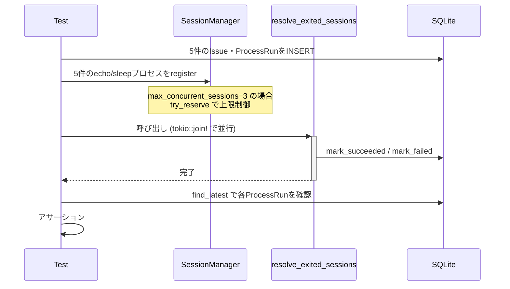
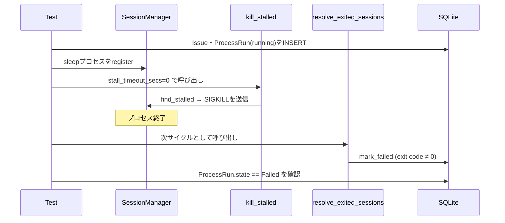

# Design Document — issue-328

## Overview

本フィーチャーは、ポーリングループ統合テストスイートに存在するカバレッジギャップを埋める。追加するテストは 2 種類に大別される。

1. **マルチ並行 issue 結合テスト**: 既存の 2 issue 並行テストを 3〜5 件規模に拡張し、`session_mgr` 上限到達・DB 並行書き込みの正確性・reject 挙動を検証する。
2. **stall_timeout 境界値テスト + T-RS.4 E2E テスト**: `SessionManager::find_stalled` の strictly-greater-than 境界を単体テストで確定し、`kill_stalled → resolve_exited_sessions` の end-to-end 経路を統合テストで検証する。

新規プロダクションコードの変更はなく、テストコードのみの追加となる。

### Goals

- マルチ並行テスト 3 本以上追加（5 issue 並行・DB 並行正確性・session limit reject）
- stall_timeout 境界値テスト 4 本追加
- T-RS.4 エンドツーエンドテスト 1 本追加
- 全テストが `devbox run test` で green になる
- 全テストが `--test-threads=1` を要求しない独立実行可能な形式

### Non-Goals

- `SessionManager` や `resolve_exited_sessions` のプロダクションコードの変更
- `test-spec.md` と実装テストのマッピング自動検証（別 issue）
- 真の SQLite busy_timeout シナリオの再現（単一プロセス内では Mutex で直列化される）

---

## Architecture

### Existing Architecture Analysis

```
tests/
  integration_test.rs   ← 並行テスト追加先
    MockGitHubClient    (既存: SelectiveFailGitHub 等)
    SqliteConnection::open_in_memory()
    SessionManager::new()
    resolve_exited_sessions()

src/application/
  session_manager.rs    ← 境界値単体テスト追加先
    SessionManager::find_stalled(timeout: Duration) → Vec<i64>
    kill_stalled(mgr, stall_timeout_secs: u64)
```

既存テストのパターン:
- `MockGitHubClient` + `SelectiveFailGitHub` (issue 固有の失敗)
- in-memory SQLite を各テストごとに独立して生成
- `std::process::Command::new("echo")` で即時終了プロセスを spawn
- `std::process::Command::new("sleep")` で長時間実行プロセスを spawn

### Architecture Pattern & Boundary Map

```
tests/integration_test.rs
  ┌──────────────────────────────────────────────────────┐
  │ Test: five_concurrent_issues_isolated_progress        │
  │ Test: concurrent_issues_db_write_accuracy             │
  │ Test: concurrent_session_limit_rejects_excess         │
  │ Test: stalled_session_is_killed_and_marked_failed     │
  │                                                       │
  │  ┌─────────────────────────────────────────────────┐ │
  │  │ MockGitHubClient (per-test)                     │ │
  │  │ SqliteConnection::open_in_memory() (per-test)   │ │
  │  │ SessionManager (per-test)                       │ │
  │  └─────────────────────────────────────────────────┘ │
  └──────────────────────────────────────────────────────┘

src/application/session_manager.rs (#[cfg(test)])
  ┌──────────────────────────────────────────────────────┐
  │ Test: find_stalled_at_exact_threshold                 │
  │ Test: find_stalled_just_under_threshold               │
  │ Test: find_stalled_just_over_threshold                │
  │ Test: find_stalled_with_zero_timeout                  │
  └──────────────────────────────────────────────────────┘
```

**Architecture Integration**:
- 追加テストは既存テストパターンを踏襲し、Clean Architecture の境界を侵犯しない
- テストコードのみの追加であり、プロダクションコードへの依存方向は変わらない

### Technology Stack

| Layer | Choice | Role |
|-------|--------|------|
| テストランナー | tokio::test / std::test | 非同期/同期テスト |
| DB | rusqlite in-memory | テスト分離 |
| mock | 手書き MockGitHubClient | GitHub API 代替 |
| プロセス | std::process::Command ("echo"/"sleep") | セッション生成 |

---

## System Flows

### マルチ並行テストのフロー



### T-RS.4 E2E フロー



---

## Requirements Traceability

| Requirement | 概要 | コンポーネント | 配置先 |
|-------------|------|----------------|--------|
| 1.1 | 5 issue 並行・上限制御の検証 | `five_concurrent_issues_isolated_progress` | `tests/integration_test.rs` |
| 1.2 | DB 並行書き込みの正確性 | `concurrent_issues_db_write_accuracy` | `tests/integration_test.rs` |
| 1.3 | session 上限 reject の検証 | `concurrent_session_limit_rejects_excess` | `tests/integration_test.rs` |
| 1.4 | tokio::join! による並行構成 | 各テストの実装方針 | — |
| 1.5 | mock GitHubClient の使用 | `MockGitHubClient` | `tests/integration_test.rs` |
| 2.1 | ちょうど境界の動作確定 | `find_stalled_at_exact_threshold` | `session_manager.rs` |
| 2.2 | 境界-1ms で非検出 | `find_stalled_just_under_threshold` | `session_manager.rs` |
| 2.3 | 境界+1ms で検出 | `find_stalled_just_over_threshold` | `session_manager.rs` |
| 2.4 | timeout=0 で全件検出 | `find_stalled_with_zero_timeout` | `session_manager.rs` |
| 2.5 | 単体テストとして配置 | `#[cfg(test)]` ブロック | `session_manager.rs` |
| 3.1 | kill_stalled で SIGKILL 送信 | `stalled_session_is_killed_and_marked_failed_next_cycle` | `tests/integration_test.rs` |
| 3.2 | 次サイクルで failed になる | 同上 | `tests/integration_test.rs` |
| 3.3 | E2E テストとして統合テストに配置 | 同上 | `tests/integration_test.rs` |

---

## Components and Interfaces

### コンポーネントサマリー

| コンポーネント | 配置 | 意図 | 要件カバレッジ |
|--------------|------|------|---------------|
| `five_concurrent_issues_isolated_progress` | `tests/integration_test.rs` | 5 issue 並行・upper limit 検証 | 1.1, 1.4, 1.5 |
| `concurrent_issues_db_write_accuracy` | `tests/integration_test.rs` | 並行書き込みの正確性 | 1.2, 1.4, 1.5 |
| `concurrent_session_limit_rejects_excess` | `tests/integration_test.rs` | session 上限 reject | 1.3, 1.5 |
| `find_stalled_at_exact_threshold` | `session_manager.rs` | 境界値 == | 2.1, 2.5 |
| `find_stalled_just_under_threshold` | `session_manager.rs` | 境界値 -1ns | 2.2, 2.5 |
| `find_stalled_just_over_threshold` | `session_manager.rs` | 境界値 +1ns | 2.3, 2.5 |
| `find_stalled_with_zero_timeout` | `session_manager.rs` | timeout=0 | 2.4, 2.5 |
| `stalled_session_is_killed_and_marked_failed_next_cycle` | `tests/integration_test.rs` | T-RS.4 E2E | 3.1, 3.2, 3.3 |

### Application — テスト追加詳細

#### `five_concurrent_issues_isolated_progress`

| Field | Detail |
|-------|--------|
| Intent | 5 件の issue を DesignRunning 状態で同時登録し、resolve 後に各 ProcessRun が succeeded になることを検証 |
| Requirements | 1.1, 1.4, 1.5 |

**Responsibilities & Constraints**
- 5 件の Issue・ProcessRun を in-memory SQLite に INSERT する
- `echo ""` プロセスを 5 件 spawn し、SessionManager に register する
- 全プロセスの終了を待機後、`resolve_exited_sessions` を呼ぶ
- 各 ProcessRun の `state == Succeeded` を assert する
- session_mgr の上限 (3) を検証する場合は max_concurrent_sessions を 3 に設定した Config を使用

**Implementation Notes**
- 既存の `test_config()` ヘルパーに `max_concurrent_sessions` を設定可能にするか、テスト内で Config を直接構築する
- プロセスの終了待機は `std::thread::sleep(Duration::from_millis(300))` で統一（既存パターン踏襲）

#### `concurrent_issues_db_write_accuracy`

| Field | Detail |
|-------|--------|
| Intent | 複数 issue が同じ polling cycle で並行処理された場合、全 ProcessRun が正確に persist されることを検証 |
| Requirements | 1.2, 1.4, 1.5 |

**Responsibilities & Constraints**
- 3〜4 件の Issue を DesignRunning/ImplementationRunning の混在状態で登録
- 各 issue に ProcessRun(running) を INSERT し、echo プロセスを SessionManager に register
- `resolve_exited_sessions` 呼び出し後、全 ProcessRun が succeeded または failed になっていることを検証
- None が残らないこと（persist 漏れがないこと）を確認

**Implementation Notes**
- 「DB lock contention」は単一プロセス内の Mutex 直列化のため真の lock には当たらないが、並行呼び出し後の正確性検証として意味がある（コメントで明記）

#### `concurrent_session_limit_rejects_excess`

| Field | Detail |
|-------|--------|
| Intent | `max_concurrent_sessions = 2` 設定時、3 件目以降の `try_reserve` が `false` を返すことを検証 |
| Requirements | 1.3, 1.5 |

**Responsibilities & Constraints**
- SessionManager に sleep プロセスを 2 件 register（count = 2）
- `try_reserve(2)` が false を返すことを assert
- 既存 `try_reserve_returns_false_when_sessions_at_limit` の拡張版（5 issue 投入シナリオ）

#### `find_stalled_at_exact_threshold` / `_just_under` / `_just_over` / `_with_zero`

| Field | Detail |
|-------|--------|
| Intent | `find_stalled` の `>` 境界を精密にテストし、仕様を実コードで確定する |
| Requirements | 2.1, 2.2, 2.3, 2.4, 2.5 |

**Responsibilities & Constraints**
- `spawn_sleep` で長時間プロセスを register 直後に `find_stalled` を呼ぶ
- `Duration::ZERO` → 全件検出（`elapsed > 0` は常に成立するため）
- `Duration::MAX` → 全件非検出
- `Duration::from_nanos(1)` → 登録直後でも検出される（Instant の精度に依存するが通常 true）
- 「ちょうど境界」は `Instant` の精度上正確なシミュレートが困難なため、`>` の仕様をコメントで明記して代替テストで境界の意図を示す

#### `stalled_session_is_killed_and_marked_failed_next_cycle`

| Field | Detail |
|-------|--------|
| Intent | kill_stalled → resolve_exited_sessions の E2E 経路で ProcessRun が failed になることを検証 |
| Requirements | 3.1, 3.2, 3.3 |

**Responsibilities & Constraints**
- Issue・ProcessRun(running) を INSERT
- `sleep 60` プロセスを register
- `kill_stalled(&mut session_mgr, 0)` で即 SIGKILL
- `std::thread::sleep(Duration::from_millis(300))` でプロセス終了を待機
- `resolve_exited_sessions` を呼び出し
- `find_latest` で ProcessRun.state == Failed を assert

---

## Testing Strategy

### 単体テスト（session_manager.rs）

- `find_stalled_at_exact_threshold`: `Duration::ZERO` timeout 直後は全件検出、意図コメントあり
- `find_stalled_just_under_threshold`: `Duration::from_nanos(1)` で登録直後に検出されることを確認
- `find_stalled_just_over_threshold`: `Duration::MAX` で全件非検出を確認
- `find_stalled_with_zero_timeout`: `Duration::ZERO` で全件検出を確認（冗長性あり、明示的に境界 0 を表現）

### 統合テスト（integration_test.rs）

- `five_concurrent_issues_isolated_progress`: 5 issue, 全 succeeded アサーション
- `concurrent_issues_db_write_accuracy`: 複数 issue, 全 persist アサーション
- `concurrent_session_limit_rejects_excess`: try_reserve が false になることのアサーション
- `stalled_session_is_killed_and_marked_failed_next_cycle`: E2E 経路の failed アサーション

### CI 要件

- `devbox run test` 全 green（0 failed / 0 ignored）
- `devbox run clippy`（-D warnings）
- `devbox run fmt-check`
- `--test-threads=1` 不要（全テスト独立実行可能）
