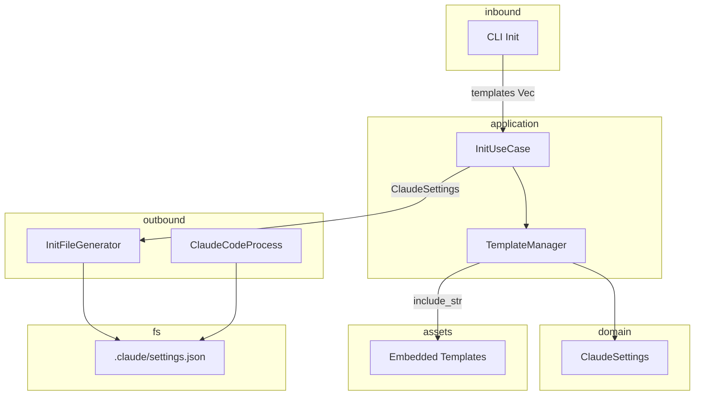
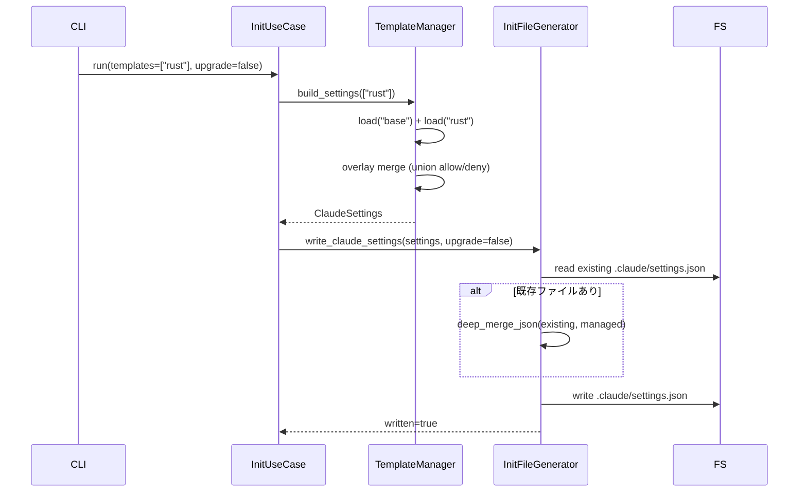
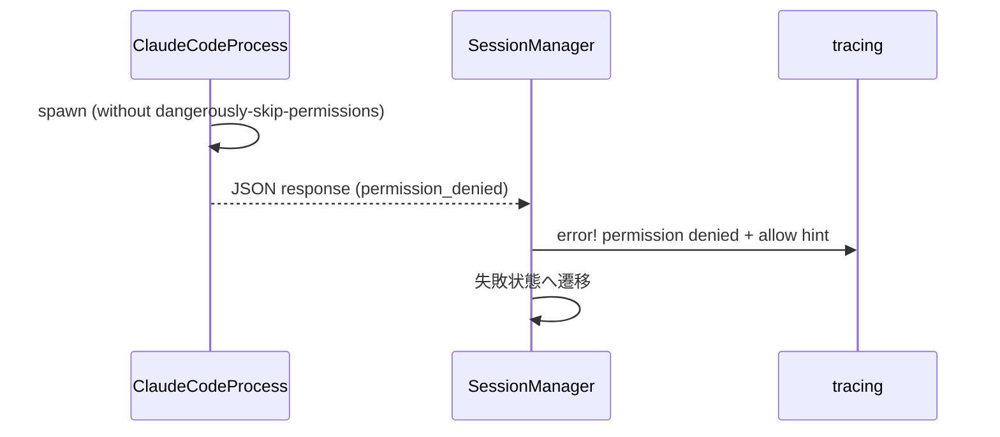

# 設計書: Claude Code Permission 機構の活用

## 概要

本機能は Cupola が Claude Code を起動する際の `--dangerously-skip-permissions` フラグを廃止し、Claude Code 標準の Permission 機構 (`.claude/settings.json`) でプロセスの実行範囲を構造的に制限する。プロジェクト種別ごとの安全なデフォルト権限テンプレートを `cupola init` で配布することで、プロンプトインジェクション攻撃の実行範囲を根本的に塞ぐ。

**Users**: Cupola を利用する開発者が `cupola init --template <key>` でテンプレートを選択し、自動的に最小権限の `.claude/settings.json` を取得する。Cupola が内部で Claude Code を起動する際は常に permission 機構が有効な状態になる。

**Impact**: `--dangerously-skip-permissions` を削除することで、任意コマンド実行・WebFetch・ファイル任意読み書きが無条件に許可される状態から、`.claude/settings.json` で明示的に許可された操作のみが実行可能な状態へ移行する。

### Goals

- `--dangerously-skip-permissions` を完全廃止し、permission 機構を常時有効化する
- プロジェクト種別ごとの最小権限テンプレートを最低 4 種 (base, rust, typescript, python, go) 提供する
- `cupola init --template <key>` で設定をワンコマンド適用できる
- 既存ユーザーの `.claude/settings.json` カスタマイズを破壊しない
- Permission 不足時に開発者が素早く対処できる情報を提供する

### Non-Goals

- Claude Code 自体の permission 機構の変更
- テンプレートの動的ダウンロード・外部配信 (コンパイル時埋め込みのみ)
- `--dangerously-skip-permissions` の再有効化手段の提供
- Web UI や設定エディタ
- permission テンプレートの独立 crate 化 (将来の構想 issue に委ねる)

## アーキテクチャ

### 既存アーキテクチャの分析

本変更は以下の既存コンポーネントを修正・拡張する:

- `src/adapter/outbound/claude_code_process.rs` — `--dangerously-skip-permissions` の単一削除箇所
- `src/adapter/inbound/cli.rs` — `Init` サブコマンドへの `--template` オプション追加
- `src/application/init_use_case.rs` — テンプレート選択・マージ処理の組み込み
- `src/adapter/outbound/init_file_generator.rs` — `.claude/settings.json` 生成・マージ機能の追加

新規追加コンポーネント:

- `src/domain/claude_settings.rs` — permission 設定の値オブジェクト
- `src/application/template_manager.rs` — テンプレートロード・オーバーレイロジック
- `assets/claude-settings/*.json` — コンパイル時埋め込みテンプレートファイル群

### アーキテクチャパターンと境界マップ



**キー決定事項**:
- `TemplateManager` は application 層に配置 (use case ロジックの分離)
- `ClaudeSettings` は domain 層の値オブジェクト (純粋なデータ構造)
- テンプレートは compile-time 埋め込み (既存 `CLAUDE_CODE_ASSETS` パターンを踏襲)
- マージロジックは `serde_json` のみで実装 (追加依存なし)

### テクノロジースタック

| レイヤー | 選択 / バージョン | 本機能での役割 | 備考 |
|---------|-----------------|---------------|------|
| CLI | clap 4 (derive) | `--template` オプション追加 (value_delimiter) | 既存依存 |
| Application | Rust 2024 / 既存構造 | TemplateManager (新規)、InitUseCase 拡張 | — |
| Domain | Rust 2024 / serde 1 | ClaudeSettings 値オブジェクト (新規) | — |
| Data | serde_json 1 (既存依存) | テンプレート JSON のパース・マージ | 追加依存なし |
| Assets | Rust `include_str!` | テンプレートのコンパイル時埋め込み | 実行時依存なし |

## システムフロー

### テンプレート適用フロー (`cupola init --template rust`)



### Permission Denied エラーフロー



## 要件トレーサビリティ

| 要件 | サマリー | コンポーネント | インターフェース | フロー |
|------|---------|--------------|----------------|--------|
| 1.1 | build_command からフラグ削除 | ClaudeCodeProcess | build_command | — |
| 1.2 | steering bootstrap からフラグ削除 | InitUseCase | run | — |
| 1.3 | ワーキングディレクトリ設定 (既存) | ClaudeCodeProcess | build_command | — |
| 2.1 | base.json 配置 | TemplateManager, Embedded Assets | — | — |
| 2.2 | スタック別テンプレート配置 | TemplateManager, Embedded Assets | — | — |
| 2.3 | compile-time 埋め込み | TemplateManager | include_str! | — |
| 2.4 | JSON 形式定義 | ClaudeSettings | — | — |
| 3.1 | テンプレートなし = base のみ | TemplateManager, InitUseCase | build_settings | テンプレート適用フロー |
| 3.2 | 単一テンプレート指定 | TemplateManager | build_settings | テンプレート適用フロー |
| 3.3 | 複数テンプレート指定 | CLI Init, TemplateManager | InitArgs, build_settings | テンプレート適用フロー |
| 3.4 | 未知キーエラー | TemplateManager | TemplateError | — |
| 3.5 | base 重複適用の防止 | TemplateManager | build_settings | — |
| 4.1 | allow/deny の union マージ | InitFileGenerator | write_claude_settings | テンプレート適用フロー |
| 4.2 | スカラー既存優先 | InitFileGenerator | deep_merge_json | テンプレート適用フロー |
| 4.3 | --upgrade 時のユーザー設定保持 | InitFileGenerator | write_claude_settings | テンプレート適用フロー |
| 4.4 | 新規ファイル生成 | InitFileGenerator | write_claude_settings | テンプレート適用フロー |
| 5.1 | permission denied をセッション失敗として扱う | SessionManager | — | Permission Denied エラーフロー |
| 5.2 | エラーログとヒント出力 | SessionManager | tracing::error! | Permission Denied エラーフロー |
| 5.3 | 非インタラクティブ動作 | ClaudeCodeProcess | --output-format json (既存) | Permission Denied エラーフロー |
| 6.1 | SECURITY.md 更新 | — | — | — |
| 6.2 | CONTRIBUTING.md 更新 | — | — | — |
| 6.3 | SECURITY.md 攻撃面拡大警告 | — | — | — |

## コンポーネントとインターフェース

### コンポーネントサマリー

| コンポーネント | レイヤー | 目的 | 要件カバレッジ | 依存 (P0/P1) | Contracts |
|--------------|--------|------|-------------|------------|-----------|
| ClaudeCodeProcess | adapter/outbound | フラグ削除 | 1.1, 1.3 | — | Service |
| CLI Init | adapter/inbound | --template オプション追加 | 3.1–3.4 | InitUseCase (P0) | — |
| ClaudeSettings | domain | permission 設定値オブジェクト | 2.4 | serde (P0) | — |
| TemplateManager | application | テンプレートロード・マージ | 2.1–2.4, 3.1–3.5 | ClaudeSettings (P0) | Service |
| InitFileGenerator | adapter/outbound | settings.json 生成・マージ | 4.1–4.4 | serde_json (P0) | Service |
| InitUseCase | application | use case 統合 | 1.2, 3.1–3.5, 4.1–4.4 | TemplateManager (P0), InitFileGenerator (P0) | — |

---

### Adapter / Outbound

#### ClaudeCodeProcess

| フィールド | 詳細 |
|----------|------|
| Intent | `build_command` から `--dangerously-skip-permissions` フラグを削除する |
| Requirements | 1.1 |

**Responsibilities & Constraints**
- `build_command` の `.arg("--dangerously-skip-permissions")` 行を削除する
- `--output-format json` は維持し、non-interactive モードは変えない
- 既存の8つのユニットテストを更新し、フラグが含まれないことをアサーションに追加する

**Contracts**: Service [x]

##### Service Interface
```rust
impl ClaudeCodeProcess {
    pub fn build_command(
        &self,
        prompt: &str,
        working_dir: &Path,
        json_schema: Option<&str>,
        model: &str,
    ) -> Command;
    // --dangerously-skip-permissions を削除、その他の引数は変更なし
}
```

**Implementation Notes**
- 既存の `spawn` メソッドと `ClaudeCodeRunner` トレイト実装は変更不要

---

#### InitFileGenerator

| フィールド | 詳細 |
|----------|------|
| Intent | `.claude/settings.json` の生成と既存ファイルとのディープマージを行う |
| Requirements | 4.1, 4.2, 4.3, 4.4 |

**Responsibilities & Constraints**
- `.claude/` ディレクトリが存在しない場合は作成する
- 既存 `.claude/settings.json` が存在する場合は deep merge する
- マージ後の JSON を pretty-print で書き込む
- `upgrade=false` 時も `upgrade=true` 時も同じ union マージを適用 (ユーザー設定は常に保持)

**Dependencies**
- Inbound: InitUseCase — ClaudeSettings を受け取り settings.json を生成 (P0)
- External: serde_json 1 — JSON パース・シリアライズ (P0)

**Contracts**: Service [x]

##### Service Interface
```rust
pub trait FileGenerator {
    // 既存メソッドは省略

    fn write_claude_settings(
        &self,
        settings: &ClaudeSettings,
        upgrade: bool,
    ) -> Result<bool, anyhow::Error>;
    // Ok(true)  : ファイルを新規作成または更新した
    // Ok(false) : 変更なし
    // Err(...)  : 既存ファイルの JSON パース失敗等
}
```

**マージアルゴリズム** (`deep_merge_json`):
1. `ClaudeSettings` を `serde_json::Value` に変換 (管理テンプレートとして)
2. 既存 `.claude/settings.json` が存在すれば `serde_json::from_str` で読み込む
3. `permissions.allow` / `permissions.deny`: 両配列を `HashSet<String>` で合算し重複排除
4. スカラーキー: 既存値を優先 (`existing` に値があれば `managed` は無視)
5. ネストオブジェクト: 再帰的に同ルールを適用
6. マージ済み値を `serde_json::to_string_pretty` で書き込む

**Implementation Notes**
- Integration: `.claude/` ディレクトリが存在しない場合は `std::fs::create_dir_all` で作成
- Validation: 既存ファイルの JSON パース失敗時は `anyhow::Error` を返す (ユーザーに修正を促す)
- Risks: `.claude/` 以下に既存の設定ファイルがある場合の副作用に注意

---

### Application

#### TemplateManager

| フィールド | 詳細 |
|----------|------|
| Intent | 埋め込みテンプレートをロードし、複数テンプレートのオーバーレイマージを行う |
| Requirements | 2.1, 2.2, 2.3, 2.4, 3.1, 3.2, 3.3, 3.4, 3.5 |

**Responsibilities & Constraints**
- `base` は常に先頭に自動適用し、明示的に `base` が指定されても二重適用しない
- テンプレートは指定順にオーバーレイする (`allow`/`deny` の union)
- 未知キーは `TemplateError::UnknownTemplate` を返す
- テンプレートは `const` 配列として compile-time 埋め込み

**Dependencies**
- External: `include_str!` (compile-time) — テンプレート JSON の埋め込み (P0)
- Outbound: ClaudeSettings — 返り値の型 (P0)

**Contracts**: Service [x]

##### Service Interface
```rust
pub struct TemplateManager;

impl TemplateManager {
    pub fn build_settings(templates: &[&str]) -> Result<ClaudeSettings, TemplateError>;
    pub fn list_available() -> &'static [&'static str];
}

#[derive(Debug, thiserror::Error)]
pub enum TemplateError {
    #[error("unknown template key '{key}'. Available: {available}")]
    UnknownTemplate { key: String, available: String },
    #[error("failed to parse template '{key}': {source}")]
    ParseError { key: String, source: serde_json::Error },
}
```

- 前提条件: `templates` に含まれるキーはすべて埋め込みテンプレートに存在する
- 後提条件: `Ok(settings)` の `allow`/`deny` はそれぞれ重複のない配列
- 不変条件: `base` テンプレートは常に先頭に1回だけ適用される

**Implementation Notes**
- テンプレート配列: `const TEMPLATES: &[(&str, &str)] = &[("base", include_str!(...)), ...]`
- `list_available()` はテンプレートキー一覧を返し、エラーメッセージ生成に使用する

---

#### InitUseCase (拡張)

| フィールド | 詳細 |
|----------|------|
| Intent | `templates` パラメータを受け取り、テンプレート生成と settings.json 書き込みを行う |
| Requirements | 1.2, 3.1–3.5, 4.1–4.4 |

**変更点**:
- `run` メソッドシグネチャに `templates: &[String]` パラメータを追加
- `TemplateManager::build_settings` を呼び出して `ClaudeSettings` を生成する
- `FileGenerator::write_claude_settings(settings, upgrade)` を呼び出す
- `InitReport` に `settings_json_written: bool` フィールドを追加する
- steering bootstrap の Claude Code 呼び出しから `--dangerously-skip-permissions` を削除する

**Implementation Notes**
- `TemplateManager::build_settings` がエラーを返した場合 (未知キー等) は早期リターン
- bootstrap 層の `InitUseCase::new` / `run` 呼び出し箇所を更新する

---

### Adapter / Inbound

#### CLI Init (拡張)

| フィールド | 詳細 |
|----------|------|
| Intent | `--template` オプションを追加し、InitUseCase へ渡す |
| Requirements | 3.1, 3.2, 3.3, 3.4 |

```rust
Init {
    #[arg(long, value_enum, default_value_t = InitAgent::ClaudeCode)]
    agent: InitAgent,
    #[arg(long, default_value_t = false)]
    upgrade: bool,
    /// Permission template keys (comma-separated, e.g. "rust,docker")
    #[arg(long, value_delimiter = ',')]
    template: Vec<String>,
}
```

未指定時は空の `Vec<String>` となり、`TemplateManager` が `base` のみを適用する。

---

### Domain

#### ClaudeSettings

| フィールド | 詳細 |
|----------|------|
| Intent | `.claude/settings.json` の `permissions` セクションを表す値オブジェクト |
| Requirements | 2.4 |

```rust
#[derive(Debug, Clone, serde::Serialize, serde::Deserialize)]
pub struct ClaudeSettings {
    pub permissions: ClaudePermissions,
}

#[derive(Debug, Clone, serde::Serialize, serde::Deserialize, Default)]
pub struct ClaudePermissions {
    #[serde(default)]
    pub allow: Vec<String>,
    #[serde(default)]
    pub deny: Vec<String>,
}
```

不変条件: `allow` と `deny` の各配列に重複なし (マージ後)

## データモデル

### ドメインモデル

- `ClaudeSettings` — 値オブジェクト (permissions の集約)
- `ClaudePermissions` — 値オブジェクト (allow/deny 配列のペア)
- 不変条件: マージ後の allow/deny 配列は重複なし

### データコントラクト

**テンプレートファイル形式** (例: `assets/claude-settings/rust.json`):
```json
{
  "permissions": {
    "allow": [
      "Bash(cargo build*)",
      "Bash(cargo test*)",
      "Bash(cargo clippy*)",
      "Bash(cargo fmt*)",
      "Bash(cargo check*)",
      "Bash(rustup*)"
    ]
  }
}
```

`deny` キーはオプション。存在しない場合は空配列として扱う。

**マージ結果** (`.claude/settings.json`):
- 既存の全フィールドを保持
- `permissions.allow` / `permissions.deny` は union 配列 (重複排除)
- スカラーキーは既存値を優先

## エラーハンドリング

### エラーカテゴリと対応

| エラー | 種別 | 対応 |
|--------|------|------|
| 未知テンプレートキー | ユーザーエラー | エラーメッセージ + 利用可能キー一覧を出力して処理中断 |
| 既存 settings.json の JSON パース失敗 | ユーザーエラー | エラーメッセージを出力して処理中断 (ファイル修正を促す) |
| Permission Denied (Claude Code) | Claude エラー | エラーログ + allow 追加ヒントを出力してセッション失敗 |
| テンプレート JSON パース失敗 | システムエラー | compile-time に顕在化するため実行時には発生しない |

### Permission Denied エラーログ形式

```
ERROR permission denied by Claude Code
      tool: Bash(cargo test*)
      hint: .claude/settings.json の permissions.allow に "Bash(cargo test*)" を追加してください
```

### モニタリング

- `tracing::error!` で permission denied を記録
- セッション失敗は既存の `ExecutionLog` テーブルで追跡 (変更なし)

## テスト戦略

### ユニットテスト

- `TemplateManager::build_settings`: base のみ / 複数テンプレート / 未知キー / base 重複入力
- `deep_merge_json` / `write_claude_settings`: 新規ファイル / 既存ファイルの array union / スカラー既存優先 / ネストオブジェクト / --upgrade
- `ClaudeCodeProcess::build_command`: `--dangerously-skip-permissions` が含まれないことの確認

### 統合テスト

- `cupola init` (テンプレートなし): `base.json` の内容で `.claude/settings.json` が生成される
- `cupola init --template rust`: base + rust の union で生成される
- `cupola init --template rust,typescript`: base + rust + typescript の union で生成される
- `cupola init` (既存 settings.json あり): deep merge が正しく動作し、既存エントリが保持される
- `cupola init --upgrade`: ユーザー追加の allow/deny が保持される

## セキュリティ考慮事項

- `--dangerously-skip-permissions` 廃止により、permission 機構が常時有効化される
- `base.json` の `deny` リストは最小限のセキュリティラインを確保する (rm -rf, curl, wget, ssh, git push, gh, WebFetch, WebSearch)
- `permissions.allow` の拡張は攻撃面の拡大であることを `SECURITY.md` に明記する
- テンプレートの compile-time 埋め込みにより、実行時テンプレートファイルの改ざんリスクを排除する
- deep merge でユーザーが `deny` エントリを削除できてしまうリスクは、SECURITY.md の自己責任明記で対処する
