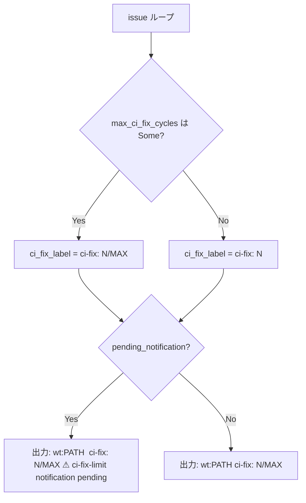

# Design Document

## Overview

`cupola status` の各 Issue 行に CI 修復試行回数（`ci_fix_count`）と上限（`max_ci_fix_cycles`）を `ci-fix: N[/MAX]` 形式で常時表示することで、オペレーターが運用中に打ち切り状況を一目で把握できるようにする。

変更はすべて `src/bootstrap/app.rs` の `handle_status()` 関数内の出力フォーマット修正に限定される。ドメインロジック・DB スキーマ・設定フォーマットへの変更は一切不要。

### Goals
- `cupola status` の各 Issue 行に `ci-fix: N/MAX`（または `ci-fix: N`）を常時表示する
- 既存の `⚠ ci-fix-limit notification pending` 表示を維持する
- 最小変更・最小リスクで実現する

### Non-Goals
- リトライ上限値のランタイム変更
- リトライ履歴や失敗した CI の詳細ログ表示
- `ci_fix_limit_notified` の判定条件変更（別 Issue で扱う）
- 新規ドメインロジック・DB マイグレーション・設定項目の追加

## Architecture

### Existing Architecture Analysis

`handle_status()` は bootstrap 層の関数であり、すでに次のデータを受け取っている：

- `repo: &impl IssueRepository` — `Issue` エンティティを取得（`ci_fix_count`, `ci_fix_limit_notified` を含む）
- `max_ci_fix_cycles: Option<u32>` — 設定ファイルから読み込まれた上限値

変更が必要なのは `for issue in &issues` ループ内のフォーマット文字列のみ。

### Architecture Pattern & Boundary Map

```
bootstrap/app.rs
  └── handle_status()
        └── for issue in &issues  ← ここのみ変更
              ├── pending_notification 判定（変更なし）
              ├── ci_fix_label 組み立て  ← 新規（インライン）
              └── writeln! フォーマット  ← 変更
```

本変更は bootstrap 層の表示ロジックのみに影響し、domain / application / adapter 層には一切波及しない。

### Technology Stack

| Layer | Choice | Role | Notes |
|-------|--------|------|-------|
| bootstrap | `src/bootstrap/app.rs` | 出力フォーマット修正 | 変更対象 |
| domain | `src/domain/issue.rs` | `ci_fix_count: u32` 提供 | 変更なし |
| adapter | `SqliteIssueRepository` | Issue 取得 | 変更なし |

## System Flows

### CI修復回数ラベル生成ロジック



## Requirements Traceability

| Requirement | Summary | Components | フロー |
|-------------|---------|------------|------|
| 1.1 | MAX設定時に `N/MAX` 表示 | `handle_status` フォーマット修正 | CI修復回数ラベル生成 |
| 1.2 | MAX未設定時に `N` のみ表示 | `handle_status` フォーマット修正 | CI修復回数ラベル生成 |
| 1.3 | count=0 でも常時表示 | `handle_status` フォーマット修正 | — |
| 1.4 | 既存の ⚠ 表示を維持 | `handle_status` フォーマット修正 | — |
| 1.5 | `ci-fix` を worktree パスの後に配置 | `handle_status` フォーマット修正 | — |
| 2.1 | 既存テストの更新 | テストコード | — |
| 2.2 | MAX設定時テスト | テストコード | — |
| 2.3 | MAX未設定時テスト | テストコード | — |
| 2.4 | 通知保留テスト | テストコード | — |

## Components and Interfaces

| Component | Layer | Intent | Req Coverage |
|-----------|-------|--------|--------------|
| `handle_status()` フォーマット修正 | bootstrap | Issue行に `ci-fix: N[/MAX]` を追記 | 1.1〜1.5 |
| テストケース追加・更新 | bootstrap（テスト） | フォーマット検証 | 2.1〜2.4 |

### Bootstrap Layer

#### `handle_status()` — 出力フォーマット修正

| Field | Detail |
|-------|--------|
| Intent | Issue行の末尾に `ci-fix: N[/MAX]` を追記 |
| Requirements | 1.1, 1.2, 1.3, 1.4, 1.5 |

**Responsibilities & Constraints**
- `max_ci_fix_cycles: Option<u32>` の有無に応じて `ci-fix: N/MAX` または `ci-fix: N` を生成する
- `pending_notification` 判定（`ci_fix_count > max && !ci_fix_limit_notified`）は変更しない
- worktree パスの表示後に `ci-fix:` 情報を追記する順序を守る

**Implementation Notes**

変更前（現在）:
```rust
if pending_notification {
    writeln!(out, "  #{:<5} {:<30} wt:{} ⚠ ci-fix-limit notification pending", ...)?;
} else {
    writeln!(out, "  #{:<5} {:<30} wt:{}", ...)?;
}
```

変更後（設計）:
```rust
let ci_fix_label = match max_ci_fix_cycles {
    Some(max) => format!("ci-fix: {}/{}", issue.ci_fix_count, max),
    None => format!("ci-fix: {}", issue.ci_fix_count),
};
if pending_notification {
    writeln!(out, "  #{:<5} {:<30} wt:{}  {} ⚠ ci-fix-limit notification pending",
        issue.github_issue_number,
        issue.state.to_string(),
        issue.worktree_path.as_deref().unwrap_or("none"),
        ci_fix_label,
    )?;
} else {
    writeln!(out, "  #{:<5} {:<30} wt:{}  {}",
        issue.github_issue_number,
        issue.state.to_string(),
        issue.worktree_path.as_deref().unwrap_or("none"),
        ci_fix_label,
    )?;
}
```

- Validation: `ci_fix_count` は `u32` で非負保証済み。追加バリデーション不要
- Risks: 既存テストが出力文字列の完全一致を行っている場合は更新が必要

## Data Models

### Domain Model（変更なし）

`Issue.ci_fix_count: u32` — CI 修復試行回数（既存フィールド）
`Issue.ci_fix_limit_notified: bool` — 上限通知済みフラグ（既存フィールド）

スキーマ変更・マイグレーション不要。

## Error Handling

### Error Strategy

- `writeln!` の `?` 伝播は既存のまま維持
- `max_ci_fix_cycles` が `None` の場合は分母なしで安全に表示（ゼロ除算なし）

## Testing Strategy

### Unit Tests

1. `max_ci_fix_cycles = Some(5)`、`ci_fix_count = 2` → 出力に `ci-fix: 2/5` を含む
2. `max_ci_fix_cycles = None`、`ci_fix_count = 3` → 出力に `ci-fix: 3` を含み `/` を含まない
3. `ci_fix_count = 0` → 出力に `ci-fix: 0` または `ci-fix: 0/MAX` を含む（ゼロ値常時表示）
4. `ci_fix_count = 6 > max = 5`、`ci_fix_limit_notified = false` → `ci-fix: 6/5 ⚠ ci-fix-limit notification pending` を含む
5. 既存テストがフォーマット追加後も通過することを確認
