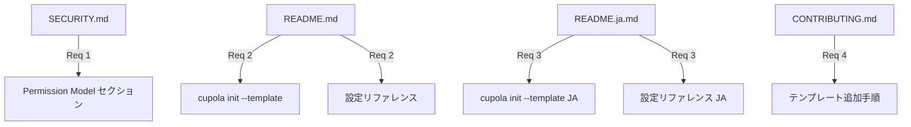

# Design Document: permission 機構ドキュメント整備 (issue-376)

## Overview

本タスクは、PR #374 / #375 で実装済みの Cupola permission 機構（`cupola.toml` + CLI フラグ方式）を外部ドキュメントに反映するドキュメント整備である。

**Purpose**: 新規ユーザーが「Cupola の permission って何?」「どう設定するの?」をドキュメントだけで理解できる状態にする。

**Users**: Cupola を初めて使う開発者、コントリビューターが対象。初期設定時の README、運用時の SECURITY.md、貢献時の CONTRIBUTING.md を参照する。

**Impact**: 実装コードへの変更はなく、SECURITY.md / README.md / README.ja.md / CONTRIBUTING.md の 4 ファイルを更新する。

### Goals

- SECURITY.md に Permission Model セクションを追加し、セキュリティモデルとして permission 機構を説明する
- README.md / README.ja.md に `cupola init --template` の使い方と `[claude_code.permissions]` 設定例を追加する
- CONTRIBUTING.md に新 permission template を追加するための開発者向け手順を追記する

### Non-Goals

- 実装コードの変更（`template_manager.rs`, `cli.rs` 等）
- 新しいテンプレートの追加
- `docs/` 配下への新規ドキュメントファイル作成
- i18n ファイルの変更

## Architecture

### Existing Architecture Analysis

permission 機構の実装状況（ドキュメントが記述すべき実態）:

```
cupola.toml
  └── [claude_code.permissions]
        ├── templates = ["rust", "devbox"]
        ├── extra_allow = [...]
        └── extra_deny = [...]
            │
            ▼
  TemplateManager::build_settings(templates)
      ├── 常に "base" を先頭に適用
      ├── 指定テンプレートを順序保持でマージ
      └── allow/deny 重複排除
            │
            ▼
  ClaudeCodeRunner::spawn()
      ├── --allowedTools "Read,Write,Bash(cargo*)..."
      └── --disallowedTools "Bash(gh*),Bash(git push*)..."
            │
            ▼
  Claude Code subprocess
      （.claude/settings.json には書き込まない）
```

**重要な分離**: Cupola の permission は Claude Code subprocess 起動時の CLI フラグとして渡されるため、ユーザーの対話型 Claude Code セッションの `.claude/settings.json` に影響しない。

### Architecture Pattern & Boundary Map

更新対象ドキュメントと対応する要件の境界:



### Technology Stack

| Layer | Choice | Role |
|-------|--------|------|
| ドキュメント | Markdown (GitHub Flavored) | 全更新ファイルの記法 |
| コードブロック | TOML / Bash / JSON | 設定例・コマンド例の表示 |

## Requirements Traceability

| Requirement | Summary | 更新対象ファイル |
|-------------|---------|----------------|
| 1.1–1.6 | SECURITY.md: Permission Model セクション追加 | SECURITY.md |
| 2.1–2.5 | README.md: `--template` オプション・設定リファレンス追記 | README.md |
| 3.1–3.4 | README.ja.md: README.md と同等の日本語更新 | README.ja.md |
| 4.1–4.5 | CONTRIBUTING.md: template 追加手順追記 | CONTRIBUTING.md |

## Components and Interfaces

| Component | 対象ファイル | Intent | Req Coverage |
|-----------|-------------|--------|--------------|
| Permission Model セクション | SECURITY.md | permission 機構のセキュリティ観点での説明 | 1.1–1.6 |
| cupola init --template 説明 | README.md | init コマンドの `--template` オプション使い方 | 2.1 |
| permission 設定リファレンス | README.md | `[claude_code.permissions]` 設定フィールド説明 | 2.2–2.4 |
| テンプレート一覧表 (EN) | README.md | 組み込みテンプレートの一覧と説明 | 2.3 |
| cupola init --template 説明 (JA) | README.ja.md | 日本語版: init コマンドの `--template` オプション使い方 | 3.1 |
| permission 設定リファレンス (JA) | README.ja.md | 日本語版: `[claude_code.permissions]` 設定フィールド説明 | 3.2–3.4 |
| テンプレート一覧表 (JA) | README.ja.md | 日本語版: 組み込みテンプレートの一覧と説明 | 3.3 |
| template 追加手順 | CONTRIBUTING.md | コントリビューター向け: 新 template の作成・登録・テスト手順 | 4.1–4.5 |

### SECURITY.md: Permission Model セクション

| Field | Detail |
|-------|--------|
| Intent | Cupola の permission 機構をセキュリティポリシーとして説明する |
| Requirements | 1.1, 1.2, 1.3, 1.4, 1.5, 1.6 |

**追加すべき内容**:
- セクション見出し: `## Permission Model`
- Cupola が spawn する Claude Code subprocess は `--dangerously-skip-permissions` を使わないことを明記
- CLI フラグ方式（`--allowedTools` / `--disallowedTools`）で permission を渡す仕組みの説明
- 対話 Claude Code セッション（`.claude/settings.json`）への影響がないことを明記
- 組み込みテンプレート一覧表（テンプレートキー・主な追加 allow 操作）
- `[claude_code.permissions]` の設定例（`templates`, `extra_allow`, `extra_deny`）
- `base` テンプレートの deny リスト（`Bash(gh*)`, `Bash(git push*)`, `WebFetch` 等）の意図説明

**挿入位置**: 既存の `## Issue Body Approval and Tampering Detection` セクションの後、`## Reporting Security Vulnerabilities` の前

**組み込みテンプレート一覧表**:

| キー | 主な追加 allow 操作 |
|------|-------------------|
| `base` | git 操作（add/commit/checkout/branch/fetch/pull 等）、基本ファイル操作。常に暗黙適用 |
| `rust` | `cargo build/test/clippy/fmt/check/run/doc`, `rustup` |
| `typescript` | `npm`, `npx`, `node`, `tsc` |
| `python` | `python`, `pip`, `pytest`, `uv`, `ruff` |
| `go` | `go build/test/run/fmt/vet` 等 |
| `devbox` | `devbox` コマンド全般 |

### README.md: cupola init --template 説明

| Field | Detail |
|-------|--------|
| Intent | `cupola init` コマンドの `--template` オプションを説明する |
| Requirements | 2.1 |

**変更箇所**: `### cupola init` セクション

現在の説明:
```
### `cupola init`

Bootstraps Cupola into the current repository for the target agent runtime.

```bash
cupola init
```
```

追加すべき内容:
- `--template <key>[,<key>]` オプションの説明（デフォルト: `base` のみ）
- 使用例:
  ```bash
  # Rust プロジェクト + devbox 環境
  cupola init --template rust,devbox

  # TypeScript プロジェクト
  cupola init --template typescript
  ```
- `cupola.toml` の `[claude_code.permissions].templates` に保存されることへの言及

### README.md: permission 設定リファレンス

| Field | Detail |
|-------|--------|
| Intent | Configuration Reference に `[claude_code.permissions]` セクションを追記する |
| Requirements | 2.2, 2.3, 2.4 |

**変更箇所 1**: Configuration Reference テーブルに `[claude_code.permissions]` 関連フィールドを追加

| Key | Type | Default | Description |
|-----|------|---------|-------------|
| `[claude_code.permissions] templates` | Array of String | `[]` (= `base` のみ適用) | 適用する permission テンプレートキーのリスト |
| `[claude_code.permissions] extra_allow` | Array of String | `[]` | テンプレート解決後の allow リストに追加するエントリ |
| `[claude_code.permissions] extra_deny` | Array of String | `[]` | テンプレート解決後の deny リストに追加するエントリ |

**変更箇所 2**: 設定全体例に `[claude_code.permissions]` を追加:
```toml
[claude_code.permissions]
templates = ["rust", "devbox"]
# extra_allow = ["Bash(my-tool*)"]
# extra_deny = ["Bash(forbidden-cmd)"]
```

**変更箇所 3**: テンプレート一覧表を設定リファレンスの `[claude_code.permissions]` 説明の直後に追記（SECURITY.md と同一内容）

**挿入位置**: Configuration Reference テーブルに `[log]` セクションの後に追加するか、または設定全体例の後に `### Permission Templates` などのサブセクションとして追加

### README.ja.md: permission 設定リファレンス（日本語版）

| Field | Detail |
|-------|--------|
| Intent | README.md と同等の変更を README.ja.md に日本語で適用する |
| Requirements | 3.1, 3.2, 3.3, 3.4 |

README.md と同一構造で、以下を日本語で記述:
- `cupola init --template` の説明と使用例
- 設定リファレンステーブルへの `[claude_code.permissions]` 追加
- テンプレート一覧表（日本語説明付き）
- `cupola.toml` 設定全体例への `[claude_code.permissions]` サンプル追加

### CONTRIBUTING.md: permission template 追加手順

| Field | Detail |
|-------|--------|
| Intent | コントリビューターが新 permission template を追加するための手順を説明する |
| Requirements | 4.1, 4.2, 4.3, 4.4, 4.5 |

**追加すべきセクション**: `## Adding a New Permission Template`

内容:
1. **テンプレートファイルの作成** (`assets/claude-settings/<key>.json`)
   - 最小構成例: `{ "permissions": { "allow": ["Bash(<cmd>*)"] } }`
   - `deny` を追加する場合の例
2. **TEMPLATES 配列への登録** (`src/application/template_manager.rs`)
   - `("<key>", include_str!(concat!(env!("CARGO_MANIFEST_DIR"), "/assets/claude-settings/<key>.json")))` を追加
3. **テストの追加** (`src/application/template_manager.rs` の `#[cfg(test)]` ブロック)
   - 単独指定テスト: `build_settings(&["<key>"])` で期待する allow エントリを検証
   - 他テンプレートとの merge テスト: `build_settings(&["<key>", "rust"])` 等で両方のエントリが存在することを検証
4. **README テンプレート一覧の更新**: README.md および README.ja.md のテンプレート一覧表に追記
5. **命名規則**:
   - 言語系: `rust`, `python`, `go`（小文字言語名）
   - エコシステム系: `devbox`, `docker`（ツール名）
   - フレームワーク系: `nextjs`, `rails`（フレームワーク名）

**挿入位置**: `## Coding Standards` セクションの後

## Testing Strategy

本タスクはドキュメント更新であり、コードテストは不要。以下の観点でレビューで検証する:

### ドキュメント検証

- SECURITY.md: Permission Model セクションの内容が実装（`template_manager.rs`, `base.json`）と一致している
- README.md / README.ja.md: `cupola init --template` の使用例が実際の CLI 動作（`src/adapter/inbound/cli.rs`）と一致している
- CONTRIBUTING.md: 手順通りに操作して新テンプレートが追加できることを確認（例として実行可能であること）
- テンプレート一覧表の内容が `assets/claude-settings/*.json` と一致している

## Error Handling

該当なし（ドキュメント整備タスクのため）。

## Security Considerations

- ドキュメントに記載する設定例は最小権限の原則を示す内容にする（`extra_allow` に広い権限を付与する例を避ける）
- `base` テンプレートの deny リスト（`Bash(gh*)`, `Bash(git push*)` 等）の意図を正確に説明する
