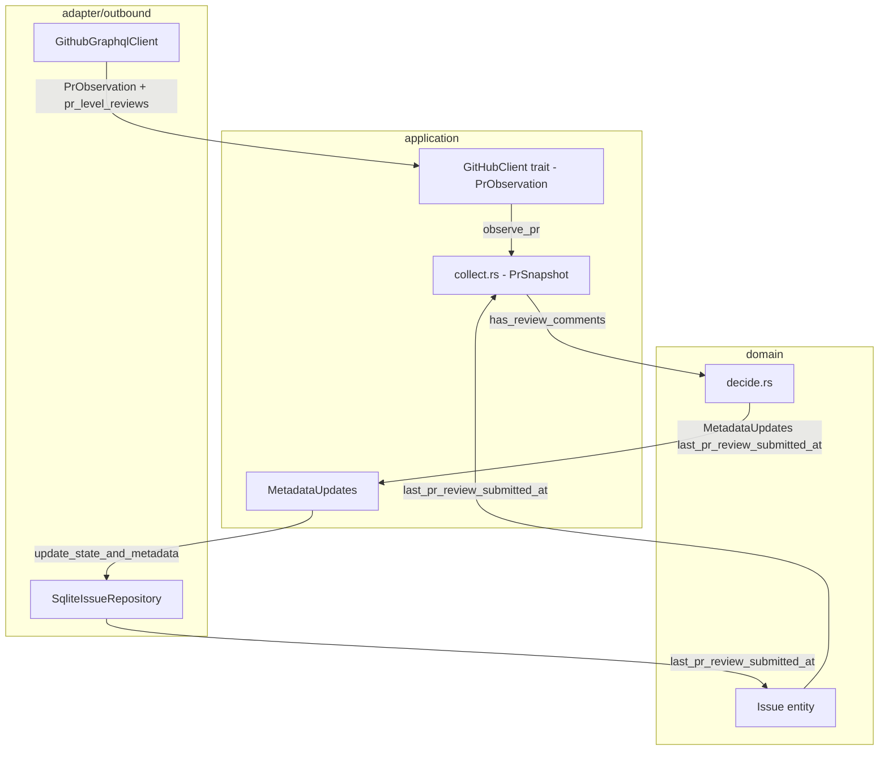
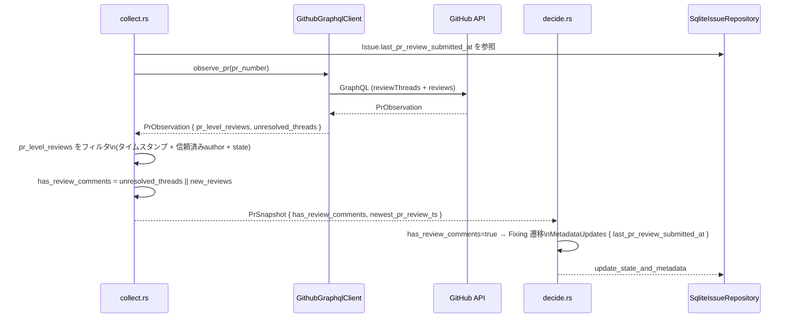

# 設計書: PRレベルのレビューコメントを fixing トリガーとして拾う

## 概要

本機能は、cupola が現在検知している `reviewThreads`（コード行コメント）に加え、PRレベルのレビューコメント（GitHub GraphQL `reviews` フィールド経由）も fixing トリガーとして扱えるようにする。

**目的**: レビュアーが PR 本体に対して `COMMENTED` / `CHANGES_REQUESTED` レビューを投稿した場合も、cupola が自動的に fixing を起動し、指摘に対応する。

**ユーザー**: cupola を利用する開発者・小規模チーム。レビューコメントの形式（スレッド vs PR レベル）を意識せず、一貫した自動修正フローの恩恵を受ける。

**影響**: `PrObservation`・`PrSnapshot`・`Issue` エンティティの拡張、DB スキーマへのカラム追加、GraphQL クエリの拡張。既存の `reviewThreads` 検知ロジックには影響を与えない。

### ゴール

- PR レベルレビュー（`COMMENTED` / `CHANGES_REQUESTED`）を fixing トリガーとして検知する
- 処理済みレビューを DB タイムスタンプで管理し、無限ループを防止する
- 既存の `reviewThreads` トリガーと統合し、単一の fixing セッションとして扱う

### 非ゴール

- `APPROVED` / `DISMISSED` レビューのトリガー化
- fixing 後の「対応しました」リプライ投稿（将来の拡張として検討）
- PR レビューのページネーション（100件超）への対応（現フェーズでは不要）

---

## 要件トレーサビリティ

| 要件 | 概要 | コンポーネント | インターフェース | フロー |
|------|------|----------------|-----------------|-------|
| 1.1 | GraphQL reviews クエリ実装 | `GithubGraphqlClient` | `GitHubClient::observe_pr` | PR観測フロー |
| 1.2 | COMMENTED/CHANGES_REQUESTED フィルタ | `GithubGraphqlClient`（parse） | — | PR観測フロー |
| 1.3 | TrustedAssociations によるフィルタ | `collect.rs` | — | 収集フロー |
| 1.4 | GraphQL 失敗時のフォールバック | `GithubGraphqlClient` | — | エラーハンドリング |
| 2.1 | last_pr_review_submitted_at DB 保持 | `SqliteIssueRepository` | `IssueRepository` | DB更新フロー |
| 2.2 | タイムスタンプによるフィルタリング | `collect.rs` | — | 収集フロー |
| 2.3 | トリガー時タイムスタンプ記録 | `decide.rs` / `MetadataUpdates` | — | 状態遷移フロー |
| 2.4 | NULL の場合すべて新規扱い | `collect.rs` | — | 収集フロー |
| 2.5 | DB スキーマ拡張 | `SqliteIssueRepository` | — | DB初期化フロー |
| 3.1–3.3 | 既存 fixing フローへの統合 | `collect.rs`・`decide.rs` | — | 状態遷移フロー |
| 3.4 | reviewThreads との共存 | `collect.rs` | — | 収集フロー |
| 3.5 | 既存ロジックへの非干渉 | すべての変更コンポーネント | — | — |

---

## アーキテクチャ

### 既存アーキテクチャとの関係

本機能は既存の Clean Architecture に完全に沿う Extension である。変更は以下の層に限定される：

- **adapter/outbound**: `GithubGraphqlClient`（GraphQL クエリ拡張）、`SqliteIssueRepository`（DBスキーマ拡張）
- **application/port**: `PrObservation` 型の拡張（`PrLevelReview` 追加）
- **application/polling**: `collect.rs`（フィルタリングロジック追加）、`PrSnapshot` 拡張
- **domain**: `Issue` エンティティのフィールド追加、`MetadataUpdates` 拡張

`decide.rs`（ドメイン層）は `has_review_comments` ブール値を参照するため、そのロジック自体は変更不要。

### アーキテクチャ境界マップ



### 技術スタック

| 層 | 選択 | 本機能での役割 |
|----|------|---------------|
| GitHub GraphQL | reqwest + serde_json（既存） | `reviews` サブクエリ追加 |
| 永続化 | SQLite / rusqlite（既存） | `last_pr_review_submitted_at` カラム追加 |
| 非同期 | tokio（既存） | 変更なし |
| 時刻 | chrono（既存） | `DateTime<Utc>` としてタイムスタンプ管理 |

---

## システムフロー

### PRレベルレビュー検知フロー（ポーリングサイクル内）



---

## コンポーネントとインターフェース

### コンポーネント概要

| コンポーネント | 層 | 意図 | 要件 | 主要依存 |
|---------------|----|----- |------|---------|
| `PrLevelReview` | application/port | PR レベルレビューの型定義 | 1.1, 1.2, 1.3 | — |
| `GithubGraphqlClient`（拡張） | adapter/outbound | reviews サブクエリの実装 | 1.1, 1.2, 1.4 | reqwest, serde_json |
| `PrObservation`（拡張） | application/port | reviews データの伝搬 | 1.1 | `PrLevelReview` |
| `PrSnapshot`（拡張） | application/polling | フィルタ後 has_review_comments 計算 | 1.3, 2.2, 2.4, 3.1–3.4 | `Issue`, `PrObservation` |
| `Issue`（拡張） | domain | last_pr_review_submitted_at 保持 | 2.1 | — |
| `MetadataUpdates`（拡張） | application | タイムスタンプ更新の伝搬 | 2.3 | — |
| `SqliteIssueRepository`（拡張） | adapter/outbound | DB カラム追加・読み書き | 2.1, 2.5 | rusqlite |

---

### application/port

#### `PrLevelReview`（新規型）

| フィールド | 詳細 |
|-----------|-------|
| Intent | PR レベルレビュー 1 件を表す値オブジェクト（`ReviewThread` と対称） |
| Requirements | 1.1, 1.2, 1.3 |

**フィールド定義**

```
PrLevelReview {
    id: String,                             // GitHub node ID
    submitted_at: DateTime<Utc>,
    body: String,
    state: PrReviewState,                   // Commented | ChangesRequested
    author: String,
    author_association: AuthorAssociation,
}

PrReviewState {
    Commented,
    ChangesRequested,
}
```

**Contracts**: State [ ✓ ]

**実装メモ**
- `ReviewThread` と同じファイル（`src/application/port/github_client.rs`）に定義する
- `PrReviewState` は本型専用の enum として定義（GitHub の `ReviewState` 全体を表す必要はない）

---

#### `PrObservation`（拡張）

既存の `PrObservation` 構造体に `pr_level_reviews: Vec<PrLevelReview>` フィールドを追加する。

- 既存フィールド: `state`, `mergeable`, `unresolved_threads`, `check_runs`
- 追加フィールド: `pr_level_reviews: Vec<PrLevelReview>`

**実装メモ**: `observe_pr()` の戻り値型として自動的に伝搬するため、`GitHubClient` trait のシグネチャ変更は不要。

---

### adapter/outbound

#### `GithubGraphqlClient`（拡張）

| フィールド | 詳細 |
|-----------|-------|
| Intent | `OBSERVE_PR_QUERY` に `reviews` サブクエリを追加し、`PrLevelReview` としてパースする |
| Requirements | 1.1, 1.2, 1.4 |

**OBSERVE_PR_QUERY 拡張内容**

既存の `reviewThreads` ノード取得に続けて以下を追加する：

```
reviews(first: 100, states: [COMMENTED, CHANGES_REQUESTED]) {
  nodes {
    id
    submittedAt
    body
    state
    author { login }
    authorAssociation
  }
}
```

**パースロジック**

`parse_pr_level_reviews(pr_node: &Value) -> Vec<PrLevelReview>` を追加：
- `reviews.nodes` を走査
- `body` が空文字・空白のみの場合はスキップ
- `submittedAt` を `DateTime<Utc>` にパース（失敗時はスキップしログ出力）
- `authorAssociation` を既存 `AuthorAssociation` enum にマップ
- 結果を `Vec<PrLevelReview>` として返す

**エラーハンドリング**
- GraphQL 応答に `reviews` フィールドが存在しない場合: 空 Vec を返し警告ログを出力（要件 1.4 に対応）
- 個別ノードのパース失敗: そのノードをスキップし警告ログ

**Contracts**: Service [ ✓ ]

---

### application/polling

#### `PrSnapshot`（拡張）と `collect.rs`

| フィールド | 詳細 |
|-----------|-------|
| Intent | PR レベルレビューのフィルタリングと `has_review_comments` への統合 |
| Requirements | 1.3, 2.2, 2.4, 3.1–3.5 |

**`PrSnapshot` への追加フィールド**

```
PrSnapshot {
    // 既存フィールド
    has_review_comments: bool,
    // 追加フィールド
    newest_pr_review_submitted_at: Option<DateTime<Utc>>,
}
```

**フィルタリングロジック（collect.rs）**

```
new_pr_reviews = observation.pr_level_reviews
    .filter(|r| r.submitted_at > issue.last_pr_review_submitted_at.unwrap_or(UNIX_EPOCH))
    .filter(|r| config.is_comment_trusted(&r.author_association, &r.author))

has_review_comments = !unresolved_threads.is_empty() || !new_pr_reviews.is_empty()

newest_pr_review_submitted_at = new_pr_reviews.iter().map(|r| r.submitted_at).max()
```

**実装メモ**
- `issue.last_pr_review_submitted_at` は `collect.rs` がイシューエンティティから直接参照する
- `newest_pr_review_submitted_at` は `decide.rs` が `MetadataUpdates` を構築する際に参照する

---

### domain

#### `Issue` エンティティ（拡張）

`Issue` 構造体に以下を追加する：

```
last_pr_review_submitted_at: Option<DateTime<Utc>>
```

- デフォルト: `None`（既存レコードは NULL → None にマップ）
- 書き込み: `MetadataUpdates` 経由で更新
- 読み込み: `collect.rs` がフィルタリングに使用

#### `MetadataUpdates`（拡張）

```
MetadataUpdates {
    // 既存フィールド
    ci_fix_count: Option<i64>,
    // 追加フィールド
    last_pr_review_submitted_at: Option<DateTime<Utc>>,
}
```

**decide.rs での設定タイミング**

`decide_design_review_waiting` / `decide_implementation_review_waiting` において、`has_review_comments = true` で Fixing に遷移する際、`MetadataUpdates.last_pr_review_submitted_at = snap.design_pr.newest_pr_review_submitted_at`（または `impl_pr`）を設定する。

---

### adapter/outbound

#### `SqliteIssueRepository`（拡張）

| フィールド | 詳細 |
|-----------|-------|
| Intent | `last_pr_review_submitted_at` カラムの追加とマイグレーション |
| Requirements | 2.1, 2.5 |

**DBスキーマ変更**

```sql
ALTER TABLE issues
ADD COLUMN last_pr_review_submitted_at TEXT;
```

既存の `init_schema()` にある `ALTER TABLE` パターン（`IF NOT EXISTS` 相当のエラー無視）に従って追加する。

**読み書き**
- `row_to_issue()`: カラム 12 番目として `last_pr_review_submitted_at TEXT` を `Option<DateTime<Utc>>` にパース
- `update_state_and_metadata()`: `MetadataUpdates.last_pr_review_submitted_at` が `Some` の場合に動的 SQL に追加

**Contracts**: State [ ✓ ]

---

## データモデル

### ドメインモデルの変更

`Issue` エンティティ（`src/domain/issue.rs` 相当）に `last_pr_review_submitted_at: Option<DateTime<Utc>>` を追加。

既存の不変条件（state machine 遷移ルール）は変更しない。

### 物理データモデル

**issues テーブルへの追加カラム**

| カラム名 | 型 | NULL | デフォルト | 説明 |
|---------|-----|------|-----------|------|
| `last_pr_review_submitted_at` | TEXT (ISO8601) | 許容 | NULL | 最後に fixing トリガーとして採用した PR レベルレビューの submittedAt |

インデックス追加は不要（既存の `github_issue_number` UNIQUE インデックスで十分）。

---

## エラーハンドリング

### エラー戦略

- GraphQL `reviews` フィールド取得失敗: 警告ログを出力し、当該サイクルは `pr_level_reviews = []` として処理継続（要件 1.4）
- タイムスタンプパース失敗: 該当ノードをスキップ、警告ログ出力
- DB カラム追加失敗（マイグレーション）: 起動時エラーとして `anyhow::Error` を伝搬（既存パターン）

### モニタリング

- PR レベルレビューを検知した場合: `tracing::info!` で件数とタイムスタンプをログ出力
- `last_pr_review_submitted_at` 更新時: `tracing::debug!` でログ出力

---

## テスト戦略

### ユニットテスト

- `parse_pr_level_reviews()`: 正常ケース（COMMENTED / CHANGES_REQUESTED）、除外ケース（body 空、APPROVED、DISMISSED）、パース失敗ケース
- `collect.rs` フィルタリングロジック: タイムスタンプ境界値（以前・以後・NULL）、TrustedAssociations フィルタ
- `MetadataUpdates` の `last_pr_review_submitted_at` 設定ロジック

### 統合テスト

- `SqliteIssueRepository`: `last_pr_review_submitted_at` の読み書き（インメモリ DB）
- `GithubGraphqlClient` モック: `pr_level_reviews` を含む `PrObservation` の生成と既存 `unresolved_threads` との共存
- エンドツーエンド: `has_review_comments = true` → Fixing 遷移 → `last_pr_review_submitted_at` 更新 → 次サイクルで同一レビューをスキップ
