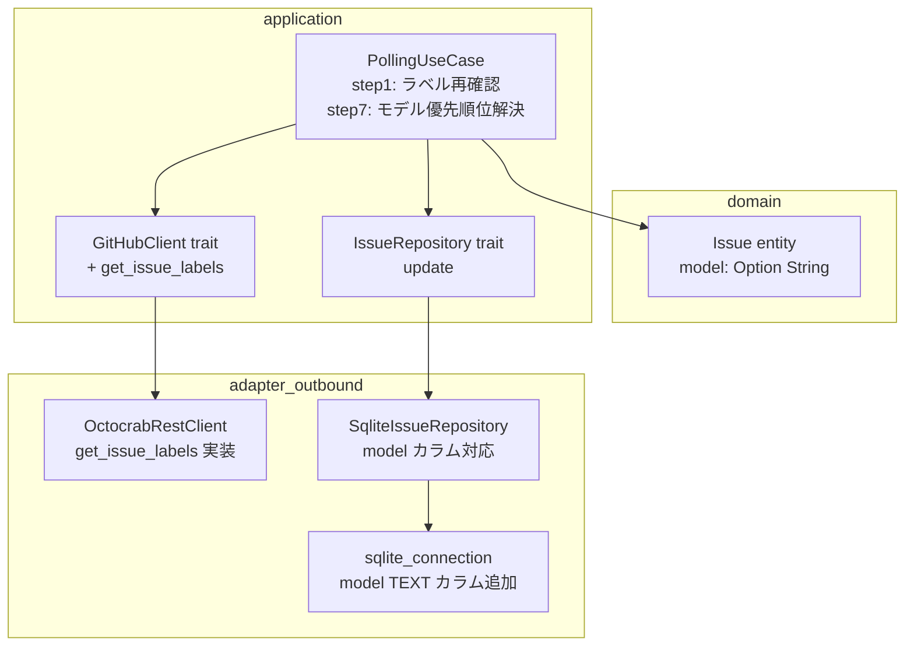
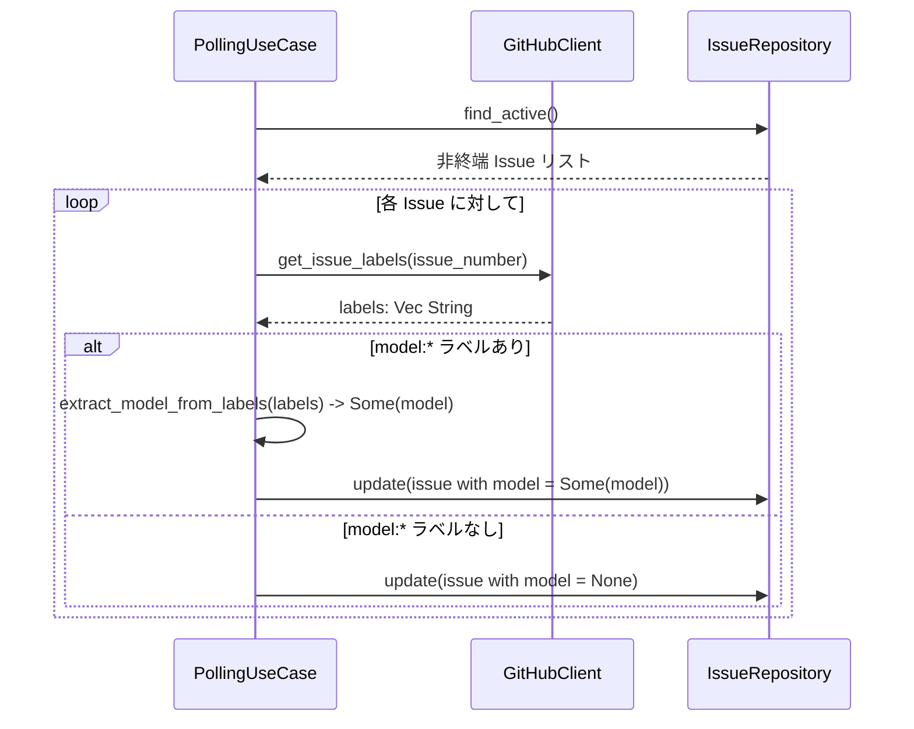
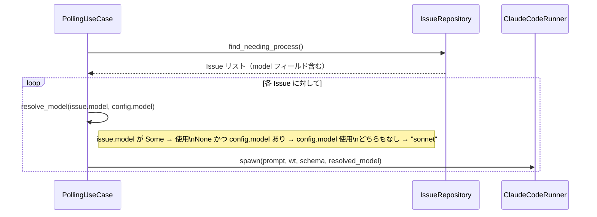
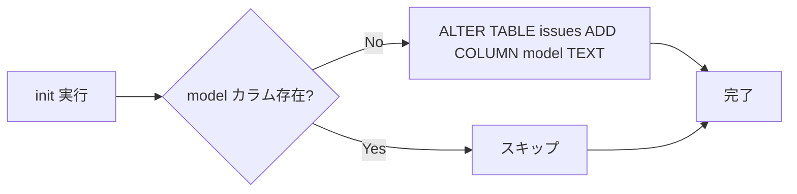

# 技術設計書: Issue ラベルによる Claude モデルの上書き指定

## Overview

本機能は、GitHub Issue に付与された `model:*` ラベル（例: `model:opus`、`model:haiku`）を読み取り、その Issue を処理する Claude Code 起動時に使用するモデルを動的に上書きする。

**Purpose**: Issue の複雑さに応じてモデルを使い分け可能にし、失敗後のリトライ時に人間がモデルを変更できるようにする。
**Users**: Cupola を運用するエンジニアが、Issue に `model:*` ラベルを付与することで利用する。
**Impact**: issues テーブルへの `model` カラム追加、ポーリングサイクルのラベル再確認処理の追加、Claude Code 起動時のモデル優先順位制御の実装。

### Goals

- `model:*` ラベルを毎ポーリングサイクルで再確認し、DB に動的に反映する
- Claude Code 起動時に「Issue DB → cupola.toml → "sonnet"」の優先順位でモデルを決定する
- 既存機能のデグレなしに後方互換性を維持する

### Non-Goals

- モデル名の事前バリデーション（Claude Code プロセスのエラーに委ねる）
- `model:*` ラベル以外のラベルによる動作制御
- API レート制限に対する複雑な最適化（現時点での Issue 数では許容範囲内）

## Architecture

### Existing Architecture Analysis

本機能は既存の Clean Architecture 構成に対する Extension であり、以下の統合ポイントを持つ:

- **domain/issue.rs**: `Issue` entity に `model: Option<String>` を追加
- **application/port/github_client.rs**: `GitHubClient` トレイトに `get_issue_labels` を追加
- **application/polling_use_case.rs**: step1（ラベル再確認）・step7（モデル優先順位解決）を変更
- **adapter/outbound/sqlite_connection.rs**: issues テーブルに `model TEXT` カラム追加
- **adapter/outbound/sqlite_issue_repository.rs**: SELECT/INSERT/UPDATE クエリに `model` カラムを追加
- **adapter/outbound/github_rest_client.rs**: `get_issue_labels` の実装を追加

### Architecture Pattern & Boundary Map



**Architecture Integration**:
- 選択パターン: Clean Architecture Extension（既存の 4 層構造を維持）
- 依存の向き: アダプタ → アプリケーション → ドメイン（変化なし）
- 新規コンポーネント: なし（既存コンポーネントへのフィールド・メソッド追加のみ）
- Steering compliance: 全レイヤーの依存方向ルールを維持

### Technology Stack

| Layer | Choice / Version | Role in Feature | Notes |
|-------|------------------|-----------------|-------|
| Backend | Rust (Edition 2024) | ドメイン・ユースケース実装 | 変更なし |
| Storage | SQLite (rusqlite) | model カラムの永続化 | ALTER TABLE または CREATE TABLE 更新 |
| GitHub API | octocrab (REST) | get_issue_labels 実装 | `GET /repos/{owner}/{repo}/issues/{n}/labels` |

## System Flows

### ポーリングサイクルにおけるラベル更新フロー（Step 1）



### Claude Code 起動時のモデル優先順位解決フロー（Step 7）



## Requirements Traceability

| Requirement | Summary | Components | Interfaces | Flows |
|-------------|---------|------------|------------|-------|
| 1.1 | model:* ラベル解析・DB 保存 | PollingUseCase, SqliteIssueRepository, Issue | get_issue_labels, update | ラベル更新フロー |
| 1.2 | ラベルなし時は model = NULL | PollingUseCase, SqliteIssueRepository | update | ラベル更新フロー |
| 1.3 | 複数 model:* ラベルは先頭優先 | PollingUseCase | extract_model_from_labels | ラベル更新フロー |
| 1.4 | model カラム nullable TEXT | SqliteIssueRepository, sqlite_connection | DDL | — |
| 2.1 | 毎サイクル非終端 Issue のラベル再確認 | PollingUseCase | get_issue_labels | ラベル更新フロー |
| 2.2 | ラベル変更を DB に即座に反映 | PollingUseCase, SqliteIssueRepository | update | ラベル更新フロー |
| 2.3 | ラベル削除時は model = NULL | PollingUseCase | update | ラベル更新フロー |
| 2.4 | step 1 で実施 | PollingUseCase | step1_issue_polling | ラベル更新フロー |
| 3.1 | モデル優先順位制御 | PollingUseCase | spawn | モデル優先順位解決フロー |
| 3.2 | issue.model が Some なら --model フラグ付与 | PollingUseCase, ClaudeCodeRunner | spawn | モデル優先順位解決フロー |
| 3.3 | issue.model が None なら config.model 使用 | PollingUseCase | resolve_model | モデル優先順位解決フロー |
| 3.4 | 両方未設定なら "sonnet" | PollingUseCase | resolve_model | モデル優先順位解決フロー |
| 3.5 | ClaudeCodeRunner の spawn でモデルを受け取る | ClaudeCodeRunner (既存) | spawn | — |
| 4.1 | nullable TEXT で後方互換性維持 | sqlite_connection | DDL | — |
| 4.2 | 既存テスト全パス | 全コンポーネント | — | — |
| 4.3 | ラベルなし Issue は従来動作継続 | PollingUseCase | resolve_model | — |

## Components and Interfaces

### コンポーネント概要

| Component | Domain/Layer | Intent | Req Coverage | Key Dependencies |
|-----------|--------------|--------|--------------|------------------|
| Issue | domain | model フィールドを追加保持 | 1.1, 1.2, 1.4, 4.1 | — |
| GitHubClient (trait) | application/port | get_issue_labels メソッド追加 | 2.1 | OctocrabRestClient |
| PollingUseCase | application | step1・step7 を拡張 | 1.1-1.4, 2.1-2.4, 3.1-3.5, 4.3 | GitHubClient, IssueRepository |
| SqliteIssueRepository | adapter/outbound | model カラム対応 | 1.1, 1.2, 1.4, 4.1 | SQLite |
| sqlite_connection | adapter/outbound | DDL に model カラム追加 | 1.4, 4.1 | rusqlite |
| OctocrabRestClient | adapter/outbound | get_issue_labels 実装 | 2.1 | octocrab / GitHub REST API |

---

### domain

#### Issue

| Field | Detail |
|-------|--------|
| Intent | Issue エンティティに `model` フィールドを追加し、ラベルから取得したモデル名を保持する |
| Requirements | 1.1, 1.2, 1.4, 4.1 |

**Responsibilities & Constraints**
- `model: Option<String>` — `None` はモデル未指定（ラベルなし）、`Some(name)` は指定あり
- ドメイン層はフォーマット変換や優先順位解決を行わない（純粋なデータ保持）

**Contracts**: State [x]

##### State Management
- State model: `model: Option<String>` — `Some("opus")`, `Some("haiku")`, `None`
- Persistence & consistency: IssueRepository::update() を通じて SQLite に永続化
- Concurrency strategy: 既存の Arc<Mutex<Connection>> + spawn_blocking パターンを継承

---

### application

#### GitHubClient（trait 拡張）

| Field | Detail |
|-------|--------|
| Intent | 非終端 Issue のラベル一覧を取得するメソッドを追加する |
| Requirements | 2.1 |

**Responsibilities & Constraints**
- `get_issue_labels(issue_number: u64) -> Result<Vec<String>>` を追加
- ラベル名のみを返す（`model:opus` のような完全な文字列）

**Dependencies**
- Outbound: OctocrabRestClient — 実装を提供 (P0)
- External: GitHub REST API `GET /repos/{owner}/{repo}/issues/{n}/labels` (P0)

**Contracts**: Service [x]

##### Service Interface

```rust
pub trait GitHubClient: Send + Sync {
    // 既存メソッドは省略
    fn get_issue_labels(
        &self,
        issue_number: u64,
    ) -> impl std::future::Future<Output = Result<Vec<String>>> + Send;
}
```

- Preconditions: `issue_number` が有効な GitHub Issue 番号であること
- Postconditions: ラベル名の文字列リストを返す（ラベルなしの場合は空 Vec）
- Invariants: GitHub API エラー時は `Err` を返す

---

#### PollingUseCase（step1・step7 拡張）

| Field | Detail |
|-------|--------|
| Intent | step1 でラベル動的更新、step7 でモデル優先順位解決を行う |
| Requirements | 1.1-1.4, 2.1-2.4, 3.1-3.5, 4.3 |

**Responsibilities & Constraints**
- `step1_issue_polling`: 既存の非終端 Issue ループに `get_issue_labels` 呼び出しとモデル更新ロジックを追加
- `step7_spawn_processes`: `&self.config.model` の直接参照を `resolve_model` ヘルパーに置き換える
- `extract_model_from_labels(labels: &[String]) -> Option<String>`: `model:*` パターンの最初のラベルを抽出するプライベートヘルパー
- `resolve_model(issue_model: Option<&str>, config_model: &str) -> &str`: 優先順位に従いモデル名を解決するプライベートヘルパー

**Contracts**: Service [x]

##### Service Interface

```rust
impl<G, I, E, C, W> PollingUseCase<G, I, E, C, W>
where
    G: GitHubClient,
    I: IssueRepository,
    E: ExecutionLogRepository,
    C: ClaudeCodeRunner,
    W: GitWorktree,
{
    /// model:* パターンのラベルを抽出し、最初に見つかった値を返す
    fn extract_model_from_labels(labels: &[String]) -> Option<String>;

    /// Issue モデル → Config モデル → "sonnet" の優先順位でモデル名を解決する
    fn resolve_model<'a>(issue_model: Option<&'a str>, config_model: &'a str) -> &'a str;
}
```

**Implementation Notes**
- Integration: `step1_issue_polling` の `find_active` ループ内に `get_issue_labels` 呼び出しを追加し、モデルが変化した場合のみ `issue_repo.update` を呼び出す（不要な更新を避ける）
- Validation: ラベル文字列が `model:` プレフィックスで始まることで判定。プレフィックス除去後の値を model 名として使用。
- Risks: GitHub API 呼び出しがサイクルごとに増加する。Issue 数が大きい場合はレート制限に注意（現時点では Issue 数が少ないため許容範囲内）。

---

### adapter/outbound

#### SqliteIssueRepository

| Field | Detail |
|-------|--------|
| Intent | Issue の SELECT/INSERT/UPDATE クエリに model カラムを追加する |
| Requirements | 1.1, 1.2, 1.4, 4.1 |

**Responsibilities & Constraints**
- `find_by_id`, `find_active`, `find_needing_process` の SELECT クエリに `model` カラムを追加
- `save` (INSERT) に `model` カラムを追加
- `update` に `model` カラムを追加
- `NULL` を `Option<String>::None` として扱う

**Contracts**: State [x]

**Implementation Notes**
- Integration: `rusqlite` の `row.get::<_, Option<String>>("model")?` でマッピング
- Risks: クエリ変更時の列インデックスずれに注意（名前付き参照を使用すること）

#### sqlite_connection（DDL 変更）

| Field | Detail |
|-------|--------|
| Intent | issues テーブルの CREATE TABLE に `model TEXT` カラムを追加し、既存 DB 向けマイグレーションを実装する |
| Requirements | 1.4, 4.1 |

**Responsibilities & Constraints**
- `CREATE TABLE IF NOT EXISTS issues (... model TEXT, ...)` に追加
- 既存 DB 向けに `ALTER TABLE issues ADD COLUMN model TEXT` のマイグレーションを `init` フェーズで実行

**Contracts**: Batch [x]

##### Batch / Job Contract
- Trigger: `cargo run -- init`（初期化コマンド実行時）
- Input / validation: 既存 DB の `PRAGMA table_info(issues)` で `model` カラムの存在確認
- Output / destination: issues テーブルに `model TEXT NULL` カラムを追加
- Idempotency & recovery: カラムが既に存在する場合は `ALTER TABLE` をスキップ（`IF NOT EXISTS` 相当のチェック）

#### OctocrabRestClient

| Field | Detail |
|-------|--------|
| Intent | `GitHubClient::get_issue_labels` を GitHub REST API で実装する |
| Requirements | 2.1 |

**Contracts**: Service [x]

##### Service Interface

```rust
impl GitHubClient for OctocrabRestClient {
    async fn get_issue_labels(&self, issue_number: u64) -> Result<Vec<String>> {
        // GET /repos/{owner}/{repo}/issues/{issue_number}/labels
        // レスポンスからラベル名の Vec<String> を構築して返す
    }
}
```

**Implementation Notes**
- Integration: octocrab の `issues().list_labels_for_issue(issue_number)` を使用するか、`reqwest` で直接 `GET /repos/{owner}/{repo}/issues/{n}/labels` を呼び出す
- Risks: octocrab の API サポート状況を確認すること。未サポートの場合は `reqwest` 直接呼び出しにフォールバック。

## Data Models

### Domain Model

```
Issue
├── id: i64
├── github_issue_number: u64
├── state: State
├── model: Option<String>   ← 追加
├── design_pr_number: Option<u64>
├── impl_pr_number: Option<u64>
├── worktree_path: Option<String>
├── retry_count: u32
├── current_pid: Option<u32>
├── error_message: Option<String>
├── feature_name: Option<String>
├── created_at: DateTime<Utc>
└── updated_at: DateTime<Utc>
```

**Business rules**:
- `model` が `None` の場合、cupola.toml の `model` 設定またはデフォルト `"sonnet"` を使用する（優先順位解決はアプリケーション層が担当）
- `model` のフォーマット検証はしない（Claude Code に委ねる）

### Physical Data Model

**issues テーブル変更**:

```sql
-- 新規 DB: CREATE TABLE に追加
CREATE TABLE IF NOT EXISTS issues (
    id                  INTEGER PRIMARY KEY,
    github_issue_number INTEGER UNIQUE NOT NULL,
    state               TEXT NOT NULL DEFAULT 'idle',
    design_pr_number    INTEGER,
    impl_pr_number      INTEGER,
    worktree_path       TEXT,
    retry_count         INTEGER NOT NULL DEFAULT 0,
    current_pid         INTEGER,
    created_at          TEXT NOT NULL DEFAULT (datetime('now')),
    updated_at          TEXT NOT NULL DEFAULT (datetime('now')),
    error_message       TEXT,
    feature_name        TEXT,
    model               TEXT          -- 追加
);

-- 既存 DB: マイグレーション
ALTER TABLE issues ADD COLUMN model TEXT;
```

**インデックス**: 追加なし（model による検索は行わない）

## Error Handling

### Error Strategy

- `get_issue_labels` 呼び出し失敗時は警告ログを出力し、model の更新をスキップする（前回値を維持）
- SQLite の model カラム操作失敗時は既存のエラーハンドリングパターン（`warn` ログ + 処理継続）に従う

### Error Categories and Responses

| エラー種別 | 発生箇所 | 対応 |
|-----------|---------|------|
| GitHub API エラー（get_issue_labels） | step1_issue_polling | `warn` ログ出力、model 更新スキップ（前回値維持） |
| SQLite 更新エラー（model カラム） | SqliteIssueRepository::update | `warn` ログ出力、処理継続 |
| 無効なモデル名 | ClaudeCode spawn 後 | Claude Code プロセスがエラー終了 → retry_count 増加の通常フロー |

### Monitoring

- `tracing::warn!` で API エラーと DB エラーを記録
- モデル変更時は `tracing::info!(issue_number, model, "updated model from label")` で記録

## Testing Strategy

### Unit Tests

- `extract_model_from_labels`: `model:opus` 抽出、複数ラベル時の先頭優先、`model:*` なしの場合
- `resolve_model`: Issue モデルあり、Config モデルのみ、両方なし（"sonnet" デフォルト）

### Integration Tests

- `get_issue_labels` モック実装 → `step1_issue_polling` でモデルが DB に書き込まれること
- `model:*` ラベル削除 → step1 で `model = None` に更新されること
- step7 で Issue の `model` が `Some("opus")` の場合、`spawn` に `"opus"` が渡されること
- モデル `None` + config.model `"haiku"` の場合、`spawn` に `"haiku"` が渡されること
- モデル `None` + config.model `""` の場合、`spawn` に `"sonnet"` が渡されること

### Migration Tests

- 既存 DB（`model` カラムなし）に対して init を実行した場合、カラムが追加され既存レコードは `NULL` になること

## Migration Strategy



- **Phase 1**: `cargo run -- init` 実行時に `PRAGMA table_info(issues)` で `model` カラムの存在を確認
- **Phase 2**: 存在しない場合 `ALTER TABLE issues ADD COLUMN model TEXT` を実行
- **Rollback**: `model` カラムを `NULL` 許容にしているため、カラム追加後も古いコードが動作可能（後方互換）
