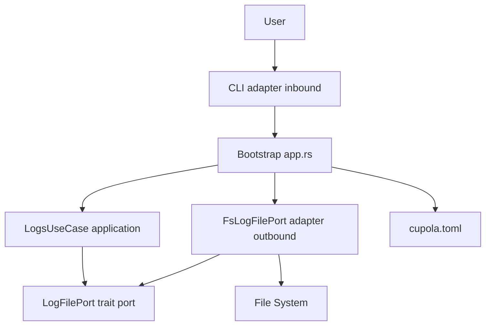
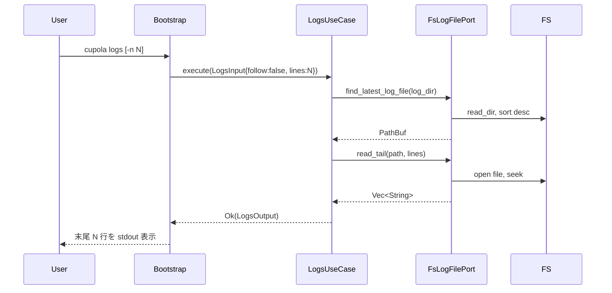
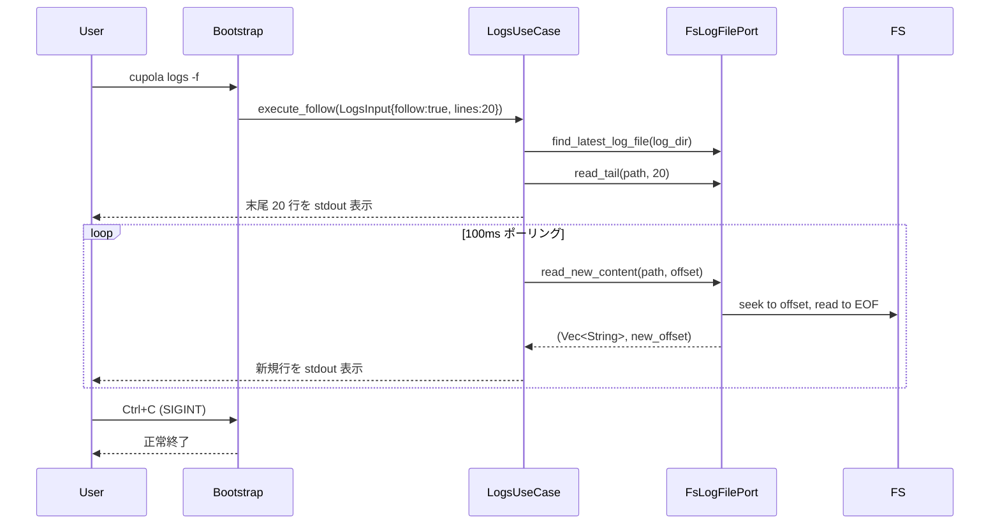

# Design Document: logs-command

## Overview

本フィーチャーは `cupola logs` コマンドを追加し、デーモンモードで起動した cupola のログをターミナルから確認できるようにする。`cupola.toml` の `[log] dir` 設定からログディレクトリを読み取り、最新のログファイルの末尾を表示する。`-f` オプションにより `tail -f` 相当のリアルタイム追跡が可能になる。

**Purpose**: ログファイルを直接開かずに CLI のみでログ確認を完結させ、デーモン運用の利便性を向上させる。  
**Users**: cupola をデーモンモードで運用するオペレーターが、稼働中のエージェントの動作状況を確認するために使用する。  
**Impact**: 既存コマンド（start / stop / init / status / doctor）に `logs` サブコマンドを追加する。既存機能への変更はない。

### Goals

- `cupola logs` で最新ログファイルの末尾 N 行を表示する
- `cupola logs -f` でリアルタイムにログを追跡し、Ctrl+C で停止できる
- `log.dir` 未設定時・ディレクトリ不在時・ログファイル不在時に適切なエラーメッセージを表示する

### Non-Goals

- ログファイルのローテーション追跡（フォロー中に日付をまたいだ場合の新ファイルへの切り替え）
- 複数ログファイルの結合表示
- ログのフィルタリング・検索機能

## Architecture

### Existing Architecture Analysis

cupola は4層クリーンアーキテクチャを採用している。`logs` コマンドは CLI サブコマンドとして追加され、以下の既存パターンに従う：

- **CLI 層** (`src/adapter/inbound/cli.rs`): `Command` enum に variant を追加
- **Use Case 層** (`src/application/`): `LogsUseCase<P: LogFilePort>` を新規追加
- **Port 層** (`src/application/port/`): `LogFilePort` trait を新規定義
- **Adapter/outbound 層** (`src/adapter/outbound/`): `FsLogFilePort` を新規追加
- **Bootstrap 層** (`src/bootstrap/app.rs`): `Command::Logs` ブランチを追加し DI を行う

設定 (`cupola.toml`) の `[log] dir` は既存の `Config.log_dir: Option<PathBuf>` として読み取り済みであり、新たなコンフィグ変更は不要。

### Architecture Pattern & Boundary Map



**Architecture Integration**:
- 選択パターン: 既存のクリーンアーキテクチャ（Ports & Adapters）に準拠
- 既存パターン保持: `UseCase<P: Port>` 型パラメータ注入パターン、`thiserror` エラー定義
- 新規コンポーネント: `LogFilePort`, `LogsUseCase`, `FsLogFilePort`（各1ファイル追加）
- Steering コンプライアンス: domain 層への変更なし、adapter は application の trait のみに依存

### Technology Stack

| Layer | Choice / Version | Role | Notes |
|-------|-----------------|------|-------|
| CLI | clap (derive) 既存 | `Logs` サブコマンド追加 | `short='f'` / `long` パターン |
| Application | tokio 既存 | フォローポーリングループ、`ctrl_c()` シグナル | `tokio::select!` 使用 |
| File I/O | std::fs / std::io 既存 | ファイル末尾読み取り、offset ベース差分読み取り | 新規クレート依存なし |

## System Flows

### 通常表示フロー（`cupola logs`）



### リアルタイム追跡フロー（`cupola logs -f`）



フォロー中断は `tokio::select!` で `ctrl_c()` と `sleep(100ms)` を競合させ、SIGINT 受信時にループを抜ける。

## Requirements Traceability

| Requirement | Summary | Components | Interfaces | Flows |
|-------------|---------|------------|------------|-------|
| 1.1 | `log.dir` 読み込み | Bootstrap, LogsUseCase | `Config.log_dir` | 通常表示フロー |
| 1.2 | 最新ファイル末尾表示 | LogsUseCase, FsLogFilePort | `find_latest_log_file`, `read_tail` | 通常表示フロー |
| 1.3 | `log.dir` 未設定エラー | Bootstrap, LogsUseCase | `LogsError::NoLogDir` | — |
| 1.4 | ディレクトリ不在エラー | FsLogFilePort | `LogFileError::DirNotFound` | — |
| 1.5 | ログファイル不在エラー | FsLogFilePort | `LogFileError::NoLogFiles` | — |
| 1.6 | `--config` オプション | CLI (Command::Logs) | `config: PathBuf` | — |
| 2.1 | フォローモード追跡 | LogsUseCase, FsLogFilePort | `read_new_content` | リアルタイム追跡フロー |
| 2.2 | Ctrl+C 停止 | LogsUseCase | `tokio::signal::ctrl_c` | リアルタイム追跡フロー |
| 2.3 | ポーリング実装 | LogsUseCase | `tokio::time::sleep(100ms)` | リアルタイム追跡フロー |
| 2.4 | `-f` / `--follow` フラグ | CLI (Command::Logs) | `follow: bool` | — |
| 3.1 | 最新ファイル選択ロジック | FsLogFilePort | `find_latest_log_file` | — |
| 3.2 | 単一ファイル対象 | FsLogFilePort | `find_latest_log_file` | — |
| 3.3 | デフォルト 20 行表示 | CLI, LogsUseCase | `lines: usize` default 20 | — |
| 3.4 | `-n <N>` 行数指定 | CLI (Command::Logs) | `lines: Option<usize>` | — |
| 4.1 | `Command::Logs` variant | CLI adapter/inbound | `Command` enum | — |
| 4.2 | ユースケースを application 層に配置 | LogsUseCase | `LogsUseCase<P>` | — |
| 4.3 | `LogFilePort` をポート定義 | Port trait | `LogFilePort` trait | — |
| 4.4 | bootstrap に DI 配線 | Bootstrap | `app.rs::run()` | — |

## Components and Interfaces

| Component | Layer | Intent | Req Coverage | Key Dependencies | Contracts |
|-----------|-------|--------|-------------|------------------|-----------|
| `Command::Logs` | adapter/inbound | `logs` サブコマンド定義 | 1.6, 2.4, 3.3, 3.4, 4.1 | clap (P0) | — |
| `LogFilePort` | application/port | ファイル操作の抽象化 | 1.2, 2.1, 3.1, 4.3 | — | Service |
| `LogsUseCase` | application | ログ表示ユースケース | 1.1-1.5, 2.1-2.3, 3.1-3.4, 4.2 | LogFilePort (P0) | Service |
| `FsLogFilePort` | adapter/outbound | ファイルシステム実装 | 1.2, 1.4, 1.5, 2.1, 3.1 | std::fs (P0) | Service |
| Bootstrap (`app.rs`) | bootstrap | DI 配線と dispatch | 1.1, 4.4 | LogsUseCase (P0), FsLogFilePort (P0) | — |

### adapter/inbound

#### `Command::Logs` variant

| Field | Detail |
|-------|--------|
| Intent | `cupola logs` サブコマンドを clap に登録し、オプションを定義する |
| Requirements | 1.6, 2.4, 3.3, 3.4, 4.1 |

**Responsibilities & Constraints**
- `--follow` / `-f` フラグと `--lines` / `-n` オプションを受け付ける
- `--config` オプションで設定ファイルパスを指定可能（他コマンドと同一パターン）

**Contracts**: — （CLI 入力の構造体定義のみ）

##### フィールド定義

```rust
Logs {
    /// Config file path (default: .cupola/cupola.toml)
    #[arg(long, default_value = ".cupola/cupola.toml")]
    config: PathBuf,

    /// Follow log output (like tail -f)
    #[arg(short = 'f', long)]
    follow: bool,

    /// Number of lines to show from end of log
    #[arg(short = 'n', long, default_value_t = 20)]
    lines: usize,
}
```

**Implementation Notes**
- Integration: `bootstrap/app.rs` の `match cli.command` に `Command::Logs` ブランチを追加
- Validation: `lines` のゼロ値は自然に動作（0行表示は空出力）
- Risks: なし

### application/port

#### `LogFilePort` trait

| Field | Detail |
|-------|--------|
| Intent | ログファイルのファイルシステム操作を抽象化し、テスタビリティを確保する |
| Requirements | 1.2, 1.4, 1.5, 2.1, 3.1, 4.3 |

**Responsibilities & Constraints**
- ログディレクトリ内の最新ファイル検索
- ファイル末尾 N 行の読み取り
- offset ベースの差分読み取り（フォローモード用）

**Dependencies**
- 外部: なし（std::path のみ）

**Contracts**: Service [x]

##### Service Interface

```rust
pub trait LogFilePort: Send + Sync {
    /// log_dir 内でファイル名辞書順で最後のログファイルを返す
    fn find_latest_log_file(&self, log_dir: &Path) -> Result<PathBuf, LogFileError>;

    /// path のファイルの末尾 lines 行を返す
    fn read_tail(&self, path: &Path, lines: usize) -> Result<Vec<String>, LogFileError>;

    /// path の offset バイト以降の新規内容を行単位で返す。
    /// 戻り値: (新規行リスト, 新しい offset)
    fn read_new_content(
        &self,
        path: &Path,
        offset: u64,
    ) -> Result<(Vec<String>, u64), LogFileError>;
}

#[derive(Debug, thiserror::Error)]
pub enum LogFileError {
    #[error("log directory not found: {path}")]
    DirNotFound { path: String },

    #[error("no log files found in: {dir}")]
    NoLogFiles { dir: String },

    #[error("failed to read log file: {source}")]
    Io { #[source] source: std::io::Error },
}
```

- Preconditions: `find_latest_log_file` に渡す `log_dir` は `Option` ではなく解決済みの `PathBuf`
- Postconditions: `read_new_content` は常に現在のファイルサイズ以下の `new_offset` を返す
- Invariants: `read_tail` で返す行数は `min(lines, 実際の行数)` となる

### application

#### `LogsUseCase`

| Field | Detail |
|-------|--------|
| Intent | ログ表示・フォローのユースケースを実装する |
| Requirements | 1.1, 1.2, 1.3, 1.4, 1.5, 2.1, 2.2, 2.3, 3.1, 3.3, 4.2 |

**Responsibilities & Constraints**
- `log_dir` の未設定チェック（`Config.log_dir.is_none()` → `LogsError::NoLogDir`）
- `LogFilePort` を介したファイル操作のオーケストレーション
- フォローモード時の 100ms ポーリングループと SIGINT 対応

**Dependencies**
- Inbound: Bootstrap → DI で注入
- Outbound: `LogFilePort` (P0) — ファイル操作の委譲

**Contracts**: Service [x]

##### Service Interface

```rust
pub struct LogsUseCase<P: LogFilePort> {
    log_file_port: P,
}

pub struct LogsInput {
    pub log_dir: Option<PathBuf>,  // Config.log_dir
    pub lines: usize,
    pub follow: bool,
}

#[derive(Debug, thiserror::Error)]
pub enum LogsError {
    #[error("[log] dir is not configured in cupola.toml")]
    NoLogDir,
    #[error(transparent)]
    File(#[from] LogFileError),
}

impl<P: LogFilePort> LogsUseCase<P> {
    pub fn new(log_file_port: P) -> Self;

    /// 末尾 N 行を返す（follow=false）またはリアルタイム追跡を行う（follow=true）
    pub async fn execute(
        &self,
        input: LogsInput,
        output: &mut dyn std::io::Write,
    ) -> Result<(), LogsError>;
}
```

- Preconditions: `input.log_dir` が `None` の場合は即座に `LogsError::NoLogDir` を返す
- フォローモード (`follow=true`) では内部で `tokio::signal::ctrl_c()` を `tokio::select!` で待機し、受信時にループを抜けて `Ok(())` を返す
- フォローポーリング間隔: 100ms（`tokio::time::sleep`）

**Implementation Notes**
- Integration: `output: &mut dyn std::io::Write` を引数に取ることで stdout への書き込みをテスト可能にする
- Validation: `log_dir` 未設定チェックはユースケース先頭で実施（early return）
- Risks: フォロー中にファイルがローテートされた場合は既存ファイルを追跡し続ける（Ctrl+C で再実行が必要）

### adapter/outbound

#### `FsLogFilePort`

| Field | Detail |
|-------|--------|
| Intent | `LogFilePort` の `std::fs` ベース実装 |
| Requirements | 1.2, 1.4, 1.5, 2.1, 3.1 |

**Responsibilities & Constraints**
- `find_latest_log_file`: `read_dir` でエントリを走査し、ファイル名辞書順最大値を `max_by` で取得
- `read_tail`: ファイルを末尾から行ポインタをスキャンして上位 N 行を返す
- `read_new_content`: `File::open` → `seek(SeekFrom::Start(offset))` → `read_to_end` で差分取得

**Dependencies**
- External: std::fs, std::io (P0)

**Contracts**: Service [x]

**Implementation Notes**
- Integration: `LogFilePort` の実装として `bootstrap/app.rs` から構築・注入
- Validation: `read_dir` エラー → `LogFileError::DirNotFound`、ファイル I/O エラー → `LogFileError::Io`
- Risks: 大容量ファイルの `read_tail` は末尾バイトブロックから逆方向スキャンで実装し、全体読み込みを回避する

## Data Models

### Domain Model

本フィーチャーにドメインオブジェクトの変更はない。`Config.log_dir: Option<PathBuf>` は既存フィールドを読み取るのみ。

### Logical Data Model

- **LogsInput**: ユースケース入力 DTO（`log_dir`, `lines`, `follow`）
- **LogFileError**: ポートのエラー型（`DirNotFound`, `NoLogFiles`, `Io`）
- **LogsError**: ユースケースのエラー型（`NoLogDir`, `File(LogFileError)`）

## Error Handling

### Error Strategy

fail-fast 方針：入力検証を先頭で行い、エラー時は即座にユーザーへフィードバックする。

### Error Categories and Responses

| エラー | 種別 | 出力先 | メッセージ例 |
|--------|------|--------|-------------|
| `log.dir` 未設定 | 設定エラー | stderr | `[log] dir is not configured in cupola.toml` |
| ディレクトリ不在 | システムエラー | stderr | `log directory not found: .cupola/logs` |
| ログファイル不在 | 利用者エラー | stderr | `No log files found in .cupola/logs` |
| ファイル I/O エラー | システムエラー | stderr | `failed to read log file: ...` |

### Monitoring

- エラー時は `tracing::error!` でログ出力（stderr）
- 正常表示は stdout 出力のみ（tracing を経由しない）

## Testing Strategy

### Unit Tests

- `LogsUseCase`: `MockLogFilePort` を使ったモック注入テスト
  - `log_dir=None` → `LogsError::NoLogDir` を返す
  - `follow=false` で `read_tail` 結果が出力に書き込まれる
  - `find_latest_log_file` がエラーを返した場合のエラー伝播
- `FsLogFilePort`:
  - `tempfile::TempDir` を使ったファイルシステムテスト
  - `find_latest_log_file`: 複数ファイル存在時に辞書順最新が選択される
  - `find_latest_log_file`: ファイルなし → `LogFileError::NoLogFiles`
  - `read_tail`: 行数 < N の場合に全行返す
  - `read_new_content`: offset 指定で差分のみ返す
- `Command::Logs` の clap パース:
  - デフォルト値（`lines=20`, `follow=false`）の確認
  - `-f`, `--follow`, `-n 50` のパース確認

### Integration Tests

- `cargo test --test integration` でのエンドツーエンドフロー検証
  - 実際のログファイルを `TempDir` に作成して `LogsUseCase` を動作確認

## Security Considerations

- ログファイルのパスは `cupola.toml` の `log.dir` から取得するため、ユーザー入力による任意パス指定はない（パストラバーサルリスクなし）
- ログファイルの読み取り権限は OS のファイルシステム権限に委ねる
