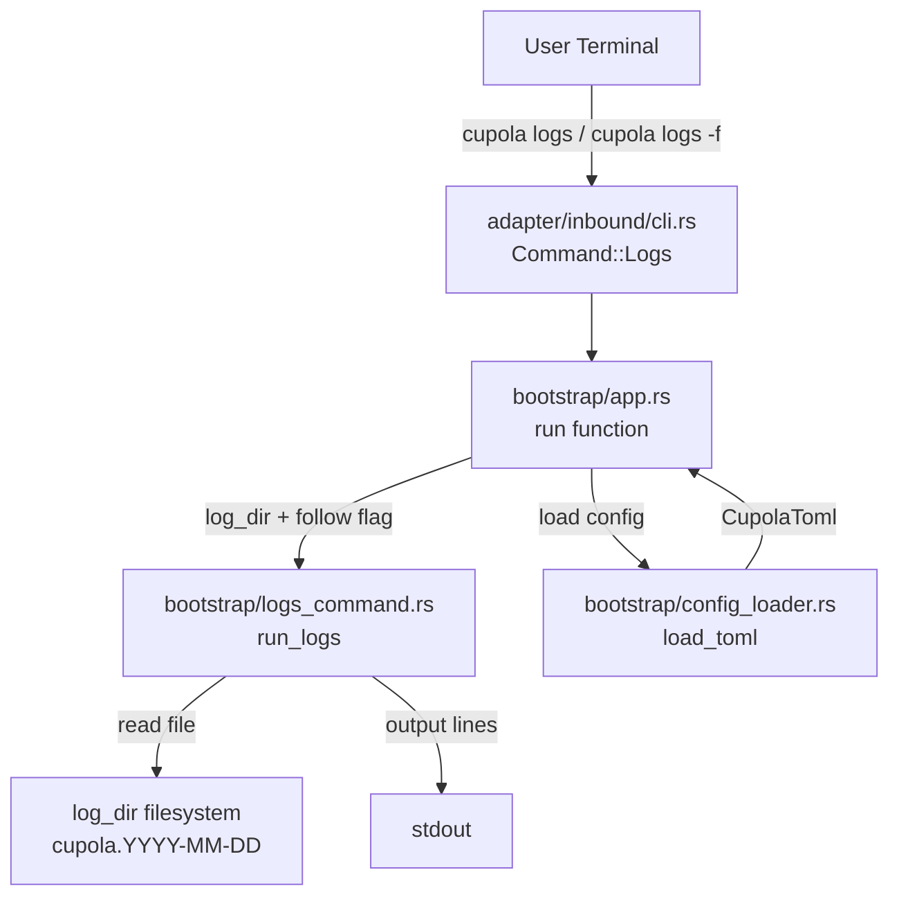
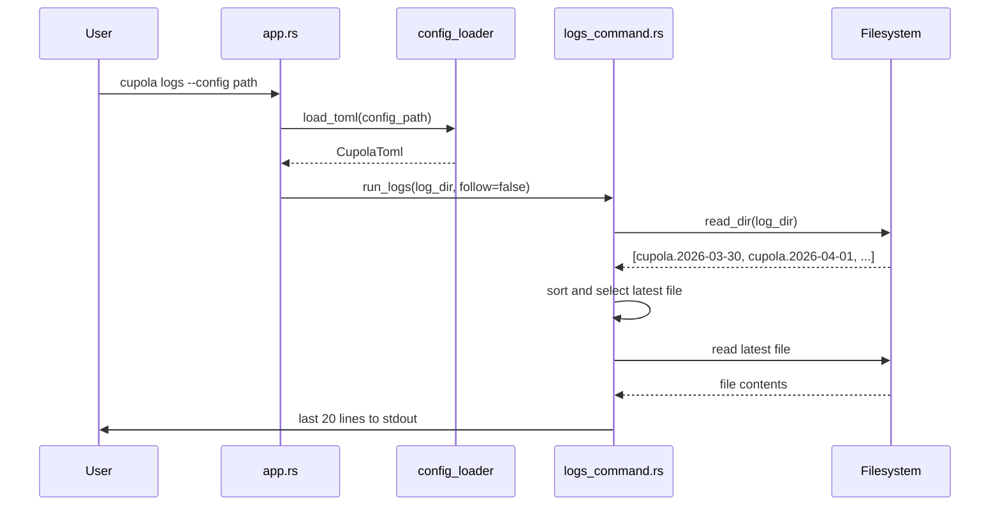
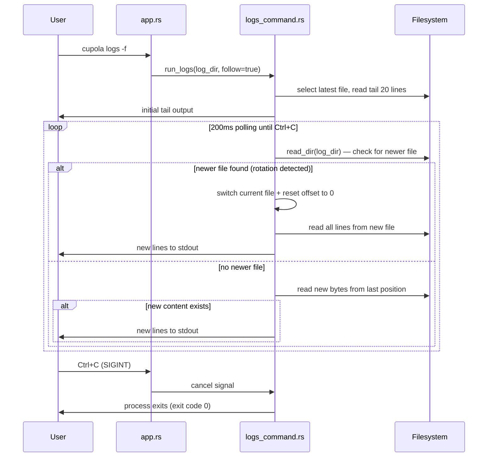

# Design Document: logs-command

## Overview

`cupola logs` コマンドを追加し、デーモン起動（`cupola start -d`）時のログファイル内容を CLI から簡単に確認できるようにする。`-f` オプション付きで `tail -f` 相当のリアルタイム追跡も提供する。

**Purpose**: デーモンモードで動作する cupola のログを確認するための専用コマンドを提供し、ログファイルを直接開く手間を排除する。

**Users**: cupola オペレーターがデーモンの動作確認・障害調査時に利用する。

**Impact**: 既存 `Command` enum に新バリアントを追加し、`app.rs` のルーティングを拡張する。ドメイン層・アプリケーション層への変更はない。

### Goals

- `cupola logs` コマンドで最新ログファイルの末尾20行を表示する
- `cupola logs -f` で `tail -f` 相当のリアルタイム追跡を提供する
- `cupola logs -f` の追跡中にログローテーションが発生した場合、新しいファイルへ自動的に切り替える
- `cupola.toml` の `log.dir` から自動的にログディレクトリを取得する
- 既存の CLI 設計パターン（`--config` デフォルト値）との一貫性を保つ

### Non-Goals

- ログのフィルタリング・検索機能
- 表示行数のカスタマイズ（`-n` オプション）
- ドメイン層・アプリケーション層の変更

---

## Architecture

### Existing Architecture Analysis

既存の CLI コマンドはすべて以下のパターンで実装されている：

1. `src/adapter/inbound/cli.rs` — `Command` enum にバリアント追加
2. `src/bootstrap/app.rs` — `match cli.command` に処理ブランチ追加
3. `src/bootstrap/` — コマンド固有のロジックを独立モジュールに配置（例: `config_loader.rs`, `logging.rs`）

`log_dir` は `Config` 構造体の `log_dir: Option<PathBuf>` として既に定義されており、`config_loader.rs` でロード済み。ログファイルは `tracing-appender::rolling::daily` により `{log_dir}/cupola.{YYYY-MM-DD}` の命名規則で生成される。

### Architecture Pattern & Boundary Map



**Architecture Integration**:
- Selected pattern: 既存の Extension パターン（adapter/inbound → bootstrap ルーティング）
- Domain/feature boundaries: bootstrap 層内で完結。ドメイン・アプリケーション層は不変
- Existing patterns preserved: `--config` フラグによる設定ファイルパス指定、`load_toml()` による設定読み込み
- New components rationale: `logs_command.rs` としてログ表示ロジックを `app.rs` から分離し単一責任を維持
- Steering compliance: Clean Architecture の依存方向（inbound → bootstrap）を遵守

### Technology Stack

| Layer | Choice / Version | Role in Feature | Notes |
|-------|-----------------|-----------------|-------|
| CLI | clap 4 (derive) | `Command::Logs` バリアント、`-f`/`--follow` フラグ | 既存依存 |
| Runtime | tokio 1 (full) | 非同期ファイル読み込み、`ctrl_c()` シグナル処理 | 既存依存 |
| FS | std::fs / tokio::fs | ファイル読み込み、ディレクトリ列挙 | 追加依存なし |
| Config | toml 0.8 + serde | `cupola.toml` から `log_dir` を読み取る | 既存パターン流用 |

---

## System Flows

### cupola logs（通常モード）



### cupola logs -f（追跡モード）



---

## Requirements Traceability

| Requirement | Summary | Components | Interfaces | Flows |
|-------------|---------|------------|------------|-------|
| 1.1 | 最新ログファイルの末尾20行表示 | LogsCommandRunner | `run_logs()` | 通常モードフロー |
| 1.2 | 複数ファイル時に最新を選択 | LogsCommandRunner | `find_latest_log_file()` | 通常モードフロー |
| 1.3 | ファイル内容を変換せず出力 | LogsCommandRunner | stdout 出力 | 通常モードフロー |
| 2.1 | `-f` でリアルタイム追跡 | LogsCommandRunner | `run_logs()` | 追跡モードフロー |
| 2.2 | 新規追記を即座に出力 | LogsCommandRunner | polling loop | 追跡モードフロー |
| 2.3 | Ctrl+C で安全終了 | LogsCommandRunner | `tokio::signal::ctrl_c()` | 追跡モードフロー |
| 2.4 | ローテーション検出と新ファイルへの切り替え | LogsCommandRunner | `find_newer_log_file()` | 追跡モードフロー |
| 3.1 | `log.dir` から設定読み取り | CLI Adapter, app.rs | `load_toml()` | 両フロー |
| 3.2 | `log.dir` 未設定時エラー | LogsCommandRunner | エラー処理 | エラーフロー |
| 3.3 | ディレクトリ不在時エラー | LogsCommandRunner | エラー処理 | エラーフロー |
| 3.4 | ファイル不在時エラー | LogsCommandRunner | エラー処理 | エラーフロー |
| 4.1 | `logs` サブコマンド登録 | CLI Adapter | `Command::Logs` | — |
| 4.2 | `-f`/`--follow` フラグ | CLI Adapter | clap フラグ定義 | — |
| 4.3 | `--help` 表示 | CLI Adapter | clap 自動生成 | — |

---

## Components and Interfaces

### コンポーネントサマリー

| Component | Domain/Layer | Intent | Req Coverage | Key Dependencies | Contracts |
|-----------|-------------|--------|--------------|-----------------|-----------|
| CLI Adapter（Logs バリアント） | adapter/inbound | `Command::Logs` 定義、フラグ解析 | 4.1, 4.2, 4.3 | clap (P0) | Service |
| LogsCommandRunner | bootstrap | ログファイル発見・表示・追跡・ローテーション切り替えロジック | 1.1–3.4, 2.4 | tokio::fs (P0), tokio::signal (P0) | Service |

---

### adapter/inbound

#### CLI Adapter（Logs バリアント）

| Field | Detail |
|-------|--------|
| Intent | `Command::Logs` バリアントを `Command` enum に追加し、フラグを解析する |
| Requirements | 4.1, 4.2, 4.3 |

**Responsibilities & Constraints**
- `logs` サブコマンドを clap に登録する
- `-f` / `--follow` フラグを `bool` で保持する
- `--config` オプションで設定ファイルパスを受け取る（デフォルト: `.cupola/cupola.toml`）
- 引数解析のみ担当し、ビジネスロジックを含まない

**Dependencies**
- External: clap 4 — 引数解析 (P0)

**Contracts**: Service [x]

##### Service Interface

```rust
// src/adapter/inbound/cli.rs に追加
#[derive(Subcommand, Debug)]
pub enum Command {
    // ... existing variants ...
    Logs {
        /// リアルタイムでログを追跡する (tail -f 相当)
        #[arg(short = 'f', long)]
        follow: bool,
        /// cupola.toml のパス
        #[arg(long, default_value = ".cupola/cupola.toml")]
        config: PathBuf,
    },
}
```

- Preconditions: なし（clap が引数バリデーションを行う）
- Postconditions: `Command::Logs { follow, config }` が構築される
- Invariants: なし

**Implementation Notes**
- Integration: `app.rs` の `match cli.command` に `Command::Logs { follow, config }` ブランチを追加する
- Validation: clap のデフォルト値機能を利用するため追加バリデーション不要
- Risks: `Command` enum に新バリアントを追加するため、`match` の網羅性チェックによりコンパイル時に漏れを検出できる

---

### bootstrap

#### LogsCommandRunner

| Field | Detail |
|-------|--------|
| Intent | ログファイルの発見・末尾表示・リアルタイム追跡を行う |
| Requirements | 1.1, 1.2, 1.3, 2.1, 2.2, 2.3, 2.4, 3.1, 3.2, 3.3, 3.4 |

**Responsibilities & Constraints**
- `log_dir` 内からプレフィックス `cupola.` を持つ最新ファイルを選択する
- 通常モード: ファイルの末尾20行を stdout に出力して終了する
- 追跡モード: 末尾20行を出力後、200ms 間隔で以下のポーリングを繰り返し、SIGINT で終了する
  1. `log_dir` を再列挙し、現在追跡中のファイルより新しい日付のファイルが存在するか確認する
  2. 新しいファイルがあれば → そのファイルに切り替え、offset をリセットして全行を出力する
  3. 新しいファイルがなければ → 現在のファイルの新規追記を読み込み出力する
- エラー時は標準エラー出力にメッセージを表示し、非ゼロの終了コードを返す
- 新規外部クレートを追加しない

**Dependencies**
- Inbound: `app.rs` — `log_dir: Option<PathBuf>` と `follow: bool` を受け取る (P0)
- External: `tokio::fs` — 非同期ファイル操作 (P0)
- External: `tokio::signal::ctrl_c` — SIGINT 捕捉 (P0)
- External: `tokio::time::sleep` — polling 間隔 (P1)

**Contracts**: Service [x]

##### Service Interface

```rust
// src/bootstrap/logs_command.rs

/// ログコマンドのエントリポイント
/// log_dir: cupola.toml の log.dir から取得した Optional パス
/// follow: -f フラグの有無
pub async fn run_logs(log_dir: Option<PathBuf>, follow: bool) -> Result<()>;

/// log_dir 内から最新のログファイルパスを返す
/// エラー: log_dir が None / 存在しない / ファイルがない場合
fn find_latest_log_file(log_dir: &Path) -> Result<PathBuf>;

/// ファイルの末尾 n 行を返す
fn read_tail_lines(path: &Path, n: usize) -> Result<Vec<String>>;

/// ファイルを offset バイト目から読み込み、新規行と次の offset を返す
async fn read_new_lines(path: &Path, offset: u64) -> Result<(Vec<String>, u64)>;

/// current_file より新しい日付のログファイルが log_dir に存在すれば、そのパスを返す
/// ローテーション検出に使用する（ポーリングごとに呼び出す）
fn find_newer_log_file(log_dir: &Path, current_file: &Path) -> Result<Option<PathBuf>>;
```

- Preconditions:
  - `find_latest_log_file`: `log_dir` が存在し、`cupola.` プレフィックスのファイルを含む
  - `read_tail_lines`: ファイルが読み取り可能
  - `read_new_lines`: ファイルが読み取り可能、`offset` ≤ ファイルサイズ
- Postconditions:
  - `run_logs(follow=false)`: 末尾20行を stdout に出力し、`Ok(())` で返る
  - `run_logs(follow=true)`: SIGINT 受信まで出力を継続し、ローテーション発生時は新ファイルへ切り替えた上で継続し、`Ok(())` で返る
  - `find_newer_log_file`: current_file より新しいファイルが存在すればそのパス、なければ `None` を返す
- Invariants: stdout 出力は改行で終端する

**Implementation Notes**

- Integration:
  - `app.rs` で `Command::Logs { follow, config }` を受け取り、`load_toml(config)` で設定をロードして `run_logs(toml.log.map(|l| l.dir), follow).await` を呼び出す
  - `src/bootstrap/mod.rs` に `pub mod logs_command;` を追加する
- Validation:
  - `log_dir` が `None`（`log.dir` 未設定）の場合: `"log.dir が cupola.toml に設定されていません"` を stderr に出力
  - ディレクトリ不在の場合: `"ログディレクトリが存在しません: {path}"` を stderr に出力
  - ファイル不在の場合: `"ログファイルが見つかりません: {dir}"` を stderr に出力
- Risks:
  - `-f` モードで大量ログが高速に書き込まれる場合の出力バッファリング → 出力ごとに `stdout` を明示的に flush する／非バッファリング出力を用いることで対応
  - ローテーション検出の遅延: 200ms ポーリングのため、最大 200ms の遅延が生じる → 許容範囲とする

---

## Data Models

### Domain Model

新規ドメインエンティティなし。`Config.log_dir: Option<PathBuf>` を既存ドメインモデルとして利用する。

### Logical Data Model

ログファイルの選択ロジック:

- `log_dir/` 内のエントリを列挙し、`cupola.` で始まるファイルのみを対象とする
- ファイル名の辞書順（ISO 8601 日付サフィックスのため = 日付順）で最後の要素を最新ファイルとして選択する

---

## Error Handling

### Error Strategy

エラーは `anyhow::Result` で伝播し、`app.rs` でハンドリングする。エラーメッセージは日本語で stderr に出力し、プロセスを非ゼロ終了コードで終了する。

### Error Categories and Responses

| エラーケース | 分類 | メッセージ | 終了コード |
|------------|------|-----------|-----------|
| `log.dir` 未設定 | 設定エラー | `log.dir が cupola.toml に設定されていません` | 1 |
| `log_dir` ディレクトリ不在 | 設定エラー | `ログディレクトリが存在しません: {path}` | 1 |
| ログファイルが存在しない | 操作エラー | `ログファイルが見つかりません: {dir}` | 1 |
| ファイル読み取り失敗 | システムエラー | `ログファイルの読み取りに失敗しました: {error}` | 1 |

### Monitoring

`tracing` の既存インフラを活用。`logs` コマンド実行時はログディレクトリを読み取るのみであり、追加のモニタリング設定は不要。

---

## Testing Strategy

### Unit Tests

`src/bootstrap/logs_command.rs` 内の `#[cfg(test)]` ブロックで以下をテストする:

1. `find_latest_log_file`: 複数ファイルが存在する場合に最新ファイルを正しく選択する
2. `find_latest_log_file`: `cupola.` プレフィックスを持たないファイルを除外する
3. `find_latest_log_file`: ファイルが存在しない場合にエラーを返す
4. `read_tail_lines`: 20行未満のファイルに対してすべての行を返す
5. `read_tail_lines`: 20行超のファイルに対して末尾20行のみを返す
6. `find_newer_log_file`: より新しい日付のファイルが存在する場合にそのパスを返す
7. `find_newer_log_file`: より新しいファイルが存在しない場合に `None` を返す
8. `find_newer_log_file`: `cupola.` プレフィックスを持たないファイルを除外する

### Integration Tests

`tests/` ディレクトリに以下を配置する:

1. 通常モード: 一時ディレクトリにダミーログファイルを作成し、`run_logs(follow=false)` が末尾20行を返すことを確認
2. エラーハンドリング: `log_dir=None` 時の適切なエラー返却を確認
3. エラーハンドリング: 空ディレクトリ時の適切なエラー返却を確認
4. ローテーション切り替え: `-f` 追跡中に新しい日付のファイルを作成した場合、新ファイルへ切り替えて読み込みを継続することを確認

> Note: `-f` モードの追跡動作は非同期かつシグナル依存のため、タイムアウト付きの統合テストで検証する（`tokio::time::timeout` + ファイル書き込みシミュレーション）
