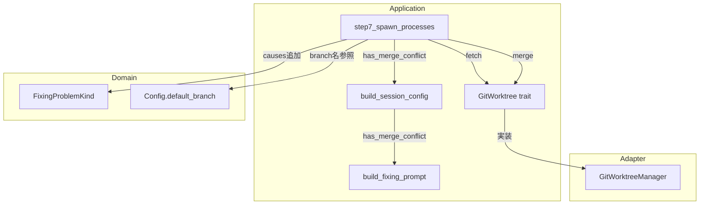
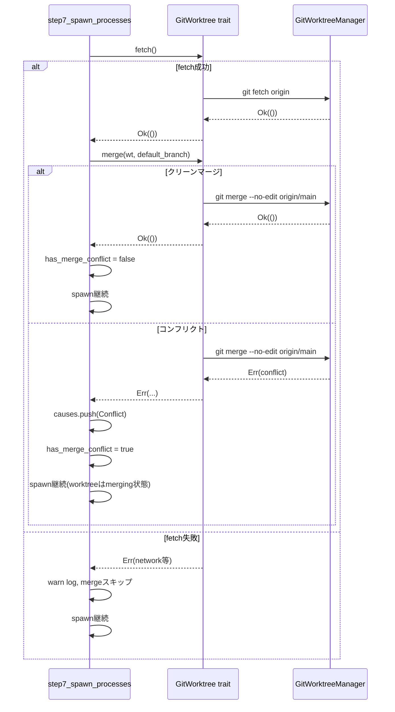

# Technical Design: merge-main-before-spawn

## Overview

**Purpose**: Fixing状態のIssueに対してagentをspawnする前に `origin/{default_branch}` をフェッチ・マージすることで、agentのworktreeとCI（merge commitテスト）のコードベースを一致させる。

**Users**: Cupolaの自動化パイプラインが対象。人間は介在しない。

**Impact**: 現在の `step7_spawn_processes` に fetch + merge ステップを追加し、`GitWorktree` トレイトと `build_fixing_prompt` の両インターフェースを拡張する。CIとagentのコード乖離による無限修正ループを解消する。

### Goals
- Fixing状態のspawn前にworktreeをCIと同一のmerge commit状態にする
- マージコンフリクト発生時にagentへ解消指示を提供する
- fetch/merge失敗時でもspawnをブロックしない（フォールバック動作の保証）

### Non-Goals
- DesignRunning / ImplementationRunning 状態へのmerge適用（Fixing状態のみ対象）
- `git merge --continue` の自動実行（agentに委ねる）
- fetch/merge結果のDBへの永続化

## Architecture

### Existing Architecture Analysis

現在の `step7_spawn_processes` のFixing状態処理フロー:

```
worktree_path 確認
→ index.lock クリーンアップ
→ prepare_inputs (inputs書き込み)
→ build_session_config (プロンプト生成)
→ spawn
```

`GitWorktree` トレイトはすでに `fetch()` メソッドを持つ。`merge()` メソッドの追加はトレイト拡張として自然に適合する。

### Architecture Pattern & Boundary Map



**Architecture Integration**:
- 選択パターン: Clean Architecture（既存踏襲）
- 境界: application層がportトレイトを通じてadapterに依存。mergeロジックはapplication層に集約
- 既存パターン踏襲: `fetch()` と同様に `merge(wt, branch)` をトレイトに追加
- steering準拠: 依存関係はdomain→application→adapterの内向きルールを維持

### Technology Stack

| Layer | Choice / Version | Role | Notes |
|-------|-----------------|------|-------|
| Backend | Rust (Edition 2024) | 実装言語 | 変更なし |
| Git操作 | std::process::Command | `git merge --no-edit` 実行 | 既存パターン踏襲 |

## System Flows

### spawn前のmergeフロー（Fixing状態）



**Key Decisions**: fetch失敗とmergeコンフリクトを別のErrとして扱うことで、それぞれの分岐処理を明確に分離している。

## Requirements Traceability

| Requirement | Summary | Components | Interfaces | Flows |
|-------------|---------|------------|------------|-------|
| 1.1 | Fixing spawn前にfetchを実行 | step7_spawn_processes | GitWorktree.fetch() | fetch成功パス |
| 1.2 | Fixing状態ハンドラ内で実行 | step7_spawn_processes | — | step7内のFixing分岐 |
| 1.3 | fetch失敗時はwarnして継続 | step7_spawn_processes | — | fetch失敗パス |
| 2.1 | クリーンマージ後にspawn | step7_spawn_processes | GitWorktree.merge() | クリーンマージパス |
| 2.2 | --no-editオプション付与 | GitWorktreeManager | merge()実装 | — |
| 2.3 | クリーンマージ時causes追加なし | step7_spawn_processes | — | — |
| 3.1 | コンフリクト時Conflict causes追加 | step7_spawn_processes | FixingProblemKind | コンフリクトパス |
| 3.2 | コンフリクト時worktreeはmerging状態でspawn | step7_spawn_processes | — | コンフリクトパス |
| 3.3 | プロンプト先頭にコンフリクト解消指示挿入 | build_fixing_prompt | has_merge_conflict flag | — |
| 3.4 | コンフリクト解消指示は英語 | build_fixing_prompt | — | — |
| 3.5 | 指示内容: マーカー確認/add/commit/修正作業 | build_fixing_prompt | — | — |
| 4.1 | コンフリクト以外の失敗時warn | step7_spawn_processes | — | merge失敗パス |
| 4.2 | コンフリクト以外の失敗時mergeスキップ | step7_spawn_processes | — | merge失敗パス |
| 4.3 | spawn全体をブロックしない | step7_spawn_processes | — | 全パス |
| 5.1 | GitWorktreeトレイトにmergeメソッド追加 | GitWorktree port | merge(wt, branch) | — |
| 5.2 | コンフリクト時Errを返す | GitWorktreeManager | merge()実装 | — |
| 5.3 | GitWorktreeManagerに実装追加 | GitWorktreeManager | — | — |
| 5.4 | 成功Ok/コンフリクトErr | GitWorktreeManager | merge()実装 | — |
| 6.1 | build_fixing_promptにフラグ追加 | build_fixing_prompt | has_merge_conflict: bool | — |
| 6.2 | フラグ真時はプロンプト先頭に挿入 | build_fixing_prompt | — | — |
| 6.3 | フラグ偽時は既存プロンプト変更なし | build_fixing_prompt | — | — |

## Components and Interfaces

### コンポーネントサマリー

| Component | Layer | Intent | Req Coverage | Key Dependencies |
|-----------|-------|--------|--------------|-----------------|
| GitWorktree (trait) | application/port | mergeメソッドの追加定義 | 5.1 | — |
| GitWorktreeManager | adapter/outbound | merge()の具体実装 | 5.2, 5.3, 5.4, 2.2 | std::process::Command |
| step7_spawn_processes | application | Fixing spawn前のfetch+merge制御 | 1.1, 1.2, 1.3, 2.1, 2.3, 3.1, 3.2, 4.1, 4.2, 4.3 | GitWorktree port |
| build_fixing_prompt | application | コンフリクト解消指示のプロンプト挿入 | 3.3, 3.4, 3.5, 6.1, 6.2, 6.3 | — |
| build_session_config | application | has_merge_conflictフラグの中継 | 6.1 | build_fixing_prompt |

---

### application/port

#### GitWorktree trait

| Field | Detail |
|-------|--------|
| Intent | Gitworktree操作の抽象インターフェース。mergeメソッドを新規追加する |
| Requirements | 5.1 |

**Responsibilities & Constraints**
- worktreeディレクトリ内でのマージ操作を抽象化
- コンフリクト時は `Err` を返し、成功時は `Ok(())` を返すシンプルなインターフェース
- テスト時はモック実装に差し替え可能

**Dependencies**
- Inbound: step7_spawn_processes — mergeの呼び出し元 (P0)

**Contracts**: Service [x]

##### Service Interface

```rust
pub trait GitWorktree: Send + Sync {
    // 既存メソッド（省略）
    fn fetch(&self) -> Result<()>;
    // 追加メソッド
    fn merge(&self, worktree_path: &Path, branch: &str) -> Result<()>;
}
```

- Preconditions: `worktree_path` が有効なgit worktreeであること。`branch` は `origin/{branch}` の形式でフェッチ済みであること
- Postconditions: 成功時はworktreeがマージ後の状態。コンフリクト時はworktreeがmerging状態で `Err` を返す
- Invariants: ネットワーク障害等のコンフリクト以外の失敗も `Err` として返す

---

### adapter/outbound

#### GitWorktreeManager

| Field | Detail |
|-------|--------|
| Intent | `GitWorktree.merge()` の具体実装。`git merge --no-edit origin/{branch}` を実行する |
| Requirements | 2.2, 5.2, 5.3, 5.4 |

**Responsibilities & Constraints**
- `run_git_in_dir(worktree_path, ["merge", "--no-edit", "origin/{branch}"])` で実装
- `run_git_in_dir` は非0終了時に `Err` を返すため、コンフリクト検出は自動的に処理される
- worktreeがmerging状態のままになることを許容する（agentが解消する）

**Dependencies**
- Inbound: GitWorktree trait — インターフェース定義 (P0)
- External: git CLI — コマンド実行 (P0)

**Contracts**: Service [x]

##### Service Interface

```rust
impl GitWorktree for GitWorktreeManager {
    fn merge(&self, worktree_path: &Path, branch: &str) -> Result<()> {
        let remote_branch = format!("origin/{branch}");
        self.run_git_in_dir(worktree_path, &["merge", "--no-edit", &remote_branch])
            .with_context(|| format!("failed to merge {remote_branch}"))
    }
}
```

**Implementation Notes**
- Integration: `run_git_in_dir` は既存ヘルパーをそのまま使用。追加の実装は不要
- Validation: `git merge` の終了コードがすべての判別を担う
- Risks: worktreeが既にmerging状態の場合、`git merge` は即座に失敗する。agentが `git merge --abort` または `git commit --no-edit` で解消する必要がある

---

### application

#### step7_spawn_processes（Fixing状態への追加処理）

| Field | Detail |
|-------|--------|
| Intent | Fixing状態のissueに対してspawn前にfetch+mergeを実行し、結果に応じてcausesとpromptフラグを設定する |
| Requirements | 1.1, 1.2, 1.3, 2.1, 2.3, 3.1, 3.2, 4.1, 4.2, 4.3 |

**Responsibilities & Constraints**
- worktree_path確認後、index.lockクリーンアップ前にfetch+mergeを挿入する
- Fixing状態（DesignFixing / ImplementationFixing）のみに適用
- fetch失敗: warn log → merge スキップ → spawn継続（`has_merge_conflict = false`）
- merge成功: spawn継続（`has_merge_conflict = false`）
- merge失敗（コンフリクト）: causes に `FixingProblemKind::Conflict` 追加 → spawn継続（`has_merge_conflict = true`）

**Dependencies**
- Inbound: polling loop — step7の呼び出し元 (P0)
- Outbound: GitWorktree.fetch() / GitWorktree.merge() — git操作 (P0)
- Outbound: build_session_config — プロンプト生成 (P0)

**Contracts**: State [x]

##### State Management

処理フロー（Fixing状態のissueに対して）:
```
let is_fixing = matches!(issue.state, State::DesignFixing | State::ImplementationFixing);
let mut has_merge_conflict = false;

if is_fixing {
    match self.git.fetch() {
        Err(e) => { tracing::warn!(...); /* mergeスキップ */ }
        Ok(()) => {
            match self.git.merge(wt, &self.config.default_branch) {
                Ok(()) => { /* クリーンマージ */ }
                Err(_) => {
                    has_merge_conflict = true;
                    // causesにConflictが未追加の場合に追加
                    // IssueRepositoryへの更新は行わない（ローカル状態のみ）
                }
            }
        }
    }
}
// has_merge_conflictをbuild_session_configに渡す
```

**Implementation Notes**
- Integration: `causes` はissueの `fixing_causes` フィールドから取得。コンフリクト追加はDB更新せずローカルのVecへの追加で済む（プロンプト生成にのみ使用）
- Validation: Fixing状態の判定は `matches!` マクロで行う
- Risks: merging状態のworktreeが次のポーリングサイクルでも再度mergeを試みるが、`git merge --no-edit` が即座にErrを返すため問題はない

---

#### build_fixing_prompt（シグネチャ拡張）

| Field | Detail |
|-------|--------|
| Intent | `has_merge_conflict: bool` フラグを受け取り、真の場合はプロンプト先頭にマージコンフリクト解消指示を挿入する |
| Requirements | 3.3, 3.4, 3.5, 6.1, 6.2, 6.3 |

**Responsibilities & Constraints**
- フラグが真の場合のみプロンプト先頭にセクションを追加（既存指示より前）
- 指示内容は英語で記述
- フラグが偽の場合は既存の動作を変更しない

**Dependencies**
- Inbound: build_session_config — 呼び出し元 (P0)

**Contracts**: Service [x]

##### Service Interface

```rust
fn build_fixing_prompt(
    issue_number: u64,
    pr_number: u64,
    language: &str,
    causes: &[FixingProblemKind],
    has_merge_conflict: bool,
) -> String
```

挿入するコンフリクト解消セクション（`has_merge_conflict == true` の場合のみ）:
```
## Merge Conflict Resolution Required

The working tree is in the middle of a merge with origin/{default_branch}.
Conflict markers (<<<<<<<, =======, >>>>>>>) remain in the files.

1. Resolve all conflicts first
2. Stage resolved files with `git add <resolved_files>`
3. Complete the merge with `git commit --no-edit`
4. Then proceed with the other fixes
```

**Implementation Notes**
- Integration: `build_session_config` にも `has_merge_conflict: bool` の引数を追加し、`build_fixing_prompt` に転送する
- Validation: フラグはboolean。`causes` の `Conflict` バリアントとは独立して管理する
- Risks: シグネチャ変更により `build_session_config` のすべての呼び出し元を更新する必要がある（現在は `step7_spawn_processes` のみ）

## Data Models

### Domain Model

変更なし。`FixingProblemKind::Conflict` は既存のバリアント。

新規追加はない。`has_merge_conflict` はアプリケーション層のローカル変数であり、永続化しない。

## Error Handling

### Error Strategy

Graceful Degradation を採用。fetch/merge の失敗はspawnのブロック要因としない。

### Error Categories and Responses

| エラー種別 | 発生箇所 | 対応 |
|-----------|---------|------|
| fetch失敗（ネットワーク等） | GitWorktreeManager.fetch() | warnログ、mergeスキップ、spawn継続 |
| mergeコンフリクト | GitWorktreeManager.merge() | causes追加、has_merge_conflict=true、spawn継続 |
| merge失敗（コンフリクト以外） | GitWorktreeManager.merge() | warnログ、spawn継続 |

### Monitoring

既存の `tracing::warn!` マクロで対応。以下のフィールドを含める:
- `issue_id`
- `error` （エラー内容）
- ログメッセージで発生箇所を明示

## Testing Strategy

### Unit Tests

- `GitWorktreeManager.merge()` - クリーンマージ成功のテスト（tempdir + bare originリポジトリ使用）
- `GitWorktreeManager.merge()` - コンフリクト発生時に `Err` を返すテスト
- `build_fixing_prompt` - `has_merge_conflict=true` 時にプロンプト先頭にコンフリクト解消セクションが含まれること
- `build_fixing_prompt` - `has_merge_conflict=false` 時は既存プロンプトと同一であること
- `step7_spawn_processes` - Fixing状態でfetch+mergeが呼ばれることをモックで検証
- `step7_spawn_processes` - fetch失敗時にspawnが継続されること（`MockGitWorktree` で `fetch()` を失敗させる）
- `step7_spawn_processes` - mergeコンフリクト時に `has_merge_conflict=true` でspawnが呼ばれること

### Integration Tests

- `tests/integration_test.rs` - Fixing状態のissueに対してフルフローでmergeが呼ばれることを検証（MockGitWorktree使用）
