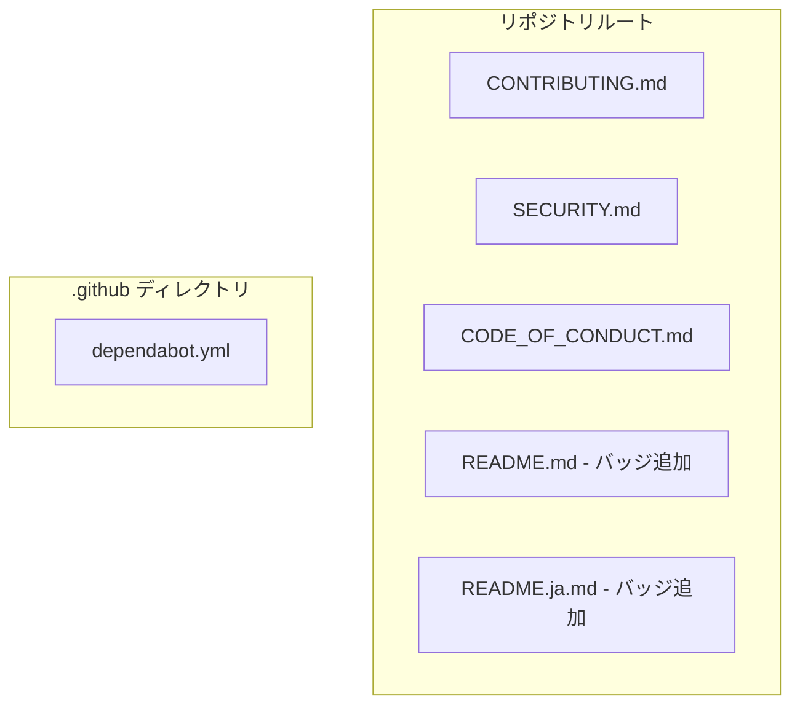

# 設計書: OSS コミュニティ標準ファイル追加

## Overview

cupolaリポジトリをOSSとして健全に公開・運営するため、コミュニティ参加に必要な標準ファイル群を整備する。
本機能は静的ファイルの追加が主体であり、コードロジックの変更は含まない。

**Purpose**: 国際コントリビューターが参加しやすい環境を整備し、脆弱性報告の明確な窓口を設け、依存関係更新を自動化する。  
**Users**: 外部コントリビューター・セキュリティ研究者・メンテナーが対象。  
**Impact**: リポジトリルートおよび `.github/` ディレクトリへの静的ファイル追加と、既存READMEの先頭へのバッジ挿入。

### Goals

- CONTRIBUTING.md・SECURITY.md・CODE_OF_CONDUCT.md を整備し、OSS参加・報告のプロセスを明確化する
- READMEにCIおよびLicenseバッジを追加し、プロジェクト健全性を一目で把握できるようにする
- dependabot.yml により依存クレートとGitHub Actionsの更新を自動化する

### Non-Goals

- crates.io / docs.rs バッジの追加（公開後に別Issueで対応）
- CODE_OF_CONDUCT の日本語訳（英語版公式テキストで統一）
- 既存コードのリファクタリング

## Architecture

### Architecture Pattern & Boundary Map

本機能はコードロジックを持たない **Simple Addition** であり、複雑なアーキテクチャパターンは不要。
追加対象ファイルとその配置を下図に示す。



- **既存パターンの尊重**: ルートディレクトリのREADMEを変更するため、既存のドキュメント構造を維持
- **最小変更原則**: 新規ファイル追加と既存READMEへの1行追加のみ

### Technology Stack

| Layer | Choice / Version | Role | Notes |
|-------|-----------------|------|-------|
| ドキュメント | Markdown | CONTRIBUTING / SECURITY / CODE_OF_CONDUCT | GitHub標準レンダリング対応 |
| CI連携 | GitHub Actions badge | CIステータス表示 | `ci.yml` ワークフロー参照 |
| 依存管理 | dependabot v2 | 自動更新 | groups機能でPR数を削減 |

## Requirements Traceability

| Requirement | Summary | 対象ファイル | 備考 |
|-------------|---------|-------------|------|
| 1.1〜1.6 | CONTRIBUTING.md 作成 | `CONTRIBUTING.md` | 英語・ルートディレクトリ |
| 2.1〜2.5 | SECURITY.md 作成 | `SECURITY.md` | 英語・ルートディレクトリ |
| 3.1〜3.4 | CODE_OF_CONDUCT.md 作成 | `CODE_OF_CONDUCT.md` | Contributor Covenant v2.1 |
| 4.1〜4.4 | READMEバッジ追加 | `README.md`, `README.ja.md` | ファイル先頭に挿入 |
| 5.1〜5.9 | dependabot.yml 作成 | `.github/dependabot.yml` | Cargo + GitHub Actions |

## Components and Interfaces

| Component | 対象ファイル | Intent | Req Coverage |
|-----------|-------------|--------|-------------|
| ContributingGuide | `CONTRIBUTING.md` | 開発参加ガイド（英語） | 1.1〜1.6 |
| SecurityPolicy | `SECURITY.md` | 脆弱性報告ポリシー（英語） | 2.1〜2.5 |
| CodeOfConduct | `CODE_OF_CONDUCT.md` | 行動規範 | 3.1〜3.4 |
| ReadmeBadges | `README.md`, `README.ja.md` | CIおよびライセンスバッジ | 4.1〜4.4 |
| DependabotConfig | `.github/dependabot.yml` | 依存関係自動更新設定 | 5.1〜5.9 |

### ドキュメントファイル層

#### ContributingGuide

| Field | Detail |
|-------|--------|
| Intent | 外部コントリビューターへの開発参加手順を英語で提供する |
| Requirements | 1.1, 1.2, 1.3, 1.4, 1.5, 1.6 |

**Responsibilities & Constraints**

- 英語で記述（国際コントリビューター向け）
- セクション順序: Welcome → 前提条件 → セットアップ → コントリビューション方法 → PRプロセス → コーディング規約
- プロジェクトの実態（devbox・Rust・gh CLI）と整合していること

**コンテンツ仕様**

| セクション | 必須内容 |
|-----------|---------|
| Welcome | プロジェクト概要と参加歓迎メッセージ |
| Prerequisites | Rust stable、devbox、gh CLI |
| Setup | `devbox shell`、`cargo build`、`cargo test` |
| Contributing | バグ報告・機能提案・PRの方法 |
| PR Process | ブランチ命名規則（例: `feature/xxx`）、conventional commits、CIチェック必須 |
| Coding Standards | `cargo fmt -- --check`、`cargo clippy --all-targets`、テスト要件（`#[cfg(test)]`）|

**Contracts**: なし（静的ドキュメント）

**Implementation Notes**
- Integration: GitHub の Community Profile（Insights > Community）でファイル認識される
- Validation: PR前に `cargo fmt -- --check` と `cargo clippy --all-targets` の実行を必須と明記
- Risks: devboxのバージョンや設定が変わった場合の手順陳腐化リスク → 実装後も定期的に見直す

---

#### SecurityPolicy

| Field | Detail |
|-------|--------|
| Intent | セキュリティ脆弱性の報告窓口と対応ポリシーを英語で明示する |
| Requirements | 2.1, 2.2, 2.3, 2.4, 2.5 |

**Responsibilities & Constraints**

- 英語で記述（セキュリティ報告の国際標準慣行）
- 公開Issueでの脆弱性報告を明示的に禁止する
- GitHub Private Vulnerability Reporting のURLを唯一の窓口として記載

**コンテンツ仕様**

| セクション | 必須内容 |
|-----------|---------|
| Reporting | GitHub Private Vulnerability Reporting URL: `https://github.com/kyuki3rain/cupola/security/advisories/new` |
| Do NOT | 公開Issueでの報告禁止を明記 |
| Timeline | 確認: 48時間以内、修正: 90日以内 |
| Supported Versions | 最新リリースのみサポート対象 |

**Contracts**: なし（静的ドキュメント）

**Implementation Notes**
- Integration: GitHub Security タブから参照される
- Risks: 対応タイムラインが守れない場合のレピュテーションリスク → 現実的な期間として90日を設定済み

---

#### CodeOfConduct

| Field | Detail |
|-------|--------|
| Intent | Contributor Covenant v2.1 に基づく行動規範を提供する |
| Requirements | 3.1, 3.2, 3.3, 3.4 |

**Responsibilities & Constraints**

- Contributor Covenant v2.1 公式テキストをそのまま使用（改変禁止）
- enforcement contact（メールアドレス等）を適切に設定すること
- 公式テキストのプレースホルダー `[INSERT CONTACT METHOD]` を実際の連絡先に置換する

**コンテンツ仕様**

- ベーステキスト: [Contributor Covenant v2.1 英語版](https://www.contributor-covenant.org/version/2/1/code_of_conduct/)
- カスタマイズ箇所: enforcement contact のみ（プレースホルダー置換）

**Contracts**: なし（静的ドキュメント）

**Implementation Notes**
- Integration: GitHub Community Profile でCODE_OF_CONDUCTとして自動認識される
- Validation: `[INSERT CONTACT METHOD]` プレースホルダーが残っていないことを確認する
- Risks: 連絡先が無効・未確認の場合 → 実装時に有効な連絡先を設定すること

---

#### ReadmeBadges

| Field | Detail |
|-------|--------|
| Intent | CIステータスとライセンス情報をREADME先頭に表示する |
| Requirements | 4.1, 4.2, 4.3, 4.4 |

**Responsibilities & Constraints**

- `README.md`（英語版）と `README.ja.md`（日本語版）の両方に同一バッジを追加
- バッジはファイル先頭（タイトル `# Cupola` の直下）に挿入
- crates.io / docs.rs バッジは追加しない（要件4.4）

**バッジ仕様**

```markdown
[](https://github.com/kyuki3rain/cupola/actions/workflows/ci.yml)
[](https://github.com/kyuki3rain/cupola/blob/main/LICENSE)
```

**Contracts**: なし（静的コンテンツ追加）

**Implementation Notes**
- Integration: GitHubのREADMEレンダリングでバッジとして表示される
- Risks: `ci.yml` ワークフロー名が変更された場合にバッジURLが無効化される → ワークフロー名を変更しない旨をCONTRIBUTING.mdに記載することを検討

---

#### DependabotConfig

| Field | Detail |
|-------|--------|
| Intent | CargoおよびGitHub Actionsの依存関係を毎週自動更新する |
| Requirements | 5.1, 5.2, 5.3, 5.4, 5.5, 5.6, 5.7, 5.8, 5.9 |

**Responsibilities & Constraints**

- `.github/dependabot.yml` に配置
- `cargo` と `github-actions` の2エコシステムを設定
- `groups` 機能でminor/patchをまとめてPR乱立を防ぐ

**設定仕様**

```yaml
version: 2
updates:
  # Cargo エコシステム
  - package-ecosystem: "cargo"
    directory: "/"
    schedule:
      interval: "weekly"
      day: "monday"
    commit-message:
      prefix: "chore(deps)"
    labels:
      - "dependencies"
    groups:
      rust-dependencies:
        patterns:
          - "*"
        update-types:
          - "minor"
          - "patch"

  # GitHub Actions エコシステム
  - package-ecosystem: "github-actions"
    directory: "/"
    schedule:
      interval: "weekly"
      day: "monday"
    commit-message:
      prefix: "ci(deps)"
    labels:
      - "ci"
      - "dependencies"
    groups:
      github-actions:
        patterns:
          - "*"
```

**Contracts**: なし（CI/CD設定ファイル）

**Implementation Notes**
- Integration: GitHubが自動で読み取り、毎週月曜日にPRを作成する
- Validation: `labels` に指定した `dependencies` / `ci` ラベルがリポジトリに存在することを確認する
- Risks: `groups` はGitHub Enterprise Serverで利用できない場合がある → cupolaはgithub.comを使用するため問題なし

## Error Handling

### Error Strategy

本機能は静的ファイルの追加のみであり、ランタイムエラーは発生しない。
設定ファイル（dependabot.yml）の構文エラーは、GitHubのバリデーションにより検出される。

### Error Categories and Responses

- **dependabot.yml 構文エラー**: GitHubが設定読み込み時にエラーを表示 → YAML構文を確認して修正
- **バッジURL無効**: バッジが「unknown」状態で表示される → `ci.yml` ワークフロー名・リポジトリパスを確認

## Testing Strategy

### 手動検証

本機能は静的ファイルのみのため、自動テストは不要。以下の手動確認を実施する。

1. **GitHub Community Profile の確認**: `https://github.com/kyuki3rain/cupola/community` でCONTRIBUTING・SECURITY・CODE_OF_CONDUCTが認識されていること
2. **CIバッジの表示確認**: README.md・README.ja.md のバッジが正常に表示されること（CIが実行済みであること）
3. **dependabot の動作確認**: マージ後に次の月曜日のスキャンでPRが作成されること
4. **CODE_OF_CONDUCT のプレースホルダー確認**: `[INSERT CONTACT METHOD]` が残っていないこと

## Security Considerations

- SECURITY.md のPrivate Vulnerability Reporting URLは正確であること（`https://github.com/kyuki3rain/cupola/security/advisories/new`）
- CODE_OF_CONDUCT の enforcement contact には有効な連絡先を設定すること
- dependabot の自動更新PRはCIが通ったことを確認してからマージすること（自動マージは設定しない）
