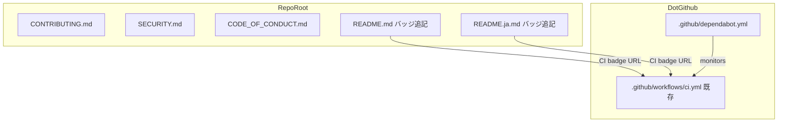

# 設計書: oss-community-files

## Overview

本フィーチャーは、cupola リポジトリに OSS コミュニティ標準ファイル一式を追加する。外部コントリビュータが貢献しやすい環境を整え、セキュリティ脆弱性の安全な報告経路を確立し、CI ステータスとライセンスをバッジで一目確認できるようにする。

**Purpose**: 外部コントリビュータ・セキュリティ研究者・リポジトリ訪問者に対して、参加方法・行動規範・セキュリティポリシー・プロジェクト品質状態を一箇所で提供する。

**Users**: 外部コントリビュータ、セキュリティ研究者、リポジトリ訪問者、プロジェクトメンテナー。

**Impact**: 既存の Rust ソースコードに変更なし。リポジトリルートおよび `.github/` ディレクトリへのファイル追加と、README 冒頭へのバッジ追記のみ。

### Goals
- CONTRIBUTING.md・SECURITY.md・CODE_OF_CONDUCT.md を英語で作成し、OSS 参加障壁を下げる
- `.github/dependabot.yml` で依存関係の自動更新と PR 乱立防止を実現する
- README.md・README.ja.md にバッジを追加し、CI ステータスとライセンスを一目で把握できるようにする

### Non-Goals
- crates.io / docs.rs バッジの追加（crates.io 公開後に別途対応）
- CONTRIBUTING.md の日本語訳（国際標準慣行に従い英語のみ）
- セキュリティポリシー以外の自動化・ボット設定
- Rust ソースコードの変更

## Architecture

### Existing Architecture Analysis

本フィーチャーはリポジトリのドキュメント層への追加であり、Rust アプリケーション（Clean Architecture の 4 層）には一切影響しない。

既存の関連ファイル・ディレクトリ:
- `.github/workflows/ci.yml` — CI バッジ URL に使用
- `.github/workflows/release.yml` — 既存リリースワークフロー
- `.github/ISSUE_TEMPLATE/` — 既存 Issue テンプレート
- `README.md` / `README.ja.md` — バッジ追記対象
- `LICENSE` (Apache-2.0) — SECURITY.md・CODE_OF_CONDUCT.md・バッジで参照

### Architecture Pattern & Boundary Map



**Architecture Integration**:
- 選択パターン: 静的ファイル追加（アプリケーション層への変更なし）
- ドメイン境界: リポジトリドキュメント層のみ。Rust コードの境界に変更なし
- 既存パターン保持: `.github/` 配下の既存構造（ISSUE_TEMPLATE, workflows）を踏襲
- 新規コンポーネント: 5 つの静的ファイル追加（CONTRIBUTING.md, SECURITY.md, CODE_OF_CONDUCT.md, バッジ追記×2, dependabot.yml）
- Steering 準拠: Rust / devbox / cargo / GitHub Actions の実態と整合した内容を記述

### Technology Stack

| Layer | Choice / Version | Role in Feature | Notes |
|-------|------------------|-----------------|-------|
| ドキュメント | Markdown | CONTRIBUTING.md, SECURITY.md, CODE_OF_CONDUCT.md の記述形式 | GitHub レンダリング対応 |
| CI | GitHub Actions (ci.yml) | CI バッジの参照先 | 既存ワークフロー |
| 依存管理 | GitHub Dependabot v2 | Cargo / GitHub Actions の自動更新 | `groups` 機能でバンドル |
| バッジ | shields.io / GitHub Actions badge | CI ステータス・ライセンスの視覚化 | 外部サービス依存なし（GitHub Actionsバッジ）|

## Requirements Traceability

| Requirement | Summary | Components | Interfaces | Flows |
|-------------|---------|------------|------------|-------|
| 1.1〜1.7 | CONTRIBUTING.md の作成と内容要件 | CONTRIBUTING.md | — | — |
| 2.1〜2.6 | SECURITY.md の作成と内容要件 | SECURITY.md | — | — |
| 3.1〜3.4 | CODE_OF_CONDUCT.md の作成と内容要件 | CODE_OF_CONDUCT.md | — | — |
| 4.1〜4.4 | README バッジの追加 | README.md, README.ja.md | — | — |
| 5.1〜5.8 | dependabot.yml の作成と設定要件 | .github/dependabot.yml | — | — |
| 6.1〜6.4 | ファイル内容のプロジェクト整合性 | 全ファイル | — | — |

## Components and Interfaces

| Component | Domain/Layer | Intent | Req Coverage | Key Dependencies | Contracts |
|-----------|--------------|--------|--------------|-----------------|-----------|
| CONTRIBUTING.md | ドキュメント | コントリビューション手順・開発環境・規約の英語ガイド | 1.1–1.7, 6.1, 6.2 | なし | — |
| SECURITY.md | ドキュメント | 脆弱性報告ポリシーの英語ガイド | 2.1–2.6, 6.3 | GitHub Private Vulnerability Reporting | — |
| CODE_OF_CONDUCT.md | ドキュメント | Contributor Covenant v2.1 の行動規範 | 3.1–3.4 | なし | — |
| README.md（バッジ追記） | ドキュメント | CI・ライセンスバッジをタイトル直下に追加 | 4.1, 4.2, 4.4 | GitHub Actions ci.yml, shields.io | — |
| README.ja.md（バッジ追記） | ドキュメント | README.md と同等バッジを追加 | 4.3, 4.4 | GitHub Actions ci.yml, shields.io | — |
| .github/dependabot.yml | CI/依存管理 | Cargo・GitHub Actions の weekly 自動更新設定 | 5.1–5.8, 6.4 | GitHub Dependabot | — |

### ドキュメント層

#### CONTRIBUTING.md

| Field | Detail |
|-------|--------|
| Intent | 外部コントリビュータ向けの貢献ガイド（英語） |
| Requirements | 1.1, 1.2, 1.3, 1.4, 1.5, 1.6, 1.7, 6.1, 6.2 |

**Responsibilities & Constraints**
- リポジトリルート（`/CONTRIBUTING.md`）に配置し、英語で記述する
- 以下のセクションを含む（順序は推奨順）:
  1. Welcome / Project Overview
  2. Prerequisites（Rust stable, devbox, gh CLI）
  3. Development Environment Setup（`devbox shell` → `cargo build` → `cargo test`）
  4. How to Contribute（バグ報告: Issue 作成, 機能提案: Issue + ラベル, PR）
  5. PR Process（ブランチ命名: `feat/`, `fix/`, `docs/` 等, conventional commits, CI チェック必須）
  6. Coding Standards（`cargo fmt`, `cargo clippy --all-targets`, テストカバレッジ）
- `devbox shell` を最初のセットアップステップとして明示する
- `cargo clippy --all-targets` および `cargo fmt` をコーディング規約として明記する
- GitHub Actions CI チェックが全通過することを PR マージ条件とする

**Dependencies**
- External: GitHub Actions CI — PR マージ条件の記述で参照（P1）

**Contracts**: なし（静的ドキュメント）

**Implementation Notes**
- Integration: ripgrep/bat/tokio の CONTRIBUTING.md を参考に構成する
- Validation: `devbox shell`, `cargo build`, `cargo test` が正常動作することを実装者が確認する
- Risks: devbox セットアップ手順が将来変更された場合の陳腐化リスク → セクション冒頭に最低限の前提コマンドのみ記述し、詳細は `devbox.json` に委ねる

---

#### SECURITY.md

| Field | Detail |
|-------|--------|
| Intent | セキュリティ脆弱性の報告ポリシー（英語） |
| Requirements | 2.1, 2.2, 2.3, 2.4, 2.5, 2.6, 6.3 |

**Responsibilities & Constraints**
- リポジトリルート（`/SECURITY.md`）に配置し、英語で記述する
- GitHub Private Vulnerability Reporting（`https://github.com/kyuki3rain/cupola/security/advisories/new`）を主要報告手段として明示する
- 公開 Issue での脆弱性報告を明示的に禁止する
- 対応タイムライン: 確認 48 時間以内、修正 90 日以内
- サポート対象バージョン: 最新リリースのみ
- 報告者クレジットポリシー（開示同意を得た場合）を含む

**Dependencies**
- External: GitHub Private Vulnerability Reporting — 報告受付窓口（P0）

**Contracts**: なし（静的ドキュメント）

**Implementation Notes**
- Integration: GitHub の Security タブで自動認識されるため、`SECURITY.md` というファイル名を変えてはならない
- Validation: リンク先 `https://github.com/kyuki3rain/cupola/security/advisories/new` が有効であることを確認する
- Risks: Private Vulnerability Reporting が無効化されている場合 → GitHub リポジトリ設定で有効化されていることを前提とする

---

#### CODE_OF_CONDUCT.md

| Field | Detail |
|-------|--------|
| Intent | Contributor Covenant v2.1 の行動規範 |
| Requirements | 3.1, 3.2, 3.3, 3.4 |

**Responsibilities & Constraints**
- リポジトリルート（`/CODE_OF_CONDUCT.md`）に配置する
- Contributor Covenant v2.1 の公式英語テキストをそのまま使用する
- 連絡先プレースホルダー `[INSERT CONTACT METHOD]` を GitHub Issues URL（`https://github.com/kyuki3rain/cupola/issues`）に置換する

**Dependencies**
- External: Contributor Covenant v2.1 公式テキスト（P0）

**Contracts**: なし（静的ドキュメント）

**Implementation Notes**
- Integration: GitHub の Community タブで自動認識されるため、`CODE_OF_CONDUCT.md` というファイル名を変えてはならない
- Validation: 公式テキストから逸脱していないことを確認する
- Risks: 日本語訳の必要性は将来の検討事項として明記し、現フェーズでは英語のみとする

---

#### README.md / README.ja.md（バッジ追記）

| Field | Detail |
|-------|--------|
| Intent | CI ステータスと Apache-2.0 ライセンスを視覚的に表示 |
| Requirements | 4.1, 4.2, 4.3, 4.4 |

**Responsibilities & Constraints**
- 両ファイルともタイトル行（`# Cupola`）の直後にバッジ行を追記する
- 追加するバッジ（2 個）:
  ```markdown
  [](https://github.com/kyuki3rain/cupola/actions/workflows/ci.yml)
  [](https://github.com/kyuki3rain/cupola/blob/main/LICENSE)
  ```
- crates.io / docs.rs バッジは crates.io 公開前は追加しない（4.4）

**Dependencies**
- External: GitHub Actions ci.yml — CI バッジの参照先（P0）
- External: shields.io — License バッジの生成（P1）

**Contracts**: なし（静的ドキュメント）

**Implementation Notes**
- Integration: `# Cupola` 行の直後、既存の `[日本語](./README.ja.md)` 行の前にバッジ行を挿入する
- Validation: GitHub でレンダリング後にバッジが正常表示されることを確認する
- Risks: ci.yml のファイル名が変更された場合にバッジが壊れる → ファイル名は固定であるため現フェーズではリスク低

---

### CI/依存管理層

#### .github/dependabot.yml

| Field | Detail |
|-------|--------|
| Intent | Cargo と GitHub Actions の依存関係を weekly で自動更新し、PR をグループ化してノイズを削減 |
| Requirements | 5.1, 5.2, 5.3, 5.4, 5.5, 5.6, 5.7, 5.8, 6.4 |

**Responsibilities & Constraints**
- `.github/dependabot.yml` に配置する
- `version: 2` を指定する
- `cargo` エコシステム: ルートディレクトリ対象、weekly（月曜日）、commit-prefix `chore(deps)`、ラベル `dependencies`
- `github-actions` エコシステム: weekly（月曜日）、commit-prefix `ci(deps)`、ラベル `ci` + `dependencies`
- Cargo の minor・patch 更新を `rust-dependencies` グループとして1 PR にバンドル
- GitHub Actions の更新を `github-actions` グループとして1 PR にバンドル

**Dependencies**
- External: GitHub Dependabot — 自動更新の実行基盤（P0）

**Contracts**: なし（静的設定ファイル）

**Configuration Contract**:
```yaml
version: 2
updates:
  - package-ecosystem: "cargo"
    directory: "/"
    schedule:
      interval: "weekly"
      day: "monday"
    commit-message:
      prefix: "chore(deps)"
    labels:
      - "dependencies"
    groups:
      rust-dependencies:
        patterns:
          - "*"
        update-types:
          - "minor"
          - "patch"
  - package-ecosystem: "github-actions"
    directory: "/"
    schedule:
      interval: "weekly"
      day: "monday"
    commit-message:
      prefix: "ci(deps)"
    labels:
      - "ci"
      - "dependencies"
    groups:
      github-actions:
        patterns:
          - "*"
```

**Implementation Notes**
- Integration: GitHub の Dependabot 設定は `.github/dependabot.yml` に配置することで自動認識される
- Validation: `version: 2` と dependabot.yml の YAML 構文が正しいことを確認する。`labels` に指定するラベル（`dependencies`, `ci`）がリポジトリに存在しない場合は自動作成される
- Risks: `groups` 機能は GitHub.com では利用可能だが、GitHub Enterprise Server の古いバージョンでは未サポートの場合がある → cupola は GitHub.com を使用しているため問題なし

## Testing Strategy

### 手動検証

本フィーチャーは静的ファイルの追加であるため、自動テストは不要。以下を手動で確認する:

- **CONTRIBUTING.md**: 全セクションが存在すること、`devbox shell` が最初のステップであること、conventional commits が明記されていること
- **SECURITY.md**: Private Vulnerability Reporting リンクが有効であること、タイムライン（48h/90d）が明記されていること
- **CODE_OF_CONDUCT.md**: Contributor Covenant v2.1 公式テキストと一致すること、連絡先が設定されていること
- **README バッジ**: GitHub でレンダリング後に CI バッジ・ライセンスバッジが正常表示されること
- **dependabot.yml**: YAML 構文が正しいこと。GitHub リポジトリの Security タブで Dependabot が認識されること

### CI 統合テスト
- GitHub Actions CI が dependabot.yml を受け付けること（YAML lint）
- 既存の `ci.yml` が正常実行されること（バッジ URL の前提）
