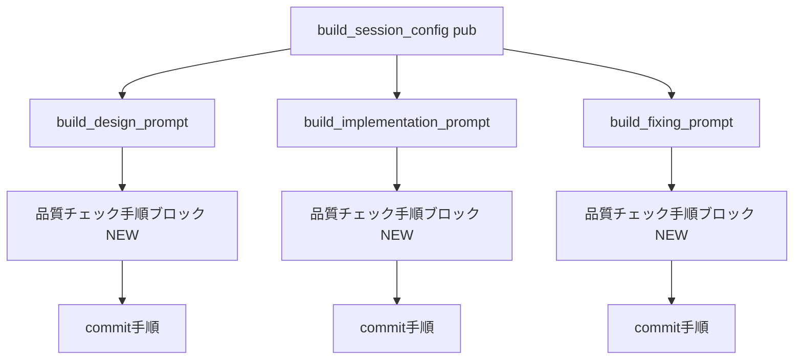
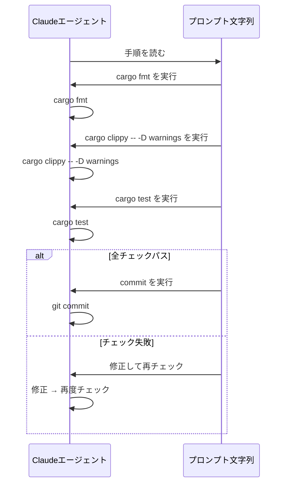

# 設計書: pre-commit-quality-check

## Overview

本機能は、cupola の Claude Code エージェントが commit 前に品質チェックを自律的に実行するよう、プロンプト文字列に手順を明示的に追加する。

**Purpose**: `src/application/prompt.rs` の3つのプロンプト生成関数（設計・実装・レビュー対応）に、`cargo fmt` / `cargo clippy -- -D warnings` / `cargo test` の実行手順を追加し、CIで失敗する壊れたPRのpushを防止する。

**Users**: cupolaが起動するClaudeエージェント（設計エージェント、実装エージェント、レビュー対応エージェント）が対象。

**Impact**: 既存の `src/application/prompt.rs` の3関数のプロンプト文字列を変更する。データモデル・ステートマシン・外部API接続には一切影響しない。

### Goals

- 3つのプロンプト全てに品質チェック手順（cargo fmt / clippy / test）を追加する
- 品質チェックがcommitの直前に実行されることをプロンプトで保証する
- チェック失敗時に修正→再チェックのループを明示的に指示する

### Non-Goals

- cargo コマンドの実際の実行制御（プロンプトによる指示のみ）
- CI結果の監視・フィードバック機能
- 品質チェックのスキップ機能
- 新規プロンプト関数の追加

## Requirements Traceability

| Requirement | Summary | Components | Interfaces | Flows |
|-------------|---------|------------|------------|-------|
| 1.1 | `build_design_prompt` に品質チェック手順を含む | DesignPromptBuilder | プロンプト文字列 | commit直前チェック |
| 1.2 | チェック失敗時に修正→再チェックを指示 | DesignPromptBuilder | プロンプト文字列 | — |
| 1.3 | 全チェックパス後にcommitを実行 | DesignPromptBuilder | プロンプト文字列 | — |
| 1.4 | 品質チェックがcommit手順の直前に配置 | DesignPromptBuilder | プロンプト文字列 | — |
| 2.1 | `build_implementation_prompt` に品質チェック手順を含む | ImplementationPromptBuilder | プロンプト文字列 | commit直前チェック |
| 2.2 | チェック失敗時に修正→再チェックを指示 | ImplementationPromptBuilder | プロンプト文字列 | — |
| 2.3 | 全チェックパス後にcommitを実行 | ImplementationPromptBuilder | プロンプト文字列 | — |
| 2.4 | feature_name 有無の両パスで品質チェックを含む | ImplementationPromptBuilder | プロンプト文字列 | — |
| 3.1 | `build_fixing_prompt` に品質チェック手順を含む | FixingPromptBuilder | プロンプト文字列 | commit直前チェック |
| 3.2 | チェック失敗時に修正→再チェックを指示 | FixingPromptBuilder | プロンプト文字列 | — |
| 3.3 | 全チェックパス後にcommitを実行 | FixingPromptBuilder | プロンプト文字列 | — |
| 4.1 | 既存ユニットテストが引き続きパス | 全コンポーネント | — | — |
| 4.2 | output_schema の種別が変更されない | 全コンポーネント | OutputSchemaKind | — |
| 4.3 | 品質チェック手順の存在をテストで検証可能 | テストモジュール | — | — |

## Architecture

### Existing Architecture Analysis

`src/application/prompt.rs` は application 層のプロンプト生成モジュールである。`build_session_config` が public エントリポイントとして `State` に応じて3つのプライベート関数を呼び分ける。各関数はRustの `format!` マクロでプロンプト文字列を生成して返す。

本機能が変更するのは、3つのプライベート関数内のフォーマット文字列のみであり、アーキテクチャ上の境界・インタフェース・型定義には一切変更を加えない。

### Architecture Pattern & Boundary Map



**Architecture Integration**:
- Selected pattern: 既存パターンのインプレース拡張（プロンプト文字列追記）
- 既存パターン保持: `format!` マクロによるプロンプト生成、`build_session_config` 経由のディスパッチ
- 新コンポーネントなし: プロンプト文字列のテキストブロック追加のみ
- Clean Architecture 準拠: application 層内の閉じた変更であり、依存方向は変化しない

### Technology Stack

| Layer | Choice / Version | Role in Feature | Notes |
|-------|------------------|-----------------|-------|
| Backend | Rust Edition 2024 | プロンプト文字列生成 | 既存スタック維持 |

外部依存の追加なし。

## System Flows



## Components and Interfaces

### コンポーネント一覧

| Component | Domain/Layer | Intent | Req Coverage | Key Dependencies | Contracts |
|-----------|--------------|--------|--------------|------------------|-----------|
| DesignPromptBuilder | application/prompt | 設計エージェント向けプロンプト生成 | 1.1, 1.2, 1.3, 1.4 | — | Service |
| ImplementationPromptBuilder | application/prompt | 実装エージェント向けプロンプト生成 | 2.1, 2.2, 2.3, 2.4 | — | Service |
| FixingPromptBuilder | application/prompt | レビュー対応エージェント向けプロンプト生成 | 3.1, 3.2, 3.3 | — | Service |
| PromptTestModule | application/prompt/tests | プロンプト内容の検証 | 4.1, 4.2, 4.3 | — | — |

### application/prompt

#### DesignPromptBuilder

| Field | Detail |
|-------|--------|
| Intent | 設計エージェント向けプロンプト文字列に品質チェック手順を追加する |
| Requirements | 1.1, 1.2, 1.3, 1.4 |

**Responsibilities & Constraints**
- `build_design_prompt` 関数内の format 文字列に品質チェックセクションを追加する
- 品質チェックは既存の手順5（タスク生成）と手順6（commit/push）の間に、独立した手順番号として挿入する
- チェック失敗時の修正指示を含める

**Contracts**: Service [x]

##### Service Interface

品質チェックセクションのプロンプトテキスト仕様:

```
### 品質チェック手順の挿入位置
手順5（/kiro:spec-tasks）の後、手順6（git commit）の前

### 追加するテキスト内容（設計）
6. commit 前に品質チェックを実行する
   以下をすべてパスしてから commit すること:
   1. cargo fmt
   2. cargo clippy -- -D warnings
   3. cargo test
   いずれかが失敗した場合は修正してから再度チェックすること

7. 成果物を commit / push する  ← 既存の手順6が7に繰り下がる
```

**Implementation Notes**
- 挿入: format文字列内の手順6（`git add`）の直前に品質チェック手順を追記し、既存の手順番号を6→7に更新する
- リスク: 手順番号の変更により、既存テスト `design_prompt_contains_related_instruction` や `design_prompt_does_not_contain_closes` への影響はない（内容の検証のみのため）

#### ImplementationPromptBuilder

| Field | Detail |
|-------|--------|
| Intent | 実装エージェント向けプロンプト文字列に品質チェック手順を追加する |
| Requirements | 2.1, 2.2, 2.3, 2.4 |

**Responsibilities & Constraints**
- `build_implementation_prompt` 関数内の format 文字列に品質チェックセクションを追加する
- `feature_name` 有無の両パス（`push_step` が "2" または "3"）において、pushの直前に品質チェックが挿入される
- `push_step` 変数の番号を動的に更新し、品質チェックステップの番号との整合性を保つ

**Contracts**: Service [x]

##### Service Interface

```
### 品質チェック手順の挿入位置
実装ステップ（/kiro:spec-impl または spec確認）の後、push の前

### 追加するテキスト内容（実装）
{quality_check_step}. commit 前に品質チェックを実行する
   以下をすべてパスしてから commit すること:
   1. cargo fmt
   2. cargo clippy -- -D warnings
   3. cargo test
   いずれかが失敗した場合は修正してから再度チェックすること

{push_step}. 成果物を commit / push する
   最終的に git push
```

- `feature_name` ありの場合: 実装=1, 品質チェック=2, push=3
- `feature_name` なしの場合: spec確認=1, 実装=2, 品質チェック=3, push=4

**Implementation Notes**
- `push_step` に加えて `quality_check_step` 変数を導入し、`feature_name` の有無に応じて動的に設定する
- 挿入: format文字列内の `{push_step}. 成果物を commit / push する` の直前に品質チェック手順を追記する

#### FixingPromptBuilder

| Field | Detail |
|-------|--------|
| Intent | レビュー対応エージェント向けプロンプト文字列に品質チェック手順を追加する |
| Requirements | 3.1, 3.2, 3.3 |

**Responsibilities & Constraints**
- `build_fixing_prompt` 関数内の format 文字列に品質チェックセクションを追加する
- 既存の手順3（`git commit -m "fix: address review comments" / git push`）の直前に独立した手順として挿入する

**Contracts**: Service [x]

##### Service Interface

```
### 品質チェック手順の挿入位置
手順2（各スレッド対応）の後、手順3（commit/push）の前

### 追加するテキスト内容（レビュー対応）
3. commit 前に品質チェックを実行する
   以下をすべてパスしてから commit すること:
   1. cargo fmt
   2. cargo clippy -- -D warnings
   3. cargo test
   いずれかが失敗した場合は修正してから再度チェックすること

4. 修正を commit / push する  ← 既存の手順3が4に繰り下がる
```

**Implementation Notes**
- 挿入: format文字列内の手順3（`git add -A`）の直前に品質チェック手順を追記し、手順3→4に更新する

## Error Handling

### Error Strategy

本機能に実行時エラーは存在しない（プロンプト文字列の生成はpanic-freeなRustの `format!` マクロのみを使用）。

エラー処理はプロンプト内の指示として Claude Code に委譲される：

| エラー種別 | プロンプトによる対処指示 |
|------------|--------------------------|
| `cargo fmt` 失敗 | 修正してから再度チェックを実行すること |
| `cargo clippy -- -D warnings` 失敗 | 修正してから再度チェックを実行すること |
| `cargo test` 失敗 | 修正してから再度チェックを実行すること |

## Testing Strategy

### Unit Tests

既存テストに加えて、以下のテストを追加する:

1. `design_prompt_contains_quality_check` — `build_design_prompt` のプロンプトに `cargo fmt`、`cargo clippy -- -D warnings`、`cargo test` が含まれること
2. `implementation_prompt_contains_quality_check` — `build_implementation_prompt` のプロンプトに品質チェック文言が含まれること（`feature_name` ありの場合）
3. `implementation_prompt_without_feature_name_contains_quality_check` — `build_implementation_prompt` のプロンプトに品質チェック文言が含まれること（`feature_name` なしの場合）
4. `fixing_prompt_contains_quality_check` — `build_fixing_prompt` のプロンプトに品質チェック文言が含まれること

既存テスト（要件4.1, 4.2対応）:
- `design_running_returns_pr_creation_schema` — 変更なしでパスすること
- `implementation_running_returns_pr_creation_schema` — 変更なしでパスすること
- `design_fixing_returns_fixing_schema` — 変更なしでパスすること
- `implementation_fixing_returns_fixing_schema` — 変更なしでパスすること
