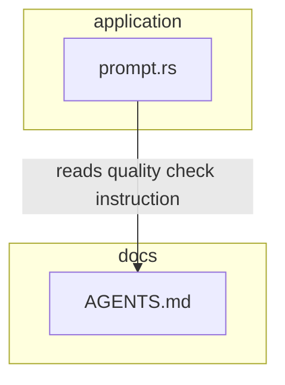

# Design Document: prompt-i18n-en

## Overview

**Purpose**: `src/application/prompt.rs` に定義された内部プロンプト文字列（定数3件、関数3件）および `AGENTS.md` の品質チェック指示を日本語から英語に変換し、AI エージェントへのトークン消費を削減する。

**Users**: Cupola システム自体（AI エージェントへプロンプトを送信するランタイム）および保守開発者が対象となる。

**Impact**: `DesignRunning`, `ImplementationRunning`, `DesignFixing`, `ImplementationFixing` の各状態で Claude Code に送信されるプロンプトのトークン数が削減される。出力言語制御（`{language}` プレースホルダ）は維持されるため、エンドユーザーへの影響はない。

### Goals

- `PR_CREATION_SCHEMA`, `FIXING_SCHEMA` の JSON schema `description` フィールドを英語化する
- `GENERIC_QUALITY_CHECK_INSTRUCTION` 定数を英語化する
- `build_design_prompt`, `build_implementation_prompt`, `build_fixing_prompt` のプロンプト本文を英語化する
- `AGENTS.md` の品質チェック指示を英語化する
- `cargo test` の全16件が引き続き通過する

### Non-Goals

- 出力言語の変更（PR body, コメント返信, cc-sdd ドキュメントは `{language}` で制御）
- i18n フレームワークの導入や言語切り替え機能の実装
- 上記以外のファイルへの変更

## Requirements Traceability

| Requirement | Summary | Components | Interfaces | Flows |
|-------------|---------|------------|------------|-------|
| 1.1–1.5 | JSON スキーマ description 英語化 | `PR_CREATION_SCHEMA`, `FIXING_SCHEMA` 定数 | — | — |
| 2.1–2.3 | 品質チェック定数英語化 | `GENERIC_QUALITY_CHECK_INSTRUCTION` 定数 | — | — |
| 3.1–3.6 | 設計プロンプト英語化 | `build_design_prompt` | — | — |
| 4.1–4.7 | 実装プロンプト英語化 | `build_implementation_prompt` | — | — |
| 5.1–5.8 | レビュー対応プロンプト英語化 | `build_fixing_prompt` | — | — |
| 6.1–6.7 | テスト assertion 英語化 | `mod tests` in `prompt.rs` | — | — |
| 7.1–7.3 | `AGENTS.md` 英語化 | `AGENTS.md` | — | — |
| 8.1–8.7 | 不変項目の保護 | 全変更対象 | format パラメータ, コマンド名, パス | — |

## Architecture

### Existing Architecture Analysis

本変更は `src/application/` 配下の Application 層に存在する `prompt.rs` の文字列リテラルのみを対象とする。Clean Architecture の層構造・依存方向・インターフェースはいずれも変更しない。

変更対象のコンポーネントと責務:

- `prompt.rs` — `SessionConfig` と各プロンプト構築関数を定義する。`build_session_config` が State に応じて各プロンプト関数にディスパッチする。
- `AGENTS.md` — Claude Code が参照する品質チェック指示ドキュメント。

### Architecture Pattern & Boundary Map

本フィーチャーは既存アーキテクチャを変更しない。変更はすべて `src/application/prompt.rs` の文字列リテラルおよび `AGENTS.md` ドキュメントに限定される。



**Architecture Integration**:
- 選択パターン: インプレース文字列置換（既存パターン維持）
- 既存パターン維持: `build_session_config` → 各プロンプト関数のディスパッチ構造、`{quality_check}` フォーマットパラメータ、`{language}` プレースホルダ
- 新コンポーネント: なし
- Steering 準拠: Application 層の変更のみ、domain/adapter への影響なし

### Technology Stack

| Layer | Choice / Version | Role in Feature | Notes |
|-------|------------------|-----------------|-------|
| Backend / Services | Rust (Edition 2024) | `prompt.rs` の文字列定数・関数変更 | 文字列リテラルのみ変更 |
| Infrastructure / Runtime | — | 変更なし | — |

## Components and Interfaces

### コンポーネント概要

| Component | Domain/Layer | Intent | Req Coverage | Key Dependencies | Contracts |
|-----------|--------------|--------|--------------|------------------|-----------|
| `PR_CREATION_SCHEMA` | application | PR 作成 JSON スキーマ定義（英語 description） | 1.1–1.5 | — | State |
| `FIXING_SCHEMA` | application | レビュー対応 JSON スキーマ定義（英語 description） | 1.1–1.5 | — | State |
| `GENERIC_QUALITY_CHECK_INSTRUCTION` | application | 品質チェック指示定数（英語） | 2.1–2.3 | — | State |
| `build_design_prompt` | application | 設計エージェント向けプロンプト生成（英語） | 3.1–3.6 | `GENERIC_QUALITY_CHECK_INSTRUCTION` | Service |
| `build_implementation_prompt` | application | 実装エージェント向けプロンプト生成（英語） | 4.1–4.7 | `GENERIC_QUALITY_CHECK_INSTRUCTION` | Service |
| `build_fixing_prompt` | application | レビュー対応エージェント向けプロンプト生成（英語） | 5.1–5.8 | `GENERIC_QUALITY_CHECK_INSTRUCTION` | Service |
| `mod tests` | application | 英語化後のプロンプトに対する assertion | 6.1–6.7 | 上記全コンポーネント | — |
| `AGENTS.md` | docs | Claude Code 向け品質チェック指示（英語） | 7.1–7.3 | — | — |

### Application Layer

#### `PR_CREATION_SCHEMA` / `FIXING_SCHEMA` 定数

| Field | Detail |
|-------|--------|
| Intent | AI へ送信する JSON スキーマの `description` フィールドを英語化し、トークンを削減する |
| Requirements | 1.1, 1.2, 1.3, 1.4, 1.5 |

**Responsibilities & Constraints**

- `description` フィールドの日本語テキストを英語に変換する
- JSON プロパティ名（`pr_title`, `pr_body`, `feature_name`, `threads`, `thread_id`, `response`, `resolved`）は変更しない
- 変換後も有効な JSON 文字列として `serde_json::from_str` でパース可能であること

**Dependencies**

- Inbound: `build_session_config` — スキーマ種別の判定 (P0)
- Outbound: なし

**Contracts**: State [x]

##### State Management

- State model: `&'static str` 定数（コンパイル時固定）
- Persistence: なし（定数のため）
- Concurrency strategy: 不変定数のため並行性の考慮不要

**Implementation Notes**

- Integration: `OutputSchemaKind::PrCreation` / `Fixing` の返却値として使用される。ロジック変更不要。
- Validation: JSON 整合性テスト（`pr_creation_schema_is_valid_json`, `fixing_schema_is_valid_json`）で検証。
- Risks: プロパティ名を誤って翻訳するリスク → テストで JSON パースを検証する。

---

#### `GENERIC_QUALITY_CHECK_INSTRUCTION` 定数

| Field | Detail |
|-------|--------|
| Intent | `build_design_prompt`, `build_implementation_prompt`, `build_fixing_prompt` に展開される品質チェック指示を英語化する |
| Requirements | 2.1, 2.2, 2.3 |

**Responsibilities & Constraints**

- 「commit 前に品質チェックを実行し、失敗した場合は修正して再チェックせよ」という意味を英語で維持する
- `AGENTS.md` / `CLAUDE.md` ファイル名参照を維持する
- `GENERIC_QUALITY_CHECK_INSTRUCTION` を参照する4件のテスト（`design_prompt_generic_quality_check`, `implementation_prompt_generic_quality_check`, `implementation_prompt_without_feature_name_generic_quality_check`, `fixing_prompt_generic_quality_check`）は定数参照のため、定数変更のみで自動追従する

**Dependencies**

- Inbound: `build_design_prompt`, `build_implementation_prompt`, `build_fixing_prompt` — `{quality_check}` パラメータとして展開 (P0)
- Outbound: なし

**Contracts**: State [x]

**Implementation Notes**

- Integration: 3つのプロンプト関数で `format!(..., quality_check = GENERIC_QUALITY_CHECK_INSTRUCTION)` により展開される。呼び出し側の変更は不要。
- Validation: 上記4件のテストが定数参照で検証。
- Risks: なし（定数変更のみ）。

---

#### `build_design_prompt` 関数

| Field | Detail |
|-------|--------|
| Intent | 設計エージェントへの指示プロンプトを英語で構築する |
| Requirements | 3.1, 3.2, 3.3, 3.4, 3.5, 3.6 |

**Responsibilities & Constraints**

- プロンプト本文（見出し・説明・手順）を英語化する
- 以下は変更しない:
  - `{quality_check}` フォーマットパラメータ
  - `{language}` プレースホルダ
  - `/kiro:spec-init`, `/kiro:spec-requirements`, `/kiro:spec-design`, `/kiro:spec-tasks` コマンド名
  - `.cupola/inputs/issue.md`, `.cupola/specs/`, `.cupola/steering/` パス参照
  - `Related: #{issue_number}`（`Closes` は含めない）
  - `feature_name` 等の出力スキーマフィールド名

**Dependencies**

- Inbound: `build_session_config`（`State::DesignRunning`）(P0)
- Outbound: `GENERIC_QUALITY_CHECK_INSTRUCTION` — `quality_check` パラメータ (P0)

**Contracts**: Service [x]

##### Service Interface

```rust
fn build_design_prompt(issue_number: u64, language: &str) -> String
```

- Preconditions: `language` は空でない文字列（通常 `cupola.toml` の `language` 設定値）
- Postconditions: 返却文字列に英語の設計エージェント役割記述、`Related: #{issue_number}`、`GENERIC_QUALITY_CHECK_INSTRUCTION` の展開内容を含む。`Closes` を含まない。
- Invariants: フォーマットパラメータ（`{quality_check}`, `{language}`）は展開される。コマンド名・パス・プロパティ名は保護される。

**Implementation Notes**

- Integration: 関数シグネチャ・呼び出し元・返却型は変更しない。文字列リテラルのみ英語化。
- Validation: `design_running_returns_pr_creation_schema`, `design_prompt_contains_related_instruction`, `design_prompt_does_not_contain_closes`, `design_prompt_generic_quality_check` テストで検証。
- Risks: `{language}` プレースホルダを誤訳するリスク → format パラメータ構文（`{language}`）は翻訳対象外。

---

#### `build_implementation_prompt` 関数

| Field | Detail |
|-------|--------|
| Intent | 実装エージェントへの指示プロンプトを英語で構築する（feature_name 有無の分岐含む） |
| Requirements | 4.1, 4.2, 4.3, 4.4, 4.5, 4.6, 4.7 |

**Responsibilities & Constraints**

- プロンプト本文（見出し・説明・手順）を英語化する
- `feature_name` が `None` の場合の `ls .cupola/specs/` 手順の記述も英語化する
- `feature_name` が `Some(name)` の場合の `/kiro:spec-impl {name}` 行は維持する
- `Closes #{issue_number}` を含む
- `{quality_check}`, `{language}`, `{feature_instruction}` フォーマットパラメータを維持する

**Dependencies**

- Inbound: `build_session_config`（`State::ImplementationRunning`）(P0)
- Outbound: `GENERIC_QUALITY_CHECK_INSTRUCTION` — `quality_check` パラメータ (P0)

**Contracts**: Service [x]

##### Service Interface

```rust
fn build_implementation_prompt(
    issue_number: u64,
    language: &str,
    feature_name: Option<&str>,
) -> String
```

- Preconditions: `language` は空でない文字列
- Postconditions: 返却文字列に実装エージェントの英語役割記述、`Closes #{issue_number}`、`GENERIC_QUALITY_CHECK_INSTRUCTION` 展開内容を含む
- Invariants: `feature_name` の有無により手順番号が変わる既存ロジックを維持する

**Implementation Notes**

- Integration: 関数シグネチャ・ロジックは変更しない。文字列リテラルのみ英語化。
- Validation: `implementation_running_returns_pr_creation_schema`, `implementation_prompt_contains_closes`, `implementation_prompt_generic_quality_check`, `implementation_prompt_without_feature_name_generic_quality_check` テストで検証。
- Risks: `{feature_instruction}` フォーマットパラメータの誤変換 → format パラメータは翻訳対象外。

---

#### `build_fixing_prompt` 関数

| Field | Detail |
|-------|--------|
| Intent | レビュー対応エージェントへの指示プロンプトを英語で構築する（動的文字列3件・フォールバック含む） |
| Requirements | 5.1, 5.2, 5.3, 5.4, 5.5, 5.6, 5.7, 5.8 |

**Responsibilities & Constraints**

- プロンプト本文（静的・動的部分すべて）を英語化する
- 動的文字列の英語化:
  - `FixingProblemKind::ReviewComments` → `.cupola/inputs/review_threads.json` を参照する英語の文字列
  - `FixingProblemKind::CiFailure` → `.cupola/inputs/ci_errors.txt` を参照する英語の文字列
  - `FixingProblemKind::Conflict` → base branch のコンフリクト解消を指示する英語の文字列（"base branch" キーワードを含む）
  - フォールバック → 英語の文字列
- `origin/main` 等のブランチ名をハードコードしない（現状も未ハードコード）
- `{quality_check}`, `{language}`, `{instructions_text}` フォーマットパラメータを維持する

**Dependencies**

- Inbound: `build_session_config`（`State::DesignFixing`, `State::ImplementationFixing`）(P0)
- Outbound: `GENERIC_QUALITY_CHECK_INSTRUCTION` — `quality_check` パラメータ (P0)

**Contracts**: Service [x]

##### Service Interface

```rust
fn build_fixing_prompt(
    _issue_number: u64,
    _pr_number: u64,
    language: &str,
    causes: &[FixingProblemKind],
) -> String
```

- Preconditions: `language` は空でない文字列。`causes` は空または `FixingProblemKind` のスライス。
- Postconditions: 返却文字列にレビュー対応エージェントの英語役割記述と、`causes` に応じた英語指示が含まれる
- Invariants: `causes` が空の場合はフォールバック英語文字列を使用する

**Implementation Notes**

- Integration: 関数シグネチャ・ロジック（`instructions` Vec の構築・enumerate join）は変更しない。文字列リテラルのみ英語化。
- Validation: `design_fixing_returns_fixing_schema`, `fixing_prompt_review_comments_only`, `fixing_prompt_ci_failure_only`, `fixing_prompt_conflict_only`, `fixing_prompt_all_causes`, `fixing_prompt_generic_quality_check` テストで検証。
- Risks: `"base ブランチ"` を英語に変えることで `fixing_prompt_conflict_only` / `fixing_prompt_all_causes` テストの assertion も更新が必要。

---

#### `mod tests`

| Field | Detail |
|-------|--------|
| Intent | 英語化後のプロンプトに合わせてテスト assertion を更新し、全16件の通過を維持する |
| Requirements | 6.1, 6.2, 6.3, 6.4, 6.5, 6.6, 6.7 |

**Responsibilities & Constraints**

- 以下の4種の日本語リテラル assertion を英語化後の対応文字列に更新する:
  - `"自動設計エージェント"` (L258) → 英語化後のプロンプトに含まれる対応英語文字列
  - `"自動実装エージェント"` (L274) → 同上
  - `"レビュー対応エージェント"` (L282) → 同上
  - `"base ブランチ"` (L422, L442) → 英語化後の対応英語文字列
- `GENERIC_QUALITY_CHECK_INSTRUCTION` を参照する4件のテスト（L456, L473, L484, L494）は定数参照のため変更不要

**Implementation Notes**

- Integration: テストは `session.prompt.contains("...")` 形式の assertion。英語化後のプロンプトに実際に含まれる文字列を assertion に使用する。
- Validation: `cargo test` の全16件通過で検証。
- Risks: 英語化後のプロンプトに含まれない文字列を assertion に使用してしまうリスク → テスト実行で検証。

---

### Docs

#### `AGENTS.md`

| Field | Detail |
|-------|--------|
| Intent | Claude Code が読み込む品質チェック指示を英語化し、トークンを削減する |
| Requirements | 7.1, 7.2, 7.3 |

**Responsibilities & Constraints**

- 品質チェック指示の日本語本文を英語化する
- commit 前チェック実行・失敗時の修正・再チェックの意味を英語で維持する
- 各リポジトリの設定やドキュメントへの参照に関する記述も英語化する
- ファイル名 `AGENTS.md`, `CLAUDE.md` の参照は維持する

**Implementation Notes**

- Integration: `GENERIC_QUALITY_CHECK_INSTRUCTION` は `AGENTS.md` / `CLAUDE.md` を参照するテキストを含む。英語化後も同参照が維持されること。
- Validation: `AGENTS.md` の内容を目視確認。
- Risks: なし（ドキュメント変更のみ）。

## Testing Strategy

### Unit Tests（`src/application/prompt.rs` の `mod tests`）

1. `design_running_returns_pr_creation_schema` — 英語化された設計エージェント識別文字列を含むことを確認
2. `implementation_running_returns_pr_creation_schema` — 英語化された実装エージェント識別文字列を含むことを確認
3. `design_fixing_returns_fixing_schema` — 英語化されたレビュー対応エージェント識別文字列を含むことを確認
4. `fixing_prompt_conflict_only` / `fixing_prompt_all_causes` — 英語化された "base branch" 相当の文字列を含むことを確認
5. `design_prompt_generic_quality_check` / `implementation_prompt_generic_quality_check` / `implementation_prompt_without_feature_name_generic_quality_check` / `fixing_prompt_generic_quality_check` — `GENERIC_QUALITY_CHECK_INSTRUCTION` 定数の展開を確認（変更不要）
6. `pr_creation_schema_is_valid_json` / `fixing_schema_is_valid_json` — JSON パース成功を確認（変更不要）
7. `design_prompt_contains_related_instruction` / `design_prompt_does_not_contain_closes` / `implementation_prompt_contains_closes` — 既存の英語 keyword 含有テスト（変更不要）

全16件が `cargo test` で通過することが合格基準。
