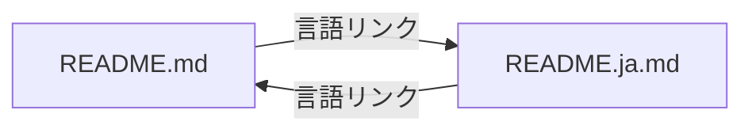

# Design Document

## Overview
**Purpose**: 英語版 README.md の日本語版（README.ja.md）を提供し、日本語話者がプロジェクトの概要・セットアップ・使い方を母語で理解できるようにする。
**Users**: 日本語話者の開発者・利用者が、プロジェクトのドキュメントを日本語で参照する。
**Impact**: リポジトリルートに README.ja.md を新規追加し、既存の README.md に言語切り替えリンクを追加する。

### Goals
- README.md の全セクションに対応する自然な日本語版ドキュメントを作成する
- README.md と README.ja.md の間に相互リンクを設定する
- 技術的内容（コマンド、コード例、設定キー名）の正確性を維持する

### Non-Goals
- README.md の内容変更（リンク追加以外）
- 3 言語以上への多言語対応
- 自動翻訳同期の仕組み構築
- CONTRIBUTING.md 等、他ドキュメントの日本語化

## Architecture

### Architecture Pattern & Boundary Map

本フィーチャーはドキュメント追加のみであり、ソフトウェアアーキテクチャへの変更はない。

**構成**:
- `README.md`（既存）: タイトル直下に言語切り替えリンクを追加
- `README.ja.md`（新規）: README.md と同一構造の日本語版ドキュメント



### Technology Stack

| Layer | Choice / Version | Role in Feature | Notes |
|-------|------------------|-----------------|-------|
| ドキュメント | Markdown / GitHub Flavored | ドキュメント記述形式 | GitHub 標準レンダリング |

## Requirements Traceability

| Requirement | Summary | Components | Interfaces | Flows |
|-------------|---------|------------|------------|-------|
| 1.1 | README.ja.md がルートに存在 | README.ja.md | — | — |
| 1.2 | 全セクション対応 | README.ja.md | — | — |
| 1.3 | 同一構造維持 | README.ja.md | — | — |
| 1.4 | 技術内容を原文維持 | README.ja.md | — | — |
| 1.5 | 自然な日本語 | README.ja.md | — | — |
| 2.1 | README.md に日本語版リンク | README.md | — | — |
| 2.2 | リンクが正しく参照 | README.md | — | — |
| 3.1 | README.ja.md に英語版リンク | README.ja.md | — | — |
| 3.2 | リンクが正しく参照 | README.ja.md | — | — |
| 4.1 | 情報の網羅性 | README.ja.md | — | — |
| 4.2 | アンカーリンク対応 | README.ja.md | — | — |
| 4.3 | 欠落情報の追加 | README.ja.md | — | — |

## Components and Interfaces

| Component | Domain/Layer | Intent | Req Coverage | Key Dependencies | Contracts |
|-----------|--------------|--------|--------------|------------------|-----------|
| README.ja.md | ドキュメント | 日本語版 README | 1.1-1.5, 3.1-3.2, 4.1-4.3 | README.md (P0) | — |
| README.md（変更） | ドキュメント | 言語リンク追加 | 2.1-2.2 | README.ja.md (P0) | — |

### ドキュメント

#### README.ja.md（新規作成）

| Field | Detail |
|-------|--------|
| Intent | README.md の日本語翻訳版を提供する |
| Requirements | 1.1, 1.2, 1.3, 1.4, 1.5, 3.1, 3.2, 4.1, 4.2, 4.3 |

**責務と制約**
- README.md の全 8 セクションに対応する日本語セクションを含む
- 見出しレベル・セクション順序を README.md と同一に維持する
- コードブロック・コマンド例・テーブル内の技術的内容は原文のまま保持する
- 冒頭（タイトル直下）に英語版への言語切り替えリンクを配置する
- 目次のアンカーリンクは日本語見出しに対応させる

**セクション構成**（README.md と対応）:

| # | README.md セクション | README.ja.md セクション |
|---|---------------------|----------------------|
| 1 | (Title) Cupola | (Title) Cupola |
| 2 | 言語リンク（新規追加） | 言語リンク（新規追加） |
| 3 | Table of Contents | 目次 |
| 4 | Project Overview | プロジェクト概要 |
| 5 | Prerequisites | 前提条件 |
| 6 | Installation & Setup | インストールとセットアップ |
| 7 | Usage | 使い方 |
| 8 | CLI Command Reference | CLI コマンドリファレンス |
| 9 | Configuration Reference | 設定リファレンス |
| 10 | Architecture Overview | アーキテクチャ概要 |
| 11 | License | ライセンス |

**翻訳方針**:
- 説明文: 自然な日本語で翻訳（機械翻訳調を避ける）
- コマンド例・コードブロック: 原文維持（コメントは日本語化可）
- テーブルの技術項目（Tool名、Option名、Key名）: 原文維持
- テーブルの説明列（Purpose, Description, Notes）: 日本語に翻訳
- リンク: 外部リンクは原文維持、内部アンカーは日本語見出しに対応

#### README.md（既存変更）

| Field | Detail |
|-------|--------|
| Intent | 日本語版への言語切り替えリンクを追加する |
| Requirements | 2.1, 2.2 |

**変更内容**:
- タイトル `# Cupola` の直下に言語切り替えリンクを追加

**リンク形式**:
```markdown
# Cupola

[日本語](./README.ja.md)
```

**README.ja.md 側のリンク形式**:
```markdown
# Cupola

[English](./README.md)
```

**Implementation Notes**
- リンクは相対パス（`./README.ja.md`, `./README.md`）を使用し、GitHub 上での参照を保証する
- 既存の README.md への変更はタイトル直下へのリンク 1 行追加のみとし、他の内容には触れない

## Testing Strategy

### 手動検証
- README.ja.md がリポジトリルートに存在することを確認
- README.ja.md の全セクションが README.md と対応していることを目視確認
- README.md → README.ja.md のリンクが正しく遷移することを確認
- README.ja.md → README.md のリンクが正しく遷移することを確認
- コードブロック・コマンド例が原文のまま保持されていることを確認
- 日本語の文体が自然で読みやすいことを確認
- 目次のアンカーリンクが各セクションに正しく遷移することを確認
