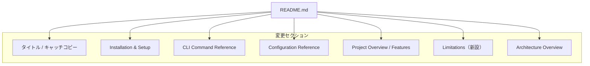

# 設計書: readme-v010-update

## Overview

本フィーチャーは、Cupola v0.1.0 の OSS 公開に向けて `README.md` を全面更新する。現行 README は初期実装時の内容を反映しており、その後追加されたコマンド（`start`, `stop`, `doctor`）、設定項目（`max_concurrent_sessions`, `model`）、および実際のソースコード構造と乖離している。

**目的**: README.md を v0.1.0 の実装状態と完全に一致させ、OSS ユーザーが正確な情報を得られるようにする。

**対象ユーザー**: Cupola を利用する OSS ユーザーおよびコントリビューター。

**影響範囲**: `README.md` および `README.ja.md`。コード変更はなし。

### Goals

- すべての CLI コマンド（`start`, `stop`, `doctor`, `init`, `status`, `--version`）を正確に記載する
- 設定項目テーブルを完全な状態にする（`max_concurrent_sessions`, `model` 追加）
- ファイルツリーを現在の `src/` ディレクトリ構造と一致させる
- 制限事項セクションを新設してユーザーの期待を適切に管理する
- キャッチコピーをプロジェクトの本質を表す文言に更新する

### Non-Goals

- コードの実装変更（本 PR スコープ外）
- コードの実装変更
- CI による README 検証の自動化

---

## Requirements Traceability

| 要件 | Summary | 対象セクション | 変更内容 |
|------|---------|----------------|----------|
| 1.1, 1.2 | キャッチコピー更新 | タイトル直下 | 文言を "Issue-driven local agent control plane for spec-driven development." に変更 |
| 2.1–2.8 | CLIコマンドリファレンス更新 | CLI Command Reference | `run` 削除、`start` / `stop` / `doctor` / `--version` を追加・更新 |
| 3.1–3.4 | 設定項目更新 | Configuration Reference | `max_concurrent_sessions`, `model` を追加 |
| 4.1–4.5 | 機能紹介追加 | Project Overview または新設 Features セクション | CI fix, Conflict fix, ラベルモデル上書き, 同時実行制限, doctor を追記 |
| 5.1–5.3 | 制限事項セクション新設 | 新設 Limitations セクション | review thread 限定、AGENTS.md/CLAUDE.md 要件を記載 |
| 6.1–6.5 | ファイルツリー更新 | Architecture Overview | 実 `src/` 構造に完全同期 |
| 7.1–7.3 | Installation URL 更新 | Installation & Setup | `<owner>/<repo>` を `kyuki3rain/cupola` に置換 |

---

## Architecture

### Existing Architecture Analysis

本フィーチャーは `README.md` のみを変更する。コードアーキテクチャへの影響はない。変更対象は以下のセクション構成を持つ単一の Markdown ファイルである。

現行の目次構成:
1. Project Overview
2. Prerequisites
3. Installation & Setup
4. Usage
5. CLI Command Reference
6. Configuration Reference
7. Architecture Overview
8. License

### Architecture Pattern & Boundary Map

変更対象ファイル・セクションの関係を示す。



**目次への追加**: `Limitations` セクションを目次リンクに追加する。

### Technology Stack

| Layer | Choice | Role | Notes |
|-------|--------|------|-------|
| ドキュメント | Markdown (GitHub Flavored) | README.md の記述形式 | 既存形式を維持 |
| コードブロック | bash / toml | コマンド例・設定例の表示 | 既存スタイルを維持 |

---

## Components and Interfaces

### コンポーネントサマリー

| Component | Layer | Intent | Req Coverage |
|-----------|-------|--------|-------------|
| タイトル・キャッチコピー | ドキュメント | プロジェクトの第一印象を形成 | 1.1, 1.2 |
| CLI Command Reference | ドキュメント | 現行コマンドの正確な記載 | 2.1–2.8 |
| Configuration Reference | ドキュメント | 全設定項目の網羅的な記載 | 3.1–3.4 |
| Project Overview / Features | ドキュメント | 主要機能の紹介 | 4.1–4.5 |
| Limitations | ドキュメント | 既知制限の明示（新設） | 5.1–5.3 |
| Architecture Overview | ドキュメント | ファイルツリーの現状反映 | 6.1–6.5 |
| Installation & Setup | ドキュメント | 正確なインストール手順 | 7.1–7.3 |

---

### ドキュメント層

#### タイトル・キャッチコピー

| Field | Detail |
|-------|--------|
| Intent | プロジェクトの目的を一文で表現する |
| Requirements | 1.1, 1.2 |

**変更仕様**:
- 現行: `A locally-resident agent that automates from design to implementation, starting from GitHub Issues.`
- 変更後: `Issue-driven local agent control plane for spec-driven development.`
- 位置: `# Cupola` 見出しの直下、`[日本語](./README.ja.md)` リンクの直後

**Implementation Notes**:
- 日本語版リンク `[日本語](./README.ja.md)` は維持する
- キャッチコピーはリンク行の直後に配置する

---

#### CLI Command Reference

| Field | Detail |
|-------|--------|
| Intent | 現行のすべての CLI コマンドとオプションを正確に記載する |
| Requirements | 2.1–2.8 |

**変更仕様**:

現行の `cupola run` セクションを `cupola start` に全面置換する。各コマンドの定義は `src/adapter/inbound/cli.rs` の実装に基づく。

**`cupola start`**:

| オプション | 説明 | デフォルト |
|-----------|------|----------|
| `--polling-interval-secs <seconds>` | ポーリング間隔のオーバーライド（秒） | `cupola.toml` の値 |
| `--log-level <level>` | ログレベルのオーバーライド | `cupola.toml` の値 |
| `--config <path>` | 設定ファイルパス | `.cupola/cupola.toml` |
| `-d`, `--daemon` | バックグラウンド（デーモン）として起動 | false |

**`cupola stop`**:

| オプション | 説明 | デフォルト |
|-----------|------|----------|
| `--config <path>` | 設定ファイルパス | `.cupola/cupola.toml` |

**`cupola doctor`**:

| オプション | 説明 | デフォルト |
|-----------|------|----------|
| `--config <path>` | 設定ファイルパス | `.cupola/cupola.toml` |

**`cupola init`**: オプションなし。SQLite スキーマを初期化する。

**`cupola status`**: オプションなし。全 Issue の処理状態を一覧表示する。

**`cupola --version` / `-V`**: インストール済みバージョンを表示する。

**Implementation Notes**:
- `cupola run` の記載をすべて削除する
- 目次の Usage セクション（手順 7）の `cupola run` を `cupola start` に修正する

---

#### Configuration Reference

| Field | Detail |
|-------|--------|
| Intent | 全設定項目とデフォルト値を網羅的に記載する |
| Requirements | 3.1–3.4 |

**変更仕様**:

以下の行を設定項目テーブルに追加する:

| Key | Type | Default | Description |
|-----|------|---------|-------------|
| `max_concurrent_sessions` | u32（オプション） | 無制限 | 同時実行する Cupola セッション数の上限 |
| `model` | String | `"sonnet"` | エージェントセッションで使用するデフォルト Claude モデル |

設定例コードブロックにも上記2項目を追加する:

```toml
max_concurrent_sessions = 4   # 省略時は無制限
model = "sonnet"
```

**Implementation Notes**:
- 既存の全設定項目（`owner`, `repo`, `default_branch`, `language`, `polling_interval_secs`, `max_retries`, `stall_timeout_secs`, `[log] level`, `[log] dir`）はそのまま維持する

---

#### Project Overview / Features

| Field | Detail |
|-------|--------|
| Intent | Cupola の主要機能を列挙してユーザーの関心を引く |
| Requirements | 4.1–4.5 |

**変更仕様**:

Project Overview または既存の Usage セクションの後に、以下の機能紹介を追加する（箇条書き形式）:

- **CI 失敗の自動検知と修正**: CI（GitHub Actions 等）の失敗を検知し、自動的に修正を試みる
- **マージコンフリクトの自動検知と修正**: ブランチのコンフリクトを検知し、自動的に解消を試みる
- **Issue ラベルによるモデル上書き**: Issue に `model:opus` 等のラベルを付与することで、そのIssueに使用するClaudeモデルをオーバーライドできる
- **同時実行数制限**: `max_concurrent_sessions` によりエージェントの同時実行数を制限できる
- **前提条件チェック（`cupola doctor`）**: `cupola doctor` を実行することで、必要なツール（Claude Code, gh CLI 等）のインストール状況と設定を検証できる

**Implementation Notes**:
- 既存の Core Capabilities 風の記述を置換または拡張する形で記載する

---

#### Limitations（新設）

| Field | Detail |
|-------|--------|
| Intent | Cupola の既知の制限事項を明示し、ユーザーの誤解を防ぐ |
| Requirements | 5.1–5.3 |

**変更仕様**:

`## Limitations` セクションを新設し、以下の内容を記載する:

- **レビューコメントのサポート範囲**: PR のレビュースレッド（`review_thread`）のみ対応。PR レベルのレビューコメント（スレッドを持たないトップレベルの PR レビューコメント）は未対応
- **品質チェックコマンドの要件**: Cupola が実行する品質チェックコマンドは、対象リポジトリの `AGENTS.md` または `CLAUDE.md` に記載する必要がある

**位置**: Architecture Overview セクションの直前、または License セクションの直前に配置する。

**目次への追加**: `- [Limitations](#limitations)` を目次に追加する。

---

#### Architecture Overview（ファイルツリー）

| Field | Detail |
|-------|--------|
| Intent | 実際の `src/` 構造をファイルツリーとして正確に表示する |
| Requirements | 6.1–6.5 |

**変更仕様**:

現行のファイルツリーを以下の内容で全面置換する（`mod.rs` は省略）:

```
src/
├── main.rs
├── lib.rs
├── domain/
│   ├── check_result.rs
│   ├── config.rs
│   ├── event.rs
│   ├── execution_log.rs
│   ├── fixing_problem_kind.rs
│   ├── issue.rs
│   ├── state.rs
│   └── state_machine.rs
├── application/
│   ├── doctor_use_case.rs
│   ├── error.rs
│   ├── init_use_case.rs
│   ├── io.rs
│   ├── polling_use_case.rs
│   ├── prompt.rs
│   ├── retry_policy.rs
│   ├── session_manager.rs
│   ├── stop_use_case.rs
│   ├── transition_use_case.rs
│   └── port/
│       ├── claude_code_runner.rs
│       ├── command_runner.rs
│       ├── config_loader.rs
│       ├── execution_log_repository.rs
│       ├── git_worktree.rs
│       ├── github_client.rs
│       ├── issue_repository.rs
│       └── pid_file.rs
├── adapter/
│   ├── inbound/
│   │   └── cli.rs
│   └── outbound/
│       ├── claude_code_process.rs
│       ├── git_worktree_manager.rs
│       ├── github_client_impl.rs
│       ├── github_graphql_client.rs
│       ├── github_rest_client.rs
│       ├── init_file_generator.rs
│       ├── pid_file_manager.rs
│       ├── process_command_runner.rs
│       ├── sqlite_connection.rs
│       ├── sqlite_execution_log_repository.rs
│       └── sqlite_issue_repository.rs
└── bootstrap/
    ├── app.rs
    ├── config_loader.rs
    ├── logging.rs
    └── toml_config_loader.rs
```

**Implementation Notes**:
- レイヤー説明テーブル（`domain`, `application`, `adapter`, `bootstrap` の責務説明）は維持する

---

#### Installation & Setup

| Field | Detail |
|-------|--------|
| Intent | 正確なリポジトリURLでインストール手順を提供する |
| Requirements | 7.1–7.3 |

**変更仕様**:

- `git clone https://github.com/<owner>/<repo>.git` を `git clone https://github.com/kyuki3rain/cupola.git` に変更
- `cd <repo>` を `cd cupola` に変更
- 手順 7（ポーリング開始）の `cupola run` を `cupola start` に変更

---

## Testing Strategy

### ドキュメント検証

- **目視確認**: 生成された README.md を GitHub の Markdown プレビューまたはローカルレンダラーで確認する
- **コマンド整合性チェック**: README 記載の全コマンドが `src/adapter/inbound/cli.rs` の実装と一致することを確認する
- **設定項目チェック**: `max_concurrent_sessions` と `model` が設定テーブルとコード例の両方に記載されていることを確認する
- **ファイルツリーチェック**: README のファイルツリーと `find src/ -name "*.rs"` の出力（`mod.rs` 除く）が一致することを確認する
- **リンクチェック**: 日本語版へのリンク `[日本語](./README.ja.md)` が先頭に存在することを確認する
- **Limitations セクション**: 目次リンクおよびセクション本文が存在することを確認する

### 受け入れ基準の照合

要件定義の受け入れ条件（要件 1〜7 の全条件）を1つずつ確認する。

---

## Error Handling

本フィーチャーはドキュメント変更のみであるため、ランタイムエラーは発生しない。誤記・漏れはコードレビューおよびドキュメント検証で検出・修正する。
