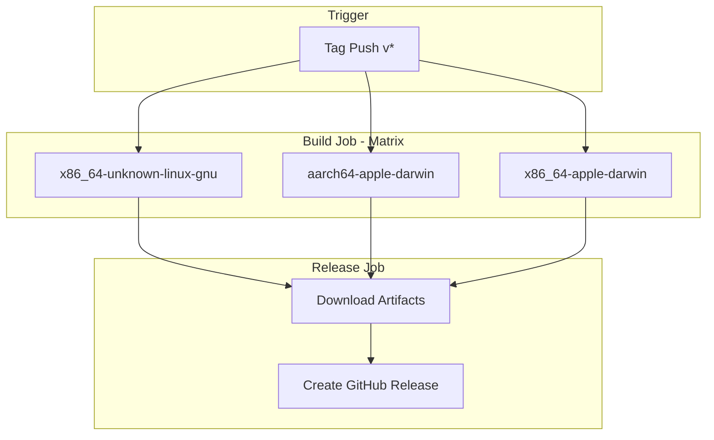
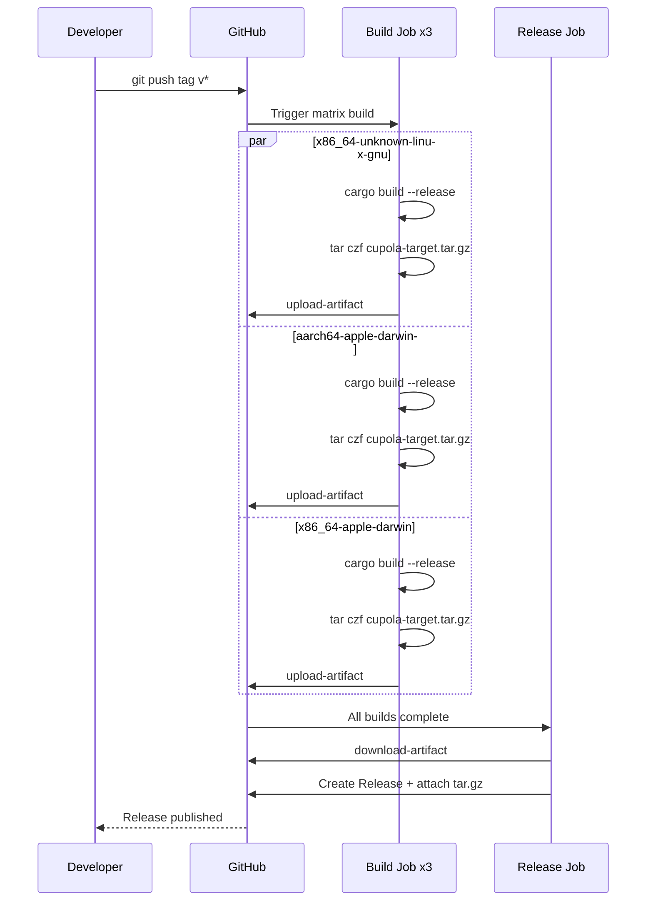

# Design Document

## Overview
**Purpose**: GitHub Actions の Release workflow を追加し、v* タグの push をトリガーとしてクロスプラットフォームバイナリの自動ビルド・パッケージング・GitHub Release 作成を実現する。
**Users**: OSS メンテナーおよびエンドユーザー。メンテナーはタグ push のみでリリースを完了し、ユーザーは Release ページからバイナリをダウンロードする。
**Impact**: 新規ファイル追加のみ。既存コードへの変更なし。

### Goals
- v* タグ push で 3 ターゲットのバイナリを自動ビルド・リリース
- 手動操作を最小化し、リリースプロセスを完全自動化
- セキュリティベストプラクティスに準拠したワークフロー

### Non-Goals
- Windows ターゲットのサポート
- バイナリの署名・公証（notarization）
- Homebrew / apt 等のパッケージマネージャー向け配布
- Cargo.toml のバージョン自動更新

## Architecture

### Architecture Pattern & Boundary Map

**Architecture Integration**:
- Selected pattern: 単一ワークフロー内の build matrix + release ジョブ。シンプルさと管理容易性を優先
- 既存パターン: 既存の CI ワークフロー（.github/workflows/）と同一ディレクトリに配置
- 新規コンポーネント: release.yml のみ。既存コードへの依存・変更なし

### Technology Stack

| Layer | Choice / Version | Role in Feature | Notes |
|-------|------------------|-----------------|-------|
| Infrastructure / Runtime | GitHub Actions | CI/CD 実行基盤 | ubuntu-latest, macos-latest |
| Build | Rust stable + rust-toolchain Action | クロスコンパイル | dtolnay/rust-toolchain |
| Cache | rust-cache Action | ビルドキャッシュ | Swatinem/rust-cache |
| Release | softprops/action-gh-release | GitHub Release 作成 | リリースノート自動生成 |

## System Flows

## Requirements Traceability

| Requirement | Summary | Components | Flows |
|-------------|---------|------------|-------|
| 1.1 | セマンティックバージョニングタグでトリガー | WorkflowTrigger | Tag Push → Build |
| 1.2 | 非一致タグはジョブ内検証で失敗 | WorkflowTrigger | — |
| 1.3 | contents: write パーミッション | WorkflowPermissions | — |
| 2.1 | Linux ビルド | BuildMatrix | Build sequence |
| 2.2 | macOS ARM ビルド | BuildMatrix | Build sequence |
| 2.3 | macOS x86 ビルド | BuildMatrix | Build sequence |
| 2.4 | 適切な OS ランナー | BuildMatrix | — |
| 2.5 | fail-fast 無効 | BuildMatrix | — |
| 2.6 | Rust stable ツールチェーン | BuildMatrix | — |
| 2.7 | ビルドキャッシュ設定 | BuildMatrix | — |
| 3.1 | tar.gz パッケージング | PackageStep | Build sequence |
| 3.2 | アーティファクトアップロード | PackageStep | Build sequence |
| 3.3 | ファイル不在時エラー | PackageStep | — |
| 4.1 | 全ビルド完了後に Release 作成 | ReleaseJob | Release sequence |
| 4.2 | tar.gz ファイル添付 | ReleaseJob | Release sequence |
| 4.3 | リリースノート自動生成 | ReleaseJob | Release sequence |
| 4.4 | needs: build 依存 | ReleaseJob | — |
| 5.1 | コミットハッシュピン留め | 全 Action 参照 | — |
| 5.2 | 最小限パーミッション | WorkflowPermissions | — |

## Components and Interfaces

| Component | Layer | Intent | Req Coverage | Key Dependencies |
|-----------|-------|--------|--------------|------------------|
| WorkflowTrigger | Workflow Config | タグ push イベントの検知とフィルタリング | 1.1, 1.2 | GitHub Events |
| WorkflowPermissions | Workflow Config | ワークフロー権限設定 | 1.3, 5.2 | — |
| BuildMatrix | Build Job | 3 ターゲットの並列ビルド | 2.1–2.7 | rust-toolchain, rust-cache |
| PackageStep | Build Job | バイナリのパッケージングとアーティファクト化 | 3.1–3.3 | upload-artifact |
| ReleaseJob | Release Job | GitHub Release 作成とバイナリ添付 | 4.1–4.4, 5.1 | download-artifact, action-gh-release |

### Workflow Configuration

#### WorkflowTrigger

| Field | Detail |
|-------|--------|
| Intent | セマンティックバージョニング形式のタグ push を検知してワークフローを開始する |
| Requirements | 1.1, 1.2 |

**Responsibilities & Constraints**
- `on.push.tags` で glob パターン `v[0-9]*.[0-9]*.[0-9]*` のタグ push をトリガーする（この glob はサフィックス付きタグも含まれ得る）
- ジョブ内でタグ名を正規表現 `^v[0-9]+\.[0-9]+\.[0-9]+$` で厳密に検証し、マッチしない場合はジョブを即座に失敗させる

**Contracts**: Batch [x]

##### Batch / Job Contract
- Trigger: `push.tags: ["v[0-9]*.[0-9]*.[0-9]*"]`
- Input / validation: ジョブ内で取得したタグ名がセマンティックバージョニング正規表現 `^v[0-9]+\.[0-9]+\.[0-9]+$` に一致することを検証
- Output / destination: build ジョブの起動
- Idempotency & recovery: 同一タグの再 push は GitHub が重複を防止

#### WorkflowPermissions

| Field | Detail |
|-------|--------|
| Intent | ワークフロー全体の権限を最小限に設定する |
| Requirements | 1.3, 5.2 |

**Responsibilities & Constraints**
- `permissions.contents: write` のみを設定
- GitHub Release の作成・アセットアップロードに必要な最小権限

### Build Job

#### BuildMatrix

| Field | Detail |
|-------|--------|
| Intent | 3 ターゲットのバイナリを各 OS ランナーで並列ビルドする |
| Requirements | 2.1, 2.2, 2.3, 2.4, 2.5, 2.6, 2.7 |

**Responsibilities & Constraints**
- matrix strategy で 3 ターゲットを定義
- fail-fast: false で独立ビルドを保証
- 各ターゲットに適切な OS ランナーを割り当て

**Dependencies**
- External: dtolnay/rust-toolchain@stable — Rust ツールチェーンのインストール (P0)
- External: Swatinem/rust-cache — ビルドキャッシュ (P1)
- External: actions/checkout — リポジトリチェックアウト (P0)

**Contracts**: Batch [x]

##### Batch / Job Contract
- Trigger: WorkflowTrigger からのタグ push イベント
- Input / validation: matrix.target と matrix.os の組み合わせ
- Output / destination: `target/{target}/release/cupola` バイナリ
- Idempotency & recovery: ジョブ再実行で同一成果物を生成

**Matrix 定義**:

| target | os | 備考 |
|--------|----|------|
| x86_64-unknown-linux-gnu | ubuntu-latest | Linux AMD64 |
| aarch64-apple-darwin | macos-latest | macOS ARM64 |
| x86_64-apple-darwin | macos-latest | macOS AMD64 |

#### PackageStep

| Field | Detail |
|-------|--------|
| Intent | ビルド成果物を tar.gz にパッケージしアーティファクトとしてアップロードする |
| Requirements | 3.1, 3.2, 3.3 |

**Responsibilities & Constraints**
- `cupola-{target}.tar.gz` 形式でパッケージ
- if-no-files-found: error でファイル不在時にジョブ失敗

**Dependencies**
- External: actions/upload-artifact — アーティファクトアップロード (P0)

**Contracts**: Batch [x]

##### Batch / Job Contract
- Trigger: cargo build --release 完了後
- Input / validation: `target/{target}/release/cupola` バイナリの存在
- Output / destination: `cupola-{target}.tar.gz` アーティファクト
- Idempotency & recovery: 再実行で同一 tar.gz を生成

### Release Job

#### ReleaseJob

| Field | Detail |
|-------|--------|
| Intent | 全ターゲットのアーティファクトを収集し GitHub Release を作成する |
| Requirements | 4.1, 4.2, 4.3, 4.4 |

**Responsibilities & Constraints**
- needs: build で全ビルド完了を待機
- 全アーティファクトをダウンロードして Release に添付
- リリースノートを自動生成

**Dependencies**
- Inbound: BuildMatrix — 全ターゲットのビルド完了 (P0)
- External: actions/download-artifact — アーティファクトダウンロード (P0)
- External: softprops/action-gh-release — GitHub Release 作成 (P0)

**Contracts**: Batch [x]

##### Batch / Job Contract
- Trigger: 全 build ジョブの成功完了（needs: build）
- Input / validation: `cupola-*` パターンの tar.gz アーティファクト
- Output / destination: GitHub Release（リリースノート + バイナリアセット）
- Idempotency & recovery: 同一タグへの再実行は既存 Release を更新

## Error Handling

### Error Strategy
GitHub Actions のネイティブエラーハンドリングに依存。カスタムエラー処理は不要。

### Error Categories and Responses
- **ビルドエラー**: cargo build 失敗 → ジョブ失敗、他ターゲットは継続（fail-fast: false）
- **パッケージングエラー**: バイナリ不在 → if-no-files-found: error でジョブ失敗
- **アーティファクトエラー**: アップロード/ダウンロード失敗 → ジョブ失敗、GitHub Actions の自動リトライに委任
- **Release 作成エラー**: API エラー → ジョブ失敗、手動リトライ可能

## Testing Strategy

### 手動検証
- テストタグ（例: v0.0.1-test）を push してワークフローがトリガーされるが、タグ検証ステップでエラーとなることを確認
- 各ターゲットのビルド成功を Actions ログで確認
- GitHub Release ページでアーティファクトのダウンロード・展開を確認

### CI 検証項目
1. タグ push でワークフローがトリガーされること
2. 3 ターゲット全てのビルドが成功すること
3. tar.gz ファイルが正しく生成されること
4. GitHub Release が作成されバイナリが添付されること
5. リリースノートが自動生成されること

## Security Considerations
- 全 Action 参照はコミットハッシュでピン留め（タグ参照禁止）
- パーミッションは contents: write のみ（最小権限原則）
- 詳細は `research.md` の「Action バージョンピン留め」セクションを参照
