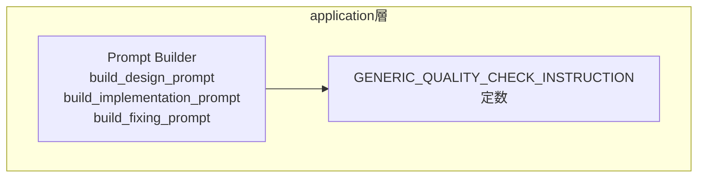

# Design Document

## Overview

本機能は `src/application/prompt.rs` 内の 3 つのプロンプトビルダー関数（`build_design_prompt`・`build_implementation_prompt`・`build_fixing_prompt`）から Rust 固有の品質チェックコマンド（`cargo fmt`・`cargo clippy -- -D warnings`・`cargo test`）を除去し、「AGENTS.md / CLAUDE.md に記載された品質チェックに従え」という汎用指示に置き換える。

**Purpose**: この変更により、cupola が Rust 以外の言語で書かれたプロジェクトの Issue も正しく処理できるようになる。
**Users**: cupola を利用する開発者（特に Rust 以外のプロジェクトに cupola を適用するケース）。
**Impact**: プロンプト文字列の内容が変更される。既存の Rust プロジェクト向けには動作が変わらない（各プロジェクトの CLAUDE.md に cargo コマンドが記載されているため）。

### Goals
- design / implementation / fixing 各プロンプトから言語固有コマンドを完全に除去する
- 汎用的な品質チェック指示（AGENTS.md / CLAUDE.md 参照）を統一文言で 3 関数に適用する
- 関連テストを新仕様に合わせて更新し、全テストをパスさせる

### Non-Goals
- プロンプト関数のシグネチャや呼び出し側の変更
- AGENTS.md / CLAUDE.md の内容の規定
- 他の言語向け品質チェックコマンドのハードコード追加

## Architecture

### Existing Architecture Analysis

`src/application/prompt.rs` は application 層に属し、各ステート（DesignRunning / ImplementationRunning / DesignFixing / ImplementationFixing）に対応するプロンプト文字列を生成する責務を持つ。外部依存はなく、純粋な文字列生成関数群である。

変更は文字列リテラルの置換のみであり、レイヤー境界・トレイト・インターフェースへの影響はない。

### Architecture Pattern & Boundary Map

変更は単一ファイル・単一モジュール内で完結する。新たなコンポーネント境界は発生しない。



**Architecture Integration**:
- 選択パターン: 文字列定数の切り出し（DRY）
- 既存パターン維持: application 層内の純粋関数構造を維持
- 新コンポーネント: モジュールレベル定数 `GENERIC_QUALITY_CHECK_INSTRUCTION`
- Steering 準拠: application 層は外部依存なし・純粋ロジックの原則を維持

### Technology Stack

| Layer | Choice / Version | Role in Feature | Notes |
|-------|------------------|-----------------|-------|
| Backend / Services | Rust (Edition 2024) | プロンプト文字列生成 | `src/application/prompt.rs` のみ変更 |

## Requirements Traceability

| Requirement | Summary | Components | Interfaces | Flows |
|-------------|---------|------------|------------|-------|
| 1.1 | design プロンプトに cargo コマンドを含まない | `build_design_prompt` | — | — |
| 1.2 | design プロンプトに汎用品質チェック指示を含む | `build_design_prompt`, `GENERIC_QUALITY_CHECK_INSTRUCTION` | — | — |
| 1.3 | commit/push 手順を維持 | `build_design_prompt` | — | — |
| 2.1 | implementation プロンプトに cargo コマンドを含まない | `build_implementation_prompt` | — | — |
| 2.2 | implementation プロンプトに汎用品質チェック指示を含む | `build_implementation_prompt`, `GENERIC_QUALITY_CHECK_INSTRUCTION` | — | — |
| 2.3 | `Closes #N` 形式の issue 参照を維持 | `build_implementation_prompt` | — | — |
| 3.1 | fixing プロンプトに cargo コマンドを含まない | `build_fixing_prompt` | — | — |
| 3.2 | fixing プロンプトに汎用品質チェック指示を含む | `build_fixing_prompt`, `GENERIC_QUALITY_CHECK_INSTRUCTION` | — | — |
| 3.3 | 各修正原因に応じた指示を維持 | `build_fixing_prompt` | — | — |
| 4.1 | cargo コマンド存在アサートのテストを除去 | テストモジュール | — | — |
| 4.2 | 汎用品質チェック指示の存在を検証するテストを追加 | テストモジュール | — | — |
| 4.3 | 同等以上のカバレッジを汎用指示の観点で提供 | テストモジュール | — | — |

## Components and Interfaces

| Component | Domain/Layer | Intent | Req Coverage | Key Dependencies | Contracts |
|-----------|--------------|--------|--------------|------------------|-----------|
| `GENERIC_QUALITY_CHECK_INSTRUCTION` | application | 汎用品質チェック指示文字列の定数 | 1.2, 2.2, 3.2 | なし | — |
| `build_design_prompt` | application | 設計エージェント向けプロンプト生成 | 1.1, 1.2, 1.3 | `GENERIC_QUALITY_CHECK_INSTRUCTION` | Service |
| `build_implementation_prompt` | application | 実装エージェント向けプロンプト生成 | 2.1, 2.2, 2.3 | `GENERIC_QUALITY_CHECK_INSTRUCTION` | Service |
| `build_fixing_prompt` | application | レビュー対応エージェント向けプロンプト生成 | 3.1, 3.2, 3.3 | `GENERIC_QUALITY_CHECK_INSTRUCTION` | Service |
| テストモジュール | application | プロンプト関数の仕様検証 | 4.1, 4.2, 4.3 | 各プロンプト関数 | — |

### application 層

#### `GENERIC_QUALITY_CHECK_INSTRUCTION`

| Field | Detail |
|-------|--------|
| Intent | 汎用品質チェック指示を表す定数文字列（3 関数で共有） |
| Requirements | 1.2, 2.2, 3.2 |

**Responsibilities & Constraints**
- commit 前に AGENTS.md / CLAUDE.md に記載された品質チェックの実行を求める汎用指示を保持する
- Rust 固有・言語固有コマンドを一切含まない

**Contracts**: なし（定数）

**Implementation Notes**
- 定数値: `"commit 前に AGENTS.md / CLAUDE.md に記載された品質チェックを実行し、全てパスしてから commit すること。失敗した場合は修正して再チェックすること。"`
- Risks: 文言変更時は関連テストのアサート文字列も同時に更新する必要がある

---

#### `build_design_prompt`

| Field | Detail |
|-------|--------|
| Intent | 設計エージェント向けプロンプト生成（既存関数の修正） |
| Requirements | 1.1, 1.2, 1.3 |

**Responsibilities & Constraints**
- 現行のステップ 6（`cargo fmt` / `cargo clippy -- -D warnings` / `cargo test` の列挙）を `GENERIC_QUALITY_CHECK_INSTRUCTION` の参照に置き換える
- commit / push 手順（ステップ 7）は変更しない

**Dependencies**
- Inbound: `build_session_config` — 呼び出し元（P0）
- Outbound: `GENERIC_QUALITY_CHECK_INSTRUCTION` — 汎用品質チェック指示文字列（P0）

**Contracts**: Service [x]

##### Service Interface
```rust
fn build_design_prompt(issue_number: u64, language: &str) -> String
```
- Preconditions: なし
- Postconditions: `cargo fmt`・`cargo clippy`・`cargo test` を含まない文字列を返す。`GENERIC_QUALITY_CHECK_INSTRUCTION` の内容を含む文字列を返す。
- Invariants: `Related: #{issue_number}` を含む。`Closes` キーワードを含まない。

**Implementation Notes**
- Integration: ステップ 6 のブロックを `GENERIC_QUALITY_CHECK_INSTRUCTION` の埋め込みに変更
- Risks: ステップ番号（6.→commit）の整合性を確認すること

---

#### `build_implementation_prompt`

| Field | Detail |
|-------|--------|
| Intent | 実装エージェント向けプロンプト生成（既存関数の修正） |
| Requirements | 2.1, 2.2, 2.3 |

**Responsibilities & Constraints**
- `quality_check_step` ブロック内の `cargo fmt` / `cargo clippy -- -D warnings` / `cargo test` の列挙を `GENERIC_QUALITY_CHECK_INSTRUCTION` の参照に置き換える
- feature_name あり・なし両パターンで同様に変更する

**Dependencies**
- Inbound: `build_session_config` — 呼び出し元（P0）
- Outbound: `GENERIC_QUALITY_CHECK_INSTRUCTION` — 汎用品質チェック指示文字列（P0）

**Contracts**: Service [x]

##### Service Interface
```rust
fn build_implementation_prompt(issue_number: u64, language: &str, feature_name: Option<&str>) -> String
```
- Preconditions: なし
- Postconditions: `cargo fmt`・`cargo clippy`・`cargo test` を含まない文字列を返す。`GENERIC_QUALITY_CHECK_INSTRUCTION` の内容を含む文字列を返す。`Closes #{issue_number}` を含む。
- Invariants: feature_name あり・なしで品質チェック指示の内容が同一である。

**Implementation Notes**
- Integration: `{quality_check_step}. commit 前に品質チェック...` のブロックを `GENERIC_QUALITY_CHECK_INSTRUCTION` で置換
- Risks: ステップ番号変数（`quality_check_step`・`push_step`）の計算ロジックに影響しないよう注意

---

#### `build_fixing_prompt`

| Field | Detail |
|-------|--------|
| Intent | レビュー対応エージェント向けプロンプト生成（既存関数の修正） |
| Requirements | 3.1, 3.2, 3.3 |

**Responsibilities & Constraints**
- ステップ 3（`cargo fmt` / `cargo clippy -- -D warnings` / `cargo test` の列挙）を `GENERIC_QUALITY_CHECK_INSTRUCTION` の参照に置き換える
- ReviewComments / CiFailure / Conflict の各ケース分岐は変更しない

**Dependencies**
- Inbound: `build_session_config` — 呼び出し元（P0）
- Outbound: `GENERIC_QUALITY_CHECK_INSTRUCTION` — 汎用品質チェック指示文字列（P0）

**Contracts**: Service [x]

##### Service Interface
```rust
fn build_fixing_prompt(
    _issue_number: u64,
    _pr_number: u64,
    language: &str,
    causes: &[FixingProblemKind],
) -> String
```
- Preconditions: なし
- Postconditions: `cargo fmt`・`cargo clippy`・`cargo test` を含まない文字列を返す。`GENERIC_QUALITY_CHECK_INSTRUCTION` の内容を含む文字列を返す。
- Invariants: causes の内容に応じた修正指示が含まれる（既存動作維持）。

**Implementation Notes**
- Integration: ステップ 3 の箇条書きブロックを `GENERIC_QUALITY_CHECK_INSTRUCTION` で置換
- Risks: ステップ番号（3.→4.commit）の整合性を確認すること

---

#### テストモジュール（`#[cfg(test)] mod tests`）

| Field | Detail |
|-------|--------|
| Intent | プロンプト関数の仕様検証テスト（旧テストの更新） |
| Requirements | 4.1, 4.2, 4.3 |

**Responsibilities & Constraints**
- 削除対象テスト（4 件）:
  - `design_prompt_contains_quality_check`
  - `implementation_prompt_contains_quality_check`
  - `implementation_prompt_without_feature_name_contains_quality_check`
  - `fixing_prompt_contains_quality_check`
- 追加テスト（4 件）:
  - `design_prompt_generic_quality_check` — design プロンプトが汎用指示を含み cargo コマンドを含まないことを検証
  - `implementation_prompt_generic_quality_check` — implementation プロンプト（feature_name あり）が同様であることを検証
  - `implementation_prompt_without_feature_name_generic_quality_check` — implementation プロンプト（feature_name なし）が同様であることを検証
  - `fixing_prompt_generic_quality_check` — fixing プロンプトが同様であることを検証

**Contracts**: なし（テスト専用）

**Implementation Notes**
- Validation: 各テストで「`cargo fmt` を含まない」「`AGENTS.md` を含む」の 2 軸をアサートする
- Risks: `GENERIC_QUALITY_CHECK_INSTRUCTION` の文言変更時はテストのアサート文字列も更新が必要

## Testing Strategy

### Unit Tests
1. `design_prompt_generic_quality_check` — design プロンプトが `cargo fmt` を含まず汎用品質チェック指示を含む
2. `implementation_prompt_generic_quality_check` — implementation プロンプト（feature_name あり）が同様
3. `implementation_prompt_without_feature_name_generic_quality_check` — implementation プロンプト（feature_name なし）が同様
4. `fixing_prompt_generic_quality_check` — fixing プロンプトが同様
5. 既存テスト（`design_running_returns_pr_creation_schema`、`design_prompt_contains_related_instruction` 等）が引き続きパスすること
