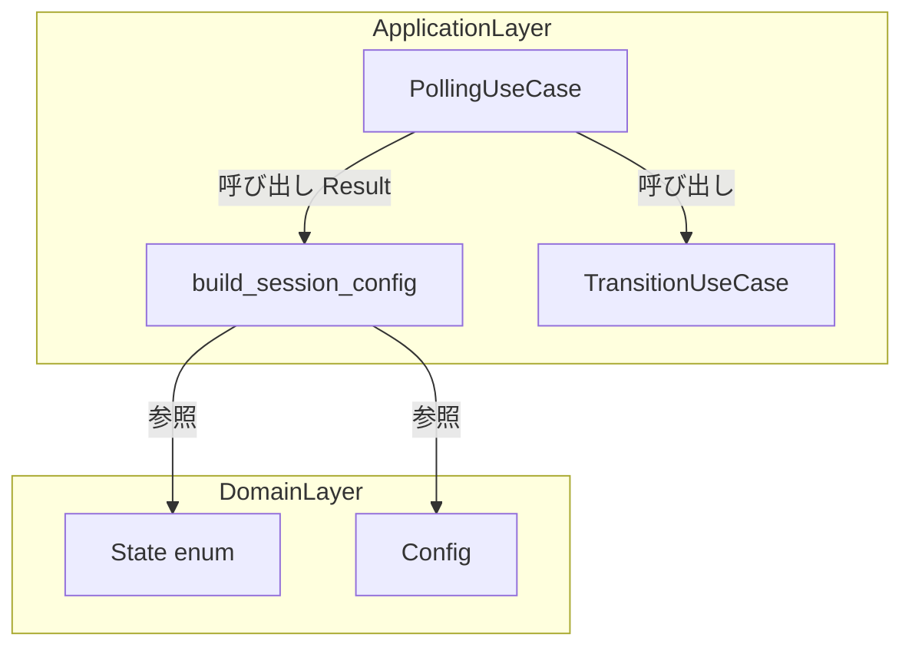
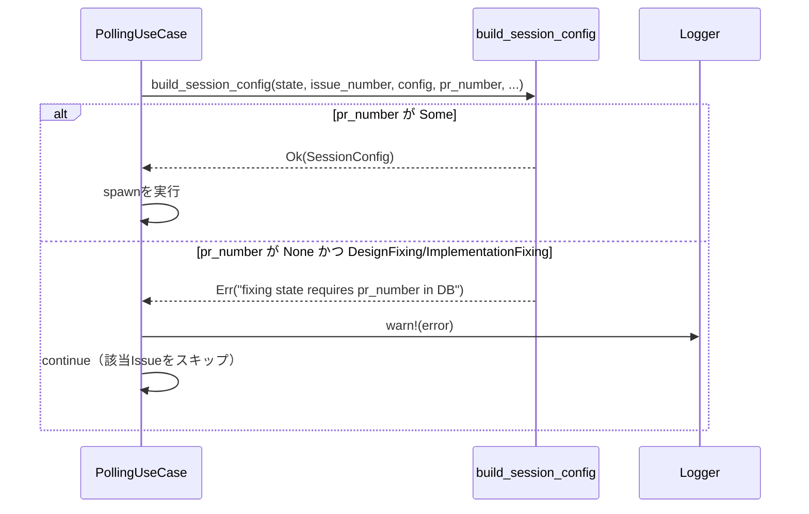

# Design Document: replace-expect-with-context

## Overview

本番コードに残存する `expect()` 呼び出しをエラー伝播パターン `.context()?` に置き換え、デーモン全体がpanicでクラッシュするリスクを排除する。加えて `clippy::expect_used = "deny"` lint を追加して再発を静的に防止する。

**Purpose**: panic（デーモン全体クラッシュ）をエラー伝播（対象Issueのみスキップ）に変更し、システムの耐障害性を向上させる。  
**Users**: cupola デーモンの運用者。万が一DBに `pr_number` が存在しない不整合が発生しても、他のIssueの処理が継続される。  
**Impact**: `build_session_config` の戻り値型が `SessionConfig` → `Result<SessionConfig, anyhow::Error>` に変わり、呼び出し元 `step7_spawn_processes` でのエラースキップ処理が追加される。

### Goals

- `src/application/prompt.rs` の2箇所と `src/application/transition_use_case.rs` の1箇所で `expect()` を排除する
- `cargo clippy` で `expect_used = "deny"` による静的チェックを有効化する
- テストコードでの `expect()` 使用は引き続き許可する

### Non-Goals

- `src/application/session_manager.rs:86` の `expect("wait after kill")` は変更しない
- `SessionConfigError` などの専用エラー型の新設は行わない
- 既存のエラーハンドリング構造（`step6_apply_events` の `if let Err(e)` など）の変更は行わない

## Architecture

### Existing Architecture Analysis

本変更は **application レイヤー**（`src/application/`）のみに閉じている。Clean Architecture の依存方向は変わらず、ドメイン・アダプター・ブートストラップレイヤーへの影響はない。

既存パターン:
- applicationレイヤーは `anyhow::Context` を使用してエラーコンテキストを付加するパターンを採用済み
- `step7_spawn_processes` はIssueのループ処理で既に `continue` によるスキップパターンを利用
- `step6_apply_events` は `if let Err(e)` でエラーをキャッチ済み

### Architecture Pattern & Boundary Map



**Architecture Integration**:
- 既存の Clean Architecture パターンを維持。変更は application レイヤー内部に閉じる
- `build_session_config` の戻り値型変更により、`PollingUseCase` が `Result` を介してエラーをハンドル
- 新規コンポーネントは不要。既存の関数シグネチャ変更のみ

### Technology Stack

| Layer | Choice / Version | Role in Feature | Notes |
|-------|------------------|-----------------|-------|
| Backend / Services | Rust Edition 2024 | エラーハンドリングパターンの変更 | `anyhow::Context` trait の `?` 演算子を使用 |
| Infrastructure | `anyhow` crate（既存） | `Result<T, anyhow::Error>` 型の利用 | 追加依存なし |
| CI / Lint | `clippy::expect_used = "deny"` | `expect()` 混入を静的に防止 | `Cargo.toml` の `[lints.clippy]` セクションに追記 |

## System Flows



## Requirements Traceability

| Requirement | Summary | Components | Interfaces | Flows |
|-------------|---------|------------|------------|-------|
| 1.1 | build_session_config の戻り値を Result に変更 | BuildSessionConfig | `build_session_config() -> Result<SessionConfig>` | step7_spawn_processes ループ |
| 1.2 | DesignFixing 時 pr_number=None で Err を返す | BuildSessionConfig | 同上 | エラー伝播フロー |
| 1.3 | ImplementationFixing 時 pr_number=None で Err を返す | BuildSessionConfig | 同上 | エラー伝播フロー |
| 1.4 | step7_spawn_processes でエラー時スキップ | PollingUseCase | step7_spawn_processes | エラースキップフロー |
| 1.5 | エラーを warn/error ログ出力 | PollingUseCase | step7_spawn_processes | エラースキップフロー |
| 2.1 | find_by_id の None を Err に変更 | TransitionUseCase | reset_for_restart 後の find_by_id | step6_apply_events |
| 2.2 | step6_apply_events のエラーハンドリングは変更不要 | PollingUseCase | step6_apply_events | 既存エラーハンドリング |
| 2.3 | 周辺エラーハンドリングロジックは変更しない | PollingUseCase | step6_apply_events | - |
| 3.1 | expect_used = "deny" を Cargo.toml に追加 | ClippyConfig | Cargo.toml | cargo clippy CI |
| 3.2 | all = "warn" の確認（既存） | ClippyConfig | Cargo.toml | - |
| 3.3 | テストコードで expect_used を許可 | LibRs | src/lib.rs | cfg_attr |
| 3.4 | 本番コードの新規 expect() を CI で拒否 | ClippyConfig | Cargo.toml | cargo clippy |
| 3.5 | テストブロック内の expect() はエラーにしない | LibRs | src/lib.rs | cfg_attr |
| 4.1 | session_manager.rs:86 は変更しない | - | - | - |
| 4.2 | kill 直後の wait は実質到達不可能のため維持 | - | - | - |

## Components and Interfaces

| Component | Layer | Intent | Req Coverage | Key Dependencies | Contracts |
|-----------|-------|--------|--------------|------------------|-----------|
| BuildSessionConfig | application | セッション設定を構築し Result を返す | 1.1–1.3 | State, Config (P0) | Service |
| PollingUseCase (step7) | application | Issueループ処理でエラー時スキップ | 1.4, 1.5 | BuildSessionConfig (P0) | Service |
| TransitionUseCase | application | reset後のfind_by_idをエラー伝播に変更 | 2.1–2.3 | IssueRepository (P0) | Service |
| ClippyConfig | build config | expect_used=deny でlint強制 | 3.1–3.4 | Cargo.toml (P0) | - |
| LibRs | entry point | テストコードで expect_used を許可 | 3.3, 3.5 | src/lib.rs (P0) | - |

### Application Layer

#### BuildSessionConfig

| Field | Detail |
|-------|--------|
| Intent | State・issue_number・config・pr_number からセッション設定を構築し、不正状態は Err で返す |
| Requirements | 1.1, 1.2, 1.3 |

**Responsibilities & Constraints**
- DesignFixing および ImplementationFixing 状態で `pr_number` が `None` の場合は `Err` を返す
- それ以外の状態は従来通り `Ok(SessionConfig)` を返す
- I/O なし。純粋関数として動作を維持

**Dependencies**
- Inbound: `PollingUseCase::step7_spawn_processes` — 呼び出し元 (P0)
- Outbound: `State` enum — 状態判定 (P0)
- External: `anyhow::Context` — コンテキストメッセージ付加 (P0)

**Contracts**: Service [x]

##### Service Interface

```rust
pub fn build_session_config(
    state: State,
    issue_number: u64,
    config: &Config,
    pr_number: Option<u64>,
    feature_name: Option<&str>,
    fixing_causes: &[FixingProblemKind],
) -> anyhow::Result<SessionConfig>
```

- Preconditions: なし（引数はすべてコンパイル時に型保証済み）
- Postconditions: DesignFixing/ImplementationFixing かつ `pr_number == None` の場合は必ず `Err` を返す
- Invariants: `Ok` を返す場合は必ず有効な `SessionConfig` を含む

**Implementation Notes**
- `pr_number.context("fixing state requires pr_number in DB")?` で既存の `expect()` を置き換える
- 戻り値型変更により呼び出し元（`step7_spawn_processes`）の型注釈も更新が必要

#### PollingUseCase — step7_spawn_processes

| Field | Detail |
|-------|--------|
| Intent | Issueごとにセッション設定を構築し、エラー時は warn ログを出してスキップ |
| Requirements | 1.4, 1.5 |

**Responsibilities & Constraints**
- `build_session_config` が `Err` を返した場合、該当Issueのspawnをスキップして次のIssueへ進む
- 他のIssueへの影響はない（ループ継続）

**Dependencies**
- Inbound: ポーリングループ (P0)
- Outbound: `build_session_config` (P0)

**Contracts**: Service [x]

**Implementation Notes**
- `match build_session_config(...) { Ok(cfg) => { ... }, Err(e) => { tracing::warn!(...); continue; } }` パターンを採用
- 既存の `continue` パターンと一貫性を保つ

#### TransitionUseCase

| Field | Detail |
|-------|--------|
| Intent | `reset_for_restart` 後の `find_by_id` で `expect()` を `?` に置き換え |
| Requirements | 2.1, 2.2, 2.3 |

**Responsibilities & Constraints**
- `find_by_id` が `None` を返した場合は `context("issue not found after reset_for_restart")?` でエラーとして伝播
- 呼び出し元 `step6_apply_events` の `if let Err(e)` が既存のままエラーをキャッチ

**Dependencies**
- Inbound: `PollingUseCase::step6_apply_events` (P0)
- Outbound: `IssueRepository::find_by_id` (P0)
- External: `anyhow::Context` (P0)

**Contracts**: Service [x]

**Implementation Notes**
- `.ok_or_else(|| anyhow::anyhow!("issue not found after reset_for_restart"))` または `.context("issue not found after reset_for_restart")?` を使用
- `step6_apply_events` の変更は不要

### Build Configuration

#### ClippyConfig & LibRs

| Field | Detail |
|-------|--------|
| Intent | `expect_used = "deny"` lint の有効化とテストコードでの除外 |
| Requirements | 3.1, 3.2, 3.3, 3.4, 3.5 |

**Contracts**: —

**Cargo.toml の変更**:

```toml
[lints.clippy]
all = "warn"
expect_used = "deny"  # 追記
```

**src/lib.rs の変更**:

```rust
#![cfg_attr(test, allow(clippy::expect_used))]
// (ファイル先頭付近に追記)
```

**Implementation Notes**
- `[lints.clippy]` セクションはすでに存在するため追記のみ
- `cfg_attr` はクレートレベルアトリビュートとして `src/lib.rs` の先頭に配置する
- 変更後は `cargo clippy -- -D warnings` でエラーがないことを確認する

## Error Handling

### Error Strategy

本変更はエラー戦略自体の変更である。変更後の方針:

- `build_session_config` の失敗（pr_number欠如）→ applicationレイヤーで `warn` ログ + 対象Issueスキップ（Graceful Degradation）
- `find_by_id` の失敗（reset後不整合）→ `Err` 伝播 → `step6_apply_events` の既存エラーハンドリングでキャッチ

### Monitoring

`step7_spawn_processes` でのスキップ時に `tracing::warn!` でログ出力する。これにより既存のログ収集基盤でエラーを検知可能。

## Testing Strategy

### Unit Tests

- `build_session_config` に `pr_number = None` かつ DesignFixing を渡したとき `Err` が返ること
- `build_session_config` に `pr_number = None` かつ ImplementationFixing を渡したとき `Err` が返ること
- `build_session_config` に `pr_number = None` かつ他の状態を渡したとき `Ok` が返ること

### Integration Tests

- `step7_spawn_processes` で `build_session_config` が `Err` を返すIssueが存在しても他のIssueのspawnが実行されること
- `transition_use_case` の `reset_for_restart` 後に `find_by_id` が `None` を返す場合に `Err` が伝播されること

### Lint Verification

- `cargo clippy -- -D warnings` が全エラーなしで通過すること
- テストコード内の `expect()` が `deny` エラーにならないこと
