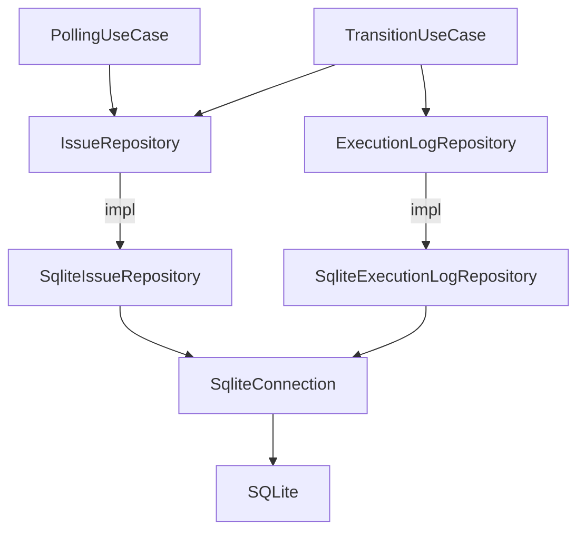

# 技術設計書: sqlite-mutex-error-propagation

## Overview

**Purpose**: SQLite アダプター層の `.expect("mutex poisoned")` と `.expect("spawn_blocking panicked")` を `map_err` + `?` によるエラー伝搬に置き換え、mutex 毒化やタスクパニック時のプロセスクラッシュを防ぐ。

**Users**: Cupola のランタイム（`polling_use_case`、`transition_use_case`）が SQLite アダプターを使用する際、mutex 毒化が発生してもプロセスが継続できるようになる。

**Impact**: `sqlite_connection.rs`、`sqlite_execution_log_repository.rs`、`sqlite_issue_repository.rs` の本番コード計11箇所（mutex lock）と対応する spawn_blocking `await` 箇所が変更される。トレイトシグネチャや呼び出し元コードへの影響はない。

### Goals

- 本番コードの `.expect("mutex poisoned")` 全11箇所を `map_err` + `?` に置換する
- `.await.expect("spawn_blocking panicked")` を `map_err` + `?` に置換する
- `cargo test` および `cargo clippy -- -D warnings` が通過する状態を維持する

### Non-Goals

- エラー型の変更（`anyhow::Result` → `CupolaError` への変更は行わない）
- テストコード内の `.expect()` の変更
- mutex のリカバリロジックや再試行処理の追加

## Requirements Traceability

| Requirement | Summary | Components | Interfaces | Flows |
|-------------|---------|------------|------------|-------|
| 1.1 | 本番コード11箇所の mutex expect を map_err に置換 | SqliteIssueRepository, SqliteExecutionLogRepository, SqliteConnection | `-> anyhow::Result<T>` | — |
| 1.2 | mutex 毒化時にパニックしない | 同上 | 同上 | — |
| 1.3 | 対象11箇所を網羅 | 同上 | — | — |
| 1.4 | トレイトシグネチャを維持 | 同上 | IssueRepository, ExecutionLogRepository | — |
| 2.1 | spawn_blocking の await expect を map_err に置換 | SqliteIssueRepository, SqliteExecutionLogRepository | `-> anyhow::Result<T>` | — |
| 2.2 | spawn_blocking パニック時にエラー伝搬 | 同上 | 同上 | — |
| 2.3 | 戻り値型 Result<T> を維持 | 同上 | 同上 | — |
| 3.1 | テストコードの .expect() を変更しない | SqliteConnection | — | — |
| 3.2 | #[cfg(test)] ブロック内は対象外 | 全対象ファイル | — | — |
| 4.1 | cargo test 通過 | 全対象ファイル | — | — |
| 4.2 | cargo clippy 通過 | 全対象ファイル | — | — |
| 4.3 | cargo fmt 準拠 | 全対象ファイル | — | — |

## Architecture

### Existing Architecture Analysis

本フィーチャーは既存の Clean Architecture を変更しない。変更はすべて `adapter/outbound/` 内の実装詳細に閉じている。

- **アーキテクチャ層**: `adapter/outbound/` のみ
- **影響範囲**: `sqlite_connection.rs`、`sqlite_execution_log_repository.rs`、`sqlite_issue_repository.rs`
- **維持されるもの**: `IssueRepository` トレイト（application 層）、`ExecutionLogRepository` トレイト（application 層）のシグネチャはそのまま

### Architecture Pattern & Boundary Map



変更対象はすべて `SqliteIssueRepository`、`SqliteExecutionLogRepository`、`SqliteConnection` 内部に閉じており、上位レイヤーへの影響はない。

### Technology Stack

| Layer | Choice / Version | Role in Feature | Notes |
|-------|------------------|-----------------|-------|
| Backend / Services | Rust（Edition 2024）| 置換対象コードの言語 | — |
| Data / Storage | rusqlite + SQLite（WAL mode）| DB接続管理 | 変更なし |
| Infrastructure / Runtime | tokio（spawn_blocking）| 非同期タスク管理 | JoinError を anyhow::Error に変換 |
| Error | anyhow | エラー伝搬 | `anyhow::anyhow!()` でラップ |

## Components and Interfaces

| Component | Domain/Layer | Intent | Req Coverage | Key Dependencies | Contracts |
|-----------|--------------|--------|--------------|------------------|-----------|
| SqliteConnection | adapter/outbound | DB接続ラッパー（mutex 管理） | 1.1, 1.2, 1.3, 3.1, 3.2 | rusqlite（P0） | Service |
| SqliteIssueRepository | adapter/outbound | IssueRepository トレイト実装 | 1.1〜1.4, 2.1〜2.3, 3.2, 4.1〜4.3 | SqliteConnection（P0） | Service |
| SqliteExecutionLogRepository | adapter/outbound | ExecutionLogRepository トレイト実装 | 1.1〜1.4, 2.1〜2.3, 3.2, 4.1〜4.3 | SqliteConnection（P0） | Service |

### adapter/outbound

#### SqliteConnection

| Field | Detail |
|-------|--------|
| Intent | `Arc<Mutex<Connection>>` のラッパー。`init_schema()` 内の mutex lock を `map_err` で安全化 |
| Requirements | 1.1, 1.2, 1.3, 3.1, 3.2 |

**Responsibilities & Constraints**

- `init_schema()` 内の `db.conn().lock().expect("mutex poisoned")` を `map_err` + `?` に変更（L42）
- テストコード（L124, L154, L188）は変更しない

**Dependencies**

- External: rusqlite — SQLite 接続（P0）

**Contracts**: Service [x]

##### Service Interface

```rust
impl SqliteConnection {
    pub fn init_schema(&self) -> anyhow::Result<()>;
    // その他のメソッドは変更なし
}
```

- Preconditions: `Arc<Mutex<Connection>>` が有効な状態
- Postconditions: エラー時は `anyhow::Error` を返す（パニックしない）
- Invariants: `MutexGuard` の lifetime はブロック内に閉じている

**Implementation Notes**

- Integration: シグネチャは変更なし
- Validation: `cargo test` のテストコードの `.expect()` が変更されていないことを確認
- Risks: なし

---

#### SqliteIssueRepository

| Field | Detail |
|-------|--------|
| Intent | `IssueRepository` トレイトの SQLite 実装。mutex lock と spawn_blocking の両方のエラーを伝搬 |
| Requirements | 1.1, 1.2, 1.3, 1.4, 2.1, 2.2, 2.3, 3.2, 4.1, 4.2, 4.3 |

**Responsibilities & Constraints**

- 以下8メソッド内の mutex lock を `map_err` + `?` に変更:
  `find_by_id()`, `find_by_issue_number()`, `find_active()`, `find_needing_process()`, `save()`, `update_state()`, `update()`, `reset_for_restart()`
- 各メソッド末尾の `.await.expect("spawn_blocking panicked")` を `map_err` + `?` に変更
- `IssueRepository` トレイトのシグネチャは変更しない

**Dependencies**

- Inbound: application 層 use case（`PollingUseCase`, `TransitionUseCase`）— IssueRepository トレイトを介して呼び出し（P0）
- External: rusqlite — SQLite クエリ実行（P0）
- External: tokio — `spawn_blocking`（P0）

**Contracts**: Service [x]

##### Service Interface

```rust
// IssueRepository トレイト（変更なし）
#[async_trait]
impl IssueRepository for SqliteIssueRepository {
    async fn find_by_id(&self, id: i64) -> anyhow::Result<Option<Issue>>;
    async fn find_by_issue_number(&self, number: i64) -> anyhow::Result<Option<Issue>>;
    async fn find_active(&self) -> anyhow::Result<Vec<Issue>>;
    async fn find_needing_process(&self) -> anyhow::Result<Vec<Issue>>;
    async fn save(&self, issue: &Issue) -> anyhow::Result<()>;
    async fn update_state(&self, id: i64, state: &State) -> anyhow::Result<()>;
    async fn update(&self, issue: &Issue) -> anyhow::Result<()>;
    async fn reset_for_restart(&self, id: i64) -> anyhow::Result<()>;
}
```

- Preconditions: `SqliteConnection` が初期化済み
- Postconditions: mutex 取得失敗時は `anyhow::Error("failed to acquire database lock")` を返す
- Postconditions: spawn_blocking 失敗時は `anyhow::Error("spawn_blocking task failed: ...")` を返す

**Implementation Notes**

- Integration: 変換パターン統一（`map_err(|_| anyhow::anyhow!("failed to acquire database lock"))?` および `.await.map_err(|e| anyhow::anyhow!("spawn_blocking task failed: {e}"))?`）
- Validation: `cargo clippy -- -D warnings` で警告なしを確認
- Risks: なし

---

#### SqliteExecutionLogRepository

| Field | Detail |
|-------|--------|
| Intent | `ExecutionLogRepository` トレイトの SQLite 実装。mutex lock と spawn_blocking の両方のエラーを伝搬 |
| Requirements | 1.1, 1.2, 1.3, 1.4, 2.1, 2.2, 2.3, 3.2, 4.1, 4.2, 4.3 |

**Responsibilities & Constraints**

- 以下3メソッド内の mutex lock を `map_err` + `?` に変更:
  `record_start()`, `record_finish()`, `find_by_issue()`
- 各メソッド末尾の `.await.expect("spawn_blocking panicked")` を `map_err` + `?` に変更
- `ExecutionLogRepository` トレイトのシグネチャは変更しない

**Dependencies**

- Inbound: application 層 use case（`TransitionUseCase`）— ExecutionLogRepository トレイトを介して呼び出し（P0）
- External: rusqlite — SQLite クエリ実行（P0）
- External: tokio — `spawn_blocking`（P0）

**Contracts**: Service [x]

##### Service Interface

```rust
// ExecutionLogRepository トレイト（変更なし）
#[async_trait]
impl ExecutionLogRepository for SqliteExecutionLogRepository {
    async fn record_start(&self, issue_id: i64, session_id: &str) -> anyhow::Result<()>;
    async fn record_finish(&self, issue_id: i64, success: bool) -> anyhow::Result<()>;
    async fn find_by_issue(&self, issue_id: i64) -> anyhow::Result<Vec<ExecutionLog>>;
}
```

- Preconditions: `SqliteConnection` が初期化済み
- Postconditions: `SqliteIssueRepository` と同一のエラーメッセージパターンを使用

**Implementation Notes**

- Integration: `SqliteIssueRepository` と同一の変換パターンを使用
- Validation: `cargo test` で既存テストの通過を確認
- Risks: なし

## Error Handling

### Error Strategy

mutex lock 失敗および spawn_blocking 失敗を `anyhow::Error` として呼び出し元に伝搬する。呼び出し元（use case 層）が既存のエラーハンドリングロジックで処理する。

### Error Categories and Responses

**System Errors**: mutex 毒化（前の lock 保持中にパニック発生時のみ）、spawn_blocking タスクパニック

| エラー源 | 変換前 | 変換後 | エラーメッセージ |
|---------|-------|-------|----------------|
| `mutex.lock()` 失敗 | `expect("mutex poisoned")` → パニック | `anyhow::Error` を返す | `"failed to acquire database lock"` |
| `.await` on spawn_blocking 失敗 | `expect("spawn_blocking panicked")` → パニック | `anyhow::Error` を返す | `"spawn_blocking task failed: {e}"` |

### Monitoring

既存の `tracing` ベースのログ基盤に変更なし。エラー伝搬後は上位レイヤーのログ出力に委ねる。

## Testing Strategy

### Unit Tests

- 変更後の各メソッドが `cargo test` でパスすること（既存テスト）
- テストコード内の `.expect()` が変更されていないこと

### Integration Tests

- `tests/` ディレクトリの既存統合テストが引き続きパスすること
- SQLite in-memory DB を使用したテストが正常に動作すること

### Static Analysis

- `cargo clippy -- -D warnings` でエラー・警告が0件であること
- `cargo fmt --check` で整形済みであること
