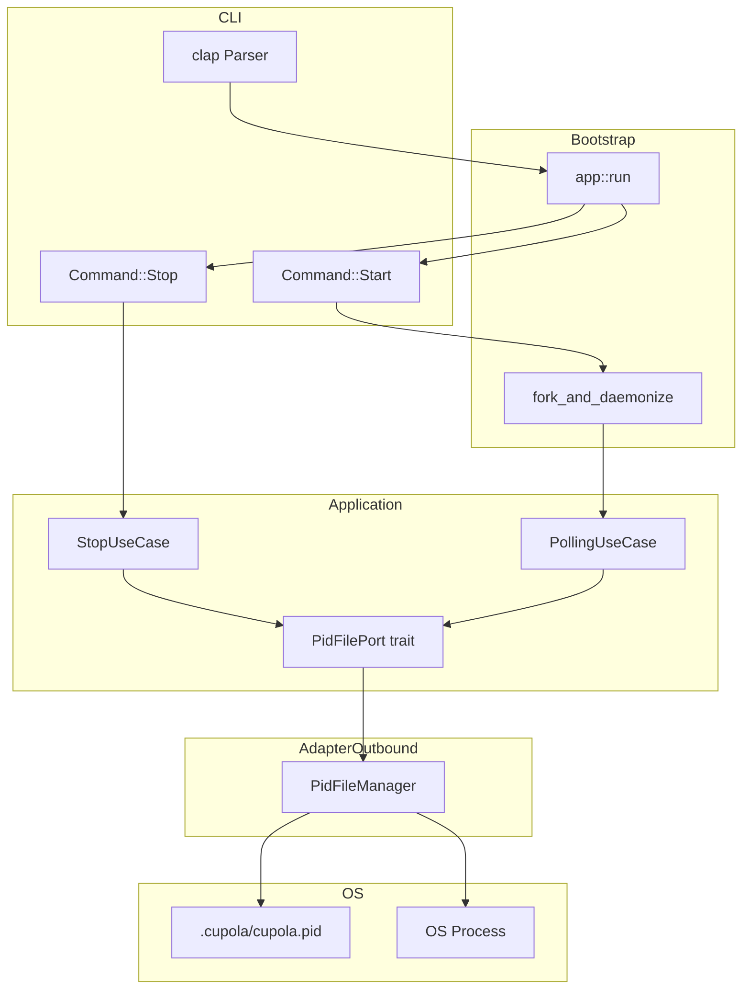
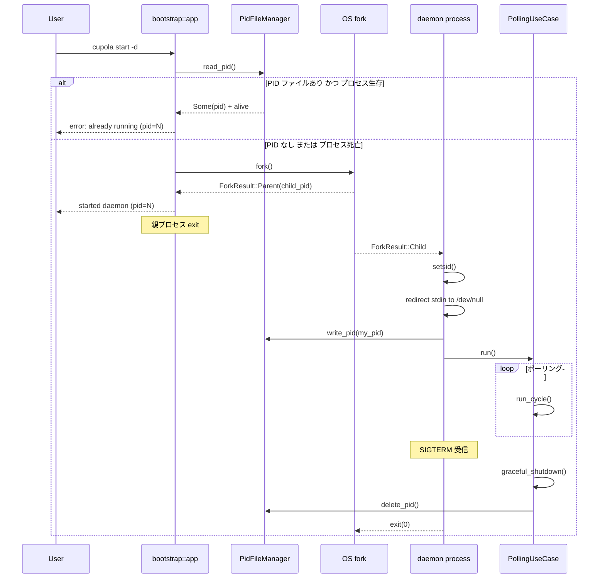
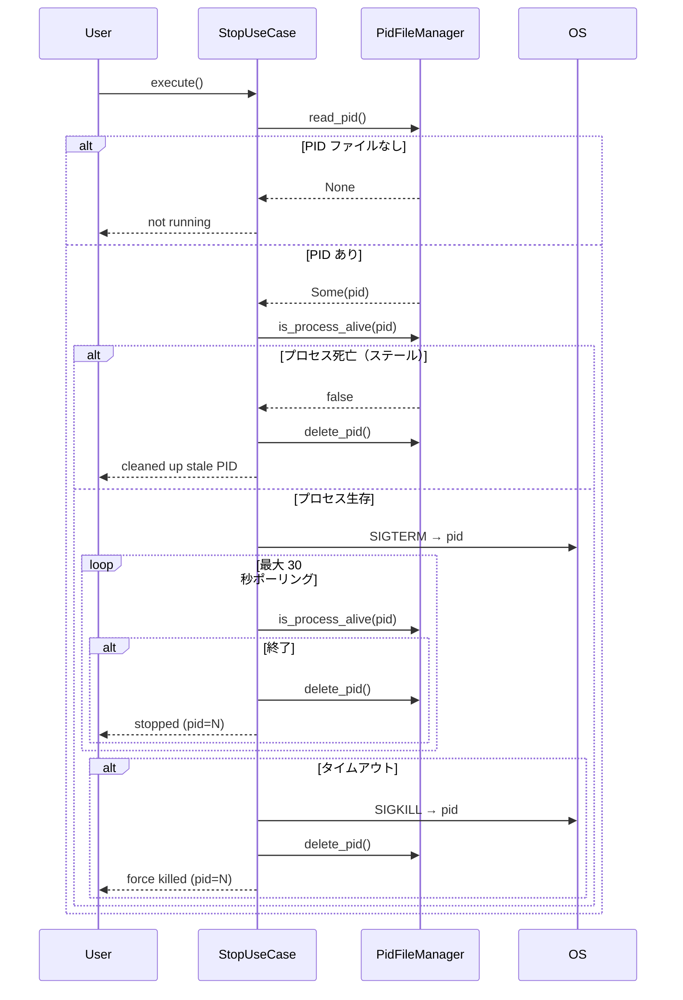

# Design Document: start-stop-daemon

## Overview

本機能は cupola の起動・停止インターフェースを改善する。`cupola run` を `cupola start` にリネームし、`-d/--daemon` オプションによるバックグラウンド（デーモン）起動と、`cupola stop` コマンドによる確実な停止機能を追加する。

**Purpose**: ターミナルセッションに依存しない安定したエージェント実行環境を提供し、スリープ復帰後でも `cupola stop` で確実に停止できるようにする。

**Users**: cupola を日常的に使う開発者。ターミナルマルチプレクサ（zellij など）経由での操作や、バックグラウンド常駐を前提とした運用が対象。

**Impact**: CLI のサブコマンド体系を変更する（`run` → `start` リネーム + `stop` 追加）。PID ファイル管理レイヤーが追加される。

### Goals

- `cupola start` でフォアグラウンド起動（既存 `run` と同等の動作）
- `cupola start -d` でデーモン起動（ターミナル非依存、PID 記録）
- `cupola stop` で確実なデーモン停止（SIGTERM + タイムアウト時 SIGKILL）
- 二重起動防止（PID ファイルによるプロセス生死確認）

### Non-Goals

- Windows 対応（本機能は Unix 専用）
- systemd / launchd との統合
- `cupola restart` コマンド
- デーモンのステータス確認専用コマンド（`cupola status` は既存実装で代替）

---

## Architecture

### Existing Architecture Analysis

現在の `Command::Run` 処理は `src/bootstrap/app.rs` が担い、設定ロード → ロギング初期化 → SQLite → GitHub アダプター → `PollingUseCase::run()` という一直線のフローである。シグナルハンドリングは `PollingUseCase` の `tokio::select!` 内で `tokio::signal::ctrl_c()` のみ対応。

変更は以下の 4 点に限定される:
1. `cli.rs`: `Command::Run` → `Command::Start` リネーム + `-d` フラグ追加 + `Command::Stop` 追加
2. `app.rs`: 新コマンドのディスパッチ追加 + デーモン fork ロジック
3. `PollingUseCase`: SIGTERM 受信 + PID ファイル削除
4. 新規ファイル: `adapter/outbound/pid_file_manager.rs` + `application/port/pid_file.rs` + `application/stop_use_case.rs`

### Architecture Pattern & Boundary Map



- **選択パターン**: 既存の Clean Architecture を維持。新規コンポーネントは各レイヤーの責務に従って配置
- **境界**: デーモン fork は bootstrap 層の責務（全具象型を知る唯一のレイヤー）
- **既存パターンの維持**: `PidFilePort` トレイト → `PidFileManager` 実装のパターンは他のポート（例: `IssueRepository`）と一貫

### Technology Stack

| レイヤー | 選択 / バージョン | 本機能での役割 | 備考 |
|---------|-----------------|--------------|------|
| CLI | clap 4 (derive) | `Start`/`Stop` サブコマンド定義 | 既存 |
| Signal | tokio::signal::unix | SIGTERM 非同期受信 | tokio "full" に含まれる、追加依存不要 |
| Daemon | nix 0.29（新規） | `fork()`, `setsid()`, `kill()` | Unix 限定依存として追加 |
| Storage | ファイルシステム | PID ファイル読み書き | SQLite は使わない |
| Error | anyhow (adapter/bootstrap), thiserror (app) | 既存方針通り | 変更なし |

---

## System Flows

### cupola start -d（デーモン起動フロー）



### cupola stop フロー



---

## Requirements Traceability

| 要件 | 概要 | コンポーネント | インターフェース | フロー |
|------|------|--------------|----------------|--------|
| 1.1 | `start` サブコマンド追加 | cli.rs, app.rs | `Command::Start` | - |
| 1.2 | `run` サブコマンド削除 | cli.rs | `Command::Run` 削除 | - |
| 1.3 | フォアグラウンド起動 | app.rs, PollingUseCase | 既存フロー | - |
| 1.4 | 既存オプション継承 | cli.rs | `Start` バリアントフィールド | - |
| 1.5 | SIGINT/SIGTERM 終了 | PollingUseCase | `run()` select ブランチ | - |
| 2.1 | `-d/--daemon` フラグ | cli.rs | `Command::Start.daemon: bool` | - |
| 2.2 | デーモン起動 | app.rs fork_and_daemonize | `fork()`, `setsid()` | daemon start flow |
| 2.3 | PID 記録 | PidFileManager | `write_pid()` | daemon start flow |
| 2.4 | stdout/stderr リダイレクト | app.rs fork | `/dev/null`, tracing-appender | daemon start flow |
| 2.5 | 起動確認メッセージ | app.rs | stdout print | daemon start flow |
| 2.6 | 二重起動防止 | app.rs, PidFileManager | `read_pid()` + `is_process_alive()` | daemon start flow |
| 2.7 | ステール PID 上書き | app.rs, PidFileManager | `is_process_alive()` → false | daemon start flow |
| 3.1 | `stop` サブコマンド追加 | cli.rs, app.rs | `Command::Stop` | stop flow |
| 3.2 | PID 読み取り | StopUseCase, PidFileManager | `read_pid()` | stop flow |
| 3.3 | SIGTERM 送信 | StopUseCase | `send_signal(SIGTERM)` | stop flow |
| 3.4 | 終了確認 + PID 削除 | StopUseCase | `wait_for_exit()` + `delete_pid()` | stop flow |
| 3.5 | PID ファイルなし時のメッセージ | StopUseCase | stdout print | stop flow |
| 3.6 | ステール PID の正常処理 | StopUseCase | `is_process_alive()` → cleanup | stop flow |
| 3.7 | 停止成功メッセージ | StopUseCase | stdout print | stop flow |
| 4.1 | PID ファイルパス | PidFileManager | 設定から解決 | - |
| 4.2 | `.gitignore` 追記 | InitFileGenerator | `GITIGNORE_ENTRIES` 定数 | - |
| 4.3 | PID ファイル維持 | PidFileManager | `write_pid()` | - |
| 4.4 | シャットダウン時 PID 削除 | PollingUseCase | `graceful_shutdown()` 末尾 | - |
| 4.5 | PID 書き込み失敗 | app.rs, PidFileManager | エラー返却 + 終了 | - |
| 5.1 | ポーリングサイクル完了待機 | PollingUseCase | 既存 graceful_shutdown | - |
| 5.2 | タイムアウト SIGKILL | StopUseCase | `wait_for_exit(timeout)` | stop flow |
| 5.3 | ログフラッシュ | PollingUseCase | WorkerGuard ドロップ | - |
| 5.4 | 終了コード 0 | PollingUseCase, StopUseCase | `Ok(())` | - |

---

## Components and Interfaces

### コンポーネント一覧

| コンポーネント | レイヤー | 役割 | 要件カバレッジ | 主要依存 | 契約 |
|--------------|---------|------|--------------|---------|------|
| `cli.rs` 変更 | adapter/inbound | CLI 定義（Start/Stop） | 1.1, 1.2, 1.4, 2.1, 3.1 | clap | Service |
| `app.rs` 変更 | bootstrap | コマンドディスパッチ + fork | 1.3, 2.2–2.7, 4.5 | nix, PidFileManager, StopUseCase | Service |
| `PidFilePort` | application/port | PID ファイル操作の抽象 | 4.1–4.5 | - | Service |
| `PidFileManager` | adapter/outbound | PID ファイル実装 + kill | 2.3, 3.2–3.6, 4.1–4.5 | nix, fs | Service |
| `StopUseCase` | application | 停止ユースケース | 3.2–3.7, 5.2, 5.4 | PidFilePort | Service |
| `PollingUseCase` 変更 | application | SIGTERM 対応 + PID 削除 | 1.5, 4.4, 5.1, 5.3 | PidFilePort | Service |
| `InitFileGenerator` 変更 | adapter/outbound | `.gitignore` に `.cupola/cupola.pid` 追加 | 4.2 | fs | - |

---

### adapter/inbound

#### `cli.rs` の変更

| フィールド | 詳細 |
|-----------|------|
| Intent | `Command::Run` を `Command::Start` にリネーム、`daemon` フラグ追加、`Command::Stop` 追加 |
| Requirements | 1.1, 1.2, 1.4, 2.1, 3.1 |

**変更内容**

```
Command::Run { ... }
  ↓ リネーム
Command::Start {
    polling_interval_secs: Option<u64>,
    log_level: Option<String>,
    config: PathBuf,
    daemon: bool,          // 新規追加（-d / --daemon）
}

Command::Stop {            // 新規追加
    config: PathBuf,       // PID ファイルパス解決に使用
}
```

**Implementation Notes**

- `Command::Run` の全フィールドをそのまま `Command::Start` に継承する
- `daemon` フラグは `#[arg(short = 'd', long)]` で定義
- テスト内の `Command::Run` 参照もすべて `Command::Start` に更新する

---

### bootstrap

#### `app.rs` の変更

| フィールド | 詳細 |
|-----------|------|
| Intent | `Command::Start`/`Stop` のディスパッチ + デーモン化ロジック |
| Requirements | 1.3, 2.2–2.7, 4.5 |

**Responsibilities & Constraints**

- `Command::Start { daemon: false }` → 既存の `run` フローと同一（PID ファイル不要）
- `Command::Start { daemon: true }` → 二重起動確認 → `fork_and_daemonize()` → 子プロセスでポーリング起動
- `Command::Stop` → `StopUseCase::execute()` を呼ぶ

**Dependencies**

- Outbound: `PidFileManager` — PID ファイル確認・書き込み（P0）
- Outbound: `nix::unistd` — `fork()`, `setsid()` （P0）
- Outbound: `StopUseCase` — 停止処理委譲（P0）

**Contracts**: Service [x]

##### Service Interface

```
fn start_foreground(cfg: Config) -> Result<()>
// 既存 run フローと同一

fn start_daemon(cfg: Config, pid_file: &PidFileManager) -> Result<()>
// 1. pid_file.read_pid() で二重起動確認
// 2. fork()
//   - 親: child_pid を stdout に出力 → exit(0)
//   - 子: setsid() → stdin を /dev/null に → pid_file.write_pid(getpid()) → polling 起動

fn stop(cfg: Config) -> Result<()>
// StopUseCase::execute() に委譲
```

**Implementation Notes**

- fork 前に SQLite 接続・tracing などのリソースを初期化しないこと。子プロセスが初期化を担う
- 親プロセスは `fork()` 後に `println!("started cupola daemon (pid={})", child_pid)` して `std::process::exit(0)`
- 子プロセスの `init_logging()` は `log_dir` が設定されている場合のみファイルへ出力。`None` の場合はデーモン起動をエラーにする（ログ先不明のため）

---

### application/port

#### `PidFilePort` トレイト

| フィールド | 詳細 |
|-----------|------|
| Intent | PID ファイル操作の抽象インターフェース |
| Requirements | 4.1–4.5 |

**Contracts**: Service [x]

##### Service Interface

```rust
pub trait PidFilePort: Send + Sync {
    /// PID ファイルに pid を書き込む。
    fn write_pid(&self, pid: u32) -> Result<(), PidFileError>;

    /// PID ファイルから pid を読み込む。ファイルが存在しない場合は None。
    fn read_pid(&self) -> Result<Option<u32>, PidFileError>;

    /// PID ファイルを削除する。ファイルが存在しない場合は Ok。
    fn delete_pid(&self) -> Result<(), PidFileError>;

    /// 指定 PID のプロセスが生存しているか確認する。
    fn is_process_alive(&self, pid: u32) -> bool;
}

#[derive(Debug, thiserror::Error)]
pub enum PidFileError {
    #[error("failed to write PID file: {0}")]
    Write(String),
    #[error("failed to read PID file: {0}")]
    Read(String),
    #[error("failed to delete PID file: {0}")]
    Delete(String),
    #[error("PID file contains invalid content: {0}")]
    InvalidContent(String),
}
```

- Preconditions: `write_pid` 呼び出し前にディレクトリが存在すること
- Postconditions: `delete_pid` 後にファイルが存在しないこと
- Invariants: `write_pid(pid)` → `read_pid()` == `Some(pid)`

---

### application

#### `StopUseCase`

| フィールド | 詳細 |
|-----------|------|
| Intent | PID ファイルを読み取り SIGTERM 送信 → 終了確認 → PID 削除 |
| Requirements | 3.2–3.7, 5.2, 5.4 |

**Dependencies**

- Inbound: bootstrap/app.rs — `execute()` を呼ぶ（P0）
- Outbound: `PidFilePort` — PID 操作（P0）

**Contracts**: Service [x]

##### Service Interface

```rust
pub struct StopUseCase<P: PidFilePort> {
    pid_file: P,
    /// SIGTERM 送信後の終了待機タイムアウト（デフォルト 30 秒）
    shutdown_timeout: Duration,
}

impl<P: PidFilePort> StopUseCase<P> {
    pub fn new(pid_file: P, shutdown_timeout: Duration) -> Self;

    /// 停止を実行する。成功時 Ok(StopResult)。
    pub async fn execute(&self) -> Result<StopResult, StopError>;
}

pub enum StopResult {
    /// 正常停止（pid=N）
    Stopped { pid: u32 },
    /// ステール PID を削除して正常終了
    StalePidCleaned { pid: u32 },
    /// 起動していなかった
    NotRunning,
    /// タイムアウトにより SIGKILL で強制終了
    ForceKilled { pid: u32 },
}

#[derive(Debug, thiserror::Error)]
pub enum StopError {
    #[error("PID file error: {0}")]
    PidFile(#[from] PidFileError),
    #[error("failed to send signal: {0}")]
    Signal(String),
}
```

**Implementation Notes**

- Integration: `bootstrap/app.rs` の `Command::Stop` ブランチが `StopUseCase::execute()` を呼び、`StopResult` をもとにユーザーメッセージを出力する
- Validation: SIGTERM 送信後は 500ms 間隔でプロセス生死をポーリング。30 秒（デフォルト）超過で SIGKILL
- Risks: プロセスが SIGTERM を無視するケースは SIGKILL で対処済み

---

#### `PollingUseCase` の変更

| フィールド | 詳細 |
|-----------|------|
| Intent | SIGTERM ハンドリングの追加 + シャットダウン時 PID 削除 |
| Requirements | 1.5, 4.4, 5.1, 5.3 |

**変更内容**

```rust
// run() の tokio::select! に SIGTERM ブランチを追加
_ = sigterm.recv() => {
    tracing::info!("received SIGTERM, shutting down...");
    break;
}

// graceful_shutdown() の末尾で PID ファイル削除（daemon モード時のみ）
if let Some(ref pid_file) = self.pid_file {
    let _ = pid_file.delete_pid();
}
```

- `PollingUseCase` に `Option<Box<dyn PidFilePort>>` フィールドを追加。フォアグラウンド起動時は `None`、デーモン時は `Some(manager)`
- `run()` 内で `tokio::signal::unix::signal(SignalKind::terminate())` を初期化

---

### adapter/outbound

#### `PidFileManager`

| フィールド | 詳細 |
|-----------|------|
| Intent | `PidFilePort` の実装。ファイル読み書きと `nix::sys::signal::kill` によるプロセス操作 |
| Requirements | 2.3, 3.2–3.6, 4.1–4.5 |

**Dependencies**

- External: `nix::sys::signal` — `kill(Pid, Signal)` によるシグナル送信（P0）
- External: `std::fs` — PID ファイル読み書き（P0）

**Contracts**: Service [x]

##### Service Interface

```rust
pub struct PidFileManager {
    /// PID ファイルのパス（例: .cupola/cupola.pid）
    pid_file_path: PathBuf,
}

impl PidFileManager {
    pub fn new(pid_file_path: PathBuf) -> Self;
}

impl PidFilePort for PidFileManager {
    fn write_pid(&self, pid: u32) -> Result<(), PidFileError> { ... }
    fn read_pid(&self) -> Result<Option<u32>, PidFileError> { ... }
    fn delete_pid(&self) -> Result<(), PidFileError> { ... }
    fn is_process_alive(&self, pid: u32) -> bool { ... }
}
```

**Implementation Notes**

- Integration: `is_process_alive` は `nix::sys::signal::kill(Pid::from_raw(pid as i32), None)` で実装。シグナル 0 送信でプロセス存在確認
- Validation: `read_pid()` は PID ファイルの内容を `u32::parse()` してバリデーション。改行含む文字列は `trim()` してから解析
- Risks: 権限エラー（`kill` 呼び出しの EPERM）はプロセス生存として扱う（pid=0 に送信するケースを防ぐ）

---

## Data Models

### Domain Model

本機能で追加される永続データは PID ファイルのみ（軽量な値オブジェクト）。SQLite スキーマ変更なし。

- **PID ファイル**: `.cupola/cupola.pid` — デーモンプロセスの PID（ASCII の `u32` 1 行）
- 不変条件: デーモン起動中は常に有効な PID が記録されている

### Physical Data Model

**PID ファイル形式**:

```
<PID>\n
```

例: `12345\n`

- UTF-8 テキスト、改行 1 行のみ
- ファイル名: `cupola.pid`（固定）
- ディレクトリ: `--config` が指す `.cupola/` と同じディレクトリ

---

## Error Handling

### Error Strategy

- **Fail Fast**: デーモン起動前の二重起動確認・PID 書き込み失敗は即時エラー終了
- **Graceful Degradation**: ステール PID ファイルは自動クリーンアップして続行
- **User Context**: エラーメッセージに PID とファイルパスを含める

### Error Categories and Responses

| カテゴリ | 状況 | 対応 |
|---------|------|------|
| 二重起動 | `cupola start -d` でプロセスが既に生存 | エラーメッセージ + 非ゼロ終了 |
| ステール PID | PID ファイルあり・プロセス死亡 | 上書き or 削除して続行 |
| PID ファイル読み取り失敗 | 権限エラー等 | エラーメッセージ + 非ゼロ終了 |
| fork 失敗 | `nix::unistd::fork()` エラー | エラーメッセージ + 非ゼロ終了 |
| 停止タイムアウト | SIGTERM 後 30 秒でプロセス未終了 | SIGKILL + 警告メッセージ |
| `cupola stop` で未起動 | PID ファイルなし | 「起動していません」メッセージ + ゼロ終了 |

### Monitoring

- `tracing::info!` でデーモン起動 PID・停止シグナル送信・graceful shutdown 完了をログ出力
- `tracing::warn!` でタイムアウト SIGKILL をログ出力

---

## Testing Strategy

### Unit Tests

1. `PidFileManager::write_pid()` → `read_pid()` のラウンドトリップ（tempfile 使用）
2. `PidFileManager::delete_pid()` でファイル削除・存在しない場合も Ok
3. `PidFileManager::is_process_alive()` で生存プロセス（自身）と不正 PID の確認
4. `StopUseCase::execute()` — PID ファイルなしの場合（`NotRunning` を返す）
5. `StopUseCase::execute()` — ステール PID の場合（`StalePidCleaned` を返す）
6. `cli.rs` — `cupola start -d` のパース確認（`daemon: true`）
7. `cli.rs` — `cupola stop` のパース確認

### Integration Tests

1. フォアグラウンド起動パスが既存の `run` と同等に動作する（`tests/` の既存テスト流用）
2. `StopUseCase` + `PidFileManager` の連携（モック PID ファイルで SIGTERM 送信まで）
3. `PollingUseCase` が SIGTERM 受信で graceful_shutdown を呼ぶ確認（`tokio::spawn` + `kill(self_pid, SIGTERM)`）

### Security Considerations

- `kill()` は PID の検証を行い、`pid <= 0` の場合はエラーとして処理する
- PID ファイルのパーミッションは通常のファイル作成権限（600 推奨だが強制はしない）
- 他ユーザーの PID に SIGTERM を送る場合は EPERM を適切にエラーハンドリングする
