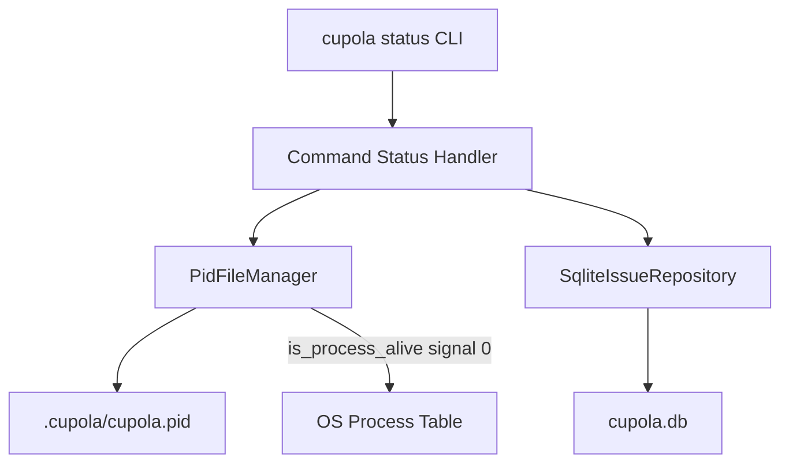
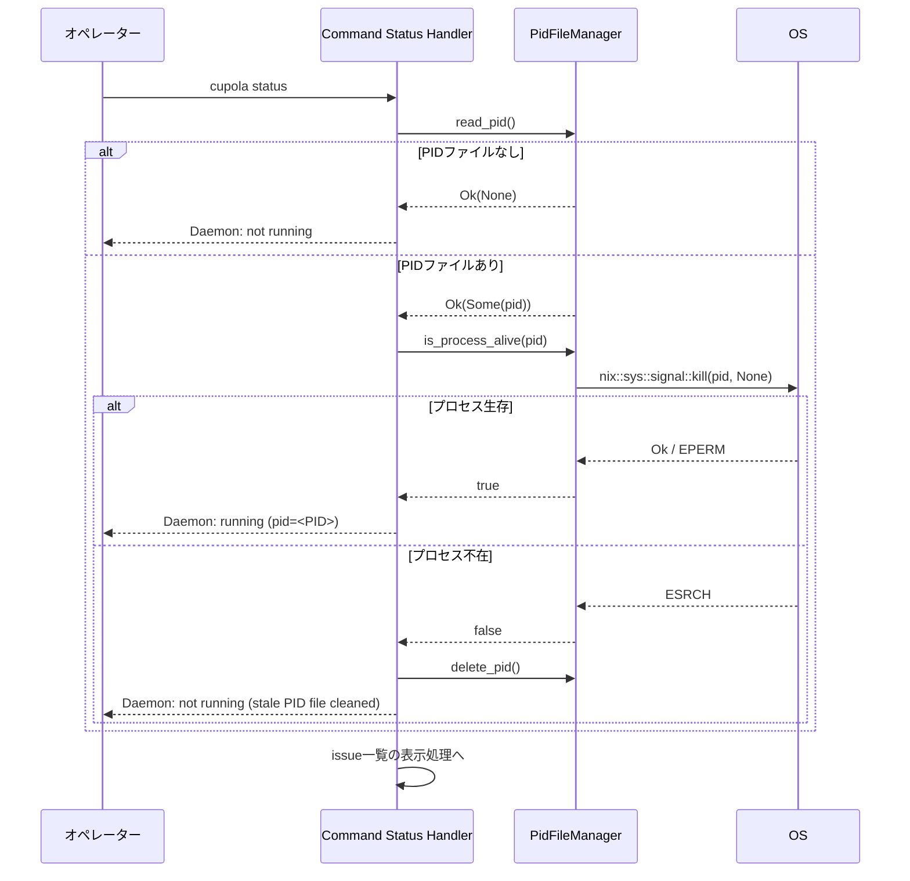
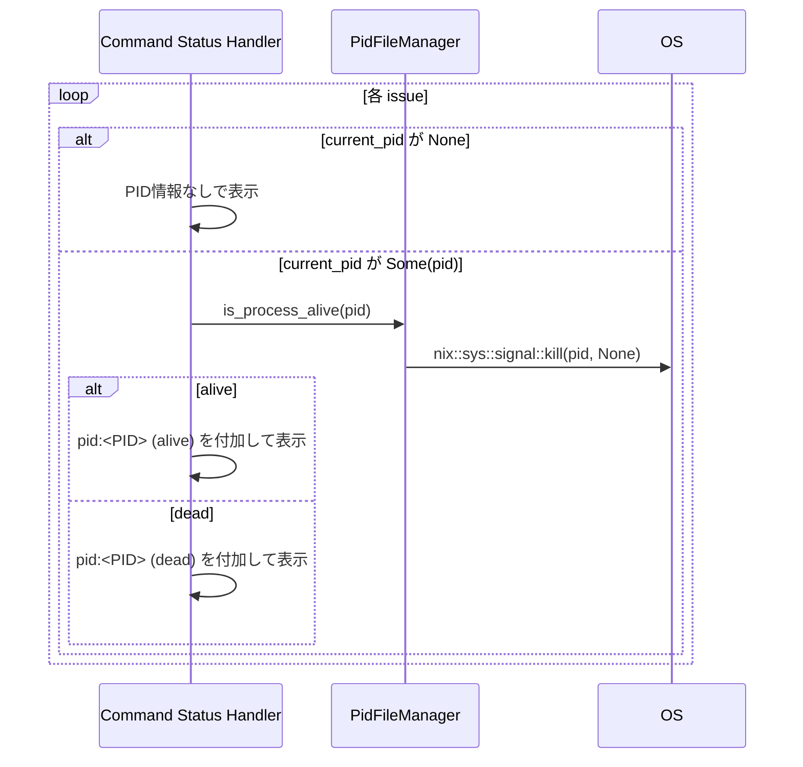

# 技術設計書: status-daemon-check

---
**Purpose**: `status` コマンドにdaemon起動状態とプロセス生存確認を追加する実装の設計。

---

## Overview

本機能は、`cupola status` コマンドの出力精度を向上させる。現状はDBの `current_pid` フィールドの有無のみでRunning状態を判断しており、daemonやissue処理プロセスが実際に停止していても「Running」と表示されてしまう問題がある。

**Purpose**: オペレーターがCupolaシステムの実際の稼働状態を正確に把握できるようにする。

**Users**: Cupolaを運用するオペレーターが `cupola status` を実行して現状確認を行う際に利用する。

**Impact**: `src/bootstrap/app.rs` の `Command::Status` ブランチのみを変更する。既存のCLIシグネチャ、ドメインモデル、アダプター、アプリケーション層への影響はない。

### Goals

- daemonプロセスの実際の起動状態（PIDファイル + signal 0チェック）を表示する
- 各issueの `current_pid` に対してプロセス生存確認を行い `(alive)` / `(dead)` を表示する
- Running:カウントを実際に生存しているプロセス数に基づいて算出する
- 既存の表示項目（state、PR番号、retry_count、worktree_path等）を維持する

### Non-Goals

- CLIシグネチャ（`Command::Status` の引数）の変更
- stale `current_pid` のDB自動クリーンアップ（表示のみ）
- daemon以外のバックグラウンドプロセスの監視
- Windowsへの対応（既存の `nix` クレートの制約のまま）

## Architecture

### Existing Architecture Analysis

- `Command::Status` は `src/bootstrap/app.rs` のブートストラップ層で実装されている
- `PidFileManager` は既に `app.rs` にインポートされており (`use crate::adapter::outbound::pid_file_manager::PidFileManager`)、`PidFilePort` トレイトの実装を提供する
- DBパスはハードコード (`.cupola/cupola.db`) されており、同パターンでPIDファイルパス (`.cupola/cupola.pid`) を追加する
- `Issue` ドメインエンティティに `current_pid: Option<u32>` が既に存在する

### Architecture Pattern & Boundary Map



**Architecture Integration**:
- 選択パターン: 既存ブートストラップ層への直接拡張（新コンポーネント不要）
- 変更境界: `src/bootstrap/app.rs` の `Command::Status` ブランチのみ
- 既存パターン維持: `PidFileManager` の再利用、`.cupola/` 直下のファイルパターン踏襲
- Steering準拠: bootstrap層がすべての具象型を知る原則に従い、application/adapterへの変更なし

### Technology Stack

| Layer | Choice / Version | Role in Feature | Notes |
|-------|------------------|-----------------|-------|
| CLI / Bootstrap | Rust + clap | `Command::Status` ブランチへの拡張 | `app.rs` のみ変更 |
| Adapter (Outbound) | `PidFileManager` (既存) | PIDファイル読み取り、プロセス生存確認 | 新規実装なし |
| OS Interface | `nix` クレート (既存) | `kill(pid, None)` によるsignal 0チェック | `PidFileManager::is_process_alive` が内部利用 |

## System Flows

### daemon状態確認フロー



### issue別プロセス生存確認フロー



## Requirements Traceability

| Requirement | Summary | Components | Interfaces | Flows |
|-------------|---------|------------|------------|-------|
| 1.1 | PID生存時: `Daemon: running (pid=<PID>)` 表示 | Command Status Handler | `PidFilePort::read_pid`, `is_process_alive` | daemon状態確認フロー |
| 1.2 | PIDファイルなし: `Daemon: not running` 表示 | Command Status Handler | `PidFilePort::read_pid` | daemon状態確認フロー |
| 1.3 | stale PID検出: ファイル削除 + `Daemon: not running (stale PID file cleaned)` | Command Status Handler | `PidFilePort::read_pid`, `is_process_alive`, `delete_pid` | daemon状態確認フロー |
| 1.4 | daemon状態をissue一覧より先に出力 | Command Status Handler | — | 表示順序 |
| 1.5 | 既存 `PidFileManager::is_process_alive` を再利用 | PidFileManager (既存) | `PidFilePort::is_process_alive` | — |
| 2.1 | current_pid alive 時: `pid:<PID> (alive)` 付加 | Command Status Handler | `PidFilePort::is_process_alive` | issue別プロセス確認フロー |
| 2.2 | current_pid dead 時: `pid:<PID> (dead)` 付加 | Command Status Handler | `PidFilePort::is_process_alive` | issue別プロセス確認フロー |
| 2.3 | current_pid None 時: PID情報なし | Command Status Handler | — | — |
| 2.4 | Running:カウントを実際の生存プロセス数で算出 | Command Status Handler | `PidFilePort::is_process_alive` | issue別プロセス確認フロー |
| 3.1 | 既存表示項目を維持 | Command Status Handler | — | — |
| 3.2 | error_message の表示を維持 | Command Status Handler | — | — |
| 3.3 | DBなし時のエラーメッセージ維持 | Command Status Handler | — | — |
| 3.4 | アクティブissueなし時: `No active issues.` 維持 | Command Status Handler | — | — |

## Components and Interfaces

### コンポーネント概要

| Component | Domain/Layer | Intent | Req Coverage | Key Dependencies | Contracts |
|-----------|--------------|--------|--------------|------------------|-----------|
| Command Status Handler | Bootstrap | statusコマンドの出力ロジック全体 | 1.1〜3.4 | PidFileManager (P0), SqliteIssueRepository (P0) | Service |
| PidFileManager | Adapter/Outbound (既存) | PIDファイル操作とプロセス生存確認 | 1.1, 1.3, 1.5, 2.1, 2.2, 2.4 | OS nix (P0) | Service |

### Bootstrap

#### Command Status Handler

| Field | Detail |
|-------|--------|
| Intent | `cupola status` 実行時のdaemon状態とissueプロセス状態の表示 |
| Requirements | 1.1, 1.2, 1.3, 1.4, 1.5, 2.1, 2.2, 2.3, 2.4, 3.1, 3.2, 3.3, 3.4 |

**Responsibilities & Constraints**

- `.cupola/cupola.pid` を参照してdaemon起動状態を判定・表示する（issue一覧より前に出力）
- stale PIDファイルを検出した場合は削除してから状態メッセージを表示する
- 各issueの `current_pid` に対してプロセス生存確認を行い `(alive)` / `(dead)` を付加する
- Running:カウントは `current_pid.is_some() && is_process_alive(pid)` の両方が真のissueのみをカウントする
- 既存の表示フォーマット（state、PR番号、retry_count、worktree_path、error_message）を変更しない

**Dependencies**

- Outbound: `PidFileManager` — PIDファイル読み取り、削除、プロセス生存確認 (P0)
- Outbound: `SqliteIssueRepository` — アクティブissue一覧取得 (P0)

**Contracts**: Service [x]

##### Service Interface

```rust
// Command::Status ブランチの処理ロジック（疑似コード）
fn handle_status(
    pid_file_manager: &impl PidFilePort,
    repo: &impl IssueRepository,
    max_sessions: Option<usize>,
) -> Result<()>;
```

- Preconditions: DBファイル (`.cupola/cupola.db`) が存在すること
- Postconditions: stdout にdaemon状態 → issue一覧の順で出力される
- Invariants: 既存の表示フォーマットが維持される

**Implementation Notes**

- Integration: `PidFileManager::new(Path::new(".cupola/cupola.pid").to_path_buf())` で初期化し、`PidFilePort` トレイトメソッドを呼び出す
- Validation: `read_pid()` が `Err` を返した場合は `not running` として扱い、エラーを出力しない（stale PIDファイルの破損ケース）
- Risks: PIDファイル削除失敗時（パーミッションエラー等）は `tracing::warn!` でログを記録し、`Daemon: not running (stale PID file exists, but cleanup failed)` を表示する（削除成功時のみ `cleaned` メッセージを使用）

### Adapter/Outbound（既存、変更なし）

#### PidFileManager

| Field | Detail |
|-------|--------|
| Intent | PIDファイルへの読み書きと、signal 0によるプロセス生存確認 |
| Requirements | 1.1, 1.3, 1.5, 2.1, 2.2, 2.4 |

変更なし。既存の `read_pid()`, `delete_pid()`, `is_process_alive()` をそのまま再利用する。

## Data Models

### Domain Model

変更なし。`Issue` エンティティの `current_pid: Option<u32>` フィールドを読み取り専用で利用する。

### Logical Data Model

データモデルへの変更なし。新たなDB操作は不要。

## Error Handling

### Error Strategy

- `read_pid()` が `Err` を返した場合（PIDファイル破損など）: `Daemon: not running` として表示し、エラーをユーザーに露出しない
- `delete_pid()` が `Err` を返した場合（パーミッションエラーなど）: `tracing::warn!` でエラーをログに記録し、`Daemon: not running (stale PID file exists, but cleanup failed)` として表示する（削除成功時のみ `cleaned` メッセージを使用する）
- `is_process_alive()` は `bool` を返し、エラーなし

### Error Categories and Responses

**System Errors**:
- PIDファイル読み取り失敗 → `Daemon: not running` として扱う（ユーザーへのエラー表示なし）
- PIDファイル削除失敗 → `tracing::warn!` でログ記録し、`Daemon: not running (stale PID file exists, but cleanup failed)` として表示

### Monitoring

既存のtracing設定に従い、エラー発生時は `tracing::warn!` で記録することを推奨する（実装判断に委ねる）。

## Testing Strategy

### Unit Tests

`src/bootstrap/app.rs` の `#[cfg(test)]` ブロックに追加する：

1. daemon PID alive → `Daemon: running (pid=<PID>)` が出力に含まれること
2. PIDファイルなし → `Daemon: not running` が出力に含まれること
3. stale PID（プロセス不存在）→ PIDファイルが削除され `Daemon: not running (stale PID file cleaned)` が出力されること
4. `current_pid` が alive なissue → `(alive)` が表示されること
5. `current_pid` が dead なissue → `(dead)` が表示されること
6. `current_pid` が None のissue → PID情報なしで表示されること
7. Running:カウントが実際の alive プロセス数のみをカウントすること

### Integration Tests

- 既存の `status_with_no_active_issues` / `status_with_active_issues` テストの継続的パス確認
- `PidFileManager` を使った生存確認は `PidFilePort` トレイトの mock 実装でテスト可能

## Supporting References

- `research.md` — 設計判断の詳細な経緯（PIDファイルパス決定方法、stale PID削除の方針）
