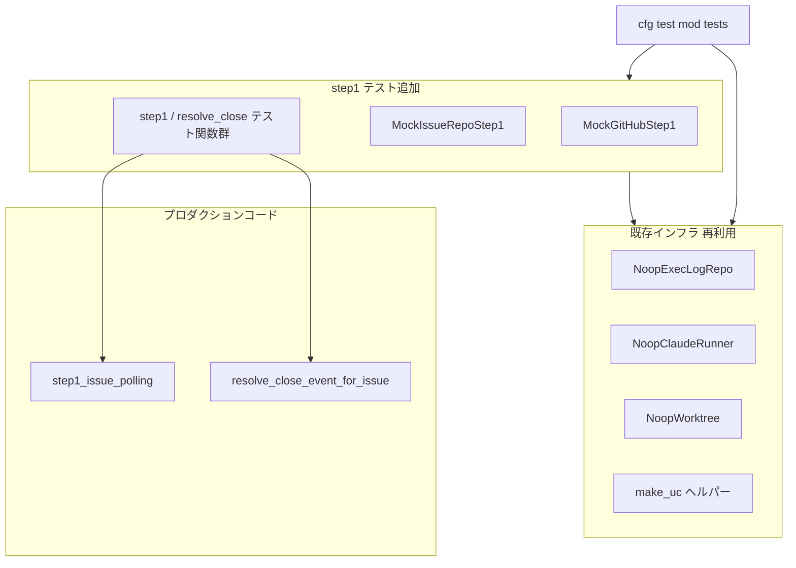
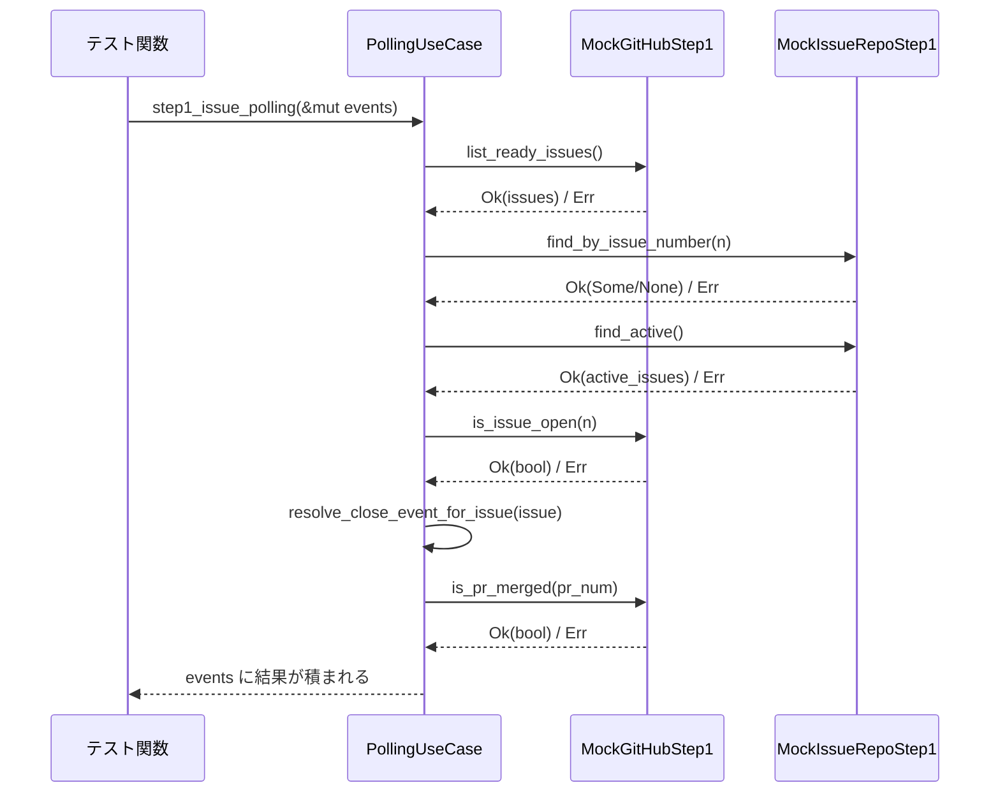

# Design Document: step1-polling-unit-tests

## Overview

`polling_use_case.rs` の `step1_issue_polling` メソッドと `resolve_close_event_for_issue` メソッドは、Cupola エージェントの Issue 検出・close 検出という中核ロジックを担うが、現時点でユニットテストが存在しない。本設計では、既存のテストインフラ（mock 定義・ヘルパー関数）を最大限に活用し、step4/step7 と一貫したスタイルで step1 のテストカバレッジを確立する。

テスト追加は `src/application/polling_use_case.rs` の `#[cfg(test)] mod tests` ブロックに閉じており、プロダクションコードへの変更は一切行わない。

### Goals
- `step1_issue_polling` の全分岐（新規 Issue 検出・重複スキップ・close 検出・エラー継続）をテストでカバーする
- `resolve_close_event_for_issue` の全分岐（PR merge 判定・フォールバック）をテストでカバーする
- `cargo test` および `cargo clippy -- -D warnings` をすべてパスするテストコードを実装する

### Non-Goals
- プロダクションコードの変更
- step2〜step7 の新規テスト追加
- 統合テスト（`tests/` ディレクトリ）の追加
- 既存 `MockGitHub` / `MockIssueRepo` 構造体のリファクタリング

## Architecture

### Existing Architecture Analysis

`polling_use_case.rs` は Clean Architecture の application 層に位置し、`GitHubClient` / `IssueRepository` 等のポートトレイトに依存する。既存の `#[cfg(test)] mod tests` ブロックには以下のインフラが揃っている：

- **`MockGitHub`**: `GitHubClient` の mock 実装。`list_ready_issues` / `is_issue_open` は `unimplemented!()` であり、step1 には直接利用できない。
- **`MockIssueRepo`**: `IssueRepository` の mock 実装。`find_by_issue_number` は `unimplemented!()` であり、step1 には直接利用できない。
- **`NoopExecLogRepo` / `NoopClaudeRunner` / `NoopWorktree`**: Noop 実装。step1 テストでもそのまま利用可能。
- **`make_uc` / `review_waiting_issue`**: `PollingUseCase` 構築ヘルパー。再利用可能。

### Architecture Pattern & Boundary Map



**Architecture Integration**:
- 選択パターン: 既存テストブロック内への追加（Extension パターン）
- 新規 mock 構造体 `MockGitHubStep1` / `MockIssueRepoStep1` を追加して step1 の制御可能な動作をシミュレート
- 既存インフラ（Noop 系・ヘルパー）はそのまま再利用
- プロダクションコードへの変更なし

### Technology Stack

| Layer | Choice / Version | Role in Feature | Notes |
|-------|------------------|-----------------|-------|
| Language | Rust (Edition 2024) | テストコード実装 | 既存スタック踏襲 |
| Async Runtime | tokio | `#[tokio::test]` での非同期テスト実行 | 既存スタック踏襲 |
| Test Framework | 標準 `#[test]` / `#[tokio::test]` | テスト関数定義 | 外部 crate 追加なし |

## System Flows



## Requirements Traceability

| Requirement | Summary | Components | Interfaces | Flows |
|-------------|---------|------------|------------|-------|
| 1.1 | agent:ready Issue が IssueDetected を emit | MockGitHubStep1, MockIssueRepoStep1 | list_ready_issues, find_by_issue_number | 新規 Issue 検出フロー |
| 1.2 | 複数 Issue で各 IssueDetected | MockGitHubStep1, MockIssueRepoStep1 | list_ready_issues, find_by_issue_number | 新規 Issue 検出フロー |
| 1.3 | 非 terminal Issue はスキップ | MockGitHubStep1, MockIssueRepoStep1 | find_by_issue_number | 新規 Issue 検出フロー |
| 1.4 | terminal 状態 Issue は再検出 | MockGitHubStep1, MockIssueRepoStep1 | find_by_issue_number | 新規 Issue 検出フロー |
| 1.5 | list_ready_issues エラー時はスキップ | MockGitHubStep1 | list_ready_issues | エラー継続フロー |
| 2.1 | active Issue close で IssueClosed | MockGitHubStep1, MockIssueRepoStep1 | find_active, is_issue_open | close 検出フロー |
| 2.2 | ReviewWaiting 以外では IssueClosed | MockGitHubStep1, MockIssueRepoStep1 | find_active, is_issue_open | close 検出フロー |
| 2.3 | is_issue_open が true ならイベントなし | MockGitHubStep1, MockIssueRepoStep1 | is_issue_open | close 検出フロー |
| 2.4 | is_issue_open エラー時はスキップ | MockGitHubStep1 | is_issue_open | エラー継続フロー |
| 2.5 | find_active エラー時はスキップ | MockIssueRepoStep1 | find_active | エラー継続フロー |
| 3.1 | DesignReviewWaiting + PR merged → DesignPrMerged | MockGitHubStep1 | is_pr_merged | resolve_close フロー |
| 3.2 | ImplementationReviewWaiting + PR merged → ImplementationPrMerged | MockGitHubStep1 | is_pr_merged | resolve_close フロー |
| 3.3 | ReviewWaiting + PR 未 merge → IssueClosed | MockGitHubStep1 | is_pr_merged | resolve_close フロー |
| 3.4 | is_pr_merged エラー → IssueClosed フォールバック | MockGitHubStep1 | is_pr_merged | エラー継続フロー |
| 3.5 | ReviewWaiting 以外 → 即 IssueClosed | - | - | resolve_close フロー |
| 3.6 | PR 番号 None → IssueClosed | - | - | resolve_close フロー |
| 4.1〜4.5 | テストコード品質要件 | 全コンポーネント | - | - |

## Components and Interfaces

| Component | Domain/Layer | Intent | Req Coverage | Key Dependencies | Contracts |
|-----------|--------------|--------|--------------|------------------|-----------|
| MockGitHubStep1 | application/test | step1 向け GitHubClient mock | 1.1〜1.5, 2.1〜2.4, 3.1〜3.4 | GitHubClient trait (P0) | Service |
| MockIssueRepoStep1 | application/test | step1 向け IssueRepository mock | 1.1〜1.4, 1.5, 2.1〜2.5 | IssueRepository trait (P0) | Service |
| step1 テスト関数群 | application/test | step1_issue_polling の全分岐テスト | 1.1〜1.5, 2.1〜2.5 | MockGitHubStep1 (P0), MockIssueRepoStep1 (P0) | - |
| resolve_close テスト関数群 | application/test | resolve_close_event_for_issue の全分岐テスト | 3.1〜3.6 | MockGitHubStep1 (P0), review_waiting_issue ヘルパー (P1) | - |

### application/test

#### MockGitHubStep1

| Field | Detail |
|-------|--------|
| Intent | `list_ready_issues` / `is_issue_open` / `is_pr_merged` の戻り値を制御可能な `GitHubClient` mock |
| Requirements | 1.1, 1.2, 1.3, 1.4, 1.5, 2.1, 2.2, 2.3, 2.4, 3.1, 3.2, 3.3, 3.4 |

**Responsibilities & Constraints**
- `list_ready_issues`: `ready_issues: Vec<GitHubIssue>` フィールドを返すか、`list_ready_issues_err: bool` が true なら `Err` を返す
- `is_issue_open`: `issue_open: bool` フィールドを返すか、`is_issue_open_err: bool` が true なら `Err` を返す
- `is_pr_merged`: `pr_merged: Result<bool, ()>` フィールドに基づいて返す
- その他のメソッドは `unimplemented!()` または Noop

**Dependencies**
- Inbound: テスト関数 — テスト用インスタンス生成 (P0)
- Outbound: `GitHubClient` trait — 実装対象 (P0)

**Contracts**: Service [x]

##### Service Interface
```rust
struct MockGitHubStep1 {
    ready_issues: Vec<GitHubIssue>,
    list_ready_issues_err: bool,
    issue_open: bool,
    is_issue_open_err: bool,
    pr_merged: bool,
    is_pr_merged_err: bool,
}

impl GitHubClient for MockGitHubStep1 {
    async fn list_ready_issues(&self) -> anyhow::Result<Vec<GitHubIssue>>;
    async fn is_issue_open(&self, _: u64) -> anyhow::Result<bool>;
    async fn is_pr_merged(&self, _: u64) -> anyhow::Result<bool>;
    // その他は unimplemented!() または Ok(デフォルト値)
}
```

**Implementation Notes**
- Integration: 既存 `MockGitHub` と同一ファイル内の `#[cfg(test)] mod tests` に追加
- Validation: `cargo test` で全テストが pass すること、`cargo clippy -- -D warnings` で警告なし
- Risks: `GitHubClient` trait に新メソッドが追加された場合は mock の更新が必要

#### MockIssueRepoStep1

| Field | Detail |
|-------|--------|
| Intent | `find_by_issue_number` / `find_active` を制御可能な `IssueRepository` mock |
| Requirements | 1.1, 1.2, 1.3, 1.4, 2.1, 2.2, 2.3, 2.5 |

**Responsibilities & Constraints**
- `find_by_issue_number`: `issues_by_number: HashMap<u64, Option<Issue>>` から返す。テストケースごとに「存在しない」「非 terminal」「terminal」を設定可能
- `find_active`: `active_issues: Vec<Issue>` を返すか、`find_active_err: bool` が true なら `Err` を返す
- その他のメソッドは `unimplemented!()` または Ok(デフォルト値)

**Dependencies**
- Inbound: テスト関数 — テスト用インスタンス生成 (P0)
- Outbound: `IssueRepository` trait — 実装対象 (P0)

**Contracts**: Service [x]

##### Service Interface
```rust
struct MockIssueRepoStep1 {
    issues_by_number: std::collections::HashMap<u64, Option<Issue>>,
    active_issues: Vec<Issue>,
    find_active_err: bool,
}

impl IssueRepository for MockIssueRepoStep1 {
    async fn find_by_issue_number(&self, n: u64) -> anyhow::Result<Option<Issue>>;
    async fn find_active(&self) -> anyhow::Result<Vec<Issue>>;
    // その他は unimplemented!() または Ok(デフォルト値)
}
```

**Implementation Notes**
- Integration: 既存 `MockIssueRepo` と同一ファイル内の `#[cfg(test)] mod tests` に追加
- Validation: HashMap を使用することで issue_number ごとに異なる戻り値を設定可能
- Risks: `IssueRepository` trait に新メソッドが追加された場合は mock の更新が必要

## Error Handling

### Error Strategy
step1 のプロダクションコードは各 API エラーを `tracing::warn!` でログ出力して処理継続する設計（panic しない）。テストでは `Err` を返す mock を使用してエラー時に events が空のままであることを検証する。

### Error Categories and Responses
- **API Error**: `list_ready_issues` / `is_issue_open` / `find_active` / `is_pr_merged` が `Err` を返す場合 → events リストへの追記なし・処理継続
- `resolve_close_event_for_issue` での `is_pr_merged` エラー → `IssueClosed` にフォールバック

## Testing Strategy

### ユニットテスト（本 spec の成果物）

step1 新規 Issue 検出（Requirement 1）:
- `step1_new_issue_detected_emits_issue_detected_event` — 1.1
- `step1_multiple_issues_each_emit_event` — 1.2
- `step1_non_terminal_existing_issue_is_skipped` — 1.3
- `step1_terminal_existing_issue_is_redetected` — 1.4
- `step1_list_ready_issues_error_no_event` — 1.5

step1 close 検出（Requirement 2）:
- `step1_closed_non_review_waiting_emits_issue_closed` — 2.1, 2.2
- `step1_open_issue_emits_no_event` — 2.3
- `step1_is_issue_open_error_no_event` — 2.4
- `step1_find_active_error_no_event` — 2.5

resolve_close_event_for_issue（Requirement 3）:
- `resolve_close_design_review_waiting_merged_emits_design_pr_merged` — 3.1
- `resolve_close_impl_review_waiting_merged_emits_impl_pr_merged` — 3.2
- `resolve_close_pr_not_merged_emits_issue_closed` — 3.3
- `resolve_close_is_pr_merged_error_fallback_to_issue_closed` — 3.4
- `resolve_close_non_review_waiting_state_emits_issue_closed` — 3.5
- `resolve_close_no_pr_number_emits_issue_closed` — 3.6

### 品質チェック（Requirement 4）
- `cargo test` — 全テストが pass すること
- `cargo clippy -- -D warnings` — 警告なし
- `cargo fmt --check` — フォーマット準拠
