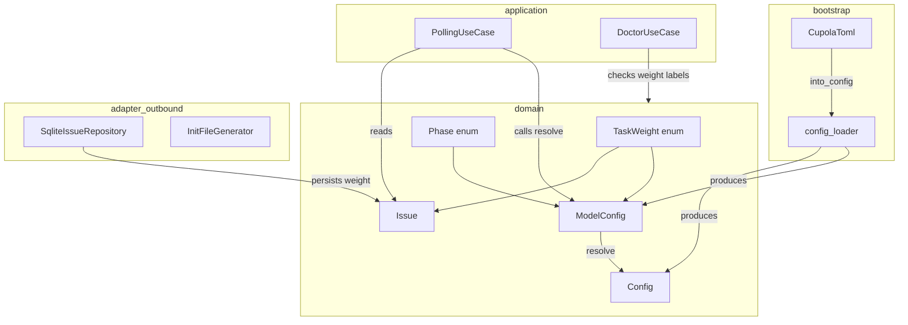
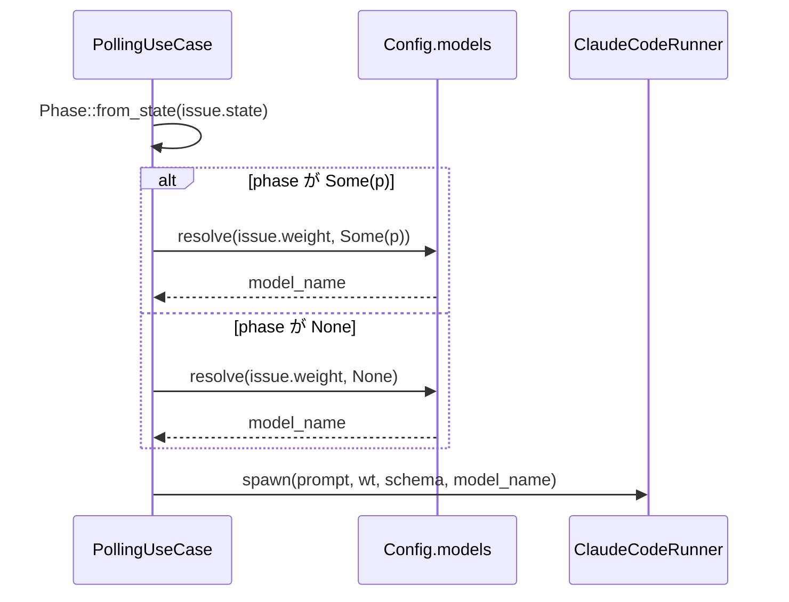
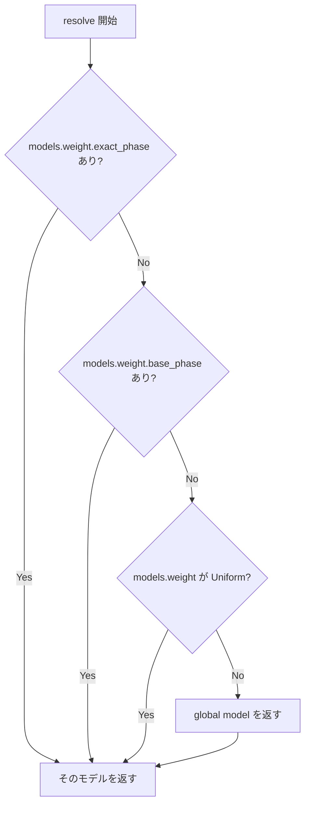

# 技術設計書: TaskWeight × Phase によるモデル解決機構

## Overview

本機能は、Cupola の Issue スポーン時に使用する Claude モデルを、タスクの重さ（`TaskWeight`）と実行フェーズ（`Phase`）の 2 軸で動的解決する機構を導入する。

**Purpose**: 現在デッドコードとなっている `Issue.model` フィールドを廃止し、`TaskWeight` enum と Config ベースのマッピングに置き換えることで、モデル名変更への耐性とフェーズ単位の細粒度制御を実現する。

**Users**: Cupola 運用者は `cupola.toml` に 1 行（`model = "sonnet"`）だけ書けば動作し、必要に応じて `[models]` セクションで weight × phase ごとのチューニングが可能になる。

**Impact**: `Issue.model: Option<String>` フィールドの削除、DB スキーマの破壊的変更（`model` → `weight`）、および `doctor` コマンドのラベルチェック変更を伴う。

### Goals

- `TaskWeight`（Light / Medium / Heavy）と `Phase` の 2 軸でモデルを解決する 4 段フォールバックチェーンを実装する
- `cupola.toml` の最小構成（`model = "sonnet"` 1 行）が引き続き動作する
- GitHub ラベル `weight:light` / `weight:heavy` でタスク単位のモデル制御を可能にする

### Non-Goals

- `fix` ショートハンド（`design_fix` + `impl_fix` をまとめて指定）は v0.1 では実装しない
- モデル名のバリデーション（free-form string としてランナーにそのまま渡す）
- 既存ユーザーへの後方互換マイグレーション

---

## Architecture

### Existing Architecture Analysis

現在の構造:
- `Issue.model: Option<String>` — domain/adapter/DB に存在するが spawn 時に未使用
- `Config.model: String` — グローバルデフォルト、spawn 時に常に参照
- `CupolaToml.model: Option<String>` — TOML パース用、bootstrap 層で `Config.model` に変換
- `PollingUseCase.step7` — `self.config.model` を直接 `claude_runner.spawn()` に渡す

変更対象の依存関係:
- `src/domain/` — Issue, Config を変更、新型追加
- `src/bootstrap/config_loader.rs` — TOML パース拡張
- `src/adapter/outbound/sqlite_issue_repository.rs` — weight の読み書き
- `src/application/polling_use_case.rs` — label 検出とモデル解決
- `src/application/doctor_use_case.rs` — label チェック変更
- `src/adapter/outbound/init_file_generator.rs` — テンプレート更新

### Architecture Pattern & Boundary Map



**Key Decisions**:
- `ModelConfig` と `resolve()` は domain 層に配置（4 段フォールバックはビジネスルール）
- `ModelTier` の TOML パース用型は bootstrap/config_loader に留める（serde/TOML は bootstrap 責務）
- `Config` は `models: ModelConfig` を埋め込み、application 層は `config.models.resolve()` を呼ぶだけ

### Technology Stack

| Layer | Choice / Version | Role in Feature | Notes |
|-------|------------------|-----------------|-------|
| Domain / Runtime | Rust (Edition 2024) | TaskWeight, Phase, ModelConfig, Issue 変更 | serde derive は既存許容済み例外 |
| Config / TOML | `toml` crate（既存） | ModelTier の untagged enum パース | `serde(untagged)` で Uniform/PerPhase を判別 |
| Storage | SQLite / rusqlite（既存） | weight カラムへの読み書き | TEXT NOT NULL DEFAULT 'medium' |

---

## System Flows

### モデル解決フロー（spawn 時）



### 4 段フォールバックチェーン



---

## Requirements Traceability

| 要件 | Summary | Components | Interfaces | Flows |
|------|---------|------------|------------|-------|
| 1.1–1.7 | TaskWeight / Phase ドメイン型 | TaskWeight, Phase | `Phase::from_state()`, `Phase::base()` | spawn 時 Phase 解決フロー |
| 2.1–2.7 | Config モデル解決機構 | ModelConfig, ModelTier | `ModelConfig::resolve()` | 4 段フォールバックチェーン |
| 3.1–3.3 | Issue エンティティ変更 | Issue | — | — |
| 4.1–4.4 | DB スキーマ変更 | SqliteIssueRepository | weight 列 SQL | — |
| 5.1–5.4 | GitHub Label → TaskWeight | PollingUseCase (step1) | `label_to_weight()` | label 検出フロー |
| 6.1–6.4 | spawn 時モデル解決 | PollingUseCase (step7) | `ModelConfig::resolve()` | モデル解決フロー |
| 7.1–7.3 | init / doctor 更新 | InitFileGenerator, DoctorUseCase | — | — |

---

## Components and Interfaces

### コンポーネント一覧

| Component | Layer | Intent | Req Coverage | Key Dependencies | Contracts |
|-----------|-------|--------|--------------|------------------|-----------|
| TaskWeight | domain | タスク重さの型安全な表現 | 1.1 | — | State |
| Phase | domain | 実行フェーズの型安全な表現 | 1.2–1.7 | State | State |
| ModelConfig | domain | weight × phase → model 解決 | 2.1–2.7 | TaskWeight, Phase | Service |
| Issue | domain | weight フィールドを保持 | 3.1–3.3 | TaskWeight | State |
| Config | domain | ModelConfig を埋め込む | 2.1 | ModelConfig | — |
| CupolaToml / ModelTier | bootstrap | TOML パース用型 | 2.7 | serde, toml | — |
| SqliteIssueRepository | adapter/outbound | weight の永続化 | 4.1–4.4 | rusqlite | Batch |
| PollingUseCase (step1) | application | label → TaskWeight 変換 | 5.1–5.4 | GitHubClient | — |
| PollingUseCase (step7) | application | モデル解決して spawn | 6.1–6.4 | ModelConfig | — |
| InitFileGenerator | adapter/outbound | toml テンプレート更新 | 7.1 | — | — |
| DoctorUseCase | application | weight ラベルチェック | 7.2–7.3 | GitHubClient | — |

---

### domain

#### TaskWeight

| Field | Detail |
|-------|--------|
| Intent | タスクの重さを表す値オブジェクト（Light / Medium / Heavy） |
| Requirements | 1.1, 3.2 |

**Responsibilities & Constraints**
- `Default` は `Medium`
- `Copy` / `Clone` / `PartialEq` / `Eq` を実装
- serde `Serialize` / `Deserialize` を実装（DB 永続化のため）

**Contracts**: State [x]

##### State Management

```rust
#[derive(Debug, Clone, Copy, PartialEq, Eq, Default, Serialize, Deserialize)]
#[serde(rename_all = "lowercase")]
pub enum TaskWeight {
    Light,
    #[default]
    Medium,
    Heavy,
}
```

- 文字列表現: `"light"` / `"medium"` / `"heavy"`（SQLite での格納値と一致）

---

#### Phase

| Field | Detail |
|-------|--------|
| Intent | Claude Code 実行フェーズを表す値オブジェクト |
| Requirements | 1.2–1.7 |

**Responsibilities & Constraints**
- `State` 値から対応する `Phase` を返す `from_state()` を提供
- Fix フェーズからベースフェーズへのフォールバック用 `base()` を提供

**Contracts**: Service [x]

##### Service Interface

```rust
#[derive(Debug, Clone, Copy, PartialEq, Eq)]
pub enum Phase {
    Design,
    DesignFix,
    Implementation,
    ImplementationFix,
}

impl Phase {
    /// State から対応する Phase を返す。spawn 不要な State は None を返す。
    pub fn from_state(state: State) -> Option<Self>;

    /// DesignFix → Some(Design)、ImplementationFix → Some(Implementation)、
    /// それ以外 → None
    pub fn base(&self) -> Option<Self>;
}
```

- `from_state` の対応表:

| State | Phase |
|-------|-------|
| DesignRunning | Some(Design) |
| DesignFixing | Some(DesignFix) |
| ImplementationRunning | Some(Implementation) |
| ImplementationFixing | Some(ImplementationFix) |
| その他 | None |

---

#### ModelConfig

| Field | Detail |
|-------|--------|
| Intent | weight × phase → 具体モデル名の解決ロジックを所有する値オブジェクト |
| Requirements | 2.1–2.7 |

**Responsibilities & Constraints**
- グローバルデフォルトモデルとオプションの weight 別設定を保持
- 4 段フォールバックで最終モデル名を返す
- モデル名のバリデーションは行わない（free-form string として pass-through）

**Dependencies**
- Inbound: PollingUseCase — モデル解決呼び出し (P0)
- Outbound: なし（純粋ロジック）

**Contracts**: Service [x]

##### Service Interface

```rust
/// weight 別モデル設定。None の場合はグローバルデフォルトにフォールバック。
pub struct PerPhaseModels {
    pub design: Option<String>,
    pub design_fix: Option<String>,
    pub implementation: Option<String>,
    pub implementation_fix: Option<String>,
}

pub enum WeightModelConfig {
    Uniform(String),
    PerPhase(PerPhaseModels),
}

pub struct ModelConfig {
    /// グローバルデフォルト（`model = "sonnet"` に対応）
    pub default_model: String,
    pub light: Option<WeightModelConfig>,
    pub medium: Option<WeightModelConfig>,
    pub heavy: Option<WeightModelConfig>,
}

impl ModelConfig {
    /// 4 段フォールバックチェーンでモデル名を解決する。
    /// phase が None の場合はグローバルデフォルトを返す。
    pub fn resolve(&self, weight: TaskWeight, phase: Option<Phase>) -> &str;
}
```

- Preconditions: なし
- Postconditions: 常に空でない文字列を返す（`default_model` が最終フォールバック）
- Invariants: `default_model` は空文字列不可

**Implementation Notes**
- Integration: `Config.models: ModelConfig` として埋め込む
- Validation: `default_model` が空でないことは `Config::validate()` で検証
- Risks: `serde(untagged)` での TOML パース順序に注意（PerPhase より Uniform を先に試みると誤マッチの可能性あり。serde は定義順に試みるため、Uniform を先に定義すること）

---

#### Issue（変更）

| Field | Detail |
|-------|--------|
| Intent | `model: Option<String>` を `weight: TaskWeight` に置き換え |
| Requirements | 3.1–3.3 |

**Responsibilities & Constraints**
- `weight` フィールドのデフォルト値は `TaskWeight::Medium`

**Contracts**: State [x]

##### State Management

```rust
pub struct Issue {
    // ... 既存フィールド省略 ...
    pub weight: TaskWeight,  // model: Option<String> を置き換え
    // ...
}
```

---

### bootstrap

#### CupolaToml / ModelTier（変更）

| Field | Detail |
|-------|--------|
| Intent | TOML から ModelConfig へのパース仲介型 |
| Requirements | 2.7 |

**Responsibilities & Constraints**
- `ModelTier` は untagged enum で Uniform / PerPhase を受け付ける
- `into_config()` 内で `ModelTier` → `WeightModelConfig` に変換し `ModelConfig` を構築

**Contracts**: Batch [x]

##### Batch / Job Contract

```rust
#[derive(Debug, Deserialize)]
#[serde(untagged)]
enum ModelTier {
    Uniform(String),
    PerPhase {
        design: Option<String>,
        design_fix: Option<String>,
        implementation: Option<String>,
        implementation_fix: Option<String>,
    },
}

#[derive(Debug, Deserialize)]
struct ModelsToml {
    light: Option<ModelTier>,
    medium: Option<ModelTier>,
    heavy: Option<ModelTier>,
}

// CupolaToml への追加フィールド
// models: Option<ModelsToml>
```

---

### adapter/outbound

#### SqliteIssueRepository（変更）

| Field | Detail |
|-------|--------|
| Intent | `model` カラム → `weight` カラムへの読み書き変更 |
| Requirements | 4.1–4.4 |

**Contracts**: Batch [x]

##### Batch / Job Contract

- SQL スキーマ変更: `model TEXT` → `weight TEXT NOT NULL DEFAULT 'medium'`
- save / update クエリ: `weight` カラムに `task_weight_to_str(weight)` の結果を書き込む
- row_to_issue: `weight` カラムを `str_to_task_weight(s)` で `TaskWeight` に変換
- `task_weight_to_str` / `str_to_task_weight`: 既存の `state_to_str` / `str_to_state` と同パターンで実装

**Implementation Notes**
- Integration: `init` サブコマンドで `cupola init` 実行時に新スキーマが生成される
- Validation: 不明な weight 文字列は `Err` を返す
- Risks: 既存 DB との非互換。`cupola init` の再実行を要求する破壊的変更

---

### application

#### PollingUseCase — step1 変更（Label → TaskWeight）

| Field | Detail |
|-------|--------|
| Intent | GitHub ラベルから `TaskWeight` を解決して Issue に設定 |
| Requirements | 5.1–5.4 |

**Contracts**: Service [x]

##### Service Interface

```rust
/// GitHub Issue のラベルリストから TaskWeight を解決する。
/// weight:heavy が優先、weight:light が次、どちらもなければ Medium。
fn label_to_weight(labels: &[String]) -> TaskWeight;
```

- 優先順位: `weight:heavy` > `weight:light` > `Medium`（デフォルト）

---

#### PollingUseCase — step7 変更（モデル解決）

| Field | Detail |
|-------|--------|
| Intent | `config.model` 直参照を `config.models.resolve()` 経由に変更 |
| Requirements | 6.1–6.4 |

**Contracts**: Service [x]

##### Service Interface

```rust
// step7 内のモデル解決ロジック（擬似コード）
let phase = Phase::from_state(issue.state);
let model = self.config.models.resolve(issue.weight, phase);
self.claude_runner.spawn(&prompt, wt, schema, model).await?;
```

---

#### DoctorUseCase（変更）

| Field | Detail |
|-------|--------|
| Intent | `check_model_labels()` → `check_weight_labels()` に変更 |
| Requirements | 7.2–7.3 |

**Contracts**: Service [x]

##### Service Interface

- `check_weight_labels()` は `weight:light` / `weight:heavy` の存在を GitHub で確認
- いずれかが欠落している場合は `CheckStatus::Warn` を返す

---

### adapter/outbound (init)

#### InitFileGenerator（変更）

| Field | Detail |
|-------|--------|
| Intent | `cupola.toml` テンプレートに `[models]` セクションのコメント付き凡例を追加 |
| Requirements | 7.1 |

**Implementation Notes**

追加するテンプレート内容（コメントアウト形式）:

```toml
# モデルを weight 別に指定する例:
# [models]
# light = "haiku"
# heavy = "opus"
#
# フェーズ別に細かく指定する例:
# [models.heavy]
# design = "opus"
# implementation = "opus"
# # design_fix / implementation_fix は上記にフォールバックされます
```

---

## Data Models

### Domain Model

```
TaskWeight (value object)
  Light | Medium(default) | Heavy

Phase (value object)
  Design | DesignFix | Implementation | ImplementationFix
  + from_state(State) -> Option<Phase>
  + base() -> Option<Phase>

ModelConfig (value object)
  default_model: String
  light: Option<WeightModelConfig>
  medium: Option<WeightModelConfig>
  heavy: Option<WeightModelConfig>
  + resolve(TaskWeight, Option<Phase>) -> &str

WeightModelConfig (value object)
  Uniform(String) | PerPhase(PerPhaseModels)

Issue (entity)
  weight: TaskWeight  ← model: Option<String> を置き換え
```

### Physical Data Model

**SQLite issues テーブル変更**:

```sql
-- 旧
model TEXT,

-- 新
weight TEXT NOT NULL DEFAULT 'medium',
-- CHECK 制約（任意）
-- CHECK (weight IN ('light', 'medium', 'heavy'))
```

---

## Error Handling

### Error Categories and Responses

**設定エラー**:
- `default_model` が空文字列 → `Config::validate()` で検出し起動時にエラー終了
- 不明な `weight:*` ラベル値 → `label_to_weight()` でデフォルト(`Medium`) として扱う

**DB エラー**:
- `weight` カラムに不明な文字列 → `str_to_task_weight()` が `Err` を返し、`row_to_issue()` が失敗
- 旧 DB（`model` カラムのまま）→ rusqlite の column not found エラー。`cupola init` 再実行を案内するエラーメッセージを返す

**モデル解決エラー**:
- `ModelConfig::resolve()` は必ず値を返す（`default_model` が最終フォールバック）ため、エラーは発生しない

---

## Testing Strategy

### Unit Tests

- `TaskWeight` の serde 往復テスト（`"light"` → `Light` → `"light"`）
- `Phase::from_state()` の全 State パターンテスト
- `Phase::base()` の全 Phase パターンテスト
- `ModelConfig::resolve()` の全 weight × phase 組み合わせ（解決例マトリクス完全網羅）
- `label_to_weight()` の各ラベル組み合わせテスト（both / light only / heavy only / none）
- `ModelTier` の TOML パーステスト（Uniform 文字列 / PerPhase テーブル）

### Integration Tests

- `CupolaToml` の TOML パース → `Config` 変換テスト（`model` のみ / `[models]` あり / 混在）
- `SqliteIssueRepository` の weight 読み書きテスト（インメモリ DB）
- `DoctorUseCase` の `check_weight_labels()` テスト（モック GitHubClient）

---

## Migration Strategy

本機能は既存ユーザーのいない段階での導入であり、破壊的変更は許容される。

1. DB スキーマを `cupola init` で再生成する（既存 `cupola.db` は削除が必要）
2. `cupola.toml` の `model = "sonnet"` はそのまま動作する（グローバルデフォルトとして）
3. GitHub ラベル `model:*` → `weight:*` に変更（`cupola doctor` で確認可能）
