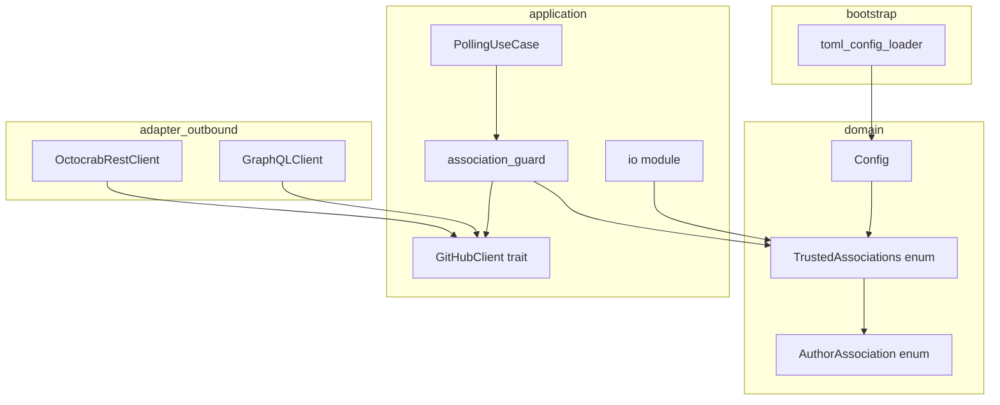
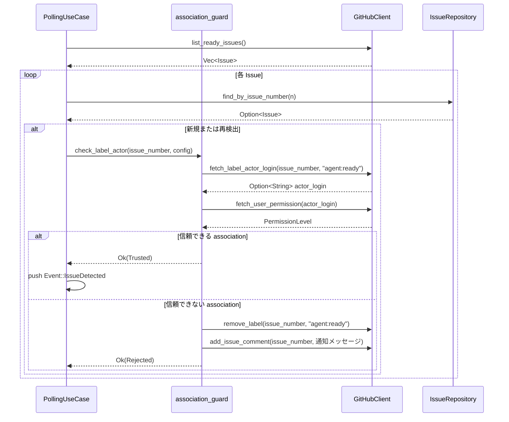
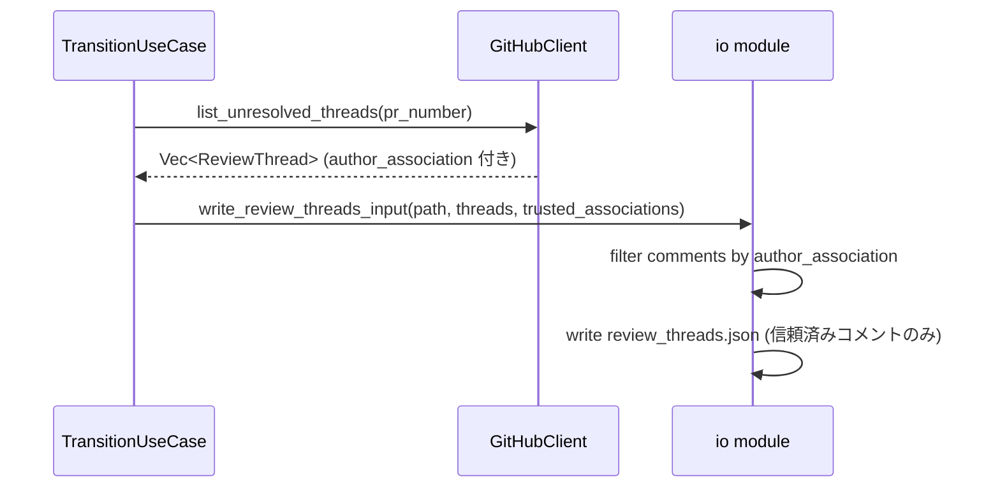

# 技術設計書: trusted-associations-auth-guard

## Overview

本機能は、Cupola が処理する入力の送信元を GitHub の `author_association` フィールドによって認証するセキュリティガードを実装する。公開リポジトリでは外部ユーザーが Issue body や PR レビューコメントにプロンプトインジェクション攻撃を仕込むリスクがあるため、入力内容のサニタイズではなく **入力元の認証** によって防御する。

`cupola.toml` に `trusted_associations` フィールドを追加し、信頼できる association レベルを設定可能にする。`agent:ready` ラベルを付与したユーザーが信頼できない場合はラベルを削除してコメントで通知し、PR レビューコメントは信頼できるユーザーのもののみを `review_threads.json` に書き出す。

### Goals
- `trusted_associations` 設定によって信頼できる入力元を柔軟に制御する
- `agent:ready` ラベル付与者の association を検証し、権限不足の場合はラベル削除 + コメント通知を行う
- PR レビューコメントを author_association でフィルタリングし、信頼できるコメントのみを Claude Code へ渡す

### Non-Goals
- Issue body や PR description のコンテンツサニタイズ
- GitHub Actions ワークフローの権限制御
- FIRST_TIMER / FIRST_TIME_CONTRIBUTOR / CONTRIBUTOR association の完全サポート（デフォルト設定では不要）

---

## Architecture

### Existing Architecture Analysis

既存システムはクリーンアーキテクチャ 4 層構成（domain / application / adapter / bootstrap）に従う。以下の統合ポイントを修正する。

- **domain/config.rs**: `Config` 構造体に `trusted_associations` フィールドを追加
- **bootstrap/config_loader.rs**: `CupolaToml` に TOML フィールドを追加し変換ロジックを実装（`toml_config_loader.rs` は `ConfigLoader` trait の実装を提供）
- **application/port/github_client.rs**: `GitHubClient` トレイトに Timeline/Permission API メソッドを追加。`ReviewComment` に `author_association` フィールドを追加
- **adapter/outbound/github_rest_client.rs**: Timeline API + Permission API の実装を追加
- **adapter/outbound/github_graphql_client.rs**: `reviewThreads` クエリに `authorAssociation` フィールドを追加
- **application/polling_use_case.rs**: `step1_issue_polling` に association チェックを追加
- **application/io.rs**: `write_review_threads_input` にフィルタリングロジックを追加

### Architecture Pattern & Boundary Map



**Architecture Integration**:
- 既存の Clean Architecture 4 層パターンを維持
- Association チェックロジックはアプリケーション層の関数（`association_guard` モジュール）に集約
- ドメイン型 `AuthorAssociation` / `TrustedAssociations` を中心に型安全性を確保

### Technology Stack

| Layer | Choice / Version | Role in Feature | Notes |
|-------|------------------|-----------------|-------|
| Domain | Rust enum | `AuthorAssociation` / `TrustedAssociations` 型定義 | serde Deserialize 対象外（変換は bootstrap で実施） |
| Application | Rust async fn | association チェック・フィルタロジック | `Config` を受け取り判定 |
| Adapter (REST) | octocrab（既存） | Timeline API・Permission API 呼び出し | 新規メソッド追加のみ |
| Adapter (GraphQL) | reqwest + serde_json（既存） | reviewThreads に authorAssociation 追加 | クエリ文字列の修正のみ |
| Bootstrap | toml + serde（既存） | `trusted_associations` の TOML 読み込みと変換 | |

---

## System Flows

### agent:ready ラベル付与者 Association チェックフロー



### PR レビューコメント フィルタリングフロー



---

## Requirements Traceability

| Requirement | Summary | Components | Interfaces | Flows |
|-------------|---------|------------|------------|-------|
| 1.1 | trusted_associations を cupola.toml から読み込む | `CupolaToml`, `Config` | TOML デシリアライズ | bootstrap 起動時 |
| 1.2 | デフォルト値 OWNER/MEMBER/COLLABORATOR | `TrustedAssociations::default()` | `Config` 初期化 | 設定ロード |
| 1.3 | `"all"` でチェックスキップ | `TrustedAssociations::All` バリアント | `association_guard` | チェックロジック |
| 1.4 | 有効な association 値を認識 | `AuthorAssociation` enum | `CupolaToml` 変換 | 設定ロード |
| 1.5 | 無効値でエラー・停止 | `Config::validate()` | `ConfigError` | 起動時検証 |
| 2.1 | Timeline API でラベル付与者 login を取得 | `OctocrabRestClient` | `GitHubClient::fetch_label_actor_login` | agent:ready 検出時 |
| 2.2 | 信頼できる association なら続行 | `association_guard` | - | step1 フロー |
| 2.3 | 信頼できない association でラベル削除 | `OctocrabRestClient` | `GitHubClient::remove_label` | step1 フロー |
| 2.4 | ラベル削除時にコメント通知 | `OctocrabRestClient` | `GitHubClient::add_issue_comment` | step1 フロー |
| 2.5 | Timeline API 失敗時はワークフロー停止 | `association_guard` | エラー伝播 | step1 フロー |
| 2.6 | チェック結果をログ記録 | `association_guard` | `tracing` | step1 フロー |
| 3.1 | review_threads.json 書き出し時に author_association を確認 | `io module`, `GraphQLClient` | `ReviewComment.author_association` | フィルタフロー |
| 3.2 | 信頼済みコメントを含める | `io module` | `write_review_threads_input` | フィルタフロー |
| 3.3 | 信頼できないコメントを除外 | `io module` | `write_review_threads_input` | フィルタフロー |
| 3.4 | 除外コメント数をログ記録 | `io module` | `tracing` | フィルタフロー |
| 3.5 | `"all"` でフィルタスキップ | `io module` | `TrustedAssociations::All` | フィルタフロー |
| 4.1 | SECURITY.md を提供 | ドキュメントファイル | - | - |
| 4.2 | Fork ワークフロー案内 | README / docs | - | - |
| 4.3 | cupola.toml 設定例を記載 | README / docs | - | - |

---

## Components and Interfaces

### コンポーネントサマリー

| Component | Domain/Layer | Intent | Req Coverage | Key Dependencies | Contracts |
|-----------|--------------|--------|--------------|------------------|-----------|
| `AuthorAssociation` | domain | GitHub author_association の型安全な表現 | 1.4, 全要件 | - | State |
| `TrustedAssociations` | domain | 信頼設定の sum type | 1.1–1.3 | `AuthorAssociation` | State |
| `association_guard` | application | association チェック・ラベル削除・通知の orchestration | 2.1–2.6 | `GitHubClient`, `Config` | Service |
| `GitHubClient` trait 拡張 | application/port | Timeline API・Permission API・ラベル操作の追加ポート | 2.1–2.4 | - | Service |
| `OctocrabRestClient` 拡張 | adapter/outbound | 上記ポートの REST 実装 | 2.1–2.4 | octocrab | Service |
| `GraphQLClient` 拡張 | adapter/outbound | reviewThreads に authorAssociation を追加 | 3.1 | reqwest | Service |
| `io module` 拡張 | application | review_threads.json 書き出し時のフィルタ | 3.1–3.5 | `TrustedAssociations` | Service |
| `CupolaToml` 拡張 | bootstrap | trusted_associations の TOML 読み込み | 1.1–1.5 | serde | Service |

---

### Domain Layer

#### `AuthorAssociation`

| Field | Detail |
|-------|--------|
| Intent | GitHub `author_association` 値の型安全な enum 表現 |
| Requirements | 1.4, 2.1, 3.1 |

**Responsibilities & Constraints**
- GitHub API が返す association 文字列を型安全な enum に変換する
- 全バリアントを網羅的に表現し、文字列比較を排除する
- ドメイン層に属し、I/O 依存なし

**Contracts**: State [x]

##### State Management
```rust
#[derive(Debug, Clone, PartialEq, Eq)]
pub enum AuthorAssociation {
    Owner,
    Member,
    Collaborator,
    Contributor,
    FirstTimer,
    FirstTimeContributor,
    None,
}

impl AuthorAssociation {
    pub fn from_str(s: &str) -> Result<Self, ConfigError>;
    pub fn as_str(&self) -> &'static str;
}
```

**Implementation Notes**
- `from_str` は大文字小文字を区別しない（TOML 設定の利便性）
- 未知の文字列は `ConfigError::InvalidAssociation(String)` を返す

---

#### `TrustedAssociations`

| Field | Detail |
|-------|--------|
| Intent | association チェックの設定を表す sum type。`All`（スキップ）と `Specific`（リスト）の 2 バリアント |
| Requirements | 1.1–1.3 |

**Responsibilities & Constraints**
- `"all"` 設定を `All` バリアントで型安全に表現する
- `Specific` バリアントで信頼する association リストを保持する
- `is_trusted(&AuthorAssociation) -> bool` で判定ロジックを提供する

**Contracts**: State [x]

##### State Management
```rust
#[derive(Debug, Clone)]
pub enum TrustedAssociations {
    All,
    Specific(Vec<AuthorAssociation>),
}

impl TrustedAssociations {
    pub fn is_trusted(&self, assoc: &AuthorAssociation) -> bool;
    pub fn default() -> Self; // Specific([Owner, Member, Collaborator])
}
```

**Config への追加**:
```rust
pub struct Config {
    // 既存フィールド...
    pub trusted_associations: TrustedAssociations,  // 追加
}
```

---

### Application Layer

#### `association_guard` モジュール

| Field | Detail |
|-------|--------|
| Intent | agent:ready ラベル付与者の association チェックと、信頼できない場合の処理を orchestrate する |
| Requirements | 2.1–2.6 |

**Responsibilities & Constraints**
- GitHub Timeline API で `agent:ready` ラベルを付与した actor の login を取得する
- Permission API で actor の permission level を取得し `AuthorAssociation` にマッピングする
- 信頼できない場合: ラベル削除 + コメント通知を実行する
- チェック結果を `tracing` でログ出力する
- `TrustedAssociations::All` の場合は即座に `Trusted` を返す（API 呼び出しなし）

**Dependencies**
- Outbound: `GitHubClient` — Timeline API・Permission API・ラベル操作（P0）
- Inbound: `PollingUseCase::step1_issue_polling` — association チェック要求（P0）

**Contracts**: Service [x]

##### Service Interface
```rust
pub enum AssociationCheckResult {
    Trusted,
    Rejected { actor_login: String, association: AuthorAssociation },
}

pub async fn check_label_actor<G: GitHubClient>(
    github: &G,
    issue_number: u64,
    label_name: &str,
    trusted: &TrustedAssociations,
    owner: &str,
    repo: &str,
) -> Result<AssociationCheckResult, anyhow::Error>;
```

- Preconditions: `issue_number` は存在する Issue の番号
- Postconditions: `Rejected` の場合、ラベル削除とコメント投稿が完了している
- Invariants: `TrustedAssociations::All` の場合は常に `Trusted` を返す

**Implementation Notes**
- Integration: `PollingUseCase::step1_issue_polling` 内で `Event::IssueDetected` を push する前に呼び出す
- Validation: Timeline API で actor login が取得できない場合（ラベルが手動でなく API 経由で付与された等）はエラーを返し安全側に倒す
- Risks: GitHub API レート制限。ラベル付与イベントは低頻度なので通常問題ない

---

#### `GitHubClient` トレイト拡張

| Field | Detail |
|-------|--------|
| Intent | Timeline API・Permission API・ラベル操作・コメント投稿の新規ポート定義 |
| Requirements | 2.1–2.4 |

**Contracts**: Service [x]

##### Service Interface
```rust
use core::future::Future;

// src/application/port/github_client.rs への追加
pub trait GitHubClient {
    // 既存メソッド...

    /// issue の timeline から指定ラベルを最後に付与した actor のログインを返す
    fn fetch_label_actor_login(
        &self,
        issue_number: u64,
        label_name: &str,
    ) -> impl Future<Output = anyhow::Result<Option<String>>>;

    /// ユーザーのリポジトリに対する permission level を返す
    fn fetch_user_permission(
        &self,
        username: &str,
    ) -> impl Future<Output = anyhow::Result<RepositoryPermission>>;

    /// Issue からラベルを削除する（既存の可能性あり。未実装なら追加）
    fn remove_label(
        &self,
        issue_number: u64,
        label_name: &str,
    ) -> impl Future<Output = anyhow::Result<()>>;

    /// Issue にコメントを投稿する（既存の可能性あり。未実装なら追加）
    fn add_issue_comment(
        &self,
        issue_number: u64,
        body: &str,
    ) -> impl Future<Output = anyhow::Result<()>>;
}

/// GitHub のリポジトリ permission level
/// `GET /repos/{owner}/{repo}/collaborators/{username}/permission` の `permission` フィールドに対応。
/// OWNER 判定はこの API 単独では行えないため、`admin` permission + リポジトリオーナーとの照合で判断する。
#[derive(Debug, Clone, PartialEq, Eq)]
pub enum RepositoryPermission {
    Admin,    // → Owner / Collaborator（Admin）相当
    Maintain, // → Maintain 相当（GitHub の permission level に存在）
    Write,    // → Collaborator（Write）相当
    Triage,   // → NONE 相当（デフォルト設定では拒否）
    Read,     // → NONE 相当
}

impl RepositoryPermission {
    pub fn to_author_association(&self) -> AuthorAssociation;
}
```

---

#### `io module` 拡張

| Field | Detail |
|-------|--------|
| Intent | `write_review_threads_input` に `trusted_associations` によるフィルタリングを追加 |
| Requirements | 3.1–3.5 |

**Contracts**: Service [x]

##### Service Interface
```rust
// src/application/io.rs の変更
pub fn write_review_threads_input(
    worktree_path: &Path,
    threads: &[ReviewThread],
    trusted_associations: &TrustedAssociations,  // 追加パラメータ
) -> Result<()>;
```

- Preconditions: `threads` は GraphQL から取得した `author_association` 付きのスレッド
- Postconditions: `review_threads.json` には信頼済みコメントのみが含まれる
- Invariants: `TrustedAssociations::All` の場合は全コメントを含める

**Implementation Notes**
- Integration: 呼び出し元（TransitionUseCase）から `config.trusted_associations` を渡す
- Validation: フィルタで除外したコメント数を `tracing::info!` でログ出力する
- Risks: `author_association` が `None`（GraphQL フィールド取得失敗）の場合は NONE として扱い安全側に倒す

---

### Adapter Layer

#### `OctocrabRestClient` 拡張

| Field | Detail |
|-------|--------|
| Intent | `GitHubClient` トレイトの新規メソッドを REST API で実装 |
| Requirements | 2.1–2.4 |

**Contracts**: Service [x]

**Implementation Notes**
- `fetch_label_actor_login`: `GET /repos/{owner}/{repo}/issues/{issue_number}/timeline` を呼び出し、`event == "labeled"` かつ `label.name == label_name` のイベントを逆順で検索して最新の actor.login を返す
- `fetch_user_permission`: `GET /repos/{owner}/{repo}/collaborators/{username}/permission` を呼び出し `permission` フィールドを `RepositoryPermission` にマッピング。404 の場合は `RepositoryPermission::Read`（NONE 相当）を返す
- Integration: octocrab の `reqwest` クライアントを直接使用（既存パターンに従う）

---

#### `GraphQLClient` 拡張

| Field | Detail |
|-------|--------|
| Intent | `reviewThreads` クエリに `authorAssociation` フィールドを追加 |
| Requirements | 3.1 |

**Contracts**: Service [x]

**Implementation Notes**
- `list_unresolved_threads` の GraphQL クエリ内 `comments` ノードに `authorAssociation` を追加するのみ
- `ReviewComment` 構造体に `author_association: AuthorAssociation` を追加し、GraphQL 文字列から `AuthorAssociation::from_str` で変換する

---

### Bootstrap Layer

#### `CupolaToml` 拡張

| Field | Detail |
|-------|--------|
| Intent | `trusted_associations` フィールドの TOML 読み込みとドメイン型への変換 |
| Requirements | 1.1–1.5 |

**Contracts**: Service [x]

##### State Management
```rust
// src/bootstrap/config_loader.rs への追加（CupolaToml はこのファイルに定義されている）
#[derive(Debug, Deserialize)]
pub struct CupolaToml {
    // 既存フィールド...
    pub trusted_associations: Option<Vec<String>>,  // 追加
}

impl CupolaToml {
    fn into_config(&self, overrides: &CliOverrides) -> Result<Config, ConfigError> {
        // trusted_associations の変換
        let trusted_associations = match &self.trusted_associations {
            None => TrustedAssociations::default(),
            Some(values) if values == &["all"] => TrustedAssociations::All,
            Some(values) => {
                let assocs = values.iter()
                    .map(|s| AuthorAssociation::from_str(s))
                    .collect::<Result<Vec<_>, _>>()?;
                TrustedAssociations::Specific(assocs)
            }
        };
        // ...
    }
}
```

---

## Data Models

### Domain Model

```
TrustedAssociations
├── All: チェックスキップ
└── Specific(Vec<AuthorAssociation>): 信頼する association リスト

AuthorAssociation (Value Object)
├── Owner
├── Member
├── Collaborator
├── Contributor
├── FirstTimer
├── FirstTimeContributor
└── None
```

**Business Rules:**
- `TrustedAssociations::All` は常に信頼済みとして処理する
- `TrustedAssociations::Specific` に空リストを渡した場合は全ユーザーが拒否される（安全側）
- デフォルトは `Specific([Owner, Member, Collaborator])`

### Logical Data Model

`ReviewComment` 構造体の変更:
```rust
pub struct ReviewComment {
    pub author: String,
    pub body: String,
    pub author_association: AuthorAssociation,  // 追加
}
```

### Data Contracts & Integration

**cupola.toml 設定例（追加フィールド）**:
```toml
# デフォルト（省略可）
trusted_associations = ["OWNER", "MEMBER", "COLLABORATOR"]

# プライベートリポジトリで緩める場合
# trusted_associations = ["all"]
```

---

## Error Handling

### Error Strategy
設定エラーは起動時に検出してフェイルファスト、実行時エラーは安全側（ワークフロー停止）で対処する。

### Error Categories and Responses

| Error | 分類 | 対応 |
|-------|------|------|
| `trusted_associations` に無効な文字列 | 設定エラー | `ConfigError::InvalidAssociation` → 起動中止、ログ出力 |
| Timeline API 呼び出し失敗 | システムエラー | `anyhow::Error` を伝播 → step1 でエラーログ、当該 Issue をスキップ（ワークフロー続行しない） |
| Permission API 呼び出し失敗 | システムエラー | 404 → `RepositoryPermission::Read` として扱う（安全側）。その他 → エラー伝播 |
| `author_association` フィールドが GraphQL で取得できない | システムエラー | `AuthorAssociation::None` として扱い、デフォルト設定では拒否 |

### Monitoring

- association チェック結果（許可/拒否）: `tracing::info!`
- 拒否されたコメント数: `tracing::info!`
- API 呼び出し失敗: `tracing::error!`

---

## Testing Strategy

### Unit Tests

- `TrustedAssociations::is_trusted`: 全バリアントの組み合わせ（All / Specific・各 AuthorAssociation）
- `AuthorAssociation::from_str`: 有効値・無効値・大文字小文字の変換
- `association_guard::check_label_actor`: モック `GitHubClient` を使用し信頼/拒否の両ケース
- `write_review_threads_input` フィルタリング: 信頼済み/信頼外コメントの混在ケース
- `CupolaToml::into_config`: `"all"` 指定・リスト指定・省略・無効値

### Integration Tests

- `OctocrabRestClient::fetch_label_actor_login`: Timeline API モックを使用した actor login 取得
- `OctocrabRestClient::fetch_user_permission`: Permission API モックを使用した permission 取得
- `GraphQLClient::list_unresolved_threads`: `authorAssociation` フィールドを含む GraphQL レスポンスの処理
- `step1_issue_polling` 統合: association チェックを含む end-to-end フロー（mock adapter injection）

---

## Security Considerations

- **Fail Safe**: Timeline API または Permission API が失敗した場合、ワークフローを続行しない（信頼できない入力を処理しない）
- **デフォルト安全**: `trusted_associations` 省略時は最も制限が強い設定（OWNER/MEMBER/COLLABORATOR のみ）を適用する
- **`"all"` の明示的な設定要件**: チェックスキップは設定ファイルへの意図的な記述が必要。デフォルトでは有効
- **ログの適切な粒度**: actor login はログに記録するが、コメント本文は記録しない（プロンプトインジェクション内容の露出防止）

---

## Supporting References

詳細な調査ログは `research.md` を参照。
