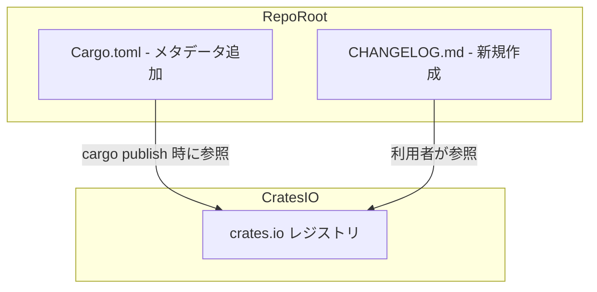

# 設計書: v0.1.0 リリース準備

## Overview

本フィーチャーは、cupola の初回 OSS 正式リリース（v0.1.0）に向けて、変更履歴の透明性を確保し、パッケージ情報を整備するものである。

**Purpose**: リポジトリルートへの CHANGELOG.md 作成と Cargo.toml パッケージメタデータ追加によって、crates.io への公開準備を整え、利用者が変更履歴・パッケージ概要を把握できるようにする。

**Users**: OSS 利用者・コントリビューター、および crates.io を通じてパッケージを発見するRustエコシステムの開発者。

**Impact**: 既存ソースコードへの変更はなく、ドキュメントファイルの新規作成とビルドマニフェストへのメタデータ追加のみを行う。ビルド・テストへの影響はない。

### Goals
- Keep a Changelog 形式に準拠した CHANGELOG.md を作成し、v0.1.0 の主要機能を記録する
- Cargo.toml に crates.io 公開に必要なパッケージメタデータを追加する
- 既存の cargo build / test / clippy がすべてパスし続けることを保証する

### Non-Goals
- crates.io への実際の公開（`cargo publish` の実行）は対象外
- バージョンのインクリメント（0.1.0 を維持する）
- README の更新・翻訳

---

## Requirements Traceability

| Requirement | Summary | Components | Interfaces | Flows |
|-------------|---------|------------|------------|-------|
| 1.1 | CHANGELOG.md がリポジトリルートに存在する | CHANGELOG.md | — | — |
| 1.2 | Keep a Changelog 形式に準拠 | CHANGELOG.md | — | — |
| 1.3 | v0.1.0 Added セクションに主要8機能を記載 | CHANGELOG.md | — | — |
| 1.4 | バージョンセクションに日付を記載 | CHANGELOG.md | — | — |
| 1.5 | フッターに比較リンクを記載 | CHANGELOG.md | — | — |
| 2.1 | Cargo.toml に description を追加 | Cargo.toml | — | — |
| 2.2 | Cargo.toml に repository を追加 | Cargo.toml | — | — |
| 2.3 | Cargo.toml に readme を追加 | Cargo.toml | — | — |
| 2.4 | Cargo.toml に keywords を追加 | Cargo.toml | — | — |
| 2.5 | Cargo.toml に categories を追加 | Cargo.toml | — | — |
| 2.6 | バージョンは 0.1.0 のまま維持 | Cargo.toml | — | — |
| 3.1 | cargo build が成功する | ビルドシステム | — | — |
| 3.2 | cargo test が全テストパス | テストスイート | — | — |
| 3.3 | cargo clippy -- -D warnings がゼロ警告 | Linter | — | — |
| 3.4 | cargo fmt --check が差分なし | Formatter | — | — |

---

## Architecture

### Existing Architecture Analysis

本フィーチャーはコードの変更を含まない。対象ファイルは以下の2つのみ：

- `CHANGELOG.md`（新規作成）: リポジトリルートへの追加。Cargo のビルドグラフに含まれない純粋なドキュメントファイル
- `Cargo.toml`（既存ファイルの `[package]` セクション編集）: メタデータフィールドの追加のみ。依存関係・ビルド設定への変更なし

既存のクリーンアーキテクチャ（domain / application / adapter / bootstrap の4層構造）に対する影響はない。

### Architecture Pattern & Boundary Map

本フィーチャーは新しいアーキテクチャ境界を導入しない。変更対象はプロジェクトルートの設定・ドキュメントファイルのみ。



### Technology Stack

| Layer | Choice / Version | Role in Feature | Notes |
|-------|------------------|-----------------|-------|
| ドキュメント | Markdown | CHANGELOG.md の記述形式 | Keep a Changelog 形式に準拠 |
| ビルドマニフェスト | Cargo.toml (TOML) | パッケージメタデータの定義 | `[package]` セクションのみ変更 |

---

## Components and Interfaces

### コンポーネント一覧

| Component | Domain/Layer | Intent | Req Coverage | Key Dependencies | Contracts |
|-----------|--------------|--------|--------------|-----------------|-----------|
| CHANGELOG.md | ドキュメント | v0.1.0 の変更履歴記録 | 1.1–1.5 | なし | — |
| Cargo.toml (package metadata) | ビルドマニフェスト | crates.io 公開メタデータの提供 | 2.1–2.6 | なし | — |

---

### ドキュメント層

#### CHANGELOG.md

| Field | Detail |
|-------|--------|
| Intent | Keep a Changelog 形式で v0.1.0 の変更履歴を記録する |
| Requirements | 1.1, 1.2, 1.3, 1.4, 1.5 |

**Responsibilities & Constraints**
- リポジトリルート（`Cargo.toml` と同階層）に配置する
- Keep a Changelog 仕様（https://keepachangelog.com/）に厳密に準拠する
- `## [Unreleased]` セクションを先頭に維持し、将来の変更記録に備える
- `## [0.1.0] - 2026-04-01` セクションに以下の機能を `### Added` として記載する：
  1. GitHub Issue 検知と cc-sdd による設計自動生成
  2. 設計/実装 PR の自動作成
  3. Review thread への自動修正・返信・resolve
  4. CI 失敗・conflict の自動検知と修正
  5. 同時実行数制限（max_concurrent_sessions）
  6. モデル指定（cupola.toml + Issue ラベル）
  7. `cupola doctor` / `cupola init` コマンド
  8. Graceful shutdown

**Dependencies**: なし

**Contracts**: なし（純粋なドキュメントファイル）

**ファイル構造定義**:
```
# Changelog

## [Unreleased]

## [0.1.0] - 2026-04-01

### Added
- <機能1>
- ...

[0.1.0]: https://github.com/kyuki3rain/cupola/releases/tag/v0.1.0
```

**Implementation Notes**
- Integration: Cargo のビルドグラフに含まれないため、ビルドへの影響はない
- Validation: Keep a Changelog の必須構造（ヘッダー・Unreleased セクション・バージョンセクション・末尾リンク）がすべて存在することを確認する
- Risks: 初回リリースのため比較リンク（`compare/vX...vY`）ではなくタグリンク形式を使用する

---

#### Cargo.toml パッケージメタデータ

| Field | Detail |
|-------|--------|
| Intent | `[package]` セクションに OSS 公開に必要なメタデータを追加する |
| Requirements | 2.1, 2.2, 2.3, 2.4, 2.5, 2.6 |

**Responsibilities & Constraints**
- `[package]` セクションのみ変更する（`[dependencies]` 等への変更は禁止）
- `version = "0.1.0"` は変更しない（2.6）
- 追加するフィールド定義:

| フィールド | 値 | 制約 |
|-----------|-----|------|
| `description` | `"A locally-resident agent that automates GitHub Issue-driven development using Claude Code"` | 200文字以内、英語 |
| `repository` | `"https://github.com/kyuki3rain/cupola"` | HTTPS URL |
| `readme` | `"README.md"` | リポジトリルートからの相対パス |
| `keywords` | `["github", "automation", "agent", "claude", "ci"]` | 最大5個、小文字 |
| `categories` | `["command-line-utilities", "development-tools"]` | crates.io 有効スラッグ |

**Dependencies**
- External: crates.io — `keywords` と `categories` の有効値チェック（P1）

**Contracts**: なし（ビルドマニフェストのメタデータのみ）

**Implementation Notes**
- Integration: メタデータフィールドはコンパイルに影響しない。`cargo build` / `cargo clippy` / `cargo test` はすべて影響を受けない
- Validation: `cargo metadata --format-version 1` または `cargo package --list` で Cargo がメタデータを正常に読み込めることを確認できる
- Risks: `categories` スラッグの有効性。`command-line-utilities` と `development-tools` は crates.io 標準スラッグとして確認済み（research.md 参照）

---

## Error Handling

### Error Strategy
本フィーチャーはランタイムエラーを生成しない（ドキュメントとメタデータの追加のみ）。

考えられる問題とその対処:

| 問題 | 対処 |
|-----|------|
| Cargo.toml の TOML 構文エラー | `cargo build` がビルド時にエラーを報告する。構文を修正する |
| `categories` スラッグが無効 | `cargo publish` 時にエラーになるが、`cargo build` / `cargo test` には影響なし |

### Monitoring
特別なモニタリングは不要。CI の `cargo build` / `cargo test` / `cargo clippy` がパスすれば品質が保証される。

---

## Testing Strategy

### ユニットテスト
- 対象なし（ソースコードの変更がないため）

### 統合テスト
- 対象なし（新たな外部連携がないため）

### 手動検証（受け入れ基準の確認）
1. `CHANGELOG.md` がリポジトリルートに存在すること（1.1）
2. Keep a Changelog 形式のヘッダー・セクション・リンクが揃っていること（1.2, 1.4, 1.5）
3. v0.1.0 の全8機能が `### Added` に記載されていること（1.3）
4. `Cargo.toml` に5フィールドが追加され、バージョンが 0.1.0 のままであること（2.1–2.6）
5. `cargo build` がエラーなく通ること（3.1）
6. `cargo test` が全テストパスすること（3.2）
7. `cargo clippy -- -D warnings` がゼロ警告であること（3.3）
8. `cargo fmt --check` が差分なしであること（3.4）
