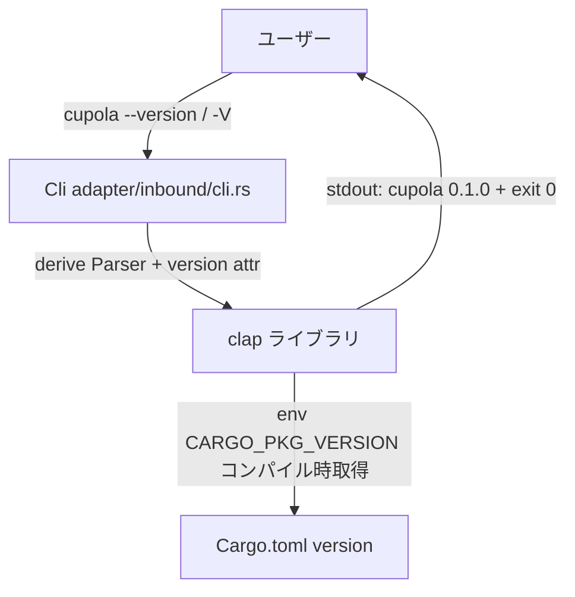

# Design Document: version-flag

## Overview

本機能は cupola CLI に `--version` / `-V` フラグを追加し、実行中の cupola のバージョンを確認できるようにする。バグ報告・デバッグ・前提条件チェックなどの場面でバージョン情報の取得手段を提供する。

**Purpose**: cupola ユーザーおよび開発者が、実行中のバイナリバージョンを素早く確認できるようにする。

**Users**: cupola を利用する開発者・運用者が `cupola doctor` による前提条件チェックやバグ報告時に利用する。

**Impact**: 既存の `Cli` 構造体の `#[command(...)]` アトリビュートに `version` キーワードを追加するのみ。既存サブコマンドへの変更なし。

### Goals

- `cupola --version` で `cupola 0.1.0` 形式のバージョン情報を表示する
- `cupola -V` でも同等の出力を提供する
- `Cargo.toml` の `version` フィールドをバージョンの唯一のソースとする

### Non-Goals

- バージョン以外のビルド情報（コミットハッシュ、ビルド日時など）の表示
- 機械可読な JSON 形式でのバージョン出力
- バージョン比較や自動更新チェック機能

## Architecture

### Existing Architecture Analysis

cupola の CLI は Clean Architecture の adapter/inbound 層に位置する `src/adapter/inbound/cli.rs` に実装されている。`Cli` 構造体が clap の `Parser` derive マクロを使用し、サブコマンドを `Command` enum で管理している。

`--version` / `-V` フラグはサブコマンドとは独立したグローバルフラグであり、clap がパース前に処理して exit する。bootstrap 層や application 層への影響はない。

### Architecture Pattern & Boundary Map

本機能の変更範囲は adapter/inbound 層の単一ファイルに限定される。

**Architecture Integration**:
- Selected pattern: 既存の clap derive パターンに `version` キーワードを追加するのみ
- Existing patterns preserved: `#[derive(Parser)]` + `#[command(...)]` の構造を維持
- Steering compliance: adapter/inbound 層への変更のみ。domain / application 層は無変更

### Technology Stack

| Layer | Choice / Version | Role in Feature | Notes |
|-------|------------------|-----------------|-------|
| CLI | clap 4.x (derive) | `#[command(version)]` によるフラグ自動登録 | 既存依存。追加クレート不要 |
| Infrastructure | `env!("CARGO_PKG_VERSION")` | コンパイル時バージョン取得 | Rust 標準マクロ |

## Requirements Traceability

| Requirement | Summary | Components | Interfaces | Flows |
|-------------|---------|------------|------------|-------|
| 1.1 | `--version` 実行時に `cupola <version>` を標準出力表示 | `Cli` struct | `#[command(version)]` | clap が stdout 出力後 exit |
| 1.2 | バージョン番号は `Cargo.toml` から取得 | `Cli` struct | `env!("CARGO_PKG_VERSION")` | コンパイル時解決 |
| 1.3 | 終了コード 0 で終了 | clap ランタイム | — | clap 標準動作 |
| 2.1 | `-V` で `--version` と同一出力 | `Cli` struct | `#[command(version)]` | clap が短縮フラグを自動登録 |
| 2.2 | `-V` 実行時も終了コード 0 | clap ランタイム | — | clap 標準動作 |
| 3.1 | `env!("CARGO_PKG_VERSION")` でコンパイル時取得 | `Cli` struct | `#[command(version)]` | clap が内部で利用 |
| 3.2 | `Cargo.toml` 変更後の再コンパイルで反映 | ビルドシステム | — | Rust コンパイラ標準動作 |

## Components and Interfaces

| Component | Domain/Layer | Intent | Req Coverage | Key Dependencies | Contracts |
|-----------|--------------|--------|--------------|------------------|-----------|
| `Cli` struct | adapter/inbound | CLI エントリポイント。`--version` / `-V` フラグを clap に委譲 | 1.1, 1.2, 1.3, 2.1, 2.2, 3.1, 3.2 | clap 4.x (P0) | Service |

### Adapter / Inbound

#### `Cli` struct (`src/adapter/inbound/cli.rs`)

| Field | Detail |
|-------|--------|
| Intent | clap の `#[command(version)]` アトリビュートを付与して `--version` / `-V` フラグを自動登録する |
| Requirements | 1.1, 1.2, 1.3, 2.1, 2.2, 3.1, 3.2 |

**Responsibilities & Constraints**

- `#[command(name = "cupola", about = "...", version)]` に `version` を追加する唯一の変更点
- clap が `env!("CARGO_PKG_VERSION")` を自動適用し、`cupola 0.1.0` 形式で出力する
- フラグが指定された場合、clap がパース完了前に stdout へ出力して `process::exit(0)` する（bootstrap/application 層には到達しない）

**Dependencies**

- External: clap 4.x — `version` アトリビュートによる自動フラグ登録（P0）

**Contracts**: Service [x]

##### Service Interface

`Cli::parse()` / `Cli::parse_from(args)` — clap の標準パースインターフェース。`--version` / `-V` が渡された場合は関数が返らず process が終了する。

**Implementation Notes**

- Integration: `#[command(...)]` アトリビュートに `version` を追記するだけ。他コンポーネントへの影響なし。
- Validation: `Cli::parse_from(["cupola", "--version"])` および `Cli::parse_from(["cupola", "-V"])` が panic せず正常終了することをテストで確認する。ただし clap の version フラグは `process::exit` を呼ぶため、テスト時は `get_matches_from_safe` 相当の API（clap 4: `try_parse_from`）を利用する。
- Risks: clap が `--version` / `-V` をグローバルに予約するため、将来これらを別用途で使用不可。現時点で競合なし。

## Testing Strategy

### Unit Tests

- `Cli::try_parse_from(["cupola", "--version"])` が `Err` を返す（clap は version フラグを `ErrorKind::DisplayVersion` として扱う）ことを確認
- `Cli::try_parse_from(["cupola", "-V"])` が同様に `ErrorKind::DisplayVersion` を返すことを確認
- エラーメッセージに `"cupola"` と `env!("CARGO_PKG_VERSION")` の値が含まれることを確認（バージョン文字列をハードコードするとバージョン更新時にテストが壊れるため）

> clap 4.x では `--version` / `-V` の処理結果は `clap::error::ErrorKind::DisplayVersion` として `try_parse_from` から返却される。`assert` はエラー種別とメッセージ内容で行う。
