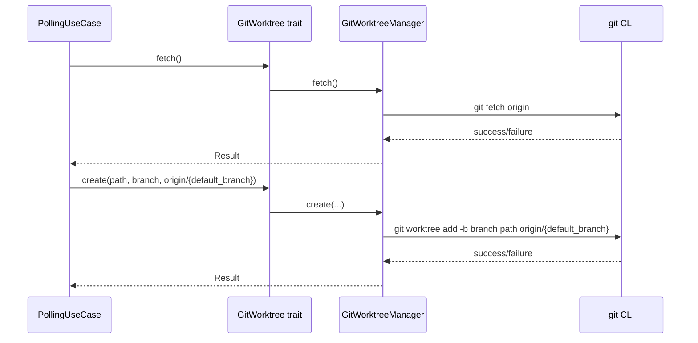

# Design Document

## Overview

**Purpose**: worktree 作成時にリモートの最新コミットを起点とすることで、常に最新のコードから作業を開始できるようにする。

**Users**: cupola を利用する開発者が、Issue 初期化時に最新のリモートコードを起点とした worktree で作業を開始する。

**Impact**: `initialize_issue` メソッドの worktree 作成フローを変更し、`git fetch origin` の実行と start_point の `origin/{default_branch}` への変更を行う。

### Goals
- worktree 作成前に `git fetch origin` を実行してリモートの最新情報を取得する
- start_point を `HEAD` から `origin/{default_branch}` に変更する
- GitWorktree trait に `fetch` メソッドを追加し、クリーンアーキテクチャの抽象化を維持する

### Non-Goals
- fetch 対象のリモート名のカスタマイズ（`origin` 固定）
- fetch のリトライ機構（既存の retry_policy はセッション単位で適用）
- ローカルブランチの自動更新（worktree の起点変更のみ）

## Architecture

### Existing Architecture Analysis

現在のアーキテクチャ:
- `GitWorktree` trait（application/port）が Git worktree 操作を抽象化
- `GitWorktreeManager`（adapter/outbound）が `std::process::Command` で git コマンドを実行
- `PollingUseCase` が `initialize_issue` 内で `self.worktree.create()` を呼び出し
- `Config.default_branch` で default branch 名にアクセス可能

変更は既存のレイヤー構造に沿って行い、新しいコンポーネントの追加は不要。

### Architecture Pattern & Boundary Map



**Architecture Integration**:
- Selected pattern: 既存の Ports & Adapters パターンを継続
- Domain/feature boundaries: GitWorktree trait にメソッド追加のみ。新しい境界は不要
- Existing patterns preserved: trait による抽象化、`run_git` による git コマンド実行
- Steering compliance: Clean Architecture の依存方向ルールを維持

### Technology Stack

| Layer | Choice / Version | Role in Feature | Notes |
|-------|------------------|-----------------|-------|
| Backend / Services | Rust (Edition 2024) | use case ロジック修正 | 既存 |
| Infrastructure / Runtime | std::process::Command | git fetch origin 実行 | 既存の `run_git` メソッドを利用 |

## Requirements Traceability

| Requirement | Summary | Components | Interfaces | Flows |
|-------------|---------|------------|------------|-------|
| 1.1 | fetch origin 実行 | GitWorktreeManager, PollingUseCase | GitWorktree::fetch | initialize_issue フロー |
| 1.2 | fetch 失敗時のエラー処理 | GitWorktreeManager | GitWorktree::fetch -> Result | initialize_issue フロー |
| 2.1 | origin/default_branch を起点に使用 | PollingUseCase | GitWorktree::create | initialize_issue フロー |
| 2.2 | ローカルが古い場合でもリモート最新を使用 | PollingUseCase | GitWorktree::create | initialize_issue フロー |
| 3.1 | fetch メソッドを trait に追加 | GitWorktree trait | GitWorktree::fetch | - |
| 3.2 | fetch メソッドの実装 | GitWorktreeManager | GitWorktree::fetch | - |

## Components and Interfaces

| Component | Domain/Layer | Intent | Req Coverage | Key Dependencies | Contracts |
|-----------|--------------|--------|--------------|------------------|-----------|
| GitWorktree trait | application/port | fetch メソッド追加 | 3.1 | なし | Service |
| GitWorktreeManager | adapter/outbound | fetch の実装 | 1.1, 1.2, 3.2 | git CLI (P0) | Service |
| PollingUseCase | application | initialize_issue の修正 | 1.1, 2.1, 2.2 | GitWorktree (P0), Config (P0) | - |

### Application Layer

#### GitWorktree trait（拡張）

| Field | Detail |
|-------|--------|
| Intent | Git のリモート取得操作を抽象化するために fetch メソッドを追加 |
| Requirements | 3.1 |

**Responsibilities & Constraints**
- リモートからの最新情報取得を trait メソッドとして定義
- 既存メソッド（create, remove, push 等）との一貫性を維持

**Contracts**: Service [x]

##### Service Interface
```rust
pub trait GitWorktree: Send + Sync {
    // 既存メソッド省略
    fn fetch(&self) -> Result<()>;
}
```
- Preconditions: リポジトリが初期化済みであること
- Postconditions: リモート追跡ブランチが最新に更新されること
- Invariants: ローカルブランチは変更されない

#### PollingUseCase（修正）

| Field | Detail |
|-------|--------|
| Intent | initialize_issue 内で fetch を呼び出し、start_point を変更 |
| Requirements | 1.1, 2.1, 2.2 |

**Implementation Notes**
- `self.worktree.fetch()?;` を `self.worktree.create()` の前に追加
- `"HEAD"` を `&format!("origin/{}", self.config.default_branch)` に変更
- fetch 失敗時は `?` 演算子でエラーを伝播し、worktree 作成を中断（1.2）

### Adapter Layer

#### GitWorktreeManager（拡張）

| Field | Detail |
|-------|--------|
| Intent | git fetch origin コマンドの実行 |
| Requirements | 1.1, 1.2, 3.2 |

**Dependencies**
- External: git CLI — fetch コマンド実行 (P0)

**Contracts**: Service [x]

##### Service Interface
```rust
impl GitWorktree for GitWorktreeManager {
    fn fetch(&self) -> Result<()> {
        self.run_git(&["fetch", "origin"])
            .context("failed to fetch from origin")
    }
}
```
- Preconditions: `origin` リモートが設定済みであること
- Postconditions: `origin/*` 追跡ブランチが最新に更新
- Invariants: ローカルブランチやワーキングツリーは変更されない

**Implementation Notes**
- 既存の `run_git` メソッドを使用してリポジトリルートで実行
- コマンド失敗時は stderr の内容を含むエラーを返す（既存の `run_git` の動作）

## Error Handling

### Error Strategy
既存のエラーハンドリングパターン（`anyhow::Result` + `?` 演算子）に従う。

### Error Categories and Responses
**System Errors**:
- `git fetch origin` 失敗（ネットワーク障害、認証エラー等）→ `anyhow::Error` を返し、`initialize_issue` を中断。呼び出し元の `step2_issue_initialization` でエラーログ出力

## Testing Strategy

### Unit Tests
- `GitWorktreeManager::fetch` — リポジトリルートで `git fetch origin` が実行されることを確認（既存テストパターンに準拠）
- `initialize_issue` の mock テスト — fetch が create の前に呼ばれ、start_point が `origin/{default_branch}` であることを確認

### Integration Tests
- mock の `GitWorktree` 実装に `fetch` メソッドを追加
- fetch 失敗時に initialize_issue がエラーを返すことを確認
