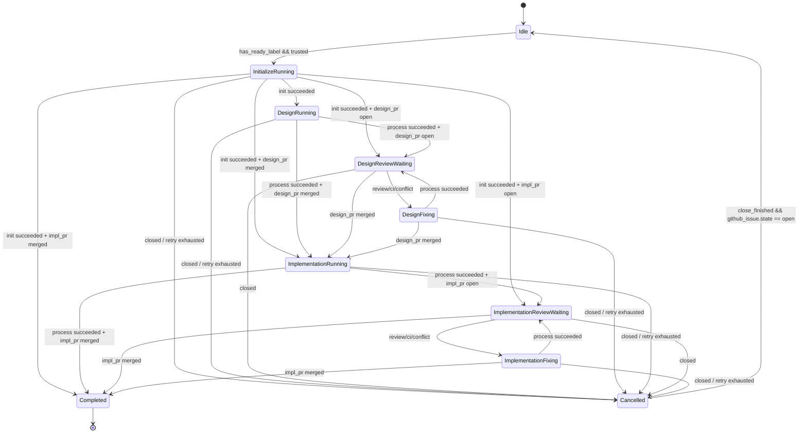

# ステートマシン設計

## 状態遷移図

概略図。省略・簡略化あり。詳細・正本は[全遷移テーブル](#全遷移テーブル)とする。遷移テーブルを変更した場合はこの図との整合を確認すること。



## 状態一覧

| 状態 | 意味 |
|------|------|
| `Idle` | workflow 未開始の待機状態 |
| `InitializeRunning` | worktree・branch 作成中（非同期） |
| `DesignRunning` | Claude Code が Design PR を作成中 |
| `DesignReviewWaiting` | Design PR のレビュー・マージ待ち（タイムアウトなし・無限待ち） |
| `DesignFixing` | Design PR の修正中 |
| `ImplementationRunning` | Claude Code が Impl PR を作成中 |
| `ImplementationReviewWaiting` | Impl PR のレビュー・マージ待ち（タイムアウトなし・無限待ち） |
| `ImplementationFixing` | Impl PR の修正中 |
| `Completed` | Impl PR マージ完了（遷移なし・再開不可）。ただし CloseIssue・CleanupWorktree の持続性エフェクトは完了まで毎サイクル実行される |
| `Cancelled` | リトライ枯渇・Issue クローズによる休止。`close_finished && github_issue.state == open` で自動的に `Idle` へ遷移（Issue 再オープンがトリガー） |

## 観測値

観測値は Collect フェーズが構築する WorldSnapshot として表現される。複数観測値の組み合わせで遷移条件を表現する。

各観測値の定義・構造の詳細は [observations.md](./observations.md) を参照。

## 全遷移テーブル

同一 From 状態内では上の行が優先される。テーブルに記載のない観測値の組み合わせは無視（遷移なし）。Mermaid 図は全体像を示す簡略表現であり、適用範囲の厳密な正本は下記テーブルとする。

| From | 観測条件 | To |
|------|----------|----|
| `Idle` | `has_ready_label && ready_label_trusted` | `InitializeRunning` |
| `Idle` | `has_ready_label && !ready_label_trusted` | — |
| **`InitializeRunning`** | `github_issue.state == closed` | `Cancelled` |
| `InitializeRunning` | `processes.init.consecutive_failures >= max_retries` | `Cancelled` |
| `InitializeRunning` | `processes.init.state == failed` | `InitializeRunning` |
| `InitializeRunning` | `processes.init.state == succeeded` + `impl_pr.state == merged` | `Completed` |
| `InitializeRunning` | `processes.init.state == succeeded` + `impl_pr.state == open` | `ImplementationReviewWaiting` |
| `InitializeRunning` | `processes.init.state == succeeded` + `design_pr.state == merged` | `ImplementationRunning` |
| `InitializeRunning` | `processes.init.state == succeeded` + `design_pr.state == open` | `DesignReviewWaiting` |
| `InitializeRunning` | `processes.init.state == succeeded` | `DesignRunning` |
| **`DesignRunning`** | `github_issue.state == closed` | `Cancelled` |
| `DesignRunning` | `processes.design.consecutive_failures >= max_retries` | `Cancelled` |
| `DesignRunning` | `processes.design.state == failed` | `DesignRunning` |
| `DesignRunning` | `processes.design.state == stale` | `DesignRunning` |
| `DesignRunning` | `processes.design.state == succeeded` + `design_pr.state == merged` | `ImplementationRunning` |
| `DesignRunning` | `processes.design.state == succeeded` + `design_pr.state == closed` | `DesignRunning` |
| `DesignRunning` | `processes.design.state == succeeded` + `design_pr.state == open` | `DesignReviewWaiting` |
| **`DesignReviewWaiting`** | `github_issue.state == closed` | `Cancelled` |
| `DesignReviewWaiting` | `design_pr.state == merged` | `ImplementationRunning` |
| `DesignReviewWaiting` | `design_pr.state == closed` | `DesignRunning` |
| `DesignReviewWaiting` | `design_pr.has_review_comments` | `DesignFixing` |
| `DesignReviewWaiting` | `design_pr.ci_status == failure` + `ci_fix_exhausted` | — |
| `DesignReviewWaiting` | `design_pr.ci_status == failure` | `DesignFixing` |
| `DesignReviewWaiting` | `design_pr.has_conflict` + `ci_fix_exhausted` | — |
| `DesignReviewWaiting` | `design_pr.has_conflict` | `DesignFixing` |
| `DesignReviewWaiting` | `design_pr == None` | `DesignRunning` |
| **`DesignFixing`** | `github_issue.state == closed` | `Cancelled` |
| `DesignFixing` | `design_pr.state == merged` | `ImplementationRunning` |
| `DesignFixing` | `design_pr.state == closed` | `DesignRunning` |
| `DesignFixing` | `design_pr == None` | `DesignRunning` |
| `DesignFixing` | `processes.design_fix.consecutive_failures >= max_retries` | `Cancelled` |
| `DesignFixing` | `processes.design_fix.state == failed` | `DesignFixing` |
| `DesignFixing` | `processes.design_fix.state == stale` | `DesignFixing` |
| `DesignFixing` | `processes.design_fix.state == succeeded` | `DesignReviewWaiting` |
| **`ImplementationRunning`** | `github_issue.state == closed` | `Cancelled` |
| `ImplementationRunning` | `processes.impl.consecutive_failures >= max_retries` | `Cancelled` |
| `ImplementationRunning` | `processes.impl.state == failed` | `ImplementationRunning` |
| `ImplementationRunning` | `processes.impl.state == stale` | `ImplementationRunning` |
| `ImplementationRunning` | `processes.impl.state == succeeded` + `impl_pr.state == merged` | `Completed` |
| `ImplementationRunning` | `processes.impl.state == succeeded` + `impl_pr.state == closed` | `ImplementationRunning` |
| `ImplementationRunning` | `processes.impl.state == succeeded` + `impl_pr.state == open` | `ImplementationReviewWaiting` |
| **`ImplementationReviewWaiting`** | `github_issue.state == closed` | `Cancelled` |
| `ImplementationReviewWaiting` | `impl_pr.state == merged` | `Completed` |
| `ImplementationReviewWaiting` | `impl_pr.state == closed` | `ImplementationRunning` |
| `ImplementationReviewWaiting` | `impl_pr.has_review_comments` | `ImplementationFixing` |
| `ImplementationReviewWaiting` | `impl_pr.ci_status == failure` + `ci_fix_exhausted` | — |
| `ImplementationReviewWaiting` | `impl_pr.ci_status == failure` | `ImplementationFixing` |
| `ImplementationReviewWaiting` | `impl_pr.has_conflict` + `ci_fix_exhausted` | — |
| `ImplementationReviewWaiting` | `impl_pr.has_conflict` | `ImplementationFixing` |
| `ImplementationReviewWaiting` | `impl_pr == None` | `ImplementationRunning` |
| **`ImplementationFixing`** | `github_issue.state == closed` | `Cancelled` |
| `ImplementationFixing` | `impl_pr.state == merged` | `Completed` |
| `ImplementationFixing` | `impl_pr.state == closed` | `ImplementationRunning` |
| `ImplementationFixing` | `impl_pr == None` | `ImplementationRunning` |
| `ImplementationFixing` | `processes.impl_fix.consecutive_failures >= max_retries` | `Cancelled` |
| `ImplementationFixing` | `processes.impl_fix.state == failed` | `ImplementationFixing` |
| `ImplementationFixing` | `processes.impl_fix.state == stale` | `ImplementationFixing` |
| `ImplementationFixing` | `processes.impl_fix.state == succeeded` | `ImplementationReviewWaiting` |
| **`Cancelled`** | `close_finished && github_issue.state == open` | `Idle` |

## シナリオ例

### 正常系：初回起動

```
Idle
  → InitializeRunning  （worktree・branch 作成）
  → DesignRunning      （Claude Code が Design PR 作成）
  → DesignReviewWaiting
  → ImplementationRunning  （Design PR マージ後）
  → ImplementationReviewWaiting
  → Completed              （Impl PR マージ）
```

### リカバリ：途中で再起動した場合

cupola が停止・再起動しても、Issue の DB 上の状態はそのまま維持される。起動時は ProcessRun.state=running の孤児プロセスを SIGKILL して `state=failed` に更新した後、通常のポーリングループに入る。各 Issue はその DB 状態から継続するため、手動介入不要。

InitializeRunning 状態で再起動した場合の例（スマートルーティング）：

```
（再起動、Design PR が既に open）
  → InitializeRunning
  → processes.init.succeeded + design_pr.open → DesignReviewWaiting
```

### DesignFixing 中にマージされた場合

レビュワーが `DesignFixing` 中に PR をマージすることがある。この場合、プロセスの完了を待たず直接次の状態へ遷移する。

```
DesignFixing
  → processes.design_fix.succeeded        → DesignReviewWaiting   （通常）
  → design_pr.state == merged             → ImplementationRunning （fix 中にマージ）
```

### Cancelled からの再起動

CloseIssue が成功して `close_finished = true` になった後、Issue が再オープンされると `Cancelled → Idle` へ遷移する。遷移時に `close_finished = false` と `consecutive_failures_epoch = now()` がセットされ、再起動後の連続失敗カウントは 0 から始まる。Idle からは `agent:ready` ラベル付与で InitializeRunning へ。残っている worktree や PR があればスマートルーティングで拾われる。

**`agent:ready` ラベルの自動削除なし**: cupola は Cancelled・Completed への遷移時に `agent:ready` ラベルを自動削除しない。Cancelled 状態で Issue を再オープンした時点でラベルが残っていた場合、`Cancelled → Idle` 遷移が発生したサイクルの次サイクルで `has_ready_label && ready_label_trusted` が成立し `Idle → InitializeRunning` へ遷移する（ユーザーがラベルを再付与する必要はない）。Decide は1サイクルにつき1回のみ評価されるため、`Cancelled → Idle → InitializeRunning` が同一サイクルで完結することはない。議論目的で再オープンするだけであれば、再オープン前に手動でラベルを外すこと。

### Completed 後の再オープン

`Completed` は終端状態であり、新たな状態遷移は発生しない。ただし `close_finished = false` のまま残っている場合（CloseIssue が一度も成功していない場合）は、毎サイクル CloseIssue が発火して Issue を再クローズしようとする。`close_finished = true` になった後は Issue が再オープンされても cupola は何もしない。再オープン後の対応はユーザーが手動で行う。

## InitializeRunning の設計

初期化処理（worktree 作成・branch 作成・push 等）は `tokio::spawn` で非同期実行し、完了時に ProcessRun(type=init).state を succeeded に更新する。Collect フェーズがこの値を観測して `processes.init.state == succeeded` として Decide に渡す。

`worktree_path` ではなく ProcessRun の state を完了シグナルとして使う理由：内部処理の順序が変わっても完了検知が安定するため。

## FixingRequired の制御

### 遷移優先度（ReviewWaiting 状態）

1. **has_review_comments**: unresolved review thread あり → `ci_fix_count` をリセットして DesignFixing / ImplementationFixing へ
2. **ci_status == failure**: CI check-run が failure または timed_out → `ci_fix_count` をインクリメントして Fixing へ
3. **has_conflict**: PR が mergeable でない → `ci_fix_count` をインクリメントして Fixing へ

`ci_fix_exhausted`（`ci_fix_count >= max_ci_fix_cycles`）の場合、CI/Conflict による遷移は行わない（`—`）。`has_review_comments` は上限なし。

## トラステッド判定

`agent:ready` ラベルを付与したユーザーの author association を確認する。

| Association | 信頼 |
|-------------|------|
| Owner | ✓ |
| Member | ✓ |
| Collaborator | ✓ |
| Contributor 以下 | ✗ |

信頼されないユーザーがラベルを付与した場合、ラベルを削除してコメントを投稿する。`TrustedAssociations::All` 設定時はチェックをスキップ。レビューコメントの `has_review_comments` も同様に、trusted actor のコメントのみ対象。

### closed issue のトラステッド判定スキップ

issue が closed 状態の場合、`agent:ready` ラベルの有無に関わらず `ready_label_trusted = false` を返し、`check_label_actor` API 呼び出しをスキップする。

**理由**: closed issue はいかなる状態遷移も起こさない（遷移条件に `github_issue.state == open` が含まれる）。ポーリングサイクルごとに権限チェックAPIを呼び出しても実質的な効果はなく、ログにノイズが生じる。
