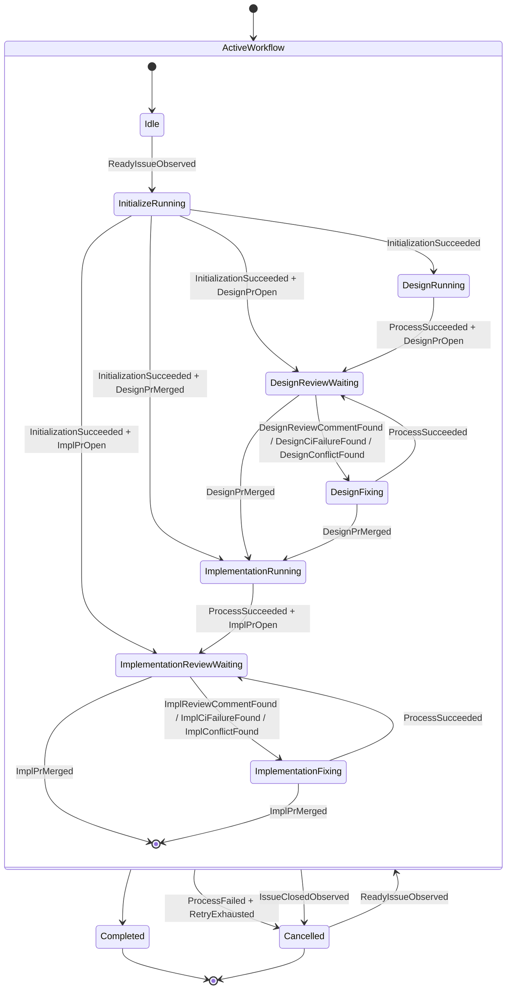

# ステートマシン設計

## 状態遷移図



## 状態一覧

| 状態 | 意味 |
|------|------|
| `Idle` | workflow 未開始の待機状態 |
| `InitializeRunning` | worktree・branch 作成中（非同期） |
| `DesignRunning` | Claude Code が Design PR を作成中 |
| `DesignReviewWaiting` | Design PR のレビュー・マージ待ち（タイムアウトなし・無限待ち） |
| `DesignFixing` | Design PR の修正中 |
| `ImplementationRunning` | Claude Code が Impl PR を作成中 |
| `ImplementationReviewWaiting` | Impl PR のレビュー・マージ待ち（タイムアウトなし・無限待ち） |
| `ImplementationFixing` | Impl PR の修正中 |
| `Completed` | Impl PR マージ完了（終端） |
| `Cancelled` | リトライ枯渇・Issue クローズ（終端・再起動可） |

## シグナル

シグナルは Collect ステップで観測される原子的な情報単位。複数シグナルの組み合わせで遷移条件を表現する。

各シグナルの観測条件の詳細は [signals.md](./signals.md) を参照。

## 全遷移テーブル

同一 From 状態内では上の行が優先される。テーブルに記載のないシグナルの組み合わせは無視（遷移なし）。Mermaid 図は全体像を示す簡略表現であり、適用範囲の厳密な正本は下記テーブルとする。

| From | シグナル | To |
|------|----------|----|
| `Idle` | `ReadyIssueObserved` | `InitializeRunning` |
| `Idle` | `UntrustedReadyIssueObserved` | — |
| **`InitializeRunning`** | `IssueClosedObserved` | `Cancelled` |
| `InitializeRunning` | `ProcessFailed` + `RetryExhausted` | `Cancelled` |
| `InitializeRunning` | `ProcessFailed` | `InitializeRunning` |
| `InitializeRunning` | `InitializationSucceeded` + `ImplPrOpen` | `ImplementationReviewWaiting` |
| `InitializeRunning` | `InitializationSucceeded` + `DesignPrMerged` | `ImplementationRunning` |
| `InitializeRunning` | `InitializationSucceeded` + `DesignPrOpen` | `DesignReviewWaiting` |
| `InitializeRunning` | `InitializationSucceeded` | `DesignRunning` |
| **`DesignRunning`** | `IssueClosedObserved` | `Cancelled` |
| `DesignRunning` | `ProcessFailed` + `RetryExhausted` | `Cancelled` |
| `DesignRunning` | `ProcessFailed` | `DesignRunning` |
| `DesignRunning` | `ProcessSucceeded` + `DesignPrOpen` | `DesignReviewWaiting` |
| **`DesignReviewWaiting`** | `IssueClosedObserved` | `Cancelled` |
| `DesignReviewWaiting` | `DesignPrMerged` | `ImplementationRunning` |
| `DesignReviewWaiting` | `DesignReviewCommentFound` | `DesignFixing` |
| `DesignReviewWaiting` | `DesignCiFailureFound` + `CiFixExhausted` | — |
| `DesignReviewWaiting` | `DesignCiFailureFound` | `DesignFixing` |
| `DesignReviewWaiting` | `DesignConflictFound` + `CiFixExhausted` | — |
| `DesignReviewWaiting` | `DesignConflictFound` | `DesignFixing` |
| **`DesignFixing`** | `IssueClosedObserved` | `Cancelled` |
| `DesignFixing` | `DesignPrMerged` | `ImplementationRunning` |
| `DesignFixing` | `ProcessFailed` + `RetryExhausted` | `Cancelled` |
| `DesignFixing` | `ProcessFailed` | `DesignFixing` |
| `DesignFixing` | `ProcessSucceeded` | `DesignReviewWaiting` |
| **`ImplementationRunning`** | `IssueClosedObserved` | `Cancelled` |
| `ImplementationRunning` | `ProcessFailed` + `RetryExhausted` | `Cancelled` |
| `ImplementationRunning` | `ProcessFailed` | `ImplementationRunning` |
| `ImplementationRunning` | `ProcessSucceeded` + `ImplPrOpen` | `ImplementationReviewWaiting` |
| **`ImplementationReviewWaiting`** | `IssueClosedObserved` | `Cancelled` |
| `ImplementationReviewWaiting` | `ImplPrMerged` | `Completed` |
| `ImplementationReviewWaiting` | `ImplReviewCommentFound` | `ImplementationFixing` |
| `ImplementationReviewWaiting` | `ImplCiFailureFound` + `CiFixExhausted` | — |
| `ImplementationReviewWaiting` | `ImplCiFailureFound` | `ImplementationFixing` |
| `ImplementationReviewWaiting` | `ImplConflictFound` + `CiFixExhausted` | — |
| `ImplementationReviewWaiting` | `ImplConflictFound` | `ImplementationFixing` |
| **`ImplementationFixing`** | `IssueClosedObserved` | `Cancelled` |
| `ImplementationFixing` | `ImplPrMerged` | `Completed` |
| `ImplementationFixing` | `ProcessFailed` + `RetryExhausted` | `Cancelled` |
| `ImplementationFixing` | `ProcessFailed` | `ImplementationFixing` |
| `ImplementationFixing` | `ProcessSucceeded` | `ImplementationReviewWaiting` |
| **`Cancelled`** | `ReadyIssueObserved` | `Idle` |
| `Cancelled` | `UntrustedReadyIssueObserved` | — |

## シナリオ例

### 正常系：初回起動

```
Idle
  → InitializeRunning  （worktree・branch 作成）
  → DesignRunning      （Claude Code が Design PR 作成）
  → DesignReviewWaiting
  → ImplementationRunning  （Design PR マージ後）
  → ImplementationReviewWaiting
  → Completed              （Impl PR マージ）
```

### リカバリ：途中で再起動した場合

cupola が停止・再起動すると、Issue は再度 `Idle → InitializeRunning` を経由する。初期化完了時に GitHub の現状を観測して適切な状態へスマートルーティングされるため、手動介入不要。

```
（再起動、Design PR が既に open）
  → InitializeRunning
  → InitializationSucceeded + DesignPrOpen → DesignReviewWaiting
```

### DesignFixing 中にマージされた場合

レビュワーが `DesignFixing` 中に PR をマージすることがある。この場合、プロセスの完了を待たず直接次の状態へ遷移する。

```
DesignFixing
  → ProcessSucceeded            → DesignReviewWaiting   （通常）
  → DesignPrMerged              → ImplementationRunning （fix 中にマージ）
```

### Cancelled からの再起動

`agent:ready` ラベルを再付与すると、`ActiveWorkflow` のスタートノードから再エントリーし、Idle を経由して InitializeRunning へ。残っている worktree や PR があればスマートルーティングで拾われる。

## InitializeRunning の設計

初期化処理（worktree 作成・branch 作成・push 等）は `tokio::spawn` で非同期実行し、完了時に `initialized = true` を DB に書き込む。Collect ステップがこのフラグを観測して `InitializationSucceeded` を生成する。

`worktree_path` ではなく専用の `initialized` フラグを使う理由：内部処理の順序が変わっても完了シグナルが安定するため。

## FixingRequired の制御

### 生成条件（優先度順）

1. **ReviewComments**: unresolved review thread あり → `ci_fix_count` をリセットして発行
2. **CiFailure**: CI check-run が failure → `ci_fix_count` をインクリメントして発行
3. **Conflict**: PR が mergeable でない → `ci_fix_count` をインクリメントして発行

`ci_fix_count >= max_ci_fix_cycles` の場合、CI/Conflict による `FixingRequired` は発行しない。ReviewComments は上限なし。

## トラステッド判定

`agent:ready` ラベルを付与したユーザーの author association を確認する。

| Association | 信頼 |
|-------------|------|
| Owner | ✓ |
| Member | ✓ |
| Collaborator | ✓ |
| Contributor 以下 | ✗ |

信頼されないユーザーがラベルを付与した場合、ラベルを削除してコメントを投稿する。`TrustedAssociations::All` 設定時はチェックをスキップ。レビューコメントの `FixingRequired` も同様に、trusted actor のコメントのみ対象。
